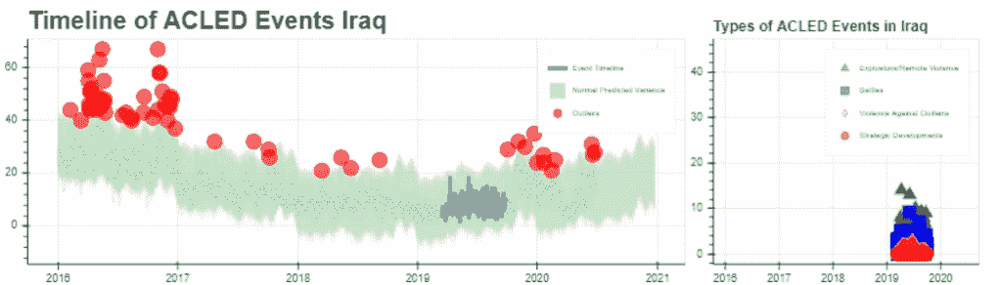
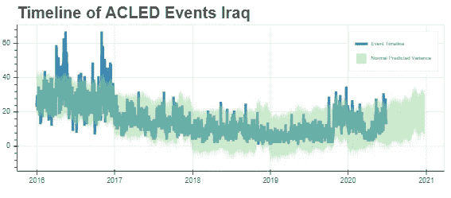
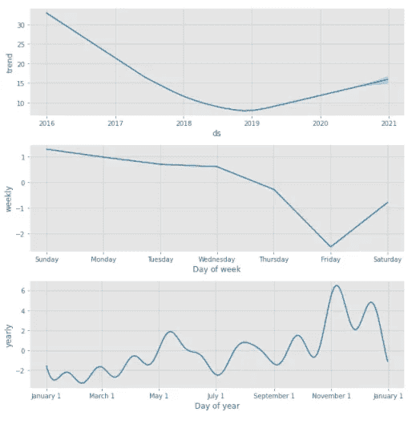
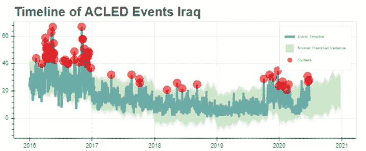

# 用机器学习研究时态数据中的异常

> 原文：<https://towardsdatascience.com/investigate-anomalies-in-temporal-data-with-machine-learning-b3da86793142?source=collection_archive---------25----------------------->

## 利用 Python 和机器学习分析时序数据，并交互可视化。

# 这是你要做的:

## 概观

在[这本笔记本](https://colab.research.google.com/drive/1rrkJ-pcddna7Ft8Zv-xYgPIVMduJi49u?usp=sharing)中，我们将探索脸书的开源萨里玛模型*先知*来识别时间序列数据中的异常值。以下是你将学到的东西:

*   什么是时序数据？
*   萨里玛是什么？
*   构建一个简单的优化器来自动优化 Prophet 模型
*   如何使用 Prophet 预测数据
*   使用 Prophet 和 Bokeh 识别交互式仪表板中的异常值
*   使用散景创建用于调查的时序仪表板布局

## 什么是时态数据？

在[我的上一篇文章](/level-up-your-visualizations-make-interactive-maps-with-python-and-bokeh-7a8c1da911fd)中，我们使用了空间数据——也就是说，空间中某个地方存在的带有坐标的数据。时态数据通常是空间数据的伴生物，它是任何具有相关时间或日期的数据。时态数据对于全面理解数据集至关重要，能够理解与时间相关的统计数据(趋势、季节性和异常值)将显著提高您处理业务数据的整体能力。

在我擅长的国家安全和国防领域，可能没有比时态数据更重要的数据类型了。时态数据有助于我们了解时间模式，并对未来做出预测。在本文中，这也是您将要学习的内容。

## 我们的数据

我们将使用来自**武装冲突地点事件数据库**的数据，具体范围缩小到伊拉克。数据可以从 github [这里](https://raw.githubusercontent.com/ConnerBrew/Iraq-Conflict-Data/master/conflict_data_irq.csv)下载，或者从 [ACLED 网站](http://acleddata.com)下载。我们将分析 2016 年至 2020 年伊拉克冲突事件数据的趋势和季节性，预测这些数据，并识别异常值。然后，我们将创建一个配套的折线图，它将允许我们深入特定的事件类别，这样我们就可以在发现异常值后对其进行调查。**走吧！**

## 加载库

首先，让我们导入必要的库。我们将使用所有的 Bokeh 来创建我们的交互式图形，fbprophet 用于 prophet 预建模型，sklearn 用于模型优化，pandas 用于一些数据操作。

## 加载数据

你可以在 [Github](https://raw.githubusercontent.com/ConnerBrew/Iraq-Conflict-Data/master/conflict_data_irq.csv) 上找到我在[本笔记本](https://colab.research.google.com/drive/1rrkJ-pcddna7Ft8Zv-xYgPIVMduJi49u?usp=sharing)中使用的具体数据。然而，我强烈建议你在这个练习中尝试使用你自己的时间序列数据！

在这个代码块中，我们将使用 **value_counts()** 方法来获取我们的折线图所需的数据。我们希望可视化每天的事件数量，因此我们将 **value_counts()** 应用于我们的日期组。

在整篇文章中，您将看到我在处理日期时间数据时喜欢应用的一些实践。首先，每次对数据帧进行操作时，我都会对其进行重新排序——这有助于减少稍后我们训练模型时的错误。我也总是喜欢在我的数据帧中有一列是日期时间格式，另一列是字符串格式。我使用 datetime 列进行分析，string 列用于标签、图例和工具提示。

## 提取分类数据

接下来，我们想要为每个**事件类型**获取 **value_counts()** 。最终产品将是一个可视化，允许用户在折线图中选择一个时间窗口，然后在第二个合作伙伴可视化中显示相关事件类型。我们将遵循与上面相同的步骤，但是现在针对 **event_type** 字段中的每个事件类型。我们将使用 **groupby()** 方法来实现这一点。

## 打扫

接下来，只需删除重复项并重新排序我们的值。

# 为什么是先知？

Prophet 是 facebook 开发的开源 SARIMA 模型。SARIMA 是一种时间序列回归*(解读:预测)*技术，它考虑了时间序列数据集的各种统计属性，包括移动平均、季节性和趋势。**趋势**是时序数据的一个属性，与数据集中的总体正增长和负增长有关。**季节性**与数据集中的周期性变化有关，例如周末活动的定期减少或每天下午活动的增加。

Prophet 最初是为了满足脸书的预测需求而开发的，因为 facebook office 严重依赖时间序列预测来设定目标和衡量进展。你可以通过观看由 Prophet 开发者提供的视频来了解更多关于 Prophet 及其起源的信息。

Prophet 需要两个数据源才能工作:**‘ds’**，代表*日期戳*，以及**‘y’**，*目标变量*。如果您正在跟随[这款笔记本](https://colab.research.google.com/drive/1rrkJ-pcddna7Ft8Zv-xYgPIVMduJi49u?usp=sharing)，那么我们已经做到了这一点——如果没有，那么为了您自己的数据，请记住这一点。

## 模型优化

模型优化是任何机器学习项目的关键要素。所有机器学习模型都有一个或两个关键参数，需要进行优化以实现模型的最佳性能。对于 Prophet，该参数为**change point _ prior _ scale**。此参数定义了模型响应数据集中的变点的灵活程度，需要进行优化以防止过度拟合和欠拟合。

为了对此进行优化，我们将使用一个非常简单的优化模型。它简单地遍历用户定义的历元，测试每个参数，并选择返回最低误差的参数。为此，我们将使用**均方误差**统计。

有关使用均方误差进行模型优化的更多信息，请参见[本文](/https-medium-com-chayankathuria-regression-why-mean-square-error-a8cad2a1c96f)关于均方误差和线性回归。

## 训练模型

既然模型已经优化，我们就用我们的数据来训练它。你会看到，根据我提供的数据， **MSE** (均方差)大约为 38。这可能看起来很高，但对于时间序列预测来说非常好——通常 MSE 低于 50 对这些目的来说是好的。

如果想进一步降低错误率，常见的技术是在训练模型之前对数据应用**指数平滑**。把它想象成时间序列数据的缩放和标准化——你可以在这里了解更多关于时间序列数据的指数平滑。

## 绘制数据

我们将使用散景来绘制数据。交互性是使您的数据可视化脱颖而出并为您的客户提供更多用途和洞察力的一种很好的方式。尽管有其他库和方法来创建交互式可视化，但 Bokeh 是我的首选库。然而，这不是一个散景教程。如果不熟悉散景，可以试试他们的 [**入门指南**](https://docs.bokeh.org/en/latest/docs/user_guide/quickstart.html) 。

基本上，我们将原始数据绘制为散景图内的线字形，并绘制**不确定性界限**，在 Prophet 数据帧中表示为 *yhat_upper* 和 *yhat_lower* 作为面积图。

## 分析趋势和季节性

如上所述，**趋势**和**季节性**是时间序列数据的两个关键统计属性。理解这些因素对于理解数据本身至关重要。Prophet 用 **plot_components** 方法使这变得简单。

在下面的图表中，你可以看到伊拉克冲突事件在过去几年中一直呈总体负面趋势(随着 ISIS 被稳步击败)。然而，你可以看到在整个 2020 年都有小幅上升的趋势——这是由于多种因素，包括冠状病毒疫情和美国从该地区的多个基地撤军，导致 is is 活动增加。

就季节性而言，你可以看到一些有趣的模式——周五**和穆斯林安息日**的活动通常很少。你可以在 3 月-6 月看到一个活动高峰，这是众所周知的常见的西部沙漠战斗季节，因为温暖的气温使干河谷变干，使地形更容易通过；这也是典型的穆斯林斋月。有趣的是，数据还显示了 10 月至 11 月的高活动量，很可能是由于炎热的夏季过后天气变冷。就近年来而言，这也是一个充满政治冲突和抗议的年度时期。

## 绘制异常值

接下来，我们将识别时间序列数据中的异常值。这些事件超出了由 Prophet 模型确定的趋势和季节性。这对国家安全和国防数据至关重要。例如，在伊拉克，我们知道恐怖活动有季节性的上升和下降。那些季节性上涨来的时候，怎么知道是不是比平时差？异常值检测有助于识别恐怖活动的可能死灰复燃，让我们有更好的准备。

我们将使用一种简单的方法——我们寻找超出 Prophet 预测的不确定性上限的数据点，然后绘制该点。在最终的图中，我们可以看到，几乎整个 2016 年都充满了高于预期的恐怖活动，2019 年底和 2020 年初也是如此-这是由于伊拉克总理阿卜杜勒-迈赫迪向新总理卡迪米移交权力后的政治不稳定，2019 年 10 月开始的重大抗议和骚乱活动，以及上述因素，如美国撤军和冠状病毒疫情。

## 绘制分类数据

我想更彻底地调查异常活动。我想知道，在活动增加的时候，哪些类型的事件构成了这些数据——简易爆炸装置、常规战争等等。为此，我们将绘制第二个图来可视化数据。

散景自动链接共享**列数据源**的图之间的选择。因为两个图的数据来自相同的数据框，一个图中的选择将自动反映在第二个图中。我们需要做的只是在视觉上对元素进行样式化，以吸引人们对所选元素的注意，并明确不同时期流行的类别。

在这个数据的例子中，我们将使用散景中的 **selection_glyph** 和 **nonselection_glyph** 属性，使数据在未被选中时不可见。这将使我们能够很容易地看到我们在原始图中选择的时间窗口的主要数据类型。

该代码片段仅显示了一个层的绘图。完整代码见笔记本。

主绘图使用一个 **box_select** 工具来动态改变可视化。将鼠标光标放在图中并拖动以选择时间窗口，观察可视化显示的变化！

## 摘要

现在，您可以通过 Prophet 机器学习模型使用 SARIMA 预测技术来分析时间序列数据。您可以自动优化您的模型，并使用它来了解数据中的趋势和季节性属性。您可以在交互式图表中绘制该信息，以便以后在仪表板或 web 应用程序中发布。**伟大的作品！**