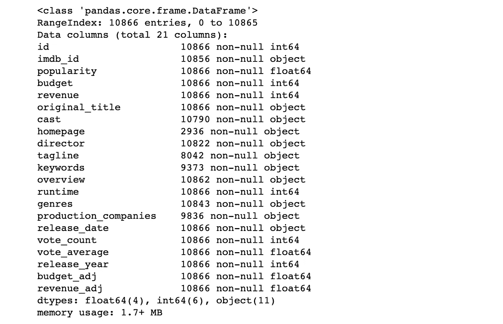
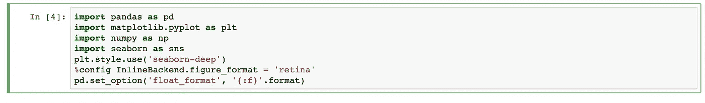
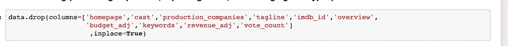
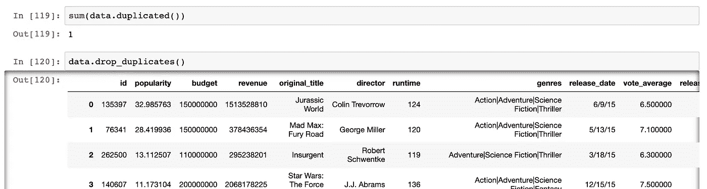
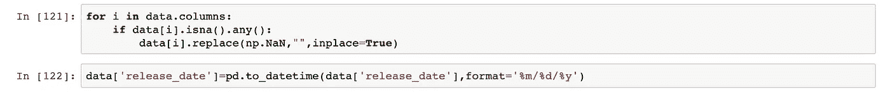
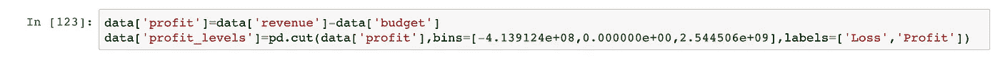
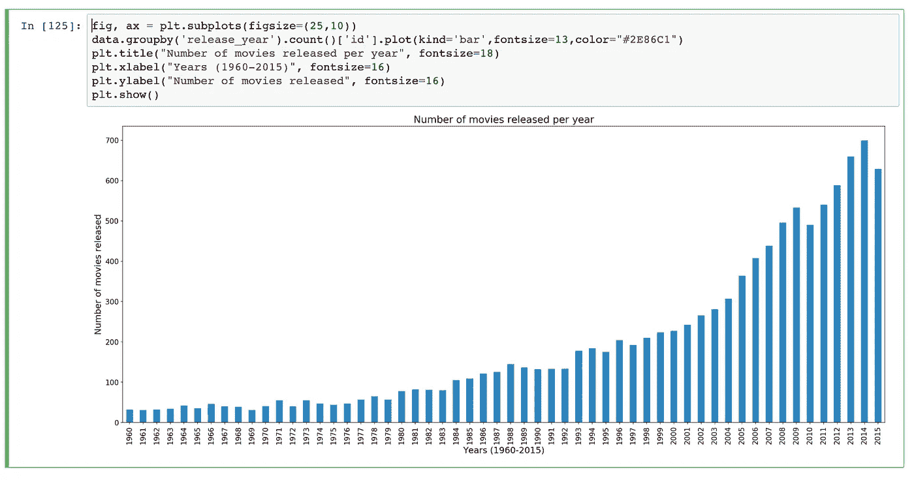
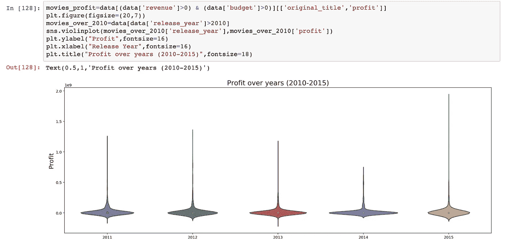
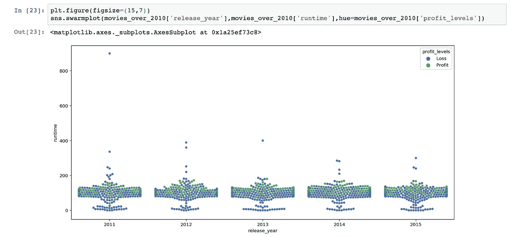
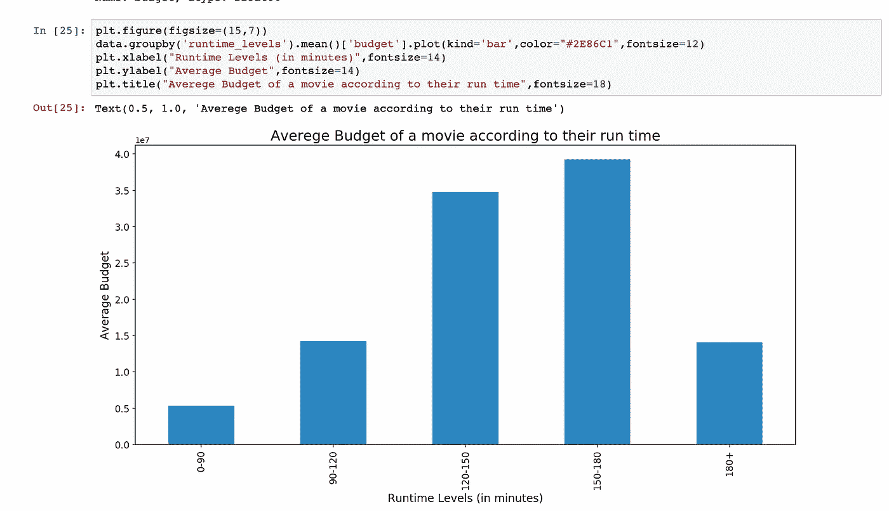

# 使用熊猫和海牛调查数据集

> 原文：<https://towardsdatascience.com/investigating-a-dataset-using-pandas-and-seaborn-d83140603cf7?source=collection_archive---------69----------------------->

克里斯·利维拉尼在 [Unsplash](https://unsplash.com/s/photos/data-analysis?utm_source=unsplash&utm_medium=referral&utm_content=creditCopyText) 上的照片

在数据分析师的生活中，有成百上千的事情要做。数据准备、清理、探索性分析，然后可视化结果。通过熊猫和 Seaborn 图书馆，我研究了“IMDB 数据集”,并得出了一些结论。

**数据集**

我在分析中使用了 IMDB 数据集。它有 21 列和 10，866 行。

下载[这里](https://d17h27t6h515a5.cloudfront.net/topher/2017/October/59dd1c4c_tmdb-movies/tmdb-movies.csv)

**清洁部分**

首先，导入分析所需的所有库。

我必须从数据集中删除不需要的列。如果您不想使用数据集中的某些列，最好只在清理部分删除它们。

然后，我检查数据集中的重复行，并从中删除一行。

下一步是寻找 NaNs，我在我的数据集中的选择性列中发现了许多 NaNs 值。虽然 NaN 值在对象类型列中，但我决定用空白替换它们。

此外，我研究了数据类型，并更改了“release_year”列的 dtype。然后，在数据集中添加类似“利润”和“利润水平”的列，以供将来分析。

**分析和可视化部分**

使用熊猫的“情节”方法，我将这些年来上映的电影数量可视化。就这样，我想象了 1960 年至 2015 年期间大多数发行的类型电影。

利用小提琴图，我找到了历年(2011–2015)的“利润”数字分布。在此期间，您可能会发现许多异常值，但这些异常值不会被删除。

为了观察 2011 年至 2015 年期间电影的运行时间，我对遭受损失和获得大量利润的电影都使用了群集图。2011 年上映了一部时长 900 分钟的电影。这显然像是一个异常值，但这不是打字错误或错误的数据。所以，我也必须把它保存在数据集中。

我用条形图根据电影的运行时间水平检查了电影的平均预算。

**结论**

分析数据集后，我得出了以下结论:

1.  大多数电影都是在 2014 年上映的。自 1960 年以来，电影发行数量的趋势线呈正曲线。
2.  导演喜欢拍“戏剧”电影。大多数上映的电影都属于“戏剧”类型。
3.  2015 年是电影行业最赚钱的一年。
4.  最赚钱的年份是 2011 年至 2015 年，赚钱的电影超过 100 分钟，而亏损的电影只有 90 分钟左右。
5.  令人惊讶的是，120-150 分钟长的电影的预算是 90-120 分钟长的电影的两倍多。但是，超过 180 分钟的最长电影的预算低于平均预算。

> ***你可以在这里*** ***找到整个代码*** [***！！***](https://github.com/essharmavi/Data-Analyst-Nanodegree)

如需讨论和更好的解决方案，请在我的 [Linkedin](https://www.linkedin.com/in/vishal-sharma-239965140/) 上留言！