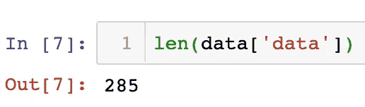

# 调查 JSON 模块

> 原文：<https://towardsdatascience.com/investigating-the-json-module-cd059b8a72f2?source=collection_archive---------56----------------------->

## 探索 Python 中最流行的数据格式之一


[图像来源](https://images.unsplash.com/photo-1516637090014-cb1ab78511f5?ixlib=rb-1.2.1&ixid=eyJhcHBfaWQiOjEyMDd9&auto=format&fit=crop&w=800&q=60)

JSON 是 JavaScript Object Notation 的缩写，创建它的目的是帮助提高数据传输的效率。它做到了这一点，现在它是网络数据传输的黄金标准。在这篇博文中，我将介绍如何使用 JSON 模块在 Python 中利用存储在 JSON 文件中的数据。

首先，我们要加载我们的 JSON 文件。我将在这篇文章中浏览的文件包含了 2001 年以来纽约市的竞选财务数据。正如这篇文章的标题所提到的，Python 中有一个非常有用的 JSON 模块，可以非常容易地导入，这使得处理 JSON 文件更加容易。

```
**import** json
```

要加载一个 JSON 文件，首先使用 Python 内置的 **open** 函数打开文件。然后，将文件对象传递给 JSON 模块的 **load** 方法。完成之后，最好检查一下 JSON 文件是作为哪种数据类型加载的。你认为它会是什么数据类型？


如果你猜是一本字典，干得好！JSON 文件通常是以分层的嵌套结构创建的，这意味着它们可能会令人困惑，甚至一开始会让人不知所措。但是，JSON 中的许多数据类型在 Python 中有相同的伙伴，只是名称不同。例如:

*   Python **列表**，**元组** = JSON 数组
*   Python **str** = JSON 字符串
*   Python **float** ， **int** = JSON 编号
*   Python **真** = JSON 真
*   python**False**= JSON False
*   无 = JSON 空

由于 JSON 模块的优秀开发人员，您可以使用 Python 中许多您熟悉的方法来研究您的 JSON 文件。一些例子:

*   检查字典的关键字:


*   检查值的数据类型:


*   将字典视为数据框架:


*   查看键中值的数量:



*   和预览数据:


因此，虽然 JSON 文件的结构可能有点吓人，但 Python 中的 JSON 模块允许您以一种对熟悉 Python 的人来说既高效又舒适的方式进行 EDA。如果您想获得一些关于如何研究嵌套数据的实践，JSON 文件是一个很好的资源。

感谢您的阅读！

[领英](https://www.linkedin.com/in/acusio-bivona-7a315818b/)