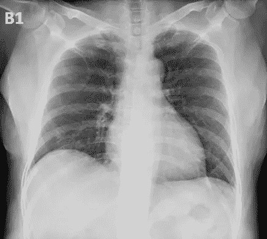
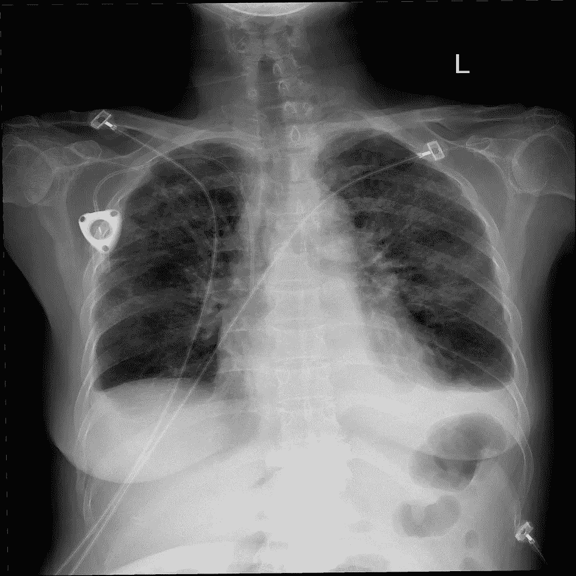
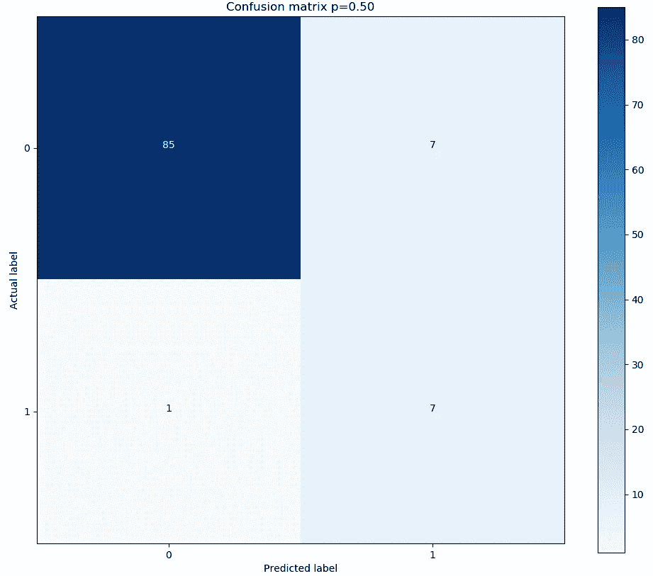
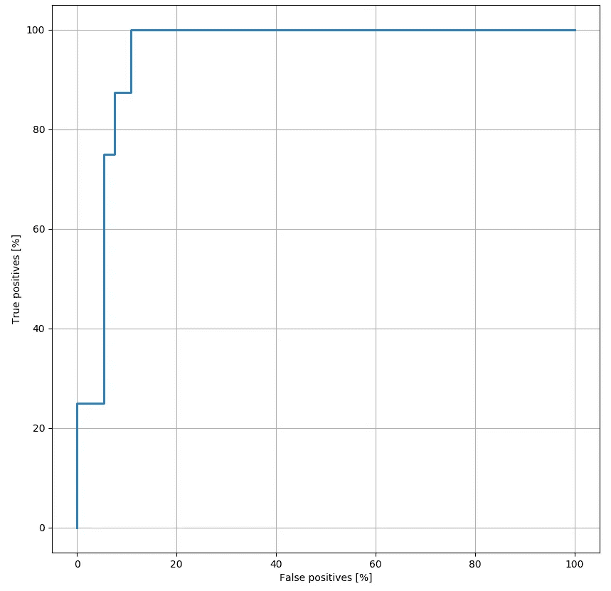
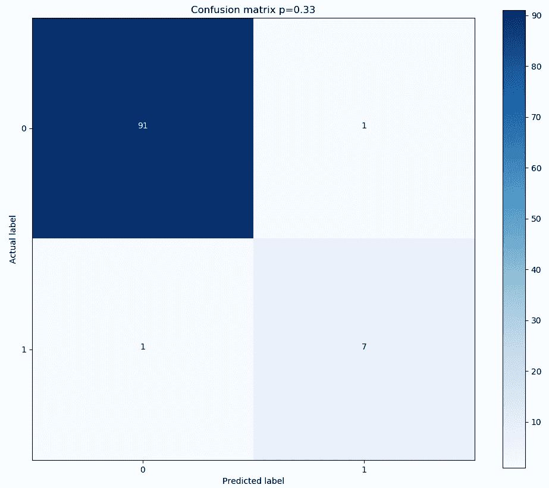
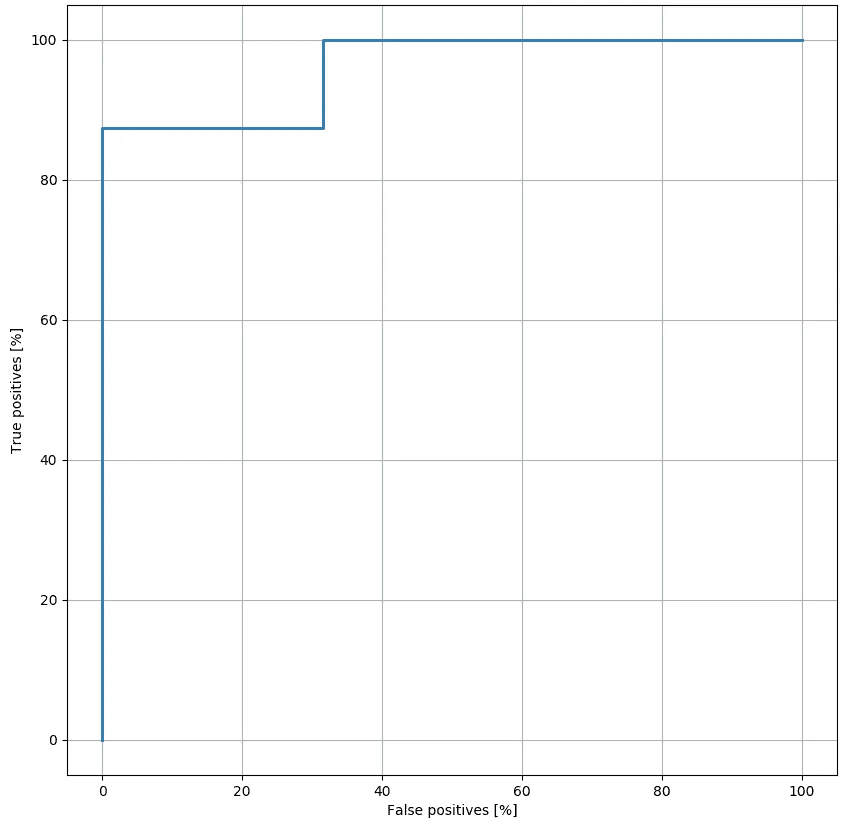
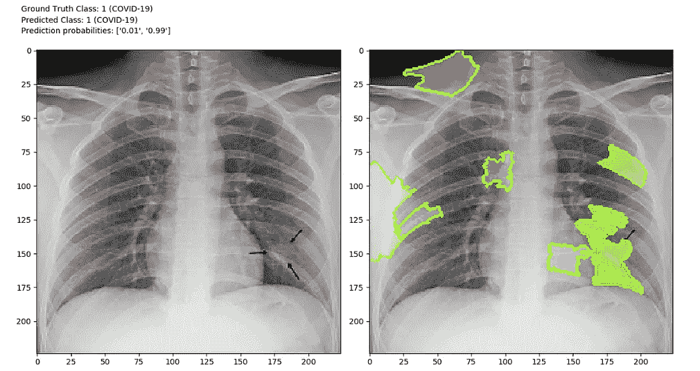
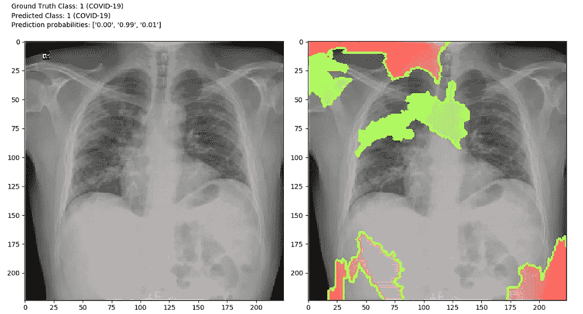
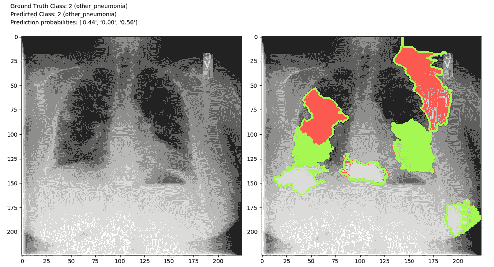
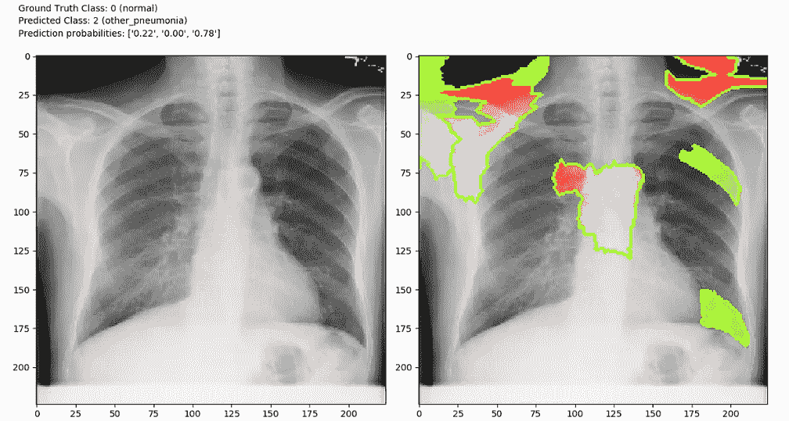

# 基于机器学习的胸片新冠肺炎感染可解释预测研究

> 原文：<https://towardsdatascience.com/investigation-of-explainable-predictions-of-covid-19-infection-from-chest-x-rays-with-machine-cb370f46af1d?source=collection_archive---------12----------------------->

## 我们能否通过应用神经网络和可解释算法来发现胸部 X 线新冠肺炎的特征？

## 编剧:布雷克·范贝罗&马特·罗斯

# 摘要

*   探索一种可解释的机器学习模型来区分新冠肺炎阳性患者的胸部 x 光片。
*   开发了深度卷积神经网络来分类胸部 X 射线。我们开源的模型基础设施是可扩展的、模块化的和有据可查的，这将允许其他研究人员通过构建这个库来快速迭代。参见我们的 [GitHub 库](https://github.com/aildnont/covid-cxr)。
*   LIME 算法被用来解释模型的预测。
*   我们邀请在机器学习或医疗保健领域拥有专业知识的研究人员、个人和组织为这个项目的发展做出贡献(联系信息在本文末尾)。
*   这个项目是一个早期的原型，而不是一个医疗诊断工具。构建这个库需要更多的数据和专业知识。

# 介绍

毫无疑问，这篇文章的读者知道新冠肺炎教的迅速传播。这种传染病对公众健康和国家经济构成严重威胁。加拿大和世界各地的病例数呈指数增长。研究人员已经接受了行动呼吁，并试图了解更多关于 SARS 冠状病毒 2(新型冠状病毒)。为了支持这些努力，机器学习研究人员正在使用他们的技能来揭示更多关于该病毒的信息。例如，研究人员基于 ResNet50 开发了 COVNet 框架，以区分新冠肺炎病例的 CT 扫描和其他类型的社区获得性肺炎[1]。

本文记录了一项应用机器学习方法搜索可解释模型的实验，以根据胸部 X 射线(CXR)区分与新冠肺炎相关的肺炎病例。尽管机器学习可能有助于解决这个问题，但模型做出的任何预测(无论多么成功)都将受到医疗保健提供商的仔细审查。必须为模型的预测提供解释。我们希望可解释的机器学习模型将为新冠肺炎不断增长的知识做出积极贡献。

# 为什么要研究 x 光？

由于逆转录聚合酶链式反应(RT-PCR)检测试剂盒供应有限，因此有必要探索识别和优先处理新冠肺炎疑似病例的替代方法。在我们的城市加拿大伦敦，新冠肺炎测试结果的周转时间目前报告为 24 小时[2]。在农村和偏远地区，这一周转时间可能更长。尽管 CT 扫描被用于对怀疑患有新冠肺炎的患者进行临床检查，但价格昂贵。因此，较小的中心获得 CT 扫描仪的机会可能有限。x 光机更便宜，也更便携，因此是一个可行的选择。

需要澄清的是，这篇文章并没有声称 CXRs 应该被用于新冠肺炎的诊断。加拿大放射科医师协会建议遵循 CDC 的指导方针，即 CXR 和 CT 不应用于诊断新冠肺炎[3]。该建议指出，病毒测试是目前诊断新冠肺炎的唯一手段，即使患者在 CXR 或 CT 上有提示性特征。也就是说，一些研究表明，放射成像(特别是 CT)可能与 RT-PCR 一样敏感[4]。这些发现展示了为什么我们决定探索这一途径，并构建开源工具来支持进一步的研究。同样重要的是要注意，正常的成像并不意味着患者没有被新型冠状病毒感染，只是他们没有表现出新冠肺炎呼吸系统疾病的迹象。

# 目标

*   确定是否可以训练机器学习分类器来区分新冠肺炎和 CXRs 的病例。
*   确定是否可以训练机器学习分类器来区分新冠肺炎病例的 cxr 与其他肺炎和正常病例。
*   应用众所周知的可解释性算法(LIME)来获得模型预测的解释。使用解释为特征工程和数据选择提供信息。
*   与对合作感兴趣的其他人联系以加强这项工作(我们最重要的目标)。

# 数据

## 数据集

出于本实验的目的，数据取自两个存储库:

1.  GitHub 上的[新冠肺炎影像数据收集库](https://github.com/ieee8023/covid-chestxray-dataset)正在收集越来越多的来自国际上的新冠肺炎病例的已鉴定的 cxr 和 CT 扫描。我们想借此机会感谢蒙特利尔大学的约瑟夫·保罗·寇恩和他的同事们，感谢他们在收集这个数据集方面所做的辛勤工作。样本图像见*图 1a* 。
2.  Kaggle 上提供的 [RSNA 肺炎检测挑战](https://www.kaggle.com/c/rsna-pneumonia-detection-challenge)数据集包含几个已识别的 cxr，并包括一个标签，指示图像是否显示肺炎的证据[6]。我们想借此机会感谢北美放射学会和所有其他相关实体创建了这个数据集。样本图像见*图 1b* 。

**图 1a(左):**一个来自数据集(1)的 CXR 的例子，标签为新冠肺炎。**图 1b(右):**取自数据集(2)的 CXR 的示例，标记为显示肺炎的证据。

在撰写本文时，第一个数据集包含 76 个新冠肺炎阳性患者的后前位(PA) CXR 图像。它还包含一些具有替代发现(如 SARS)的患者的 cxr。包含第二个数据集是为了增加可用的数据量，以提高我们的分类器的辨别能力。第二个数据集不仅包含正常的 cxr，还包含几个肺炎患者的 cxr。在从这两个数据集中仅选择**PA cxr**时要小心谨慎。尽管两个数据集都包含前后(AP) CXRs，我们假设包含两者可能会过度影响模型预测。正如贝尔、琼斯等人所描述的那样。艾尔。与 PA CXRs 相比，AP CXRs 的缺点包括结构外观上的差异[7]。

在训练之前，来自两个数据集的数据被合并成一个由大约 1000 幅图像组成的大数据集。我们希望在一个更大的数据集上训练，但是我们担心会产生太多的类别不平衡。数据集由一个包含文件名和相关标签的数据帧组成。然后，数据集被随机分为训练集、验证集和测试集，注意保持这些集中的类比例不变。

## 数据预处理

在训练之前，对图像本身进行预处理。[使用 ImageDataGenerator](https://www.tensorflow.org/api_docs/python/tf/keras/preprocessing/image/ImageDataGenerator) (来自 tensorflow.keras)在训练之前执行图像批次的预处理。对图像应用了以下变换:

*   图像大小调整为以下形状:224×224×3。通过减小图像尺寸，减少了神经网络中的参数数量。
*   对图像进行阈值处理以去除任何非常亮的像素，并修补缺失的区域。这样做是为了从图像中删除尽可能多的文本注释。有人假设，特定于一个地区或机构的注释可能会破坏预测。稍后将详细介绍。
*   对图像的像素值进行了变换，使得它们的平均值为 0。
*   图像的像素值除以图像内图像像素的标准偏差。通常，通过缩放图像使其像素值在范围*【0，1】内，从而使图像标准化。*相反，我们选择根据图像的标准偏差进行重新调整，因为数据集来自不同的来源。我们不能对 RSNA 数据集说话，但蒙特利尔大学的数据集包含从几个来源拍摄的图像。

# 二元分类

我们首先考虑一个二元分类问题，目标是检测 X 射线是否显示新冠肺炎感染的证据。分类员将 x 光图像归入非新冠肺炎类或新冠肺炎类。深度卷积神经网络架构被训练来执行二进制分类。使用 Adam 优化器和分类交叉熵损失来训练该模型。所有的训练代码都是用 [TensorFlow 2.0](https://www.tensorflow.org/) 编写的。

## 体系结构

经过无数次迭代，我们得到了一个使用剩余连接的深度卷积神经网络架构。由于新冠肺炎威胁迫在眉睫，本文发布后将进行详尽的超参数搜索。此外，网络的规模受到限制，以适应平均 GPU 硬件资源，但在扩大网络规模以利用更大的计算可用性时，指标有望得到改善。未来的工作将努力训练一个众所周知的残差网络(如 ResNet50)并利用预训练权重的迁移学习。*图 2* 总结了二元分类器的架构。

**图 2:** 二进制模型的架构概述。在该图中，残差块由两个卷积层定义，第一个卷积层的输入与第二个卷积层的输出相连，后面是最大池层。剩余的块串联连接，然后是 2 个完全连接的层。预测类(p)是最终层的 softmax 激活的 argmax。

## 防止过度配合的措施

我们应用了多种策略来应对过度拟合，如 L2 权重正则化、剔除正则化和数据扩充(训练集图像旋转多达 10 )。

## 阶级不平衡

由于可公开获得的严重新冠肺炎病例 cxr 的稀缺，我们被迫应用类别不平衡方法来减轻一个类别超过其他几个类别的影响。如果你精通机器学习，你就会知道，当一个类的代表性不足时，分类问题的准确率可能会高得令人误解。我们进退两难，因为我们也不想将我们的训练数据限制在只有 76 个非新冠肺炎的例子，因为总共会有大约 150 个图像。因此，当模型错误分类一个正面的例子时，我们应用类别加权来惩罚模型。类权重最初仅根据数据集中的比例进行计算。结果并不令人满意。因此，我们在项目的配置文件中为用户提供了一个选项，以便对代表不足的类进行更大的加权(除了计算出的权重之外)。这种干预将我们的精度和召回指标提高到原型的可接受值。

## 结果

训练实验完成后，训练指标在 [TensorBoard](https://www.tensorflow.org/tensorboard) 中可视化。参见*图* 3 *a* 关于培训和验证损失与纪元的示例。

**图 3a:** 二元分类器的训练(橙色)和验证(蓝色)损失与时期的关系

报告了测试装置的结果*图 3b* 。请注意，测试集包含不到 100 幅图像，其中只有 8 幅图像属于新冠肺炎类。*图 3c* 和 3 *d* 分别显示了混淆矩阵和 ROC 曲线。

**图 3b:** 二元分类器模型在测试集上的性能度量

**图 3c(左):**测试集上二元分类器预测的混淆矩阵。**图 3d(右):**二元分类器测试集预测的 ROC 曲线。

# 多类分类

尽管二元分类对于确定新冠肺炎 CXRs 是否具有任何可识别的模式是有信息的，但它更适用于将新冠肺炎重症病例与其他肺炎(尤其是其他病毒性肺炎)分开。我们在这里的目标是开发一个模型，可以将 CXR 图像分类为以下类别之一:正常、肺炎或新冠肺炎感染。我们重复了本文前面描述的相同的数据预处理技术。该模型架构与我们的二进制分类器非常相似，除了在末端具有 3 个节点的完全连接层(每个类一个节点)。

## 结果

一旦训练实验完成，训练指标就在 TensorBoard 中可视化。参见*图 4a* 中训练和验证损失与历元的示例。

**图 4a:** 多类分类器的训练(橙色)和验证(蓝色)损失与时期的关系

报告了测试集的结果*图 4b* 。报告了与新冠肺炎感染相对应的类别的二元指标(即精确度、召回率、F1 分数)。*图 4c* 和 *4d* 分别显示了新冠肺炎等级的混淆矩阵和 ROC 曲线。尽管该模型识别了大多数新冠肺炎病例，但是可以看出该模型的准确性明显较低。较低的整体准确性意味着多类别模型学会区分新冠肺炎类别与“正常”和“其他肺炎”类别比学会区分“正常”和“其他肺炎”类别更好。该模型的未来版本必须在训练期间找到更好的类权重平衡，以确保其他类保持独特。

**图 4b:** 多类分类器模型在测试集上的性能度量

**图 4c(左):**多类分类器关于新冠肺炎类的测试集预测的混淆矩阵。**图 4d(右):**二元分类器关于新冠肺炎类的测试集预测的 ROC 曲线。

# 可解释性

## 可解释性的必要性

正如本文前面提到的，这个模型必须是可解释的。深度卷积神经网络不是固有可解释的；相反，它们被认为是“黑盒”。根据一份关于放射学中人工智能伦理的国际声明，“透明度、可解释性和可解释性是建立患者和提供者信任的必要条件”[8]。临床医生不可能完全相信算法的预测，也不应该相信。通过解释为什么我们的模型预测新冠肺炎感染或缺乏感染，任何对改善该系统感兴趣的研究人员或临床医生可以理解为什么该模型做出特定的决定。目前，我们采用 LIME 算法[9]来解释模型预测。

追求可解释的机器学习模型不仅在道德上是负责任的，而且对研究人员来说，确保模型中没有数据泄漏或意外偏差也是有益的。我们很高兴我们探索了可解释性方法，因为我们注意到在我们的模型和数据科学社区中其他人的方法中有多种可能的数据泄漏来源。

## 石灰解释

我们使用[局部可解释的模型不可知解释](https://dl.acm.org/doi/10.1145/2939672.2939778)(即 LIME)来解释我们训练的神经网络分类器的预测[7]。我们使用了作者的 [GitHub 资源库](https://github.com/marcotcr/lime)中可用的实现。LIME 扰动一个例子中的特征，并拟合一个线性模型以在该例子周围的特征空间的局部区域中逼近神经网络。然后，它使用线性模型来确定哪些特征对该示例的模型预测贡献最大。通过将 LIME 应用于我们训练过的模型，我们可以根据我们看到的任何明显无关紧要的特征或领域专家的见解进行有根据的特征工程。我们还可以判断模型是否正在学习任何非预期的偏差，并通过附加的特征工程来消除该偏差。

对于图像数据，LIME 认为特征是图像的超像素。我们使用[快速移动](https://link.springer.com/chapter/10.1007%2F978-3-540-88693-8_52)模式搜索分割算法【10】来产生这些分割。在我们的项目中，解释在视觉上表现为 LIME 认为对原始图像预测贡献最大的超像素的叠加。绿色的超像素表示对预测类别贡献最大的区域。相反，红色的超像素表示对预测类别贡献最大的区域。

请参见*图 5a* 和 *5b* 了解测试集中两个二元分类器图像预测的时间解释的可视化表示。*图* 5 *c、5d、5e* 和 *5f* 显示了对测试集中图像的多类分类器预测的选择的时间解释。很明显，这个模型还有很长的路要走，因为胸腔外部的超像素继续出现在解释中。

**图 5a(左):**二元模型对测试集中的非新冠肺炎示例的预测的时间解释的示例。预测类匹配图像的地面真实类(即，非新冠肺炎)。有助于和不利于新冠肺炎预测的超像素分别被涂成绿色和红色。**图 5b(右):**二元模型对测试集中的新冠肺炎示例的预测的时间解释的示例。有助于和不利于新冠肺炎预测的超像素分别被涂成绿色和红色。

测试集中多类模型对 CXRs 预测的实例说明。对预测类有贡献的超像素和对预测类有贡献的超像素分别被着色为绿色和红色。**图 5c(左上):**对正常 CXR 的正确预测的简要说明。**图 5d(右上):**对被诊断患有新冠肺炎的患者的 CXR 的正确预测的简要说明。**图 5e(左下角):**对显示不同肺炎证据的 CXR 上的正确预测的简要说明。**图 5f(左上):**对一个正常 CXR 的错误预测的简要说明。该模型错误地将这种 CXR 归类为显示另一种肺炎的证据。

## 由石灰解释推动的改进

1.  **图像上打印的明亮字符**
    在训练我们的二元分类器并首次生成石灰解释后，我们注意到包含明亮文本的超像素通常突出显示为绿色，这表明它们有助于模型的预测。也许其中一个数据集比另一个数据集包含更多的特殊字符。这一发现促使我们尝试移除和修复亮度超过某一阈值的像素。在其他预处理步骤之前，如果一个像素的亮度高于 230(255 中的一个)，则使用周围像素作为参考[11]对其进行[修复 T12。这种方法似乎改善了解释，因为文本区域很少被突出显示。然而，这种方法对于不太明亮的文本区域效果不好。如果亮度截止阈值设置得太低，我们可能会切除 X 射线中可能存在的伪影，这将导致真正的患者信息被删除。我们邀请其他人就这个问题提出更好的解决方案。要么我们找到一种更好的方法来从图像中删除文本数据，要么我们在一个完全没有字符打印在图像上的数据集上进行训练。](https://scikit-image.org/docs/dev/auto_examples/filters/plot_inpaint.html)
2.  **非新冠肺炎图像**
    的儿科数据集的无意利用最初，我们使用保罗·穆尼的经典[胸部 x 光图像数据集(可在 Kaggle 上获得)作为我们的非新冠肺炎图像集合。该数据集包含分类为正常病例、细菌性肺炎病例和病毒性肺炎病例的 X 射线。在训练二元和多类分类器之后，我们注意到图像右侧和左侧的黑柱在 LIME 解释中被频繁报告为支持非新冠肺炎 cxr 预测的重要特征。鉴于这些区域在患者体外，很明显它们不应该被一致地强调为对预测有贡献。在仔细阅读了 Kaggle 上这个数据集的描述后，我们发现它的所有 cxr 都是从 1 到 5 岁的儿科患者中获取的。这构成了数据泄漏，因为该模型可能会拾取成人与儿童 X 射线的特征。这可能解释了为什么我们最初在测试集上实现了高性能指标。这向我们强调了结合可解释的人工智能实现机器学习模型的必要性。我们注意到，在过去的 2 周内，这种利用相同儿科数据集对 cxr 进行新冠肺炎分类的方法已经在数据科学界发表了多次。我们希望这个项目可以帮助纠正这些错误的结果。](https://www.kaggle.com/paultimothymooney/chest-xray-pneumonia)

虽然 LIME 是一个优秀的可解释性算法，但在不久的将来，我们将会应用和比较其他模型不可知的可解释性算法。

# 结论

本文描述的项目是应用机器学习区分新冠肺炎感染重症患者和 CXR 的一种尝试。这项工作绝不是为了临床使用；这纯粹是探索性的。然而，我们希望这个项目将继续改进，并可能提供有助于新冠肺炎医学研究的见解。我们相信可解释性是产生一个帮助医疗工作者和研究人员的算法系统的关键。这个项目将继续发展，并将相应地提供更新。

# 与我们合作

随着新冠肺炎疫情继续将社会置于越来越大的压力之下，具有共同目标的研究人员团结起来至关重要。请将这篇文章视为对有兴趣合并或扩展这项工作的个人或组织的公开呼吁。我们已经看到类似的项目在进行中，并愿意共同努力。

## 对不同专业知识的需求

这个项目是由加拿大伦敦市人工智能研究和创新实验室的成员完成的。我们认识到，我们的工作会因其他人而大大加强。我们需要有不同专业知识的人来推进这个项目。特别是:

*   需要临床专家来阐明临床需求，评估模型解释，并告知未来的数据预处理方法和模型设计决策。
*   需要数据科学专业知识来提高模型性能和可解释性技术。
*   如果项目被转移到生产中，可能需要软件工程专业知识来帮助转换项目。

如果您有兴趣，请联系我们(见下面的联系信息)。

## 需要更多数据

缺乏公开可用的新冠肺炎阳性 cxr 是改进这种原型模型性能的严重障碍。在小于 100 PA 新冠肺炎 cxr 的情况下，训练可概括的模型是具有挑战性的。机器学习的一个基本原则是，你训练的数据越多，你的模型对看不见的数据的表现就越好。

如果您能够提供更多身份认证数据或有兴趣签署数据共享协议，请联系我们:

**马特·罗斯，
人工智能经理，
信息技术服务，
城市经理办公室，
伦敦金融城公司
maross @ London . ca | 226 . 449 . 9113**

## 查看代码

请看这个项目的 [GitHub 库](https://github.com/aildnont/covid-cxr)。我们邀请您贡献您的想法。存储库的 README.md 解释了项目的组织，并提供了如何开始的详细说明。

# 参考

1.  长度李等，“人工智能在胸部 CT 上区分与社区获得性肺炎”，*放射学*，2020。可提供:10.1148/radio . 2020200905
2.  “新冠肺炎测试政策和指南”，lhsc.on.ca ，2020 年。【在线】。可用:[https://www.lhsc.on.ca/palm/labs/covid.html#main-content.](https://www.lhsc.on.ca/palm/labs/covid.html#main-content.)【访问日期:2020 年 3 月 27 日】。
3.  *加拿大放射学家协会和加拿大胸部放射学会关于影像部门新冠肺炎管理的声明*。加拿大放射学家协会，2020 年。
4.  Y.方等，“胸部 CT 对的敏感性:与 RT-PCR 的比较”，*放射学*，2020。可用:[https://pubs.rsna.org/doi/10.1148/radiol.2020200432.](https://pubs.rsna.org/doi/10.1148/radiol.2020200432.)
5.  J.科恩，《新冠肺炎影像资料集》， *GitHub* ，2020 年。【在线】。可用:【https://github.com/ieee8023/covid-chestxray-dataset. 【访问时间:2020 年 3 月 17 日】。
6.  “RSNA 肺炎检测挑战”， *Kaggle* ，2020。【在线】。可用:[https://www . ka ggle . com/c/rsna-肺炎-检测-挑战。](https://www.kaggle.com/c/rsna-pneumonia-detection-challenge.)【访问日期:2020 年 3 月 22 日】。
7.  D.贝尔和 j .琼斯，《胸片》，*放射医学*。【在线】。可用:[https://radiopaedia.org/articles/chest-radiograph.](https://radiopaedia.org/articles/chest-radiograph.)【访问日期:2020 年 3 月 26 日】。
8.  *放射学中人工智能的伦理:欧洲和北美多协会声明*。美国放射学院，2020 年。
9.  米（meter 的缩写））里贝罗、s·辛格和 c·盖斯特林，“我为什么要相信你？”，*第 22 届 ACM SIGKDD 知识发现与数据挖掘国际会议论文集— KDD* '16，2016。可用:[https://dl.acm.org/doi/10.1145/2939672.2939778.](https://dl.acm.org/doi/10.1145/2939672.2939778.)【2020 年 3 月 25 日获取】。
10.  A.Vedaldi 和 S. Soatto，“模式搜索的快速转换和核心方法”，*计算机科学讲义*，第 705–718 页，2008 年。可用:[https://link . springer . com/chapter/10.1007% 2f 978-3-540-88693-8 _ 52。](https://link.springer.com/chapter/10.1007%2F978-3-540-88693-8_52.)【2020 年 3 月 25 日访问】。
11.  《修复》，Scikit-image.org，2020 年。【在线】。可用:[https://sci kit-image . org/docs/dev/auto _ examples/filters/plot _ inpaint . html](https://scikit-image.org/docs/dev/auto_examples/filters/plot_inpaint.html.)【访问时间:2020 年 3 月 25 日】。