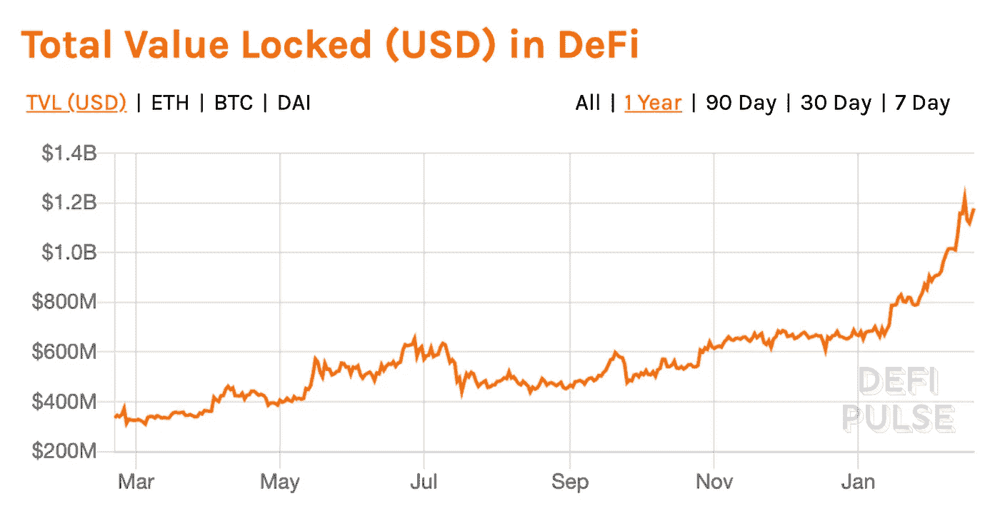
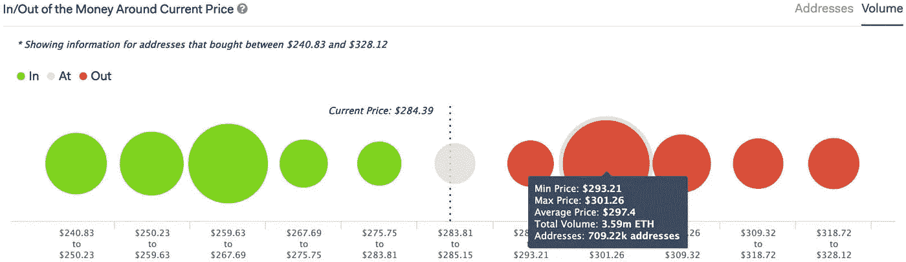
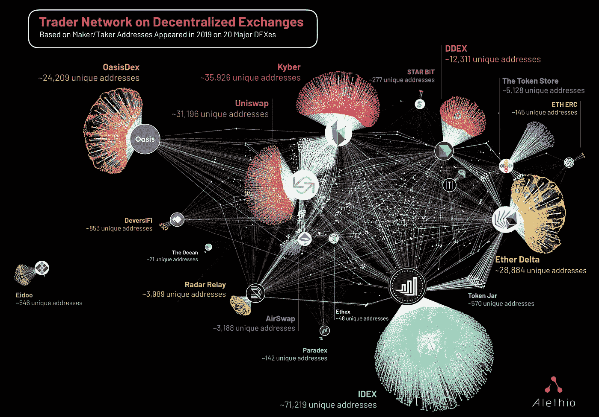

# 加密资产评估

> 原文：<https://towardsdatascience.com/investing-in-crypto-assets-eca762f3aa80?source=collection_archive---------19----------------------->

## 数据科学家的生态系统概述

来源: [Pixabay](https://pixabay.com/photos/chess-chess-pieces-chess-board-2730034/)

*注:此处无任何财务建议。本文仅供参考，不用于投资决策。*

**要点**

*   加密协议及其本地资产提供了一个开放的、数据丰富的资产类别，具有风险规模的经济性和公开市场流动性的优势
*   我们仍然没有建立长期估值的标准，这提供了一个机会之窗
*   将加密协议建模为复杂系统是一个活跃的研究领域
*   分解价值链可以增加特定想法迷宫的迭代次数。这加速了产品市场契合度的集体发现。
*   投资该资产类别提供了不对称的机会

**简介**

作为一名数据科学家，很难不对加密生态系统的开放性感到兴奋。开放的知识和开放的数据意味着一个可以指导我们投资决策的洞见宝库。

至少，它是值得深入研究的，因为它采用了多学科的方法来研究我们如何改变我们如何协调人类活动。我们不仅可以了解如何改善我们的人类系统，还可以了解它们如何以及为什么以这样的方式运行。

主流的兴趣很大程度上跟随着最近的价格趋势。在这篇文章中，我超越了加密价格的短期价格投机，并探讨了如何从长期角度看待加密资产估值的各个方面。这并不意味着对任何主题的深入探究，而是对生态系统的高层次概述。为了更深入，我提供了提到的概念的来源。

**投资分析**

大多数关于密码市场的数据科学相关文章都专注于[技术分析](https://www.investopedia.com/terms/t/technicalanalysis.asp)来预测未来价格。如果历史模式显示未来价格上涨/下跌，这提供了一个买入/卖出信号。同时，[基本面分析](https://www.investopedia.com/articles/fundamental/03/022603.asp)侧重于资产内在价值的估计。如果一项资产的估计内在价值高于/低于市场价格，这就提供了一个买入/卖出信号。

为什么这种区别对加密市场很重要？他们仍然不成熟，大部分投资(交易)都是投机性的，只要现实世界的问题没有用技术解决，这种情况就会持续下去。市场发展将使资产估值与其他更成熟的资产类别(股票、商品、外汇等)相似。)

为什么技术分析更受欢迎？最明显的答案是数据的可用性。即使区块链的数据是公开的，它仍然需要以一种有意义的格式进行解析。价格信息很容易获取。不仅如此，我们可以应用与任何其他资产类别相同(或相似)的方法进行分析。它可以被建模为有监督的机器学习或深度强化学习问题。或者我们可以用技术指标，从传统金融中转移知识。为了在基础价格上建立 LSTM 神经网络，除了知道如何优化模型架构(这是一个复杂但不同的问题)，我们不需要任何领域知识。因此，关注点更多的是超越他人(大众心理)，而不是评估资产的潜在价值。

与此同时，基本面分析依赖于领域知识，很难找到一个比密码学跨越更多领域的领域。它包括经济学、博弈论、密码学和分布式系统等。

基本面分析可以分解为两个部分:

*   对解决商业问题的未来市场潜力的估计
*   估计单个解决方案获取解决该问题的投资回报的概率

随着时间的推移，单个解决方案如何成功解决业务问题是 Balaji Srinivasan 称之为[思想迷宫](https://cdixon.org/2013/08/04/the-idea-maze)的进化过程。

**想法迷宫**

思想迷宫的一个非加密的历史例子是社交网络产品。如果我们估计未来[的总目标市场](https://en.wikipedia.org/wiki/Total_addressable_market) (TAM)将会很大，我们将如何在不同的选择中分配成功的概率？脸书获得的归因概率会和它今天在整个潜在市场中所占的百分比一样高吗？或者，MySpace 或 Hi5 会被视为更有未来潜力吗？或者，我们可能会得出结论，另一种产品将占领当时尚未推出的市场？当前的市场领导者解决业务问题的能力如何，其[网络效应](http://70 Percent of Value in Tech is Driven by Network Effects We wanted to put an actual number on the amount of value network effects have created in the digital world. The short…www.nfx.com)有多强和多有价值？这些问题可能值得一问。

这可能是一个很好的智力练习，但基本上没用。这有两个原因:缺乏交易流和封闭数据。第一个原因是，大多数人(散户投资者)没有机会投资早期企业。这是留给天使投资人和风险投资人的，因为他们既有资金也有动机长期持有非流动性资产[，以换取大概率的大幅上涨](http://reactionwheel.net/2015/06/power-laws-in-venture.html)。第二个原因是，我们可以用来评估业务的指标不对散户开放。这些公司在私人市场运营，所以他们没有动力分享他们的使用指标。随着越来越多的经济增长来自科技公司，它们上市的时间越来越长，这带来了一个困难的挑战:留给散户投资者的回报已经不多了。

在 crypto 中，许多人谈论“杀手级 dApp”(分散式应用程序)，它将使加密技术成为主流。与此同时，仍然存在需要克服的关键挑战，这些挑战涉及计算吞吐量的 UX(如[入口](https://medium.com/@dotkrueger/the-fiat-to-crypto-on-off-ramps-50ea411993df))和[可扩展性](https://medium.com/@FEhrsam/scaling-ethereum-to-billions-of-users-f37d9f487db1)。

去年，分散融资(DeFi)申请数量有所增加，这些申请锁定了 [$1B 总价值(TVL)](https://defipulse.com/) 。价值是透明的，我们可以看到价值是如何分布在不同的项目中的。同时，这只是当前 3000 亿美元行业总市值的一小部分。

DeFi Pulse 生态系统概述([来源](https://defipulse.com/))

未来的发展取决于很多不可预测的因素。和技术一样，时机很重要。某些解决思想迷宫的方法可能在今天不成功，但在 10 年后会成功。不管怎样，有一点是清楚的:随着该行业市值的增加，主流市场对其回报的兴趣也会增加。因此，在不推测真正的杀手 dApp 的情况下，探索一个明显的想法迷宫是有意义的，crypto 有多种独特的方法来解决:社会投资。

解决社会投资的想法迷宫的用例是提供一个平台，将擅长投资的人和没有资源(时间/精力/技能)来主动投资的人联系起来。这并不是说我们不能构建不基于加密技术的解决方案。 [eToro 的](https://www.etoro.com/copytrader/) CopyTrader 做的。与此同时，就像互联网使信息传播民主化一样，加密可以使金融产品的创造和管理民主化。DeFi 支持创建[可编程、可组合和可互操作的](https://consensys.net/blog/news/2019-was-the-year-of-defi-and-why-2020-will-be-too/)资产，我们已经有了这样的工作实例。在此基础上构建的 Stablecoins 和 lending 协议已经有了多种变体。社会投资也是如此。

[Set Protocol](https://www.tokensets.com/social-trader/follower) 构建了替代 eToro 产品的 DeFi，并增加了许多附加功能。 [Melon](https://melonprotocol.com/) ，另一个 DeFi 解决方案，专注于建立分散的链上资产管理。目前，对冲基金为可能编码在智能合约中的管理任务支付大量费用，并通过软件实现成本高昂的工作流程自动化。有了 DeFi，无论在什么地方，只需花费一小部分费用，就可以在几分钟内建立一个加密基金。 [ICONOMI](https://www.iconomi.com/crypto-strategies) 是另一家提供集中金融(CeFi)解决方案的提供商，该解决方案支持创建和遵循不同的加密策略。

这些是探索社会投资理念迷宫的一些例子。由于网络效应，市场经常被赢家通吃的动态所统治，这也是长期加密协议护城河的一个来源。这并不是说这里会发生这种情况。这些产品针对单独和交叉的用例。

**指标**

在过去的二十年里，软件业务改变了我们在许多垂直领域提供服务的方式。有了像《精益分析》这样的书和像《AARRR》这样的框架，我们现在已经建立了思考 SaaS 商业价值的模型。我们了解跟踪和改善[增长漏斗](https://medium.com/@ms.mbalke/aarrr-framework-metrics-that-let-your-startup-sound-like-a-pirate-ship-e91d4082994b)的价值。我们现在知道并理解了[留住人才的重要性](https://mobilegrowthstack.com/why-focusing-on-acquistion-will-kill-your-mobile-startup-e8b5fbd81724)以及[单位经济的重要性](https://www.forentrepreneurs.com/ltv-cac/)。

创建初创公司的早期经验之一是，许多我们可能认为重要的指标只是虚荣指标。一个页面上的浏览量或客户总数并不能给我们很多关于业务实际表现的有价值的信息。几乎没有可操作的洞察力，只有一个错误的成功信号。

这与加密有什么关系？我们还没有建立成功的标准。加密网络复杂且相互关联。它们在不同的层上运行，构建在彼此之上。就像链条的强度由最薄弱的环节决定一样，上层协议层的安全性由下层协议层的安全性决定。我们越往上走，协议就越面向用户。

在 DeFi 中，加密协议的互联本质被描述为[金钱乐高](https://medium.com/totle/building-with-money-legos-ab63a58ae764)。通过[分解价值链](https://haseebq.com/crypto-is-financial-unbundling/)，我们可能会看到在一个特定的想法迷宫中迭代次数的增加。以此，加速寻找适合加密应用的产品市场的集体努力。

除此之外，加密协议[通过其本地资产](https://multicoin.capital/2019/03/14/on-value-capture-at-layers-1-and-2/)创造和获取价值是有区别的。今天所有的互联网经济都是建立在 TCP/IP 协议之上的。然而，它的创造者没有抓住在它之上创造的任何价值。某些协议建立在其他协议之上，而其他协议(目前)不能随着用户数量的大量增加而扩展。有时协议的网络无法抵御恶意攻击(攻击媒介)或者不够分散。这被称为[区块链三难困境](https://github.com/ethereum/wiki/wiki/Sharding-FAQ)，加密网络需要在可伸缩性、安全性和去中心化之间进行权衡。

对于加密协议应该如何工作有不同的观点。一种观点认为，他们只是新类型的企业，其目标应该是优化他们的成功指标(如收入)。这意味着它们应该和股票一样接受评估:它们的商业基本面。另一种观点认为，它们只提供了[逻辑系统来协调网络中不同参与者之间的关系](https://www.placeholder.vc/blog/2019/10/6/protocols-as-minimally-extractive-coordinators)。作为协调者，他们应该最小化他们获得的价值，而不是最大化它(不像企业)。

除此之外，加密项目还有独特的挑战需要解决。[产品/市场契合度、社区参与度和充分的分权](https://a16z.com/2020/01/09/progressive-decentralization-crypto-product-management/)就像凳子的三条腿。它们都需要发挥作用，加密项目才能成功。

在定义有意义的加密指标方面也有很多工作要做。由于网络效应，加密协议的价值随着参与者的增加而增加。梅特卡夫定律对电信网络进行了量化，使得网络的价值与参与者的平方成比例增长。另一个引起生态系统关注的指标是来自货币经济学的[交换方程](https://en.wikipedia.org/wiki/Equation_of_exchange) (MV = PQ)。这意味着加密资产的价值可以通过求解 M(货币基础的大小)来估计，M 随着数字资源数量(Q)及其价格(P)的增加而增加，随着资产速度(V)的增加而减少。其他更多的加密原生指标包括 [NVT](https://hackernoon.com/network-value-to-transactions-ratio-cryptocurrencys-answer-to-p-e-c3743e700929) 和 INET。克里斯·伯恩斯克，这一领域的先驱思想家，就这一主题写了一篇早期文章和一本书。

慢慢地，某些习惯会变得根深蒂固，并被视为理所当然。正如今天的 web 开发人员在开发 web 应用程序时不需要考虑指针(低级编程抽象)，未来的区块链开发人员也不需要考虑今天开发区块链应用程序的许多复杂性。

**模拟协议行为**

目的驱动的令牌[的设计带来了来自其目标的挑战:让](https://medium.com/crypto3conomics/purpose-driven-tokens-51334d278c32)[建立一个自组织系统](https://thegraph.com/blog/modeling-cryptoeconomic-protocols-as-complex-systems-part-1)。它表现出的行为无法通过其各部分的总和来预测。

> 考虑行星运动的研究。一个高中生可以用笔和纸计算出一颗行星绕太阳的运动，而三体却没有任何封闭形式的解。
> 
> 布兰登·拉米雷斯

在分析加密协议时，需要考虑复杂的突发行为。 [cadCAD](https://cadcad.org/) 是一个 Python 库，通过模拟一组动作可能对系统产生的影响来实现建模。它可以回答系统设计和分析的“如果”。这篇[论文](https://epub.wu.ac.at/7309/)对这个主题提供了很好的技术介绍。

为什么这对估值很重要？因为对于一个有效可靠的系统，我们需要了解不同的输入如何影响其输出。我们最不想要的就是使用或投资一个在不同参数下的行为对我们来说是黑盒的协议。

**领域知识**

现在很明显，关于加密的知识跨越了许多领域。如何跟上生态系统的进化？

与大多数行业不同，加密社区的成员经常与公众分享他们的知识和观点。

不从区块链开发商开始是不公平的。Vitalik Buterin(以太坊的创造者)是太空中最伟大的思想家之一。与此同时，他的想法可能不会直接适用于数据科学家。他的文章可能更有助于加深对协议设计的深层技术方面的了解，以及未来 5-10 年的行业趋势。

专门从事加密的风险投资公司通常也比不从事加密的公司更积极地写作。 [Placeholder](https://www.placeholder.vc/) 、 [a16z crypto](https://a16z.com/category/blockchain-cryptocurrencies/) 、 [Outlier Ventures、](https://outlierventures.io/research/)和 [DragonFly](https://medium.com/dragonfly-research) 写下他们如何看待 crypto 的发展，并分享他们对为什么投资某些 crypto 项目的想法(他们的投资论文)。对于一个数据科学家来说，主要的价值是更好地理解价值创造和价值获取，并结合不同的评估心智模型。

加密分析公司经常写他们的平台可以从大量可用数据中发现的见解。这些可能是与数据科学家最相关的。 [IntoTheBlock](https://medium.com/intotheblock) 撰写不同协议的深度行为分析。

IntoTheBlock 的资金进出分析([来源](https://medium.com/intotheblock/fascinating-metrics-about-crypto-assets-highlights-and-slide-deck-dab51f3308f)

其他类似的公司还有 [Santiment](https://medium.com/santiment) 、 [Alethio](https://medium.com/@alethioEthstats) 、 [Dune Analytics](https://www.duneanalytics.com/blog) 和 [TokenAnalyst](https://www.tokenanalyst.io/research) 。这些侧重于分析观察数据。区块链数据的开放性使其能够洞察任何其他资产类别都无法获得的信息。

Alethio 的分散交易所交易者网络分析([来源](https://medium.com/alethio/dex-in-the-2019-a-recap-by-numbers-96d506ba1cb8)

像 [Gauntlet](https://medium.com/gauntlet-networks/introducing-gauntlet-d07304956bbf) 和[block science](https://block.science/)(cadCAD 的作者)这样的公司更关注使用基于代理的模拟来模拟协议行为。前者最近发表了[一份关于复合(DeFi 应用)财务风险的研究报告](https://gauntlet.network/reports/CompoundMarketRiskAssessment.pdf)。

**结论**

作为散户投资者，与传统科技公司相比，在更早的阶段投资加密资产是可能的。项目的指标是开放的，投资是流动的(没有[锁定期](https://www.investopedia.com/terms/l/lockup-period.asp))。或者换句话说，加密项目使风险规模经济具有公开市场流动性的所有优势。

这使得投资者能够利用不对称风险(上升空间大，下降空间小)。这尤其适用于数据科学家，他们可以利用业务和技术知识，利用自己的数据驱动型决策技能。

随着该行业的成熟和市值的增长，这种知识将越来越货币化。我们将建立评估框架，更好地分析和模拟加密协议的突发行为。但在投资中，非共识的正确总是最重要的，因为这是回报所在。