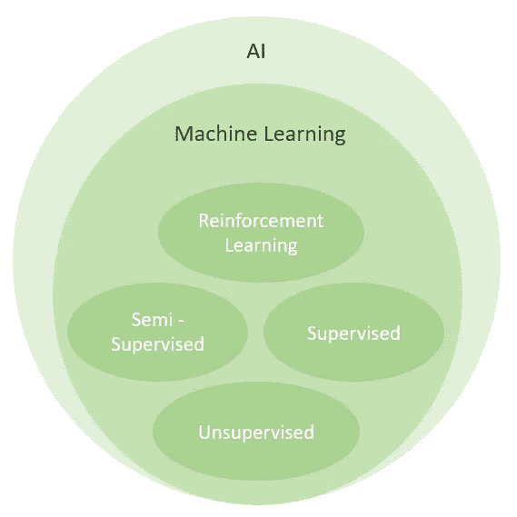
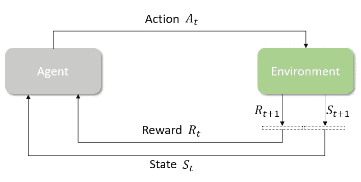

# 邀请所有有抱负的强化学习实践者

> 原文：<https://towardsdatascience.com/invitation-to-all-aspiring-reinforcement-learning-practitioner-5f87384cee67?source=collection_archive---------35----------------------->

## 感谢 AWS 和[雅加达机器学习](https://jakartamachinelearning.com/)

[drmakete 实验室](https://unsplash.com/@drmakete?utm_source=medium&utm_medium=referral)在 [Unsplash](https://unsplash.com?utm_source=medium&utm_medium=referral) 上拍摄的照片

> **公开邀请所有有志于强化学习(RL)的从业者在未来 3 个月内与我一起学习 RL**

不久前，我参加了由 AWS 和 Jakarta Machine Learning (JML)举办的 RL 训练营。我们这些参与者将会得到 AWS 经验丰富的代表们的悉心指导。在接下来的 3 个月里，导师们将指导和介绍我们走'**正道**'，学习 RL。不仅学习理论，我们还将学习如何在实际应用中应用它！

是不是很有意思？？让你更感兴趣的是:

> 我会把我在这次训练营中学到的东西分享给大家！！

所以，深呼吸，泡一杯茶，我邀请你和我一起加入这个激动人心的 RL 之旅！

照片由 [Loverna 在](https://unsplash.com/@loverna?utm_source=medium&utm_medium=referral) [Unsplash](https://unsplash.com?utm_source=medium&utm_medium=referral) 上的旅程拍摄

上周是第一次会议，这基本上是一个关于项目的介绍会议，参与者的概况，我们将学到什么，以及一些关于 RL 的介绍。当我听到我们在接下来的 3 个月里将要学习的内容时，我感到无比兴奋，因为我不仅仅是为了自己而学习，我还会与你们分享我的知识！

首先，我将向您介绍强化学习。尽情享受吧！

# 什么是强化学习？

AI 领域[图片由作者提供]

强化学习(RL)是机器学习的一个子集，它使一个*代理*能够在一个特定的*环境*中通过*行动*的结果进行学习，目的是最大化*累积回报*。

为了更好地理解，假设你有一只新的宠物狗，名叫布朗，你想教它一些技巧。怎么会？当他做对的时候你可以奖励他，当他做错的时候你什么都不给。当然，你必须这样做几次，直到他意识到他应该做什么。

安娜·杜德科娃在 [Unsplash](https://unsplash.com?utm_source=medium&utm_medium=referral) 上的照片

另一个关于 RL 如何应用于现实生活的有趣例子是 YAWScience 做的一个实验。在这个实验中，如果小鸡成功地钉住了粉红色的纸而不是其他颜色的纸，它就会得到奖励。结果是，小鸡成功地锁定了正确的一个，尽管在每次迭代中所有的纸都被打乱了！

像其他科学领域一样，我们必须准备一个强大的基础，这样我们才能轻松地学习更复杂的领域。要掌握 RL，我们必须了解它的先驱:*(MDP)*。在我们了解 MDP 之前，我们必须了解:

1.  马尔可夫性质
2.  马尔可夫过程(马尔可夫链)
3.  马尔可夫奖励过程

正如我在开始所说，这个训练营提供了学习 RL 的“正确途径”。导师告诉我们，MDP 概念对于更好地理解 RL 非常重要，并鼓励我们自己学习。

我试图在训练营之外自学这个概念，我做到了！就像我一样，我也相信你可以自学！但我不会让你迷失在野外。我想确保你和我总是在同一页上。所以，我会分享一些我看过/读过的好资源给你:

1.  [马尔可夫决策过程(MDPs)——构建强化学习问题](https://www.youtube.com/watch?v=my207WNoeyA)
2.  [David Silver 的 RL 课程——第 2 讲:马尔可夫决策过程](https://www.youtube.com/watch?v=lfHX2hHRMVQ)
3.  [强化学习揭秘:马尔可夫决策过程(第一部分)](/reinforcement-learning-demystified-markov-decision-processes-part-1-bf00dda41690)
4.  [强化学习揭秘:马尔可夫决策过程(第二部分)](/reinforcement-learning-demystified-markov-decision-processes-part-2-b209e8617c5a)

# RL 中的重要术语

RL 模型中涉及的元素。[图片由作者提供]

您需要了解几个重要术语:

1.  **代理人。**需要根据自身行为和经验接受“教育”的决策者。由策略和学习算法组成。
2.  **环境。**代理人的物理世界。基本上，它只不过是一个模拟。
3.  **状态。**代理当前所处的“情况”。这包括过去、现在和未来的状态。
4.  **行动。**代理人在环境内部的活动。
5.  **奖励。**环境的反馈。可以是正的，也可以是负的。
6.  **政策。**负责根据对环境的观察选择代理将采取什么行动的单元。
7.  **插曲。**以终止状态结束的状态序列。
8.  **奖励功能。**激励特定代理行为的功能，是 RL 的核心。

类似于监督机器学习设置中的偏差-方差权衡，RL 中也有权衡。这叫做**探索与开发的权衡**。探索是指代理人试图收集一些新信息，并期望这些信息比当前信息更有用。而利用是指代理根据已知信息做出最佳决策。

为了更好地理解，假设你和你的朋友亚当计划明天一起吃午饭。考虑这两种情况:

1.  “嗨，亚当，我听说这个地区新开了一家餐馆。我们为什么不试试去那家餐馆吃午饭呢？”
2.  “嘿，亚当，我知道我们明天应该去哪里吃午饭了。我们为什么不在上周去过的那家餐馆吃午饭呢？”

第一个场景就是我们所说的**探索**。你和亚当不知道它会是什么味道，它可能比你最喜欢的餐馆差，但也可能好得多。而在第二种情况下，你知道你们两个都不会对味道有问题，而且你们很有可能会喜欢明天的午餐。这个场景类似于**开发**阶段。

# 它是如何工作的？

RL 工作原理的基本概念。[图片由作者提供]

现在，我将解释 RL 在高层是如何工作的。不要担心，因为在以后的帖子中，我们将回到这个问题并了解细节！

下标 *t* 指的是我们当前所处的时间步长。

在第一个时间步( *t=0* )，代理接收环境的状态作为输入。基于这些输入，它将决定采取什么行动。一旦作出决定，行动就转移回环境中。

然后，时间步长递增(t=1 ),环境产生新的状态。除此之外，环境还会输出一个奖励，稍后会给代理人。

最后，将当前状态和奖励都提供给代理。代理因其之前的行为而获得奖励(可以是正的或负的)。

对于未来的时间步长，重复相同的过程。

> 但是……当这个循环结束时？

这取决于你的任务类型。一般来说，有两种不同的类型:

1.  阶段性任务是具有终结状态的任务。换句话说，这种任务是有结局的。比如下象棋。
2.  **继续任务**是没有终止状态或永不结束的任务。例如，个人辅助机器人。

因此，如果您正在处理一个临时任务，那么循环将会重复，直到到达终端状态。如果您正在处理一个连续的任务，那么循环将永远不会结束。

# 最后的话

由 [Ravi Pinisetti](https://unsplash.com/@ravipinisetti?utm_source=medium&utm_medium=referral) 在 [Unsplash](https://unsplash.com?utm_source=medium&utm_medium=referral) 上拍摄的照片

恭喜你坚持到了这一步！

到现在为止，你应该知道什么是强化学习，RL 中有哪些重要的术语，它在高层是如何工作的。如果你听从了我的建议，那么你也应该已经了解了马尔可夫决策过程的概念。对于那些没有读过这本书的人，我鼓励你花些时间来学习这个概念。

记住，这只是我们学习 RL 旅程的开始！我还有很多材料要和大家分享。所以，如果你喜欢这些内容，并且想在接下来的 3 个月里继续和我一起学习，请关注我的媒体账号，以获得关于我未来帖子的通知！

在下一集，我们将了解更多关于 RL 在自动驾驶赛车中的应用。[来看看](/reinforcement-learning-in-autonomous-race-car-c25822def9f8)！

# 关于作者

Louis Owen 是一名数据科学爱好者，他总是渴望获得新知识。他获得了最后一年的全额奖学金，在印度尼西亚最好的大学之一[*Institut Teknologi Bandung*](https://www.itb.ac.id/)攻读数学专业。最近，2020 年 7 月，他刚刚以优异的成绩从他的研究中毕业。

Louis 曾在多个行业领域担任分析/机器学习实习生，包括 OTA([*Traveloka*](https://www.linkedin.com/company/traveloka-com/))、电子商务( [*Tokopedia*](https://www.linkedin.com/company/pt--tokopedia/) )、fin tech([*Do-it*](https://www.linkedin.com/company/doitglotech/))、智慧城市 App ( [*Qlue 智慧城市*](https://www.linkedin.com/company/qluesmartcity/) )，目前在 [*世界银行*](https://www.linkedin.com/company/the-world-bank/) 担任数据科学顾问

查看路易斯的网站以了解更多关于他的信息！最后，如果您有任何疑问或需要讨论的话题，请通过 [LinkedIn](https://www.linkedin.com/in/louisowen/) 联系 Louis。