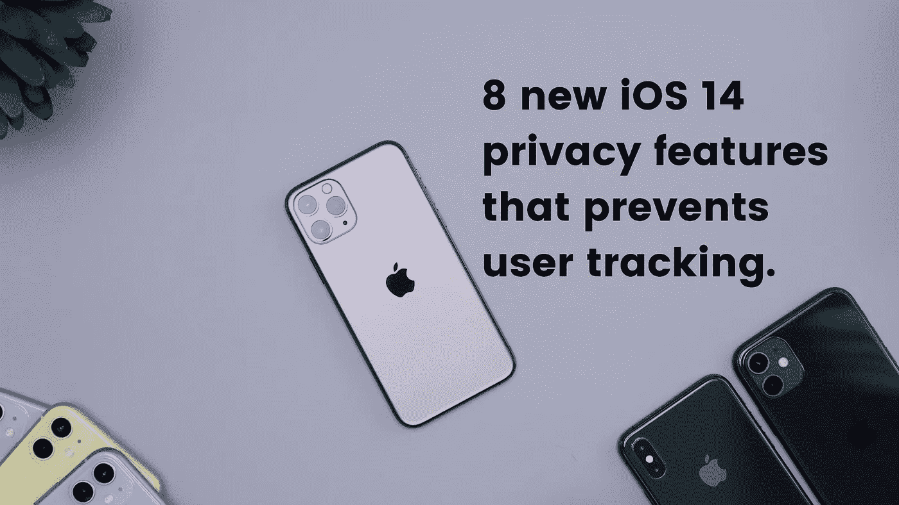
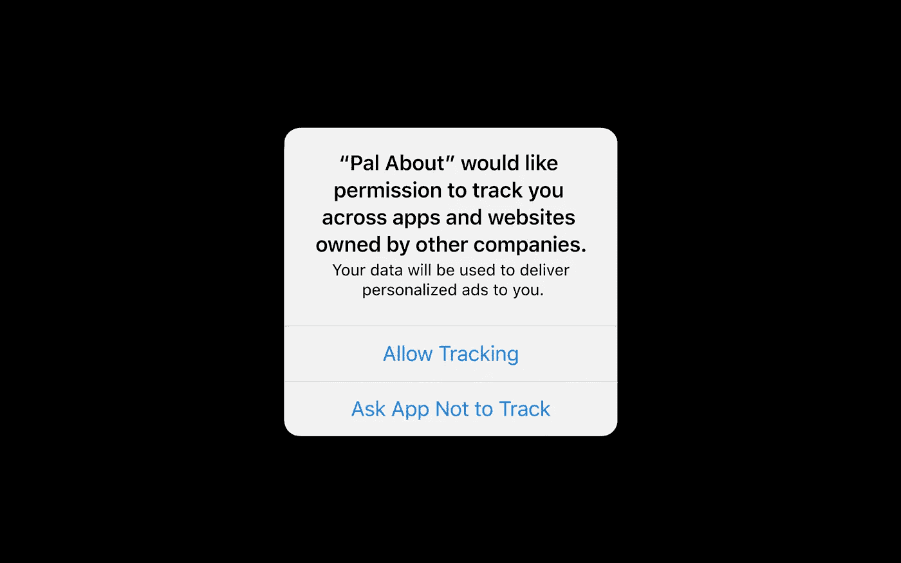
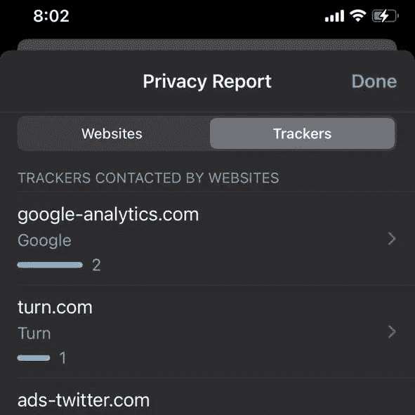
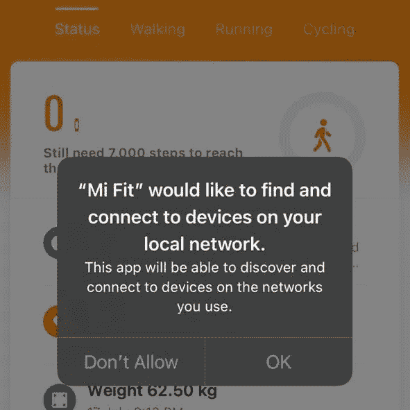
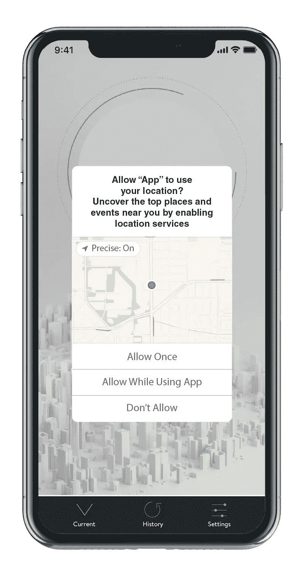
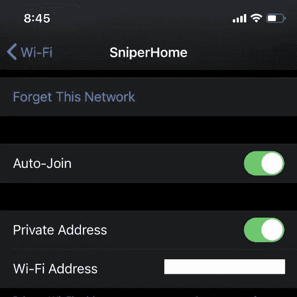

# iOS 14 是为了扰乱公司对用户的跟踪

> 原文：<https://towardsdatascience.com/ios-14-is-here-to-disrupt-user-tracking-for-ads-59894a7e9da6?source=collection_archive---------51----------------------->

## 苹果吹嘘的新 ios 14 隐私功能，用户喜欢，广告商讨厌。

丹尼尔·罗梅罗在 [Unsplash](https://unsplash.com/s/photos/iphone-11-pro?utm_source=unsplash&utm_medium=referral&utm_content=creditCopyText) 上拍摄的 BG 照片

自从 WWDC 的第一天起，科技行业的话题就一直围绕着苹果的新硅芯片以及新的 iOS 和 macOS 版本。iOS 14 与近年来的前几个版本相比，在改进的 UI 和新功能方面有了重大更新。Android 用户对很多功能一笑置之，比如他们已经拥有多年的图片模式。

但是有些东西很多人在主题演讲中忽略了，有些东西可能会影响像脸书、谷歌这样价值数十亿美元的公司，以及价值数十亿美元的广告业。广告界和苹果公司已经在 *mano a mano* 待了一段时间，但是这些新的变化将会改变这个行业的游戏规则。让我们来看看一些主要的隐私功能:

# 1.应用程序跟踪

iOS 13 已经在手机的隐私设置中加入了广告跟踪功能，而大多数用户并不知道。随着 iOS 14 的推出，苹果通过将这一功能引入应用程序，将更多控制权交给了用户。在 iOS 14 中，如果一个应用程序想要跟踪用户，他们必须明确征求用户的许可。因此，每次你安装需要追踪信息的应用程序时，你都会得到一个要求你许可的提示。用户也可以在完成后关闭此功能

跟踪权限提示

值得注意的是，这并不意味着应用程序不能完全跟踪你，苹果为开发者推出了一个新的以隐私为重点的广告框架，允许匿名检索数据，而无需掌握用户或具体信息。但这将使大多数公司用于货币化的指标过时。

# 2.Safari 跟踪报告

Safari 中的新跟踪功能将向用户显示网站用来收集用户信息的所有跟踪器的列表。这项功能将出现在 iPhone、iPad 和 Mac 上的 Safari 浏览器中，并向用户显示苹果通过其智能跟踪阻止功能阻止的所有跨网站跟踪器的列表。受欢迎的网站用来收集你的信息的追踪器的数量会让你大吃一惊。

追踪器在 google.com

# 3.本地网络跟踪

这是大多数用户没有意识到的，应用程序可以跟踪与你连接到同一个网络的设备。大多数流行的应用程序，如脸书、Youtube、MiFit 等，都使用这种权限来跟踪用户的设备，而 iOS 14 用户可以选择不允许这样跟踪的应用程序。令人惊讶的事实是，即使用户否认跟踪权限，所有这些应用程序都可以顺利运行，但它们只是由公司放在用户的其他设备上收集更多用户信息。

Mi Fit 应用程序请求本地网络跟踪权限

# 4.剪贴板跟踪

在许多用户发现流行的应用程序频繁访问剪贴板信息后，这一功能最近引起了很多关注。包括抖音、Chrome、LinkedIn 等在内的众多热门应用..接触到了这个新功能。在 Twitter 上迅速传播的视频中，一名用户向世界展示了抖音是如何复制剪贴板内容的，即使用户正在其他应用程序中键入一些内容。这在社区中引起了许多关注，因为剪贴板通常包含银行详细信息等敏感信息，如果一个应用程序秘密使用剪贴板来跟踪用户，他们可以访问大量敏感信息。iOS 14 已经为这种行为标记了一长串应用程序，公司正在试图为跟踪这些信息提供模糊的借口。

抖音从 Instagram 复制剪贴板信息

# 6.近似位置跟踪

旧版本的 iOS 已经给了用户足够的控制权来控制应用程序何时可以追踪用户的位置。自 iOS 13 以来，用户只允许一次位置访问变得更加容易，只有在使用应用程序时或总是允许，这在隐私方面受到了好评。

iOS 14 更进了一步，给了用户更多的权力，他们可以选择与应用程序共享近似位置，而不是精确位置。有了这个功能，公司永远无法知道用户的确切位置，但同时用户仍然可以获得相关的广告和签到附近的地方。考虑到位置是对用户隐私最有价值的信息之一，这也将在用户中大受欢迎。

# 7.专用 Mac 地址

这是一个非常简单但功能强大的功能，已经添加到 iOS 14 中。用户现在可以为单个无线网络屏蔽他们的 MAC 地址。现在，用户可以选择在 iPhone 上隐藏特定网络的 MAC 地址。这对用户有多种好处，如防止 ISP 跟踪用户的设备，绕过 MAC 地址防火墙访问被阻止的应用程序和网站等。

使用 Wifi 时屏蔽 Mac 地址的选项

# 8.C **摄像机和麦克风录音指示灯**

应用程序使用你设备的麦克风秘密监听是历史最悠久的阴谋论之一，许多人报告了他们在谈论产品后立即看到广告的个人经历。为了结束这种恐惧，iOS 14 在手机的状态栏中有一个**摄像头和麦克风录音指示器**。MAC 和 MacBooks 有一个绿色 led 指示灯来显示这一点已经有一段时间了，但 iOS 14 还会在应用程序使用你的麦克风时使用橙色圆点指示灯来提醒你。此外，控制中心还会显示最近使用您的摄像头或麦克风的应用程序。

橙色圆点表示麦克风的用途

在重视用户隐私的公司中，苹果一直走在前列，他们也一直利用这一点开展营销活动。在最近的一次采访中，蒂姆·库克解释说，苹果对收集用户信息不感兴趣，他说:“你不是我们的产品，我们的产品是 iPhones 和 iPads。”虽然广告公司声称苹果的政策不公平，但全球用户都很高兴苹果正在利用他们作为世界上最受欢迎的移动操作系统的力量，带来保护用户信息的变化，而不是那些将用户出卖给公司和数字营销者的公司。