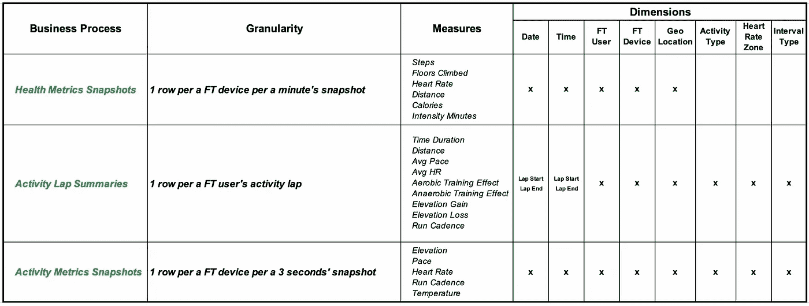
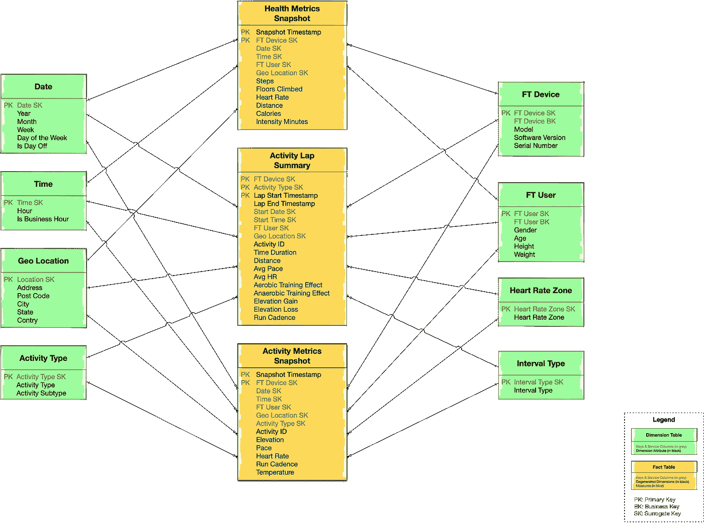

# IOT 数据分析:第 2 部分:数据模型

> 原文：<https://towardsdatascience.com/iot-data-analytics-part-2-data-model-3da9676cb449?source=collection_archive---------30----------------------->

## 将数据仓库建模的最佳实践应用于物联网数据，以实现最灵活高效的分析

# 介绍

这是上一部分的延续，上一部分描述了与健身跟踪活动示例的物联网数据分析相关的问题陈述。还描述了存储类型选择背后的原因，并推荐了两种类型的存储:

1.  大数据存储用于存储时间序列类型的数据
2.  关系分析数据库为数据分析提供了最大的灵活性。更多细节在这里。

这个故事的目的是描述第二种存储类型(关系分析存储)的推荐数据模型。数据仓库部分的逻辑数据模型。

# 建模技术

幸运的是，数据仓库概念已经在市场上存在了几十年，因此它非常成熟，许多思想领袖围绕解决方案构建和数据建模贡献了最佳实践和模式创建。

让我们使用 **Ralph 的 Kimball** 方法来处理特定设计决策的建模和一些模式。

从方法论的角度来看，我们将执行以下步骤:

1.  选择一个描述我们健身跟踪案例的**业务流程列表**
2.  对于我们定义的每个流程:

*   **粒度** —存储数据的详细程度
*   描述业务流程上下文的**维度列表**，回答了谁、什么、何时、何地、为什么以及如何的问题
*   **测量列表** —根据颗粒测量事实的定量数值

我们在 **Bus matrix、**中收集这些细节，Bus matrix 是由业务术语描述的模型的第一个高级版本，非常适合并建议与各种利益相关者共享和讨论。

用于创建逻辑数据模型的特定设计模式将是:

*   **星型模式**作为主模型布局，这赋予了最大的灵活性和效率。它还具有良好的可扩展性，这对于物联网用例非常重要。
*   **定期快照事实表** —一个事实表，其中每一行都聚集了某个预定义周期内发生的测量。粮食是一个时期，而不是个人交易
*   **累积快照事实表** —一个事实表，其中每一行聚集了在流程开始和结束之间的可预测步骤中发生的测量事件。

# 健身跟踪总线矩阵

基于问题陈述的描述，我们定义了以下业务流程列表以及粒度、维度和度量:

用于健身跟踪的总线矩阵(图片由作者提供)

## 总线矩阵注释

**周期性快照**

来自物联网设备的指标通常会定期出现，但这种规律性并不总是准确的。此外，一些 meticss 比其他 metic 出现得更频繁，因此从时间的角度来看，有一个共同的标准是非常有用和方便的。度量在一定的时间段内保持一致，以便能够关联不同的指标并更容易地可视化它们。

定期快照有两种模式:

*   **健康指标快照** —以标准模式收集健康统计数据，此时不执行任何特殊的健身活动。对齐数据的周期可以选择为一分钟或接近一分钟的时间。
*   **活动指标快照** —在特殊健身活动期间收集统计数据，如跑步、游泳等。在这种模式下，通常会更频繁地收集指标，大约每隔一秒钟收集一次

**活动圈总结**

该流程的目的是保存健身活动的所有摘要。因为每个活动可以包含动态数量的子阶段，称为 *laps* ，所以保持单个 laps 级别的粒度是值得的。

每个活动 lap 都有严格的开始和结束时间戳，因此我们可以将其视为工作流的简化版本，并为其创建一个累积类型的快照。

# 逻辑数据模型

实现总线矩阵的逻辑数据模型如下图所示:

健身跟踪物联网的逻辑数据模型(图片由作者提供)

## LDM 评论

总的来说，数据模型是总线矩阵所描述的过程的非常简单的实现。

让我们强调一些要点:

*   日期维度是非常标准的，用于按日/周/月/年进行方便的分组
*   时间维度用于构建每天的活动画面，按小时分析数据
*   除了日期和时间之外，所有事实表都有时间戳，时间戳可以被视为退化的维度。对于快照事实表，它是周期的开始，对于活动圈，我们有开始和结束里程碑
*   有一个活动 ID 退化维度，可用于将活动摘要与详细信息绑定在一起
*   建议基于代理键构建维度表中的主键
*   主键(事实上的表)建议根据粒度在字段子集(主要是维度外键)上构建。
*   即使没有可用的数据，也会对每个期间执行定期快照。建议将测量值设置为空，而不是零，以便进行正确的最小/最大/平均聚合计算

# 数据分析覆盖面

有了这样一个模型，我们将能够涵盖博客第一部分中描述的所有分析需求

# 后续步骤

那些深谙 Kimball 方法论的人可能会问:事务事实表在哪里？

快照事实表通常作为主事务事实表的补充，粒度等于每个事务 1 条记录。在我们的例子中，一个测量事件，比如 HR 或 pace 测量可以扮演一个事务的角色。这是一个有道理的观点，但是我相信事务事实表(以非规范化的形式)可以被 NoSQL 键值或时间序列类型的存储很好地覆盖。

还有其他一些有趣的话题没有涉及到，值得特别关注:

*   处理设备之间的层次关系
*   如何执行时间序列和模式匹配类型的查询/分析
*   如何存储地理位置 GPS 数据点并进行基于位置的分析
*   当我们对不同类型的活动执行不同的度量时，如何处理动态的或非常大量的度量

这些话题将会在接下来的文章中涉及。敬请期待

# 附言

更好地理解业务领域和模型中的一些实体属性是受我的个人健身追踪器/智能手表 Garmin 菲尼克斯的启发。我不为佳明公司工作，我只是其产品的消费者:)