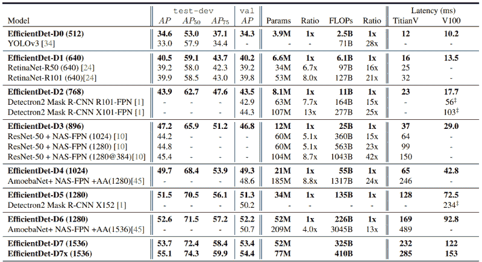
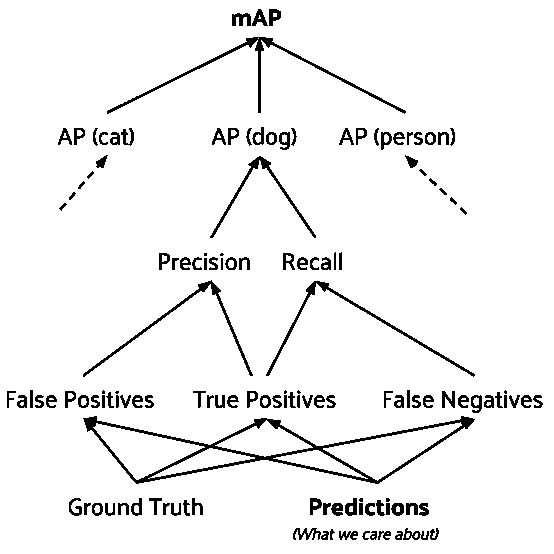
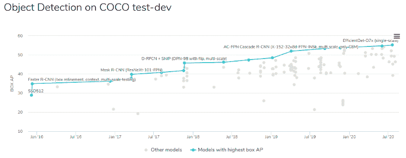
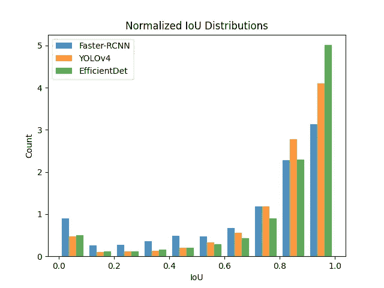
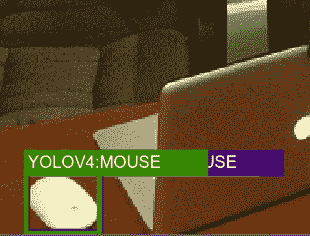
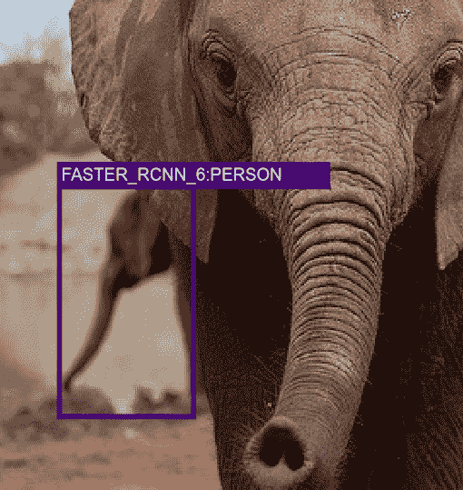
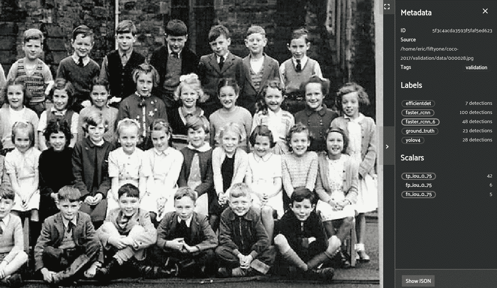

# IoU 更好的检测评估指标

> 原文：<https://towardsdatascience.com/iou-a-better-detection-evaluation-metric-45a511185be1?source=collection_archive---------1----------------------->

## 选择正确的目标检测模型意味着不仅仅要看地图

图片来自 [COCO-2017](https://cocodataset.org/) [1]验证集，检测显示在[第五十一](https://fiftyone.ai/) [2]中

为您的任务选择最佳的模型架构和预训练权重可能很困难。如果你曾经研究过物体检测问题，那么在比较不同的模型时，你肯定会碰到类似下面的图表。

右图来源:YOLOv4 [3]。左图来源:EfficientDet [4]

通过这样的比较，你可以得到的主要信息是哪个模型在 COCO 数据集上的地图比其他模型高。但这对你来说到底有多重要呢？您需要停止严格地查看聚合指标，而是查看更详细的数据和模型结果，以了解哪些有效，哪些无效。

*近年来，在通过更快的模型提供类似的检测结果方面取得了长足的进步，这意味着在比较两种检测器时，mAP 不是唯一要考虑的因素。* *然而，无论你的模型有多快，它仍然需要提供满足你要求的高质量检测*。

虽然能够容易地比较不同的模型是重要的，但是将模型的性能降低到单个数字(mAP)会掩盖模型结果中的复杂性，这可能对您的问题很重要。您还应该考虑:

*   边界框紧密度(IoU)
*   高可信度误报
*   抽查性能的单个样品
*   与你的任务最相关的课程的表现

# 什么是地图？

平均精度(mAP)用于确定模型中一组对象检测在与数据集的地面实况对象标注进行比较时的准确性。

我们不会在这里详细讨论，但你应该了解一些基本知识。有兴趣的话有很多帖子详细讨论地图[[*6*](https://medium.com/@jonathan_hui/map-mean-average-precision-for-object-detection-45c121a31173)*，*[*7*](/breaking-down-mean-average-precision-map-ae462f623a52)*]。*

## 借据

计算 mAP 时使用并集交集(IoU)。它是一个从 0 到 1 的数字，用于指定预测边界框和实际边界框之间的重叠量。

*   IoU 为 0 表示方框之间没有重叠
*   IoU 为 1 意味着框的并集与它们的重叠相同，表明它们完全重叠

([来源](https://www.pyimagesearch.com/2016/11/07/intersection-over-union-iou-for-object-detection/))

IoU 是收集人工注释时要跟踪的一个重要的准确性度量。行业最佳实践是为他们的人工注释任务包含最低 IoU 要求，以确保交付的注释相对于该对象的“完美”注释具有 IoU >= X(其中 X = 0.95 是典型值)，这由项目的注释模式确定(即，尽可能紧密地框住车辆，包括它们的所有可见部分，包括车轮)。另一方面，在 0.95 IoU 时，are 检测器的状态通常表现不佳，我们将在本文后面的实验中展示这一点。

## 简而言之地图

平均精度(mAP)通过首先收集一组预测对象检测和一组基本事实对象注释来计算。

*   对于每个预测，相对于图像中的每个基本事实框计算 IoU。
*   然后，这些借据被阈值化到某个值(通常在 0.5 和 0.95 之间)，并且使用贪婪策略将预测与基础真值盒进行匹配(即，首先匹配最高借据)。
*   然后为每个对象类生成精度-召回率(PR)曲线，并计算平均精度(AP)。PR 曲线考虑了模型在一定置信值范围内关于真阳性、假阳性和假阴性的性能。更多详情可参见[本帖](https://medium.com/@jonathan_hui/map-mean-average-precision-for-object-detection-45c121a31173)【6】。
*   所有对象类的平均 AP 是地图。
*   评估 COCO 数据集时，用 0.5 至 0.95 的 10 个 IoU 阈值重复这一过程，并求平均值。

下图演示了计算 mAP 需要多少步骤，以及在试图理解基础模型预测时 mAP 作为一个概念有多抽象。

显示将地图与模型预测相关联的步骤的流程图

# 为什么地图这么受欢迎？

为什么 mAP 已经成为比较对象检测模型的标准，最好的答案是因为它很方便。你理论上只需要用一个数字来比较不同型号的性能。

*如果你绝对需要只用一个标准来比较，地图是个不错的选择*

然而，现在最先进的车型之间的**性能差异小于** [**1%图**](https://paperswithcode.com/sota/object-detection-on-coco) ，迫切需要其他方法来比较车型性能。

来源:[论文，代码](https://paperswithcode.com/sota/object-detection-on-coco)

评估模型在每个图像的基础上定位和分类对象的能力，特别是其故障模式，比在真空中考虑地图提供了对模型的优点和缺点的更深入的洞察。我们称之为**原子评估。**

# 可可·凯奇女士比赛

为了演示原子探测评估的过程，我在 MSCOCO [1]上比较了 3 种不同的物体探测模型(fast-RCNN[5]，YOLOv4 [3]，EfficientDet-D5 [4])，以查看该评估如何将它们与它们的地图进行比较。

## 地图

作为参考，下面是 COCO-2017 验证集上的模型图:

*   [更快-RCNN+ResNet50](https://github.com/pytorch/vision/blob/master/torchvision/models/detection/faster_rcnn.py) : 33.4%地图
*   [效率检测-D5](https://github.com/google/automl/tree/master/efficientdet) : 41.3%地图
*   约洛夫 4 : 43.2%地图

## 借据

模型地图本身并不能直接显示模型的边界框有多紧，因为该信息与预测的正确性混为一谈。您必须直接评估 IoUs，以了解模型的边界框与基础事实的紧密程度。

生成不同模型 IoU 汇总统计数据的一种简单方法是绘制直方图。这是基本配方:

1.  使用一组模型检测数据集中的对象
2.  计算每个预测的借据
3.  对于每个预测，存储它与任何地面真值对象的最高 IoU
4.  用标准化计数绘制直方图

我使用我在 [Voxel51](https://voxel51.com/) 帮助开发的新计算机视觉工具[fifty one](https://fiftyone.ai/)【2】来存储我的模型输出并计算我随后用[Matplotlib](https://matplotlib.org/)【8】绘制的借据。我后来使用[51](https://fiftyone.ai/)来容易地可视化和比较三个模型的检测。声明:我在 [Voxel51](https://voxel51.com/) 工作！

51 个检测模型的 IoU 分布计算和 Matplotlib 可视化

从这些结果中，我们可以看到，即使在我们的实验中，EfficientDet 的图低于 YOLOv4，IoU > 0.9 的边界框的百分比也较高。这表明，如果您的任务中边界框的紧密度很重要，EfficientDet 是比 YOLOv4 或 Faster-RCNN 更好的选择。

## 假阳性

决定您应该使用哪个模型的一个好方法是查看最坏的情况，并了解每个模型的性能。在这种情况下，我们将查看模型对其预测有信心，但与实际情况相差甚远的场景。具体来说，我们希望找到模型同时具备以下两项的样本:

*   高置信度得分
*   低 IoU

符合这些标准的预测通常分为两类:

1.  它们产生于你试图测量的模型中的不准确性
2.  它们源于模型预测正确但被标记为错误的基本事实注释中的不准确性

有证据表明，流行的对象检测数据集中的注释可能不像你想象的那样正确。这在这篇 [*的博文*](/i-performed-error-analysis-on-open-images-and-now-i-have-trust-issues-89080e03ba09)*【9】看着* [*谷歌的开放图片数据集*](https://storage.googleapis.com/openimages/web/index.html)*【10】*中得到了证明。

我再次使用[51](https://fiftyone.ai/)来轻松找到这些样本和检测。一旦我将我的模型输出加载到 [FiftyOne](https://fiftyone.ai/) 中，我就能够使用下面的代码搜索模型的示例，例如，EfficientDet 对于任何基本事实对象都具有最大 IoU < 0.1，但也具有置信度> 0.9:

来自 COCO-2017 验证集的图像和显示在[第五十一](https://github.com/voxel51/fiftyone)中的检测

这个例子是根据我们指定的标准弹出的。如果你使用一个模型来完成自动驾驶汽车的任务，那么你需要确保你的模型不会出现像这样严重的错误。

每个模型都有不同数量的样本，预测结果都符合我们的标准:

*   更快-RCNN: 1004 个样本
*   YOLOv4: 84 个样本
*   效率检测:5 个样本

与 YOLOv4 和 EfficientDet 相比，fast-RCNN 包含了更多的高置信度、低 IoU 预测。将它们可视化显示，来自 YOLOv4 和 EfficientDet 的少数预测也由 fast-RCNN 预测。这些误报通常是注释错误，即地面真实数据集中遗漏了对象。然而，更快的 RCNN 也包含了更高比例的由模型引起的假阳性。下面是一些例子。

图片来自 COCO-2017 验证。(**左**)一只老鼠被三个模型都预测出很高的可信度，但是没有被注释。(**右**)一头大象被 Faster-RCNN 高置信度预测为“人”。

这些结果表明 YOLOv4 或 EfficientDet 对于检测未标记对象实例比 fast-RCNN 更有用。

## 现场检查

在您知道您可能需要哪些模型之后，花一些时间查看它们的检测结果来建立关于它们将如何执行您的任务的直觉是一个好主意。像我们实验中展示的那些例子，如果不看模型输出，是不可能被发现的。这就是第五十一条真正派上用场的地方。它允许您尽可能仔细地研究您的数据集和检测。

在我浏览的前几十个示例中，我发现了下面的例子。

图片来自 COCO-2017，在[第五十一届](https://github.com/voxel51/fiftyone)展出。| **黄色** : Faster-RCNN | **绿色** : EfficientDet | **蓝色** : YOLOv4

令人惊讶的是，fast-RCNN 比 YOLO 捕捉到了更多的人，比 EfficientDet 多得多，尽管 fast-RCNN 的地图要低得多。这一点得到了其他样本的证实，人群也显示出同样的趋势。如果您需要能够检测人群，那么 fast-RCNN 可能是比更新、更高的 mAP 模型更好的模型选择。

# 获胜者是谁？

没有适合任何任务的完美模型，最适合你的模型取决于你决定的标准和你的最终用例。在我们所观察的三个模型中，每一个都以不同的方式在不同的情况下发光，这些方式并没有被它们的地图所阐明。这里真正的赢家是像 [MSCOCO](https://cocodataset.org/#home) 这样的数据集和像 [FiftyOne](https://fiftyone.ai/) 、 [Matplotlib](https://matplotlib.org/) 这样的工具，以及许多其他允许我们在选择模型之前快速轻松地挖掘和分析模型的工具。

关键信息是，使用适当的指标来指导基于特定操作条件的模型评估和选择，而不是简单地依赖于 mAP，这一点至关重要。在分析了模型性能的不同方面后，没有一个模型在上述三个部分中表现最佳。根据最终任务，每种模式都可能是正确的选择，下面介绍了其中的三种。

## 借据

如果你主要关心的是边界框的紧密度，那么你可能应该选择 **EfficientDet** 。当我们绘制每个模型的所有 IoU 时，EfficientDet 具有最高的 IoU 检测。

例如，如果您希望使用一个模型来执行自动预注释，以使您的人工注释工作更加高效，这将非常有用。绘制和固定边界框比图像或检测级注释要昂贵得多。您将希望您的预测框尽可能紧凑，以便注释者可以浏览它们，决定保留哪些，丢弃哪些，而不必花费时间实际更改这些框。

## 质量保证

我们的实验表明 **YOLOv4** 是一个全面的模型。它的边界框预测可能不像 EfficientDet 那样严密，在人群中可能不像 fast-RCNN 那样有效，但它在几乎所有情况下都是一个势均力敌的竞争对手。我们的第二个实验表明，当 YOLOv4 和 EfficientDet 的预测可信度较高时，它们通常是正确的。

例如，假设您正在构建一个对象检测数据集，并且需要对其进行迭代以确保您的注释是正确的并且没有遗漏任何对象。从我们的第二个实验中，我们现在知道 EfficientDet 或 YOLOv4 可以用来提供错误地未标记或错误标记的对象的建议。由于我们只对误报数量本身感兴趣，而不是检测的 IoU，YOLOv4 可能是一个更好的选择，因为它能够比 EfficientDet 运行得更快。

## 人群

从与我们上次实验相似的多个例子中，我们看到如果你希望检测成群的物体，那么**fast-RCNN**可能是你的选择。

例如，如果您试图找到一个对象检测模型来计算纽约市监控镜头中的人数，那么您不会关心这些框有多紧，甚至不会关心它们是否都是正确的，您只关心捕捉场景中的大多数人。

# 参考

[1] T. Lin 等，[微软 COCO:情境中的公共对象](https://cocodataset.org/) (2014)，欧洲计算机视觉会议(ECCV)

[2]体素 51，[五十一](https://fiftyone.ai/) (2020)

[3] A. Bochkovskiy 等人 [YOLOv4:物体检测的最佳速度和精度](https://arxiv.org/pdf/2004.10934.pdf) (2020)

[4] M. Tan 等人， [EfficientDet:可扩展和高效的对象检测](https://arxiv.org/pdf/1911.09070.pdf) (2020)，计算机视觉和模式识别会议(CVPR)

[5] S. Ren 等人，[更快的 R-CNN:使用区域提议网络实现实时对象检测](https://arxiv.org/abs/1506.01497) (2015)，神经信息处理系统进展(NeurIPS)

[6] J. Hui，[图(平均平均精度)用于物体检测](https://medium.com/@jonathan_hui/map-mean-average-precision-for-object-detection-45c121a31173) (2018)，中等

[7] R. Tan，[分解平均平均精度(mAP)](/breaking-down-mean-average-precision-map-ae462f623a52) (2019)，迈向数据科学

[8] J .亨特， [Matplotlib:一个 2D 图形环境](https://doi.org/10.1109/MCSE.2007.55) (2007)，科学计算&工程，第 9 卷，第 3 期，第 90–95 页

[9] T. Ganter，[我对谷歌的开放图像数据集进行了错误分析，现在我对数据科学产生了信任问题](/i-performed-error-analysis-on-open-images-and-now-i-have-trust-issues-89080e03ba09) (2020)

[10] A. Kuznetsova 等人，[开放图像数据集 V4:统一图像分类、对象检测和大规模视觉关系检测](https://storage.googleapis.com/openimages/web/index.html) (2020)，国际计算机视觉杂志(IJCV)