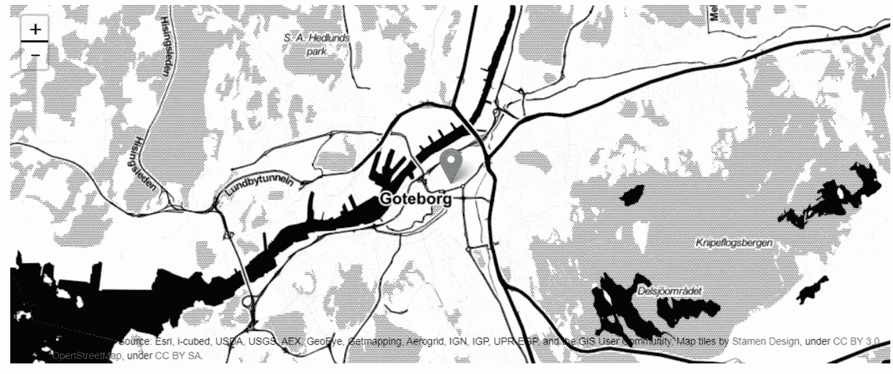

# IpyLeaflet:Jupyter 笔记本中的交互式映射

> 原文：<https://towardsdatascience.com/ipyleaflet-interactive-mapping-in-jupyter-notebook-994f19611e79?source=collection_archive---------12----------------------->

## IpyLeaflet 交互式地理空间数据可视化初学者指南。


[杰瑞米·托马斯](https://unsplash.com/@jeremythomasphoto?utm_source=medium&utm_medium=referral)在 [Unsplash](https://unsplash.com?utm_source=medium&utm_medium=referral) 上拍照

交互式地图是探索性数据分析(EDA)的重要组成部分。在本教程中，我们将向您介绍 IpyLeaflet Python 库，它可以在 Jupyter Notebook 中实现交互式地理空间数据可视化。IpyLeaflet 是 Jupyter 笔记本世界和流行的传单可视化库之间的桥梁。

我们首先介绍标记、图标和底图的基础知识，然后介绍如何集成 Geopandas 和 IpyLeaflet 来可视化不同类型的地图——Choropleth 和聚类点。在最后一节中，我们将学习如何使用 IpyLeaflet 交互式控制地图——搜索栏和全屏。

# 正确掌握基础知识

我们导入将在本教程中使用的 Ipyleaflet 方法。

```
from ipyleaflet import (Map, GeoData, basemaps, WidgetControl, GeoJSON,
 LayersControl, Icon, Marker,basemap_to_tiles, Choropleth,
 MarkerCluster, Heatmap,SearchControl, 
 FullScreenControl)from ipywidgets import Text, HTML
from branca.colormap import linear
import geopandas as gpd
import json
```

我们还使用 Geopandas 阅读了本教程的数据。第一个数据集是世界国家(多边形)。我们还有来自[武装冲突地点&事件数据项目(ACLED)](https://acleddata.com/#/dashboard) 的点数据集，记录了世界各地的所有冲突。请注意，我们只阅读了数据的一个子集，非洲的冲突。

```
# Countries
countries = gpd.read_file(gpd.datasets.get_path(‘naturalearth_lowres’))# Conflict Dataset Points
africa_acled = gpd.read_file(
 “data/acled2019.shp”,
 mask = countries[countries[“continent”] == “Africa”]
)
africa_acled.head()
```

## 基础地图

底图提供了现成的图块，可在绘制地理空间数据时提供背景。您需要指定地图的中心点以及缩放级别，以获得世界上任何地方的底图。


在这里，我们调用 IpyLeaflet 中的 Map 函数，并传递基图。上面的地图使用了 Esri 世界影像。IpyLeaflet 中有很多免费的[底图](https://ipyleaflet.readthedocs.io/en/latest/api_reference/basemaps.html)可用。例如，如果我们想改变基本地图，我们可以简单地重建地图提供一个不同的基本地图。或者更方便的是，我们可以通过在上面的地图上添加来更新( **add_layer()** )。

```
stamen = basemap_to_tiles(basemaps.Stamen.Toner)
m.add_layer(stamen)
```

在上面的代码中，我们更改了基本地图。我们现在使用的是 Stamen Toner 底图，而不是 Esri 世界影像，如下图所示。


工作草图

## 标记

到目前为止，底图仅是有用的。您通常希望将数据放在底图之上。我们从最简单的例子开始。假设我们想在地图的中心添加一个点标记。我们可以在 IpyLeaflet 中使用 **Marke()** 方法。

```
marker = Marker(location=center, draggable=False)
m.add_layer(marker);m
```

现在我们的底图里有了一个标记。



带标记的底图

## 核标准情报中心

您可以通过提供自定义图像作为图标来自定义标记。我们从[图标档案网站](http://www.iconarchive.com/)中抓取了一个图标，并在我们的地图中用作标记。

```
icon_url = “[http://icons.iconarchive.com/icons/pelfusion/long-shadow-media/512/Maps-Pin-Place-icon.png](http://icons.iconarchive.com/icons/pelfusion/long-shadow-media/512/Maps-Pin-Place-icon.png)"icon = Icon(icon_url=icon_url)
mark = Marker(location=[57.719503, 12.008843], icon=icon, rotation_angle=0, rotation_origin=’128px 128px’)
m.add_layer(mark);
m
```


图标

我们现在在地图上有了第二个标记，这次标记是我们提供的一个图标。我们开始在 Jupyter 笔记本上使用真实世界的数据和 IpyLeaflet 绘制交互式地图。

# 地理数据和地图样式

现在我们已经完成了基础工作，我们可以使用 Geopandas 显示我们之前读取的数据。我们首先绘制一张简单的交互式非洲国家地图。我们首先将多边形限制在非洲国家。为了创建包含数据的地图，IpyLeaflet 接受 Geojson 文件或 Geopandas 数据报。在这里，我们为非洲国家构建了一个地理数据。最后，我们将地理数据添加到地图中。

```
center = [4.546647, 22.373178]
zoom = 2africa = countries[countries[“continent”] == “Africa”]
africaMap = Map(basemap=basemaps.CartoDB.Positron, center=center, zoom=zoom)# Create a geodata
geodata = GeoData(geo_dataframe = africa, 
 style={‘color’: ‘black’, ‘fillColor’: ‘#E0D071’, ‘opacity’:0.03, ‘weight’:1.9, ‘dashArray’:’2', ‘fillOpacity’:0.6},
 hover_style={‘fillColor’: ‘#b08a3e’ , ‘fillOpacity’: 0.8},
 name = ‘Countries’)# Add the map to the data
africaMap.add_layer(geodata)
africaMap
```

这是一张非洲所有国家的基本交互式地图。我们将进一步发展这一点，以包括悬停和其他互动功能，但现在，这是我们的互动地图。


使用 IpyLeaflet 的基本交互式地图

让我们补充一些背景。当我们停留在一个国家上时，我们会添加国名、人口和 GDP 估计值。这里我们使用 IpyWidgets。

```
html = HTML(‘’’Hover Over Countries’’’)
html.layout.margin = ‘0px 20px 20px 20px’
control = WidgetControl(widget=html, position=’topright’)
africaMap.add_control(control)def update_html(feature, **kwargs):
     html.value = ‘’’
     <h3><b>{}</b></h3>
     <h4>GDP: {:.2e} people</h4> 
     <h4>Population: {}</h4>
      ‘’’.format(feature[‘properties’][‘name’],
        feature[‘properties’][‘gdp_md_est’],
        feature[‘properties’][‘pop_est’])geodata.on_hover(update_html)
```

现在，我们的交互式地图中有了悬停功能(见右上方的 GIF 图)。


具有悬停交互性的 IpyLeaflet 地图

## 等值区域图

使用 IpyLeaflet 创建 choropleth 地图需要将数据设置为 GeoJSON。尽管这是一个额外的步骤，而且我们需要将地理数据框架作为 Geojson 存储在本地。在设置 Choropleth 地图数据之前，让我们先这样做。

```
pop = dict(zip(africa[‘name’].tolist(), africa[‘pop_est’].tolist()))
africa[[“name”, “geometry”]].to_file(“data/africa.json”, driver=”GeoJSON”, encoding=’utf-8')
geojson_data = json.load(open(“data/africa.json”,’r’))for feature in geojson_data[‘features’]:
     properties = feature[‘properties’]
     feature.update(id=properties[‘name’])
     #print(feature[‘id’])
```

现在，我们可以使用上面创建的 Geojson 数据来设置 choropleth 地图数据(注意，在绘制 choropleth 地图之前，我们还没有对数据进行标准化，我们应该已经完成了)。

```
choroplethData = Choropleth(
     geo_data=geojson_data,
     choro_data=pop,
     colormap=linear.YlOrRd_04,
     style={‘fillOpacity’: 0.8, ‘dashArray’: ‘5, 5’}
)
```


等值区域图

## 聚类图

我们之前阅读的冲突数据集包含许多点，如果我们按原样绘制数据，我们最终会在地图上得到许多点。避免这种情况的一种常用方法是对点进行聚类，如果您想要得到所有的点，可以缩放到特定的位置。让我们看看如何使用 IpyLeaflet 创建一个集群地图。

```
clusterMap = Map(center=center, zoom=zoom)
clusterMap.add_layer(MarkerCluster(
 markers=[Marker(location=geolocation.coords[0][::-1]) for geolocation in africa_acled.sample(1000).geometry])
 )
clusterMap
```


带 IpyLeaflet 的聚类图

# 交互式控件

在最后一部分，我们将介绍两个控制功能——搜索栏和全屏缩放。

## 搜索栏和全屏缩放

假设我们想通过输入一个地点的名称来放大该地点，并获得全屏地图。我们将在上面的地图中添加此功能，以放大特定区域的冲突点。

```
search = SearchControl(position=”topleft”, 
 url=
’[https://nominatim.openstreetmap.org/search?format=json&q={s}'](https://nominatim.openstreetmap.org/search?format=json&q={s}'), 
 zoom=5,
 property_name=’display_name’,
 marker=marker
 )
clusterMap.add_control(search)control = FullScreenControl()
clusterMap.add_control(control)clusterMap
```

看看下面展示这两个功能的 GIF。


使用 IpyLeaflet 进行搜索栏和全屏缩放

# 结论

IpyLeaftlet 有大量的[文档](https://ipyleaflet.readthedocs.io/en/latest/)，你可以深入研究它的高级功能。在本教程中，我们已经介绍了使用 Jupyter 笔记本在 IpyLeaflet 中制作地图的一些基本功能。

要安装 IpyLeaflet，您可以使用 Conda 或 pip。

```
conda install -c conda-forge ipyleafletpip install ipyleaflet
```

如果您有 JupyterLab，您还需要安装 JupyterLab 扩展:

```
jupyter labextension install **@jupyter**-widgets/jupyterlab-manager jupyter-leaflet
```

本教程的代码可以在 Github 资源库中找到:

[](https://github.com/shakasom/IpyLeaflet-jupyter) [## shakasom/IpyLeaflet-jupyter

### 通过在 GitHub 上创建一个帐户，为 shakasom/IpyLeaflet-jupyter 的开发做出贡献。

github.com](https://github.com/shakasom/IpyLeaflet-jupyter)