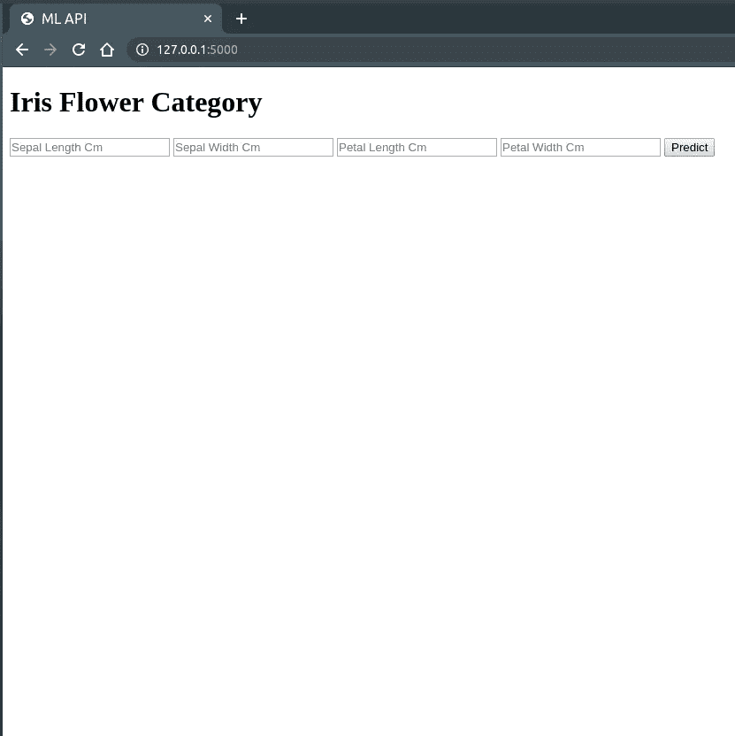
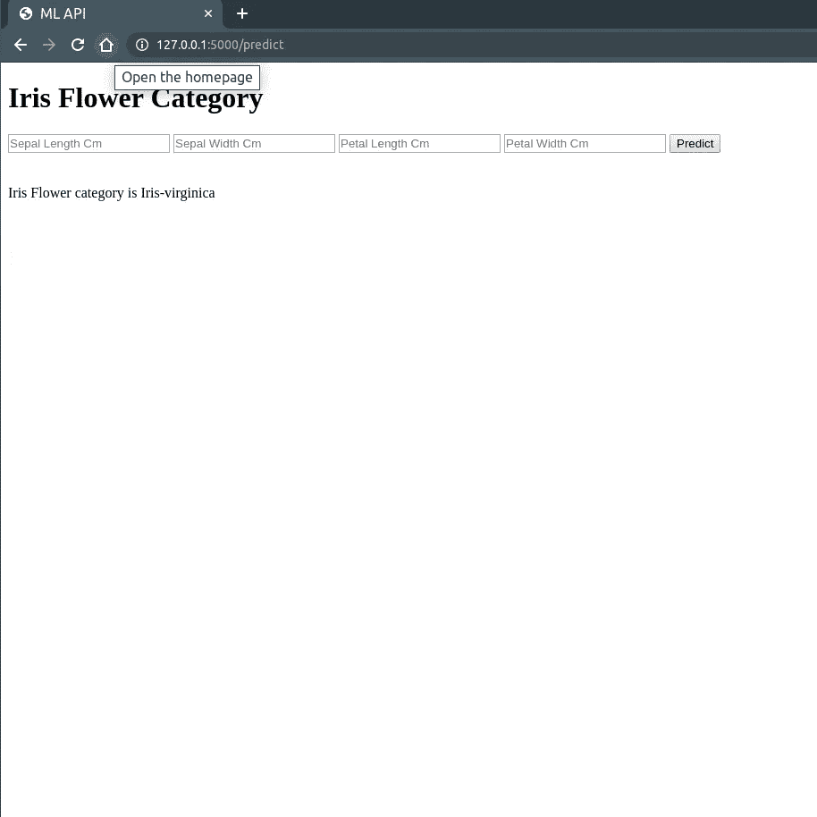

# 虹膜分类器烧瓶应用程序

> 原文：<https://towardsdatascience.com/iris-classifier-flask-app-3b4fb1de29b4?source=collection_archive---------59----------------------->

## 构建一个简单的 ML 分类算法，并将其作为 Flask 应用程序运行。

嘿，伙计们，这是我第一个关于媒体的博客。这是一个 Iris 分类 ML 模型，变成了一个 flask 应用程序，用于在 Heroku 上托管。

来源——数据营

# 步骤 1—构建模型

在这里，我们建立了一个监督分类模型，您可以从可用的分类器模型列表中选择。这里我使用了一个 KNN 模型，并获得了 98.66%的准确率。

正如你在上面的代码中看到的，我们已经使用 joblib 保存了 ML 模型，这是转换成 API 所必需的。

# 步骤 2 —所需软件包列表

对于一个运行在除开发环境之外的任何环境中的模型，我们需要安装所有必需的包。我们需要创建一个包含所有必需包的 **requirements.txt** 文件。虽然 **pip freeze** 给出了所有已安装软件包的列表，但是最好在编码的时候安装软件包，这样你就可以只安装特定代码所需的软件包。

# **步骤 3 烧瓶应用程序创建**

Flask 是一个用于在 python 中创建前端应用程序的 web 框架。我们用 Get 和 Post 方法创建了一个简单的应用程序。代码是不言自明的。我想和大家分享的一件事是，作为数据科学家/ Ml 工程师，主要精力应该放在模型构建上，而不是 UI 上。烧瓶应用程序的简单代码就足够了。

# 步骤— 4 个 HTML 页面

正如你在上面的代码中看到的，我们使用了 HTML 文件。index.html 文件将形成具有 4 个输入的基本模板。

上面代码创建了一个如下所示的 HTML 页面。

应用程序的 Html 页面。

# **步骤 5 文件结构和结果**

最后，用于虹膜分类器的文件夹中的文件是这样的。

如果你想知道如何实现这种树结构，有一个包叫做**树。**使用“ **sudo 安装树”安装软件包。**在终端中输入指向 pwd 的树。

产量预测

就是这样。现在你也可以试试。确保你遵循了所有的步骤和最终结构，并且安装了 **requirements.txt** 中的所有文件

在下一篇博客中，我会写如何将这个应用程序上传到 Heroku，这样你就可以在世界任何地方访问它。