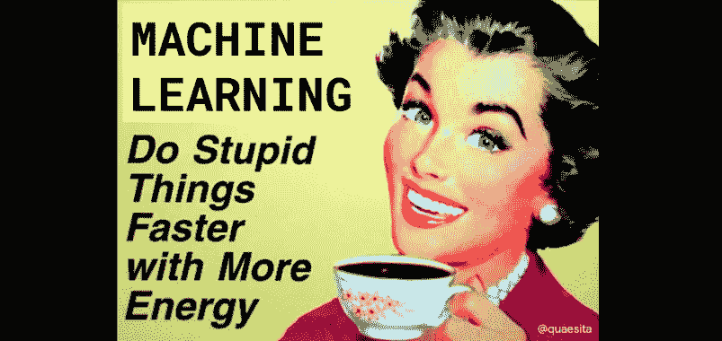

# 不敬数据和 AI！

> 原文：<https://towardsdatascience.com/irreverent-data-and-ai-d0c03057627a?source=collection_archive---------29----------------------->

## 将数据科学降低一个档次的 10 篇厚脸皮文章

随着近 100 篇文章的发表，是时候进行另一次精选了！这里是我最不敬的 10 篇文章，包括一些我让我的 snark 跑得有点太自由的地方。尽情享受吧！

# #1 人工智能是一种时尚吗

 [## AI 是一种时尚吗？

### 人们认为人工智能只是昙花一现的三个原因

medium.com](https://medium.com/hackernoon/is-ai-a-fad-55ab24bf77b9) 

# #2 机器学习——皇帝穿衣服了吗？

 [## 机器学习——皇帝穿衣服了吗？

### 深入了解机器学习的工作原理

medium.com](https://medium.com/hackernoon/machine-learning-is-the-emperor-wearing-clothes-59933d12a3cc) 

# #3 理解数据

 [## 什么是数据？

### 关于信息、内存、分析和分布的思考

towardsdatascience.com](/what-is-data-8f94ae3a56b4) 

# #4 统计学家证明统计很无聊

 [## 统计学家证明统计很无聊

### 统计学词汇的基础知识

towardsdatascience.com](/statistician-proves-that-statistics-are-boring-4fc22c95031b) 

# #5 不确定性是什么意思？

 [## “不确定性”是什么意思？

### 风险、不确定性和模糊性之间的细微差别

towardsdatascience.com](/what-does-uncertainty-mean-cac374bb595e) 

# #6 TensorFlow 已死，TensorFlow 万岁！

 [## 张量流死了，张量流万岁！

### 如果你是一个人工智能爱好者，你没有看到这个月的大新闻，你可能只是打了个盹…

hackernoon.com](https://hackernoon.com/tensorflow-is-dead-long-live-tensorflow-49d3e975cf04) 

# #7 人工智能的第一步可能会让你吃惊

 [## 人工智能的第一步可能会让你吃惊

### 欢迎来到 AI！欢迎来到机器学习！不知道区别有关系吗？不，因为你会开始…

hackernoon.com](https://hackernoon.com/the-first-step-in-ai-might-surprise-you-cbd17a35708a) 

# #8 数据科学家:22 世纪最性感的工作

 [## 数据科学家:22 世纪最性感的工作

### 在求职面试中问这三个问题，以确保你的雇主准备好让数据科学家变得高效

towardsdatascience.com](/the-sexiest-job-of-the-22nd-century-ffe753e1d155) 

# #9 数据科学是泡沫吗？

 [## 数据科学是泡沫吗？

### 你会惊讶我经常被问到这个问题。我的回答？

hackernoon.com](https://hackernoon.com/is-data-science-a-bubble-c70ceac0f264) 

# #10 无能、授权和人口

 [## 无能、授权和人口

### 预测你友好的统计学家的 5 大反对意见

hackernoon.com](https://hackernoon.com/incompetence-delegation-and-population-95ebeb9beb93) 

# 【课程】和机器学习交朋友

如果你在寻找一门为初学者和专家设计的有趣的应用人工智能课程，这里有一个我为你制作的娱乐课程:

点击此处获取整个课程播放列表:【bit.ly/machinefriend 

# 与凯西·科兹尔科夫联系

让我们做朋友吧！你可以在[推特](https://twitter.com/quaesita)、 [YouTube](https://www.youtube.com/channel/UCbOX--VOebPe-MMRkatFRxw) 和 [LinkedIn](https://www.linkedin.com/in/kozyrkov/) 上找到我。有兴趣让我在你的活动上发言吗？使用[表格](http://bit.ly/makecassietalk)取得联系。