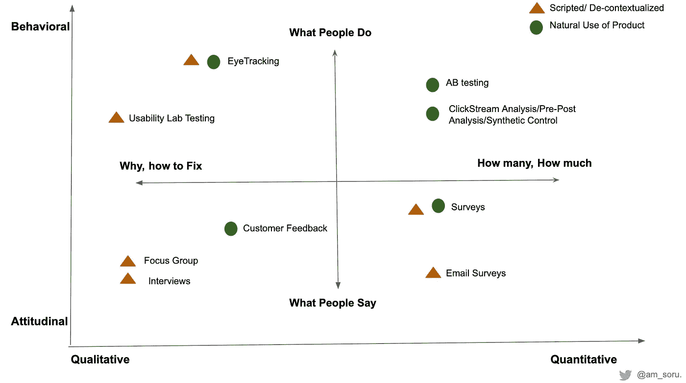
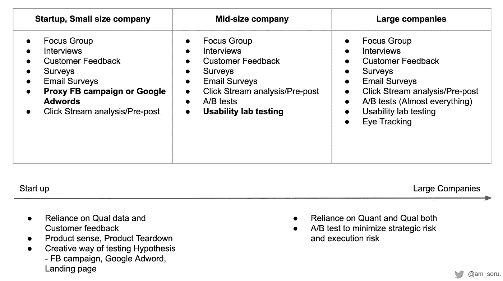

# A/B 测试是否被高估？从 A/B 测试到假设验证剧本

> 原文：<https://towardsdatascience.com/is-a-b-testing-overrated-from-a-b-testing-to-hypothesis-validation-playbook-3c06a821b2de?source=collection_archive---------56----------------------->

## 假设验证不仅仅是 AB 测试。学习何时使用什么

越来越多的团队依靠 A/B 测试来验证和量化假设。追求数据驱动的文化是一件伟大的事情，除非团队开始做过头了。

事实是，A/B 测试被一些团队过度使用和滥用，成为常识和清晰思维的替代品。在谷歌上搜索“A/B 测试被高估了吗”显示了这个长期的问题。

在这篇文章中，首先，我们将简要说明为什么 AB 测试不是解决所有问题的灵丹妙药。随后，我们将看看其他假设验证方法，成长项目经理必须从这些方法中获得稳健和快速的决策。

## 为什么我们不能只依靠 AB 测试

1.  低样本量:这不仅是初创企业的局限，更是大型组织的局限。对于一个没有达到难以捉摸的 10 万 MAU(月活跃用户)的初创公司来说，这是一个挑战。在一个大的组织中，从事低“覆盖率”产品特性的团队通常会处理这些限制。
2.  短期关注和局部优化:我们不能运行 AB 测试很多年，所以我们不能发现一个特性的长期和真实的影响。我们需要其他的[启发法](https://medium.com/@SoruK/short-term-to-long-term-impact-3869770a8a3d)来给我们信心，我们在一个月内看到的影响将长期存在。此外，有些功能需要培训，即使有巨大的长期潜力，也可能在短期内看不到效益。因此，AB 测试将我们引向局部最大值，当只有无脑 AB 测试指导产品开发时，我们可能永远不会走向全局最大值(我们的潜力)。
3.  决策挑战和速度:统计上无关紧要的数字对企业来说并不是无关紧要的数字。交易量增加 1%可能并不显著，但它可能会给大公司带来数亿美元的收入。精心设计的实验有所帮助；但是，我们偶尔会面临这些挑战，不是 stat-SIG KPI，而是仍然具有重大影响的业务影响。此外，有时由于业务限制，我们需要迅速做出决定。例如，我们的功能可能是大产品推广的先驱；或者，这可能只是我们不想陷入假日代码冻结。

## 关于假设验证堆栈的一句话

通常，人们从三个方面来看待假设验证堆栈:

1.  定性到定量:定性方法，如焦点小组、访谈和可用性实验室研究，产生了对“为什么”和“如何”的洞察。AB 测试——一种定量的方法——给我们提供了多少和多少的数字。
2.  对行为的态度:通常，我们说的和做的是不一样的。像调查和采访这样的方法可以从用户那里获得“话语”。为了理解“行动”，我们需要依靠 AB 测试和[前后分析](https://medium.com/@SoruK/ab-testing-or-pre-post-7e8cda238b0c)等方法。
3.  产品使用的背景。无论产品是在自然环境中使用还是在脚本环境中使用，都会显著影响用户的反应。

AB 测试是所有方法中最科学的。我们开始了解真正的偏好，而不是陈述的偏好。我们了解的是确凿的数据，而不是模糊的语言；此外，我们从用户的产品使用环境中获得硬性行为，而不是从脚本设置中获得。

有了这么多 AB 测试，就不难理解为什么没有经验的团队越来越依赖 AB 测试了。他们这样做是为了避免争论、责任和令人厌倦的批判性思考。他们很少意识到，通过默认选择 AB 测试，他们正在减慢组织的速度，并且他们仍然可能陷入[决策泥潭](https://medium.com/swlh/experiment-call-out-framework-6e8d1bd27f93)。

我们不会拔剑去杀一只苍蝇，同样，我们也不应该拿起 AB 测试来满足所有的想法验证需求。

## 被忽略的第四维

团队犯错是因为上面的三维框架有误导性。它确实谈到了定量、态度行为、自然脚本化的产品使用——但它忽略了至关重要的第四个维度。

第四个维度是我们的环境——公司规模、产品规模、产品成熟度、实验成熟度和业务需求。它被忽视了，因为产品管理和用户研究文献没有提到它。

> 具有讽刺意味的是，团队不考虑他们自己的上下文。他们忘记了自己，导致错误的选择。

## 高速且高质量的假设验证

对于一个拥有发达的技术堆栈、分析系统和项目管理的成熟组织来说，进行 AB 测试并不是一个错误，因为质量比速度更重要。此外，一个大型组织有资源来建立一个实验平台和一个[系统来弥补一些速度损失。](https://medium.com/@SoruK/how-to-turbocharge-experimentation-program-ff8e07683521)

对于较小的公司，重点是增长。你不能用剑来缝你的裤子，所以不要依赖 A/b 测试。你需要多和用户交流；产品意识、竞争对手产品拆解和批判性思维是你的工具，而不是 A/B 测试。

A/B 测试用速度换取精度。有了 A/B 测试，我们对我们的数字更有信心，但它会减慢我们的速度。创业公司应该优先考虑速度而不是精度，不应该为了获得 stat-sig 而运行几个月的 AB 测试。然而，随着公司的成长，每 1%的变化都很重要，因此假设验证的最佳实践也必须改变。

按公司规模划分的 A/B 测试最佳实践:

1.  小公司:不要 AB 考。和用户对话。成功产品的产品拆卸。
2.  中型:对于预计会影响指标的更改，进行 A/B 测试。测试一切并不是一个明智的想法。
3.  大型:A/B 在最终推出之前几乎测试了所有东西。对于新产品开发，在某些情况下，表现得像一个小公司是一个好主意。然而，在推广之前，A/B 测试是一个很好的实践，因为:A .意外地丢失 1%的指标是一件大事 B .复杂的技术解决方案和未知的依赖性是大型组织的副作用。保守以最小化执行风险是一件好事。

这是按公司规模排列的假设验证堆栈，记住第四维。

在我们结束这一部分之前，我们必须认识到想法验证是一个关于决策的练习。商业大师拉姆·查兰从亚马逊的做事方式中挖掘了智慧的金块。根据 Charan 的说法，贝佐斯说有两种决策，第一种和第二种。

第一类决定是必然的，不可逆转的。一旦做了决定，门就在你身后关上了，没有回头路可走。第二类决策是可变的和可逆的；它们是双向门。次优选择可能是正确的。

按照类型 1 和类型 2 来划分想法是很重要的。对于类型 1，确保团队正在进行尽职调查，收集定性和定量数据，并测试“产品的自然使用”。但是对于类型 2 特性，教条地尝试多种验证方法会导致分析瘫痪。

## 结束语

1.  了解你自己:了解你的业务需求和限制。选择一种对组织和手头的问题最合适的方法。产品管理大师们不知道我们的语境，所以不要照字面理解。
2.  采用多模型方法:尝试用多个模型来验证想法。与客户交谈，进行 AB 测试并进行调查，如果结果一致，那么该功能对用户来说很有可能是好的，即使指标并不重要。[做狐狸，不做刺猬](http://longnow.org/seminars/02007/jan/26/why-foxes-are-better-forecasters-than-hedgehogs/)。
3.  第一类和第二类决策:对于重要的和不可逆转的决策，保持怀疑和彻底的尽职调查。但是对于第二类，可逆的决定，不要陷入分析瘫痪或追求超科学的准确性

感谢 [Ricky Q](https://medium.com/u/ff3ed16f9ae1?source=post_page-----cddbdc39f962----------------------) 阅读草案，并提供宝贵的反馈。

*参考资料和进一步阅读:*

[*想法验证远不止 AB 测试*](https://itamargilad.com/idea-validation-much-more-than-just-a-b-experiments/)

[*何时使用哪种用户体验研究方法*](https://www.nngroup.com/articles/which-ux-research-methods/)

[*求求你，不要 AB 考那个*](https://www.reforge.com/brief/please-please-don-t-a-b-test-that#znFCjmaqXi7S0uCRURx3pA)