# 直线是直线吗？

> 原文：<https://towardsdatascience.com/is-a-straight-line-linear-f9f491514e97?source=collection_archive---------33----------------------->

## 书本上的线性是什么

照片由[奎诺·阿尔](https://unsplash.com/@quinoal?utm_source=medium&utm_medium=referral)在 [Unsplash](https://unsplash.com?utm_source=medium&utm_medium=referral) 上拍摄

这个简单的问题“直线是线性的吗？”浮现在我脑海里，无法自拔。好像是显而易见的，所以应该有显而易见的答案。然而，当我深入研究并试图为这个简单的答案寻找证据时，我意识到它比我想象的更复杂，也更有趣！

*线性*和*非线性*是数据科学和数学中常用的术语。我们试图找出一个问题是否可以用线性或非线性模型来解决，或者我们的数据是否是线性可分的。如果我们广泛使用这些术语，很好地理解它们是很重要的，不是吗？那么，根据书本，某物是线性的，这意味着什么呢？

# 很简单…画出来！

让我们思考并试着想象 ***线性*** 。你想到了什么？对我来说，这是一条简单的直线。这种线由以下公式描述:

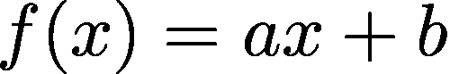

线性(？)函数公式(图片由作者提供)。

而且的确它被称为一个 ***线性函数***【1】。在这个公式中，我们有一个变量 *x* ，以及两个参数 *a* 和 *b* 。我们假设 *a = 1* ， *b = -2* ，并标绘出来:

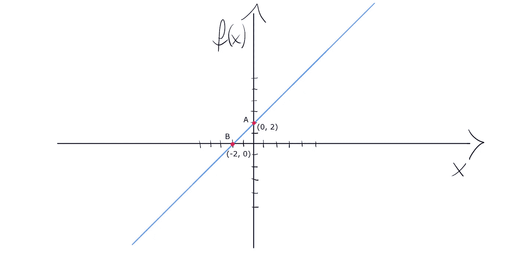

线性函数 f(x) = x -2(图片由作者提供)。

在图中我们可以看到直线经过点 *A (0，2)* 为 *f(0) = 2* 和点 *B (-2，0)* ，因为 *f(-2) = 0* 。我们通常就是这么想象线性的。

我们也倾向于根据 ***比例***【2】来考虑线性度。这意味着输入与输出成正比。这种直觉思维对我们来说是自然的，但是，我们需要记住，从形式上来说，比例是一个独立的、更广泛的术语。

根据定义，两个变量或量的比例是当这些量的比率或乘积是常数*时出现的关系。有变量 *x* 和 *y* ，如果:*

*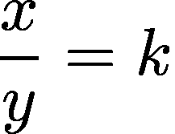*

*比例系数(图片作者提供)。*

*其中 *k* 为常数。在这种情况下，如果 *x* 增加， *y* 也增加。同样的道理，当我们减少变量时，它是成比例的。*

*变量是 ***反比*** 如果它们的乘积是常数:*

*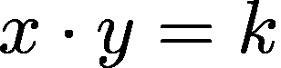*

*反比系数(图片由作者提供)。*

*为了检验它是否符合我们的直觉，我们可以这样转换这个公式:*

*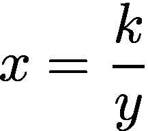*

*转换后的反比公式(图片由作者提供)。*

*假设 *k* 大于 *0* ，且 *y* 不等于 *0* ，在增加 *y* 的同时， *x* 在减少。所以一切 ok，是成反比的。*

# *循规蹈矩*

*记住我们对线性的直觉想法，让我们用正式的定义来面对它。*

*要调用给定的关系，或者一个函数，线性它应该满足两个性质(也称为*)【3】:**

1.  **添加**
2.  **同种**

*****可加性*** 由以下公式描述:**

**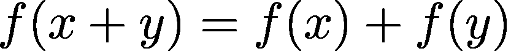**

**加法公式(图片由作者提供)。**

**这意味着输入总和的函数结果应该等于每个输入的函数结果总和。**

**所以我们来检查一下之前画的函数是否满足可加性。快速提醒你一下，我们的函数有参数 *a = 1* ， *b = -2，*它的公式是这样的:**

**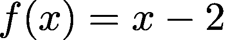**

**示例函数(图片由作者提供)。**

**为了检查可加性，我们假设 *x = 2* ， *y = 3* 。现在我们需要计算加法公式左边和右边的函数值，并检查它们是否相等。让我们从左侧开始:**

**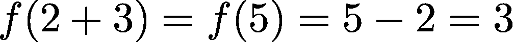**

**加法公式的左侧(图片由作者提供)。**

**现在让我们计算公式的右边:**

**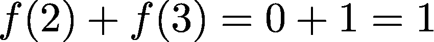**

**加法公式的右侧(图片由作者提供)。**

**哎呀，3 不等于 1，说明**我们的线性函数不满足可加性**，可加性是线性的一个必备性质。所以它不是真正的线性…**

**也许至少是 ***同质***【3】？但首先，函数齐次是什么意思？假设我们将输入 *x* 乘以因子 *d* 并计算函数 *f(dx)* 的输出。那么我们来计算这样的表达式 *df(x)* 的值。根据同质性，两个结果应该相等。这个简单的公式很好地表达了这一点:**

**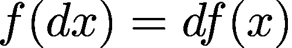**

**同质公式(图片由作者提供)。**

**现在，我们将做与可加性相同的实验，并检查我们的样本函数是否满足同质性。让我们假设 *d = 4* ， *x = 2* 并计算公式的左边:**

**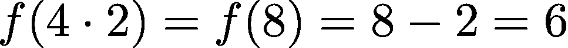**

**同质性公式左侧(图片由作者提供)。**

**然后让我们计算右边:**

**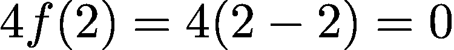**

**同质性公式的右侧(图片由作者提供)。**

**嗯，6 肯定不等于 0，我们的函数再次不满足线性要求，这一次是在齐次性方面。**

# **哪个线性函数满足叠加？**

**如果我们的简单线性函数不满足任何一个线性要求，哪个函数满足？实际上，它是一个更简单的线性函数，参数为 *b = 0* :**

**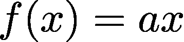**

**参数 b = 0 的线性函数(图片由作者提供)。**

**有什么特点，用这样的公式描述的函数经过坐标系的原点(在 2 *D* 系统中是 *(0，0)*)【4】。**

**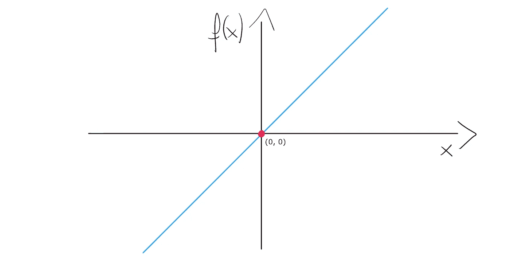**

**穿过原点的线性函数(图片由作者提供)。**

**我们来看看它是否真的满足线性的要求。我们假设 *a=2* ，那么我们的函数就用 *f(x) = 2x* 来描述。**

**我们先讨论可加性。计算可加性公式的左边为 *x = 2，y = 3* ，我们得到:**

**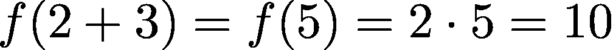**

**加法公式的左侧(图片由作者提供)。**

**对于公式的右侧，我们有:**

**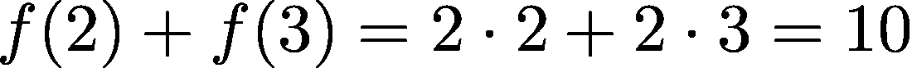**

**加法公式的右侧(图片由作者提供)。**

**到目前为止一切顺利！10 等于 10，所以我们的函数是可加的，太棒了。那么让我们检查同质性。**

**假设 *d = 2* ， *x = 4* ，我们可以计算出左边的齐次公式:**

**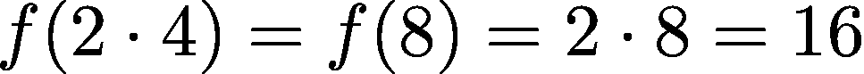**

**同质性公式左侧(图片由作者提供)。**

**好了，是 16，让我们检查一下公式的右边:**

**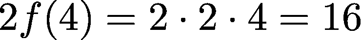**

**同质性公式的右侧(图片由作者提供)。**

**是啊！我们的函数是齐次的。它满足两个线性要求，因此我们可以说它是“真正的”线性。**

# **那么这条直线是线性的，还是非线性的？**

**答案是:看情况。如您所见，并非所有的线性函数都符合严格的线性要求。当然，使用线性函数这个术语并不意味着我们所有人都犯了一个巨大的错误。我们只需要小心在什么样的环境下使用它。**

**数学是一个非常复杂的领域，包含许多不同的分支。我们日常使用的线性函数这个术语，从微积分的角度来说是完全正确的。在这种情况下，每条直线都是线性函数。**

**然而，就线性代数而言，只有线性函数的子集是真正线性的(这些函数具有 *b = 0* )。这是一个更广泛的背景，我们根据线性映射和线性系统(使用线性算子的模型)来思考。在这种背景下，严格要求，直线不一定是线性的。**

**回答最初的问题，我们不仅了解了线性，还了解了提出非常明显的问题的价值。它们帮助我们清晰地理解我们认为已经完全理解的概念。**

## **参考书目:**

1.  **[https://en.wikipedia.org/wiki/Linear_function](https://en.wikipedia.org/wiki/Linear_function)**
2.  **[https://en . Wikipedia . org/wiki/proportional _(数学)](https://en.wikipedia.org/wiki/Proportionality_(mathematics))**
3.  **[https://en.wikipedia.org/wiki/Superposition_principle](https://en.wikipedia.org/wiki/Superposition_principle)**
4.  **https://mathinsight.org/linear_function_one_variable**