# 这是拖网渔船在捕鱼吗？全球渔业观察数据集的监督分类

> 原文：<https://towardsdatascience.com/is-a-trawler-fishing-modelling-the-global-fishing-watch-dataset-d1ffb3e7624a?source=collection_archive---------55----------------------->

照片由 [Unsplash](https://unsplash.com/s/photos/commercial-fishing-gear?utm_source=unsplash&utm_medium=referral&utm_content=creditCopyText) 上的[Egle sidaravicuite](https://unsplash.com/@egle_sidaraviciute?utm_source=unsplash&utm_medium=referral&utm_content=creditCopyText)拍摄

Metis 数据科学训练营现在已经过了中点，我还有一个项目。这是继我的[对纽约 MTA 地铁数据集](/mta-turstile-data-my-first-taste-of-a-data-science-project-493b03f1708a)的探索性数据分析之后的第三个，随后是[使用线性回归根据搜集的数据对 MyAnimeList 上的动漫用户分数建模](/myanimelist-user-scores-fun-with-web-scraping-and-linear-regression-9dd97900a82b)。

第三个项目的目的是什么？简单地说，**根据全球渔业观察(GFW)数据集**提供的特征，使用监督分类来确定特定渔船是否在捕鱼。

## TL；博士:

*   **从 GFW 数据集中的约 160，000 个条目中检索并设计了 8 个特征**，主要针对拖网渔船
*   **重复的容器 ID**意味着我必须为将来的工作留下时间序列数据
*   **随机森林**优于逻辑回归、高斯朴素贝叶斯和 K 近邻，并且在测试数据集和样本外拖网渔船数据上表现非常好
*   接下来的步骤是**解开类似的容器 ID**；将模型扩展到**包含不同的齿轮类型**；应用模型到**确定不同的齿轮类型**以及**一艘船是否是渔船**；和**调查更多复杂模型**

# 一.背景

根据联合国粮食及农业组织的数据，截至 2015 年，大约三分之一的全球渔场被过度捕捞。它继续解释为什么这是一件如此糟糕的事情:

> 过度捕捞不仅减少了粮食产量，还损害了生态系统的功能，减少了生物多样性，对经济和社会产生了负面影响。

为了跟踪过度捕捞，首先需要跟踪任何时候有哪些船只在捕鱼。这就是 GFW 的数据发挥作用的地方。

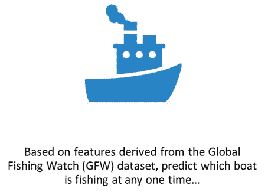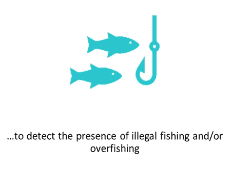

# 二。检索数据

GFW 的目标是“通过增加透明度来促进海洋的可持续性和管理”这种透明度的一部分包括公开相关数据，因此我能够下载带有各种类型渔具的渔船的 csv 文件。[ [1](#ee39)

> [1]自 2020 年 5 月 20 日起，GFW 网站上不再提供 csv 文件；相反，他们的 [GitHub](https://github.com/GlobalFishingWatch/training-data) 有一组 csv 和 numpy 文件，以几种不同的方式呈现数据。任何进一步的调查都可能会利用这些数据。

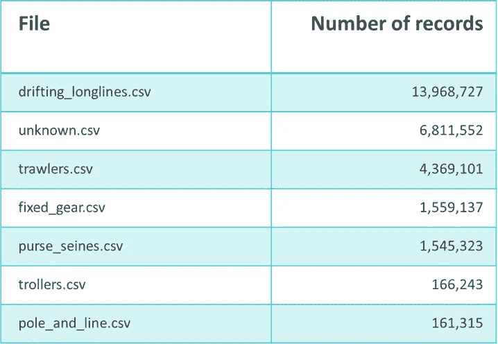

从 GFW 网站下载的 csv 文件列表，以及记录数量

从上表可以看出，有一个 **lot** 的记录！为了这次调查的目的，我选择将重点放在**拖网渔船**上，因为它们是第二大渔具类型，我的系统上仍然可以管理 440 万行数据。

GFW csv 文件具有以下功能:

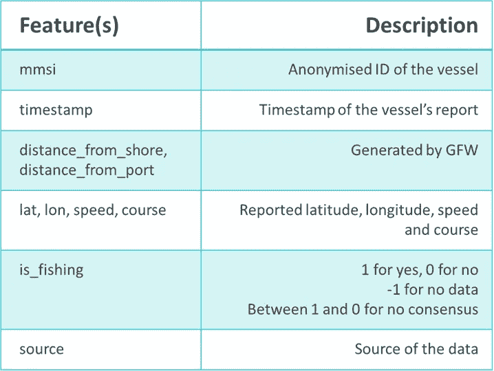

GFW csv 文件中的功能列表

我删除了更多行，如下所示:

## **答)是 _ 钓鱼**

我们的目标变量由 GFW 聘请的分析师生成，以确定船只是否在捕鱼。因此，介于 1 和 0 之间的值表示至少有一位分析师不同意其他分析师的结论。此外，三分之二以上的数据没有 is_fishing 的数据。

出于训练和测试的目的，我因此删除了捕鱼不是 1(意味着船只正在捕鱼)或 0(意味着船只没有捕鱼)的所有行。这给我留下了大约 160，000 行数据，这更易于管理。

## b)缺失数据

只有 2 行数据缺失(速度和航向)，因此在本次调查中被删除。

即使有 160，000 行而不是百万行，将所有内容加载到 Pandas 也会降低速度，有时还会导致内存错误。我求助于将我的数据加载到 PostgreSQL 数据库中来缓解这些内存问题，也是为了将来的可扩展性。

我还根据记录的 MMSI 将数据分为训练和测试数据集(80/20 分割)。我需要避免使用同一艘船的数据来预测其后续行为的情况。

# 三。准备数据

## a)时间序列转换-等等，为什么会有重复的 MMSI！？

每艘船的 MMSI(海上移动服务身份)应该是唯一的。因此，每个 MMSI 和时间戳对都应该是唯一的，这似乎是合理的，因此我可以使用一些历史数据来导出其他特征，例如经度、纬度、速度和路线的先前值或移动平均值，以及花费的时间和行驶的距离。

然而，当我试图用我的数据集验证这一点时，我发现了 MMSI 和时间戳的重复配对:

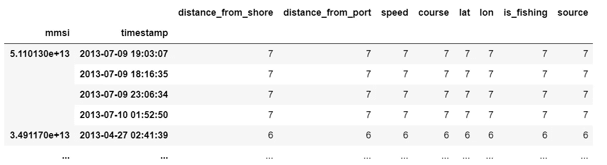

等等，什么？？？

在 bokeh 绘制第一个 MMSI 的路径产生了以下结果:

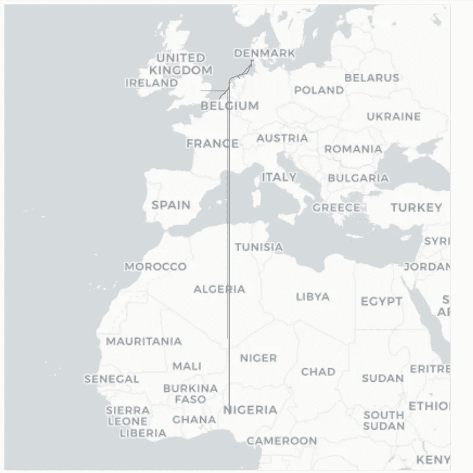

2013 年 7 月 9 日第一次 MMSI 采取的假定路线。注意西非中部的无意义坐标。

事实证明，复制 MMSI 症实际上是一个常见的问题。GFW 是这样说的:

> 每个操作员都必须手动将他们的 AIS 信息(包含他们的 MMSI)输入到他们的应答器中，这给有意或无意的错误留下了很大的空间。我们已经看到了毫无意义的任意代码，以及太不完整而无法提供关于船只身份的有用信息的代码。…这意味着在整个海洋中，多艘船只同时广播同一个 MMSI 号码，如果不仔细检查，很难区分它们。

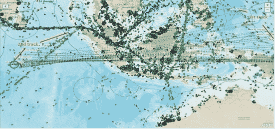

虚线表示一个特殊的 MMSI 的明显的来回传送。看看这一团糟！来源:[全球渔业观察船景](https://globalfishingwatch.org/data/spoofing-one-identity-shared-by-multiple-vessels/)

为了理清数据并确定哪些记录与哪个独特的血管相关联，我需要采用无监督学习，这超出了我目前研究的范围。因此，我决定不进行时序转换。至于带有无意义坐标的数据，我让它们是为了这次调查的目的。

## b)离海岸距离和离港口距离之间的高相关性

[距离海岸](https://globalfishingwatch.org/data-download/datasets/public-distance-from-shore-v1)和[距离港口](https://globalfishingwatch.org/data-download/datasets/public-distance-from-port-v1)都是 GFW 生成的特征；前者来自从[太平洋岛屿海洋观测系统到最近海岸线的距离得出的数据:0.01 度网格:海洋数据集](http://oos.soest.hawaii.edu/thredds/ncss/dist2coast_1deg_ocean/dataset.html)，后者来自 GFW 的[锚泊数据集](https://globalfishingwatch.org/datasets-and-code/anchorages/)。

在我最初的分析中，我发现这两个特征高度相关:

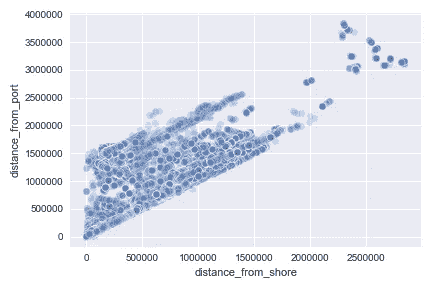

距离港口与距离海岸的散点图

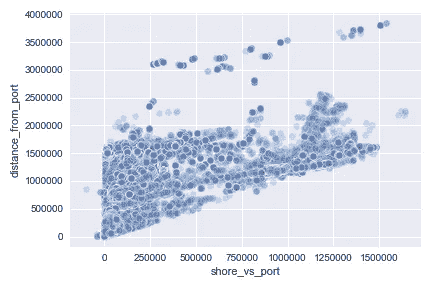

甚至两个特征之间的差异(shore_vs_port)也与距离 _from_port 高度相关

因此，我从后续分析中删除了距离海岸的距离。

## c)从时间戳生成特征

简而言之，我从每个时间戳中导出月、工作日和小时，其想法是可能存在一些可以被后续模型利用的模式。快速分析得出以下结果(y 轴是 is_fishing 目标的平均值):

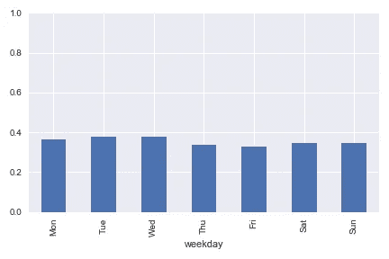

工作日似乎没有一个明确的模式…

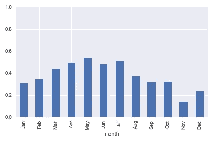

…但在 4 月至 7 月似乎有明显的峰值，在 11 月至 12 月有所下降…

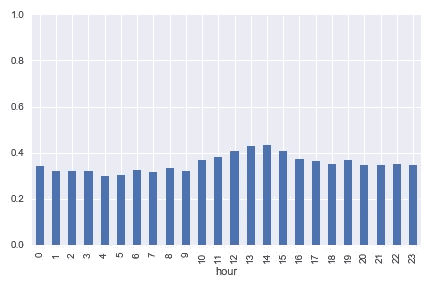

…上午 10 点至下午 3 点之间的时间明显增加。

为了限制特性的数量，我将字段保持为数字；然而，未来的工作可能需要将这些特征转换成分组的类别(例如，几个小时的早晨、白天和晚上)。

我总结了以下 8 个特点:

*   离港口的距离
*   拉脱维亚的货币单位
*   伦
*   速度
*   课程
*   工作日
*   月
*   小时

我通过 scikit-learn 的默认随机森林分类器和相关矩阵运行这些特征，发现**速度**和**距离港口**似乎是预测拖网渔船是否正在捕鱼的两个最重要的特征，如下所示:

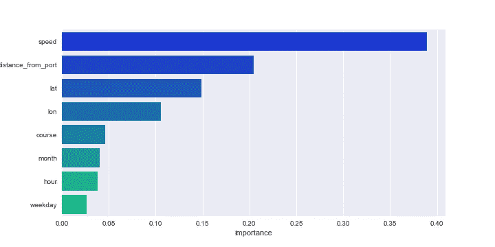

默认随机森林分类器中的要素重要性

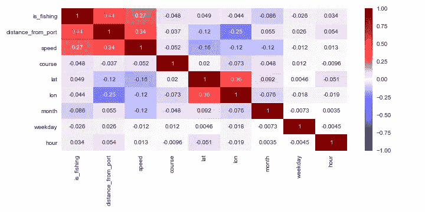

相关矩阵

# 四:拟合和选择模型

出于本项目的目的，我考虑了 scikit-learn 的以下分类模型:

*   物流回归
*   k 最近邻
*   高斯朴素贝叶斯
*   随机森林

这四个模型在训练数据集上用 5 重交叉验证进行训练；我还使用网格搜索和随机搜索执行了超参数调优(当有太多参数需要调优时使用后者)。

有一些额外的限制如下:

*   **物流回归和高斯朴素贝叶斯:**我用了 scikit-learn 的 StandardScaler 来**归一化数据**；否则，特征之间的价值差异将是压倒性的(例如，距离港口的距离可能达到数万，而这些速度最多只能达到数百)。
*   K 最近邻:我不得不**抽取 20%的训练数据**，否则要花很长时间才能得出估计值。
*   **随机森林:**我不得不**限制一些调整过的超参数**，即最大深度和最小样本分裂，否则算法容易过拟合。

然后我用 f1 评分和 AUC 评估结果。**随机森林**以 0.90 的 **f1 分数和 0.98** 的 **AUC 名列榜首，如下图所示:**

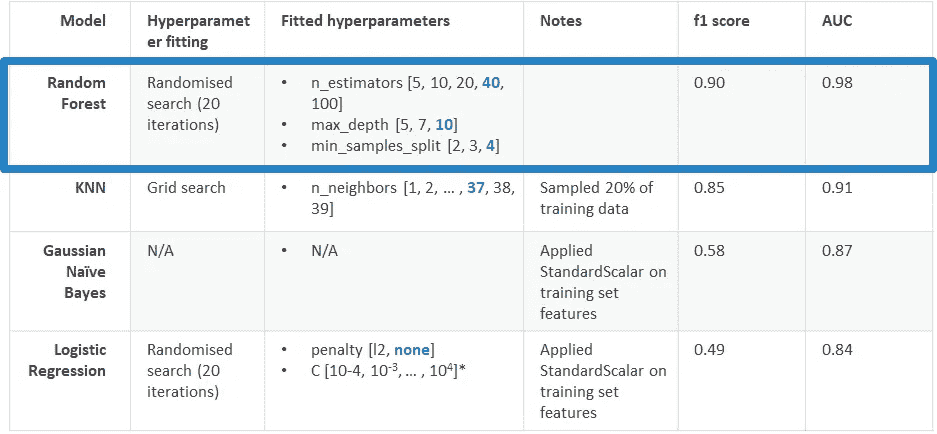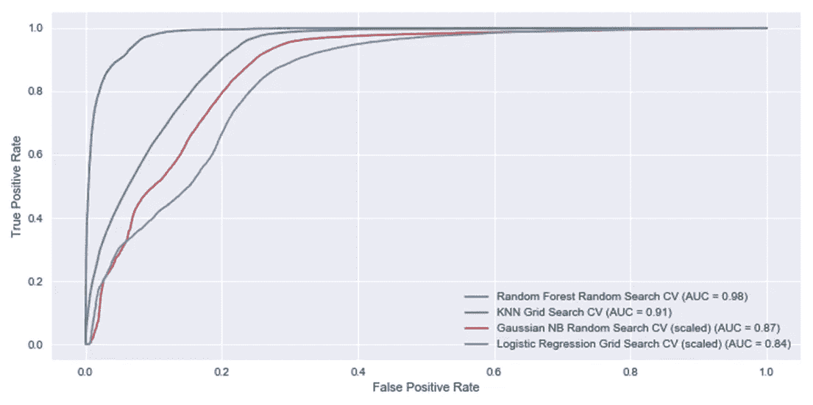

训练数据的 AUC

# 五:意见

在测试数据集上应用随机森林，我发现 f1 分数和 AUC 完全相同。

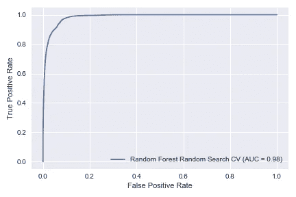

测试数据的 AUC

测试数据的混淆矩阵进一步表明，随机森林确实表现得非常好，具有高水平的精确度和召回率:

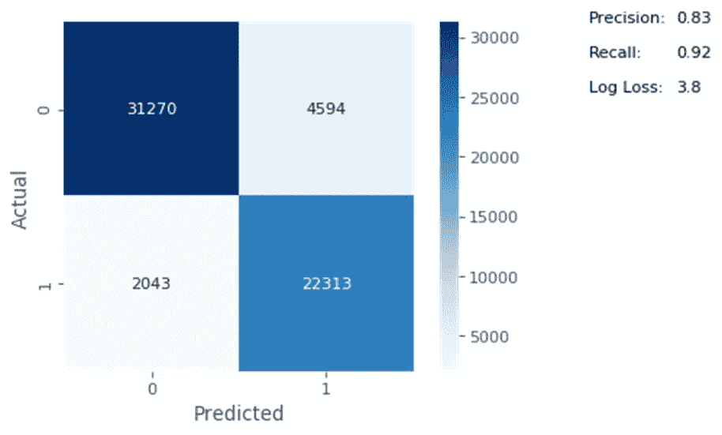

我扔在一起的一个快速而肮脏的 Flask 应用程序也显示了我选择的模型的高性能，即使面对样本外数据(即我在训练和测试数据集外忽略的没有共识的行)。我在下面链接了一个视频，因为该应用程序所依赖的 SQL 数据库有点太大，无法放到网上；我将在这个项目的未来迭代中寻求补救。

# 不及物动词进一步的工作和学习要点

尽管我当前的模型性能很高，但仍有几个方面需要改进，如下所示:

*   **解开共享相同 MMSI 的船只**以便于时间序列分析，例如通过使用聚类算法。
*   使用除拖网渔船以外的**渔具类型以及未知渔具类型处理 GFW 更大的数据集。**
*   **将数值数据转换为分类数据，分组或其他。**这样做很可能会提高物流回归和朴素贝叶斯模型的性能。除了本文前面提到的与时间相关的类别之外，纬度和经度也可以组合成地球上离散的区域单位。事实上，这是 GFW 用来构建其[锚定数据集](https://globalfishingwatch.org/datasets-and-code/anchorages/)的方法。
*   应用**附加模型**确定船只使用的渔具类型，或船只是否为渔船。

对我来说，这是另一次紧张的学习经历，尤其是当它涉及到可视化和处理地理空间数据以及处理 Pandas 和 SQL 中的大规模数据集时。我敢肯定，下一个项目将会同样有趣和紧张。