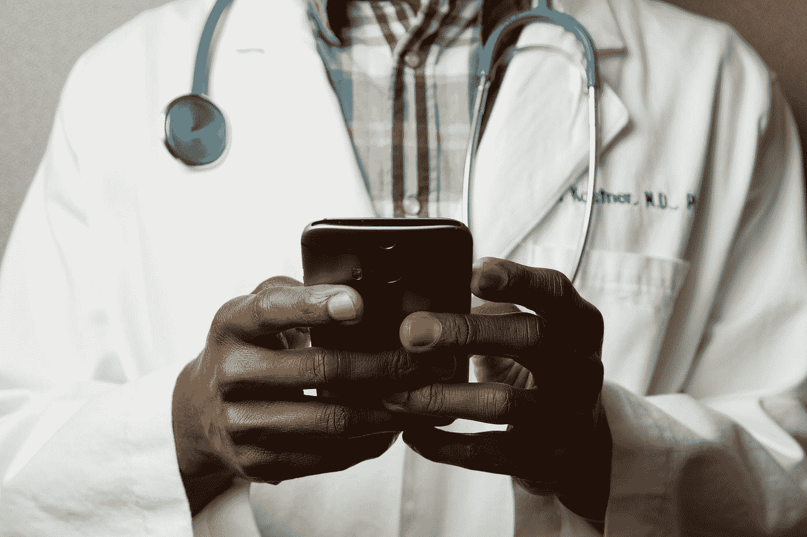
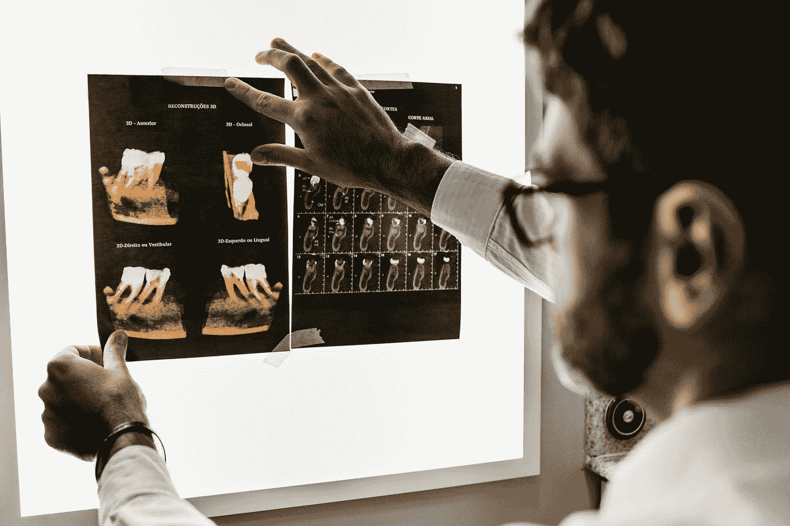
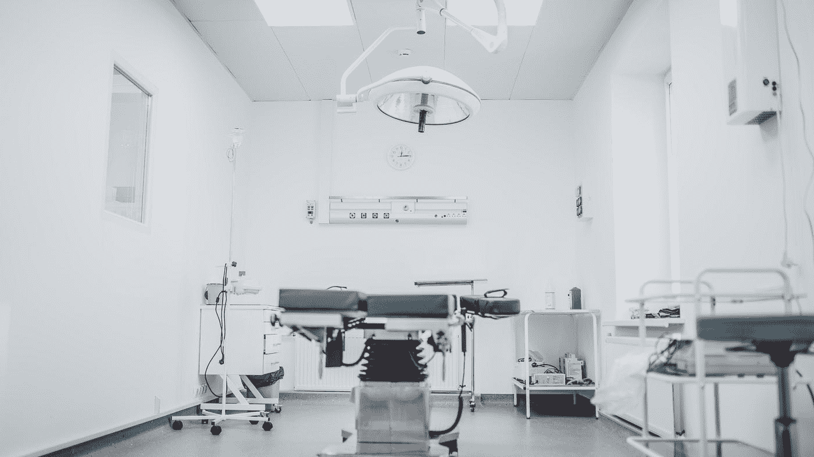

# 人工智能正在改变现代医学的面貌吗？

> 原文：<https://towardsdatascience.com/is-ai-changing-the-face-of-modern-medicine-681774f9ddb8?source=collection_archive---------67----------------------->

## 医疗人工智能产品是否具备取代医疗保健专业人员和扰乱医疗保健行业的条件？

[国家癌症研究所](https://unsplash.com/@nci?utm_source=medium&utm_medium=referral)在 [Unsplash](https://unsplash.com?utm_source=medium&utm_medium=referral) 上拍摄的照片

在 2012 年和 2017 年之间，人工智能在医疗保健领域的投资通过股权交易筹集了 18 亿美元。这超过了人工智能在所有其他行业的投资！

几十年来，现代人工智能和医疗保健一直相互吸引。医疗保健行业正在寻找降低成本和提高效率的方法，以便为全球更大比例的人口提供高质量和可获得的医疗保健。

另一方面，人工智能研究人员正在寻找能够展示人工智能价值的定义良好的用例。还有比医疗保健更好的地方吗？在医疗保健中，决策可以拯救生命，而且(除了明显的复杂病例)在许多情况下，原因是已知的，也是明确的。

在本文中，我们将探讨人工智能在医疗保健领域的应用和局限性，以及它是否会在不远的将来改变该行业的面貌。

照片由[国家癌症研究所](https://unsplash.com/@nci?utm_source=medium&utm_medium=referral)在 [Unsplash](https://unsplash.com?utm_source=medium&utm_medium=referral) 上拍摄

# 医学成像

医学成像是医学中拥抱人工智能最快的领域之一。考虑到[计算机视觉](https://en.wikipedia.org/wiki/Computer_vision)(研究计算机对图像的理解的计算机科学领域)是机器学习最知名和最成熟的领域之一，这并不奇怪。

发表在《柳叶刀数字健康》杂志上的对 82 项不同研究的[系统综述](https://www.thelancet.com/journals/landig/article/PIIS2589-7500(19)30123-2/fulltext)发现，深度学习模型的图像诊断性能与医疗保健专业人员相当。

[深度学习](https://en.wikipedia.org/wiki/Deep_learning)是机器学习的一个领域，它使用具有人工神经网络架构的模型，受生物系统神经结构的启发(考虑到这一点，将其应用于医疗用例多少令人满意)。这些模型通过向它们提供大量图像和标签来训练，因此计算机可以学习对某些疾病和状况进行分类。

根据它们的复杂程度，训练神经网络的成本可能会很高。这既与精确筛选数据所需的时间有关，也与训练期间所需的大量[计算能力](https://arxiv.org/abs/2007.05558)有关。

照片由[乔纳森·博尔巴](https://unsplash.com/@jonathanborba?utm_source=medium&utm_medium=referral)在 [Unsplash](https://unsplash.com?utm_source=medium&utm_medium=referral) 上拍摄

然而，像大多数机器学习应用一样，一旦经过训练，这些模型比人类模型更快、更便宜，这是人工智能采用的一个明显好处。

在上述系统评估后不久，英国政府承诺为 NHS 的人工智能研究投入 2 . 5 亿英镑。这只是为医学人工智能研究提供大量资金的一个例子。

那么为什么我们在医院里看不到这些模式是司空见惯的呢？

# 支持人工智能

事实上，在医学成像市场上有少数几个[FDA 批准的人工智能解决方案。其中之一是 ContaCT，它分析 CT 血管造影照片，寻找即将到来的中风迹象。在一项研究中，当识别大脑中动脉大](https://news.bloomberglaw.com/tech-and-telecom-law/fda-signals-fast-track-approval-for-ai-based-medical-devices-1)[血管闭塞](https://en.wikipedia.org/wiki/Vascular_occlusion)(大脑中动脉阻塞)时，其灵敏度超过 90%。

除此之外，它还将开始治疗的时间缩短了五倍！这在中风的治疗中尤其重要，因为中风的永久性损伤量会随着治疗时间的延长而增加。

[卡米洛·希门尼斯](https://unsplash.com/@coolmilo?utm_source=medium&utm_medium=referral)在 [Unsplash](https://unsplash.com?utm_source=medium&utm_medium=referral) 上拍摄的照片

然而，FDA 将接触[归类为](https://www.fda.gov/news-events/press-announcements/fda-permits-marketing-clinical-decision-support-software-alerting-providers-potential-stroke)

> “一种计算机辅助分类软件，使用人工智能算法分析图像，寻找与中风相关的指标。人工智能算法是一种临床决策支持软件，可以帮助提供商为患者的疾病或状况确定最合适的治疗计划。”

注意“计算机辅助”、“支持”和“协助”这些词。人工智能在医学成像方面的接触和其他类似应用不是为独立工作而设计的。它们是用于支持医疗专业人员的工具，提高了诊断的速度和准确性。

对于接触，如果它检测到血管异常，它会向神经血管专家发送短信，然后开始治疗。在人类介入之前没有治疗。

# 伦理问题

很容易理解为什么一旦医疗干预开始，人工智能就被边缘化为配角。尽管*虚拟*人工智能应用在医疗成像等领域已经相当成熟，但对于*物理*应用来说却并非如此。

物理应用[可能包括](https://www.ncbi.nlm.nih.gov/pmc/articles/PMC6691444/)技术，例如在外科手术中使用自主机器人，以及为残疾人使用智能假肢。不仅对这些技术的研究不够成熟，而且它们有着更加直接和持久的后果。

照片由 [Franck V.](https://unsplash.com/@franckinjapan?utm_source=medium&utm_medium=referral) 在 [Unsplash](https://unsplash.com?utm_source=medium&utm_medium=referral) 上拍摄

如果机器人在手术过程中出错，那可能是致命的，而用于诊断医学图像的人工智能模型会在采取任何行动之前将他们的发现传递给专家。

然而，即使是将人工智能用于诊断这一虚拟应用，也有些争议。我们将简要讨论三个主要问题。

**首先是信任问题。**人工智能模型是臭名昭著的“黑匣子”,它根据难以理解的复杂参数组合做出决策。对于神经网络来说尤其如此，在神经网络中，模型学习不同数学函数中使用的权重的复杂组合来提供分类。

尽管现在有许多用于解释神经网络的技术，但这些技术仍然难以理解，并且将使医生和患者难以信任它们来提供有效的诊断。

其次，是责任问题。当一个人工智能模型犯了一个错误并造成伤害时，通常不清楚谁应该负责。这个问题经常在自动驾驶汽车导致的[致命事故](https://en.wikipedia.org/wiki/List_of_self-driving_car_fatalities)中被问到，但这个问题同样适用于(如果不是更适用于)医疗保健。

应该是开发模型的程序员或数据科学家，还是使用模型的医疗专业人员？在明确谁对人工智能模型造成的诊断错误负责之前，如果没有大量的人类投入和监督，它们不太可能被依赖。

**最后，人工智能会导致人类自满。**如果从业者知道他们正在使用的诊断工具和他们一样有效，他们可能不会充分完成自己的诊断分析。这意味着医疗保健专业人员可以避免检查图像，因为他们知道人工智能模型会为他们做这件事。这样做的问题是，仅仅因为模型和人类平均表现相当，并不意味着他们会在个案的基础上。

正如模型可以识别人类遗漏的病例，人类也可以识别模型遗漏的病例。如果医疗保健专业人员变得自满，不正确地检查自己的图像，这些案件可能会被错过。

**结论**

很明显，人工智能在图像诊断方面的发展已经导致计算机在特定的诊断任务中与人类一样有效。

然而，提出的伦理问题意味着计算机不太可能在不久的将来取代人类。相反，他们将作为医疗专业人员的额外一层，努力提高诊断的精确度和效率。

照片由 [Arseny Togulev](https://unsplash.com/@tetrakiss?utm_source=medium&utm_medium=referral) 在 [Unsplash](https://unsplash.com?utm_source=medium&utm_medium=referral) 上拍摄

在一个每个决定都可能是生死之交的行业，要改变这一点，不仅仅需要研究。人工智能在医院中的缓慢采用将建立患者的信任，对医疗保健专业人员的培训将帮助他们使用人工智能产品来改善患者的治疗。

我不指望自动机器人很快就能为你做手术，但通过适当的程序实施，我只能看到用人工智能丰富当前诊断过程的好处。

如果你喜欢这篇文章，你可能会喜欢我写的另一篇文章，“ [*美术是人工智能的下一个前沿吗？*](https://medium.com/swlh/is-fine-art-the-next-frontier-of-ai-64645f95bef8) *。*