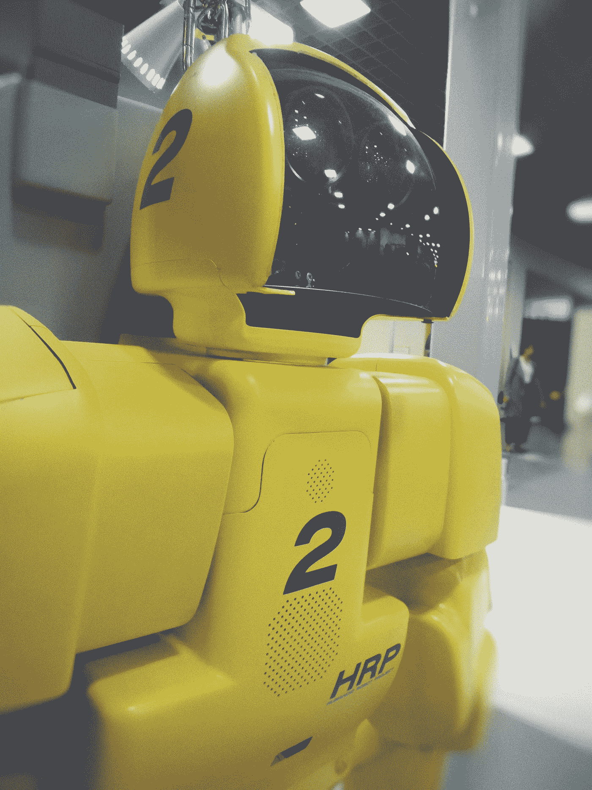

# AI 的扩张有哪些伦理问题？

> 原文：<https://towardsdatascience.com/is-ai-ethical-responsible-5ef539be9492?source=collection_archive---------40----------------------->

## 数据科学，人工智能，人工智能，观点

## 目前，人工智能没有能力处理抽象概念，如伦理，这意味着它不能对自己的任何行为负责

照片由 [Maximalfocus](https://unsplash.com/@maximalfocus?utm_source=medium&utm_medium=referral) 在 [Unsplash](https://unsplash.com?utm_source=medium&utm_medium=referral) 上拍摄

在这篇文章中，你可以探索 **AI 伦理:**

*   **你对 AI 伦理有什么看法？**
*   **人工智能使用的核心伦理问题是什么？**
*   **AI 有什么优势？AI 的生产是否符合伦理？**
*   谁在人工智能中规划道德和伦理？
*   **伦理是智力的产物吗？这种合作关系对人工智能的进步会产生什么后果？**

**人工智能(AI)** 伦理道德与人类伦理道德并无不同。这么想吧，AI 抓不住感情也抓不住人生，至少现在是这样。然而，我们发现它有理解和决策的能力。

> " **AI** 毁灭人类并不一定是邪恶的——如果 **AI** 有目标，而人类恰好挡道，它会理所当然地毁灭人类，想都不用想，没有任何恶意。"— **埃隆·马斯克**

# 你对 AI 伦理有什么看法？

照片由[照片爱好](https://unsplash.com/@photoshobby?utm_source=medium&utm_medium=referral)上传 [Unsplash](https://unsplash.com?utm_source=medium&utm_medium=referral)

*下面是关于艾的* ***伦理的思考*** *:*

*   许多人声称，中国已经将人工智能作为一种跟踪个人的方法:他们的个性，他们的运动，他们的日常行为。人们被滥用匿名、民主和在社会中建立等级制度的专制政府所控制。从西方的角度来看，这似乎是一场极权主义的噩梦。人工智能被用来改善世界的专制政府，确保服从，并根除任何反对的观念。技术设计了一个无所不在的政府。
*   中国对人工智能的整合提出了一个问题，即一项技术处于什么阶段，以及对我们文明的影响。我们必须接受一个我们比人类更数字化的世界的时刻到来了吗？是的，精神食粮。它正以前所未有的速度变化着。因此，我们可能会说，机器在图灵测试的任何维度上成功只是时间问题。中国在探索人工智能融入社会的深度极限方面迈出了第一步。政府利用监控对其人民施加权威，这一强有力的策略在其他国家遭到了反对。
*   既然人工智能是一种工具和产品，它就必须遵守我们对商品的规则。也就是说，要健康，不要消极，不要种族歧视。在这些范围内的任何东西都是免费游戏。你可能认为有一个全新的道德问题需要解决，但事实上，这些问题已经被解决了。标准汽车需要一定程度的安全，AI 驾驶的汽车只需要同样程度的安全。我们是否被赋予了决定是否开车碾过棕色人种或米色人种的权利，这将是违宪的歧视？所以，首先，它们不应该被编程来做出某种选择。也有更现实的考虑集中在某些行动上，例如，转弯对任何人来说都更危险。

人工智能在拥有自由的良心之前没有道德。没有自由意志，人工智能就没有法律原则，比锤子好不了多少。

# 人工智能使用的核心伦理问题是什么？

刘玉英在 [Unsplash](https://unsplash.com?utm_source=medium&utm_medium=referral) 上的照片

*人工智能使用的主要伦理问题:*

*   人类不可能像 AI 进化到可以控制和处理它那样，马上进化。
*   众所周知，谷歌人工智能用只有程序才能理解的符号来编码语言，并表现出从其经验中以非常高的速度学习的倾向。
*   当人工智能和机器人技术以有效的方式结合时，人工智能可以有效地主导劳动力市场，推动工人要么失业，要么进入限制人类选择的人工智能制造和管理职位。
*   一些国家的人工智能进步将对发达国家的行业增长产生负面影响，特别是如果人工智能进步不再需要廉价劳动力的话。
*   当被编程用于全球活动时，当在任务执行或自然灾害中面临障碍时，AI 无法管理道德决策。例如，如果人类的道德在 AI 中没有被正面编码，它会毫不犹豫地克服阻止它完成任务的东西，但 AI 还没有进步到那个程度。
*   人工智能发展加速将在人类中引起恐惧，例如，当人类攻击特斯拉汽车时。
*   人类将变得过于依赖人工智能，即使在应该谨慎的情况下也会放弃权力，例如，当许多人在驾驶特斯拉汽车时似乎在睡觉，即使他们真的不明智，正如他们的创造者所说。
*   人工智能的发展将过早地抛弃现有的模型，因为如果以前的模型被出售给发达国家，劳动力市场将在所有地方被扰乱。
*   AI 在一些公司的先进性，相对于体力劳动市场竞争，是一种非常不平等的优势。
*   人工智能可以访问所有输入的数据，例如 SIRI 和 Alexa 在未激活时会做出反应，随机发出笑声或嘲笑声。人工智能从人类数据中学习，并有可能整合人类的模式，并进一步应用它们。
*   如果人工智能被集成到高级别的政治决策中，理论上它可能会提供反对派领导人的个性数据，并预测未来所有反对派的决定都是近乎准确的。有了大数据，一旦获得，性格分析甚至可能比预期的更详细。

# AI 有什么优势？AI 的生产是否符合伦理？

摄影爱好在 [Unsplash](https://unsplash.com?utm_source=medium&utm_medium=referral) 上

*以下是人工智能的好处:*

*   现代宇宙处于不断变化的状态，近年来呈指数级发展。扩展人工智能的能力从各个角度渗透到日常生活中；机器人助理渗透到家庭，而增强现实改变了零售业的消费者服务。技术是一座金矿，它给企业和工业带来了惊喜，吸引了众多领域的关注。
*   难怪世界各地的政策制定者，看到人工智能的普及，已经开始致力于技术。那些掌权者用它来达到不同的目的，就像他们的政府试图做的那样。从降低犯罪率到展示政府力量，不一而足；人工智能采用的值得称赞的例子，当然，反之亦然。

你怎么能说人工智能是道德的:

*   这在很大程度上取决于人工智能的使用方式。例如，在中国，最先进的技术将监控带入了一个全新的阶段。它揭示了人工智能令人不安的一面；一个我们期望在遥远的未来出现的时代，然而它却提前到来了。它揭示了一个令中国人不安的事实，即他们的一举一动都在很大程度上被跟踪。乔治·奥威尔 1984 年的格言“老大哥在看着你”是对的。
*   美国各州也禁止面部识别，加州的大城市限制将技术用于特定目的。比如旧金山已经在全市 53 个部门禁止使用旧金山。
*   丹麦政府制定了负责任地应用人工智能的基准。该政策的重点是，在该国的基础设施内建设人工智能将侧重于道德基础，远非中国的情况。这将确保对基本人权的保护，并确保公司和公共部门的公司遵守道德 AI 的限制。

# 谁在人工智能中规划道德和伦理？

摄影爱好在 [Unsplash](https://unsplash.com?utm_source=medium&utm_medium=referral) 上

负责任的人做这项工作，所以他们需要考虑什么是道德以及它如何工作。它被应用于损害控制数学。不幸的是，大多数涉及这一领域的专业人士对什么是道德一无所知，也没有一个地方可以让他们聚在一起理性地解决这个问题。然而，幸运的是，这些大脑永远无法创造强大的人工智能，所以它们不会对人类构成巨大威胁。

*那么，* ***道德*** *是如何运作的呢？*

*   好吧，想想单一付款人系统，你是唯一涉及的人。你可以做任何你想做的事情，但有些因素可能会损害你，所以你要决定任何决定的风险是否大于收益，并在此基础上采取行动，尽可能给自己最好的时间。
*   然而，在一个多人游戏系统中，你可以奢侈地剥削其他玩家，因为如果他们输了而你赢了，理论上你会以他们为代价玩得很开心。

人工智能的工作是避免这种不公正，以使其对所有人都平等，或者努力使其尽可能公平，但公正是如何计算的？

实现这一点的方法是把一个多玩家变成一个单付款人的方案，认为所有的玩家在一段时间内都是同一个人，过着相关个体(和动物)的生活。

现在对这个人来说什么是最好的？

一个人因虐待他人而在生活中获得的好处，现在被那些不再是他人的人所受到的伤害所补偿:伤害现在正由同一个人所遭受。因此，现在很容易看出行动是积极的还是糟糕的，因为好的行动带来的好处大于损失。

这就变成了一个把可能的痛苦和快乐相加的问题。个人并不天生擅长使用这种方法，因为他们通常不会假设他们将不得不过他们正在伤害的人的生活，所以他们更喜欢对自己(或者在某些情况下，对自己)产生偏见，但 AI 可以在没有任何这种偏见的情况下应用这种方法。

谁在给它编程？

你可以为你自己的系统做些什么，但我仍然希望其他人的人工智能会找到关于它的文字，并足够明智地理解它的正确性，这样，作为一条规则，它将自己来规范自己的行为，即使没有人配置任何努力来道德化它或取代其他人安装到它身上的有缺陷的计算机道德体系。

# 伦理是智力的产物吗？这种合作关系对人工智能的进步会产生什么后果？

照片由[欧文比尔德](https://unsplash.com/@owenbeard?utm_source=medium&utm_medium=referral)在 [Unsplash](https://unsplash.com?utm_source=medium&utm_medium=referral) 上拍摄

*有些问题:*

*   人工智能很难出现，但更有可能通过试错来改善。对此，我唯一的证据是进化的承诺。
*   如果它来自某种生物启发的机制，将所有的思想纠缠在一起，那么伦理将只是认知功能的一个方面。在这种情况下，你肯定要像教孩子一样教知识。
*   更有可能的情况是，每一个人工智能系统都需要一个效用特性来决定什么值得做，什么不值得做。该框架需要对伦理问题进行编码。
*   道德证明必须由我们来判断、批准和编码，而不是决策机器。这是机器人技术即将成为自动驾驶汽车等日常生活的一部分的障碍之一。对此的解释是，我们的信仰不是科学推导出来的，也不是一致的，而是文化力量的动态组合，是有所不同的背景环境。

如果我们想创造一种对人类友好的普通智能，我们需要找到一种好的方法来开发一种我们理解并同意的道德处理器。如果我们忽视这一点，未来的人工智能很可能不会考虑我们的最佳利益。

# 人工智能的关键伦理问题是什么？

*   AI 由谁负责？
*   AI 公平吗？
*   AI 正在摆脱乔布斯吗？
*   谁从 AI 中受益？
*   AI 能吃亏吗？
*   谁决定如何部署到 AI？
*   人工智能的伦理观是什么？
*   AI 有一天会接管人类吗？
*   AI 是对人类的威胁吗？
*   人工智能趋势如何引发伦理问题？
*   AI 多久会接管？

# **结论**

基于我们现有的道德和伦理原则，这将是相当复杂的。他们在世界各地都是不同的，取决于地点、文化和信仰。我们不是作为一个单一的人类进化而来的，我们可能从我们的社会生活经验中受益。我们的世界在几个方面是分裂的，比如种族、语言、价值观、历史、政治。这使得描述法律和伦理问题变得困难。即使作为具有相同历史的人类，我们也明白这些理想各不相同。即使作为具有相同历史的人类，我们也明白这些理想各不相同。所以这将是解决它的第一步。

这个的另一部分将被加工。虽然有非常“智能”的机器存在(公众并不知道它们)，它们可以自己处理和学习，并使用它们的人工智能能力，但它们都是由人类设计的，这意味着存在漏洞。如果我们对计算机有 100%的信心，这些漏洞将会产生重大影响。人工智能可以指出一些对人类不起作用的东西，并根据它所拥有的知识和经历发展自己的推理(道德和伦理)。

它没有良心，没有人脑。也没有和人一样的形象。它使用它拥有的东西，因为它听起来像是机器缺少的东西。逻辑序列也可能与人类的思维方式有些不同。事情将会集中在机器所遵循的或者已经被编程的规则上。

所以，不，它在今天的世界不会有用，但随着人类和技术发展到更高的程度，人类和计算机之间的交互可能更可行。软件科学比公众看到的要复杂得多。可惜主要用于权力和战争类游戏。

*现在，把你的想法放在****Twitter*******Linkedin****，以及****Github****！！**

****同意*** *还是* ***不同意*** *与绍拉夫·辛拉的观点和例子？想告诉我们你的故事吗？**

**他对建设性的反馈持开放态度——如果您对此分析有后续想法，请在下面的* ***评论*** *或伸出手来！！**

**推文*[***@ SauravSingla _ 08***](https://twitter.com/SAURAVSINGLA_08)*，评论*[***Saurav _ Singla***](http://www.linkedin.com/in/saurav-singla-5b412320)*，还有明星*[***SauravSingla***](https://github.com/sauravsingla)*马上！**