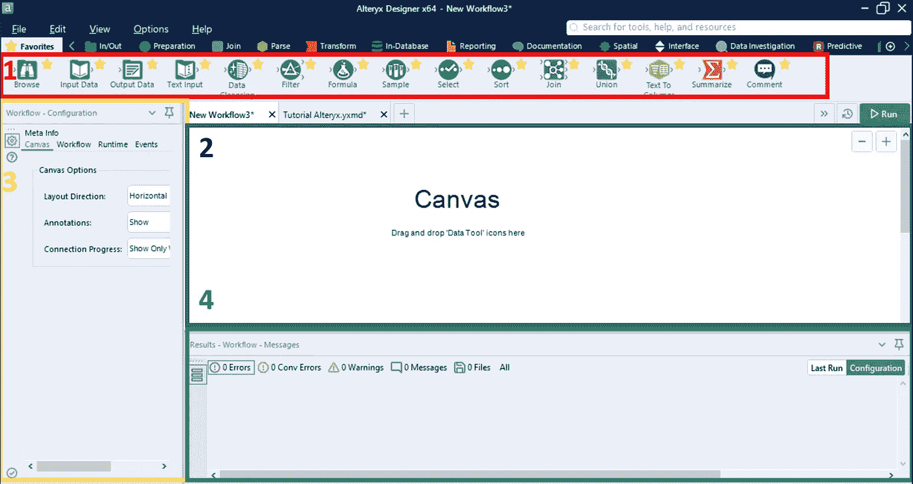
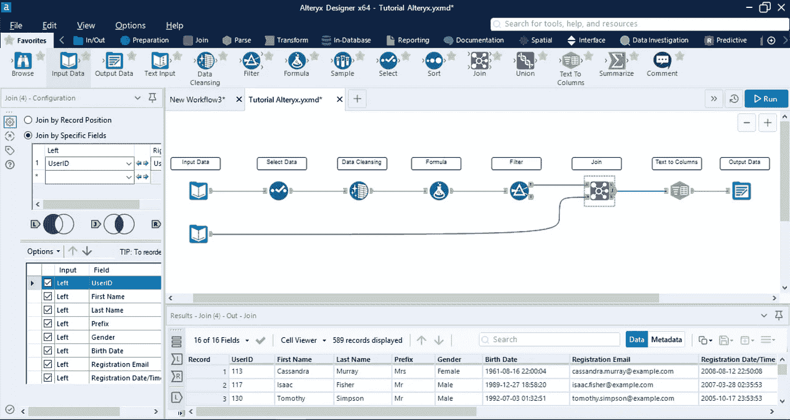

# Alteryx 是否是您分析需求的正确选择？

> 原文：<https://towardsdatascience.com/is-alteryx-the-right-choice-for-your-analysis-needs-249e6a2ec2b1?source=collection_archive---------13----------------------->

## 什么是 Alteryx 以及我对使用它的想法

法国巴黎鸟瞰图— [来源](https://unsplash.com/photos/52gEprMkp7M)

# **简介:**

几周前，我的同事从我的隔间墙上偷窥说，“嘿，你要学习 Alteryx 了。”… *Alteryx* ？我甚至不知道那是什么词。在让他为我重复并拼写出来后，我做了一些谷歌搜索。在我的谷歌搜索中，我找不到该软件是什么以及它的最佳用途的综合分类。我不得不费力地从许多搜索中把这些信息拼凑起来。这就是我写这篇文章的原因:分享我拼凑的关于 Alteryx 的结论，并分享我自己使用它的第一手经验。

# **目录:**

*   什么是 Alteryx
*   历史/背景
*   使用 Alteryx(基本用例)
*   总体思路

# **什么是 Alteryx？**

Alteryx 是一个拖放软件，用于数据清理、数据挖掘、ETL、空间分析、机器学习和其他 BI 相关的活动。它的使用范围可以是相对基本的活动，如连接不同的数据源和预处理(我将马上向您展示)，也可以是复杂的活动，如预测建模、时间序列和模拟。

# **历史/背景**

Alteryx 既是制作软件 ***的公司名称，也是软件*** 的名称……它实际上有一个有趣的背景故事。该公司成立于 1997 年，以前被称为 SRC 有限责任公司。在最初的 15 年里，该公司主要专注于地理商业智能解决方案。它有从事各种有趣的数据相关地理项目的历史，包括在 2012 年与美国人口普查局合作创建一个工具，帮助客户为各自的用例战略性地挖掘/分析人口数据。这是一个突破性的项目，因为这是公众第一次能够如此细致地了解美国的人口构成。

2010 年，该公司更名为“Alteryx ”,采用他们领先的数据分析软件的名称。从这一点上，该公司开始将自己定义为一家全方位的数据科学和分析公司，而不仅仅是一个地理商业智能解决方案。他们将自己的软件设计成一个拖放式解决方案，供任何员工在没有太多编码/硬科学背景的情况下执行高级分析。

> **然而**，由于 Alteryx 在地理空间数据分析方面数十年的背景，我相信这仍然是它的软件区别于其他软件的地方。

另一方面，Alteryx 于 2017 年 3 月 24 日首次公开募股，每股 14 美元。股价在 2020 年 2 月 14 日达到 158 美元的高点…

# **使用 Alteryx(基本用例)**

所以，让我们来深入了解一下使用 Alteryx 是什么感觉。下图乍一看可能有点吓人，但实际上非常简单。

让我们剖析一下画布视图，这样我们就能理解它是如何工作的:

1.在顶部，红色，我们有各种数据工具**我们可以在屏幕上拖放。数据工具本质上是可以以直观的方式应用于数据的功能。通常，用户会从绿皮书图标“输入数据”开始。**

2.中间黑色的是**画布**。然后，我们将需要的任何图标(数据工具)拖到画布上，画布是占据屏幕大部分的大块空白区域。像蜘蛛网一样的连接从一个图标到另一个图标，以显示分析的进展(我们很快就会谈到这一点)

3.左边黄色部分是**配置窗口**。一旦我们拖动一个或多个图标，我们将使用配置窗口配置和定制每个图标的功能。

4.最后，在底部我们有**结果窗口**。每个数据工具的结果都可以在这里显示和交互。这个特性非常有用，因为它允许我们看到每个数据工具在每一步的输入和输出。

## 让我们看看画布上的作品是什么样子的:

在这里，我们对虚拟数据进行了一些基本的预处理，我将从左到右一步步介绍每个图标的功能:

**1。输入数据**:本例中从 excel 表中拉入数据。然而，Alteryx 可以从不同的地方以不同的格式提取数据。

**2。选择数据:**在这一步中重命名并改变了列的顺序

**3。数据清理:**更改了“性别”列的格式，该列以前包含不需要的字符

**4。公式:**通过将名字和姓氏列相加创建了一个新列

**5。过滤器:**根据 1 个特定属性过滤数据，即居住国

**6。Join:** 将另一个工作表加入到现有的工作表中，类似于 Excel 或 SQL join 语句中的 Vlookup

7。文本到列:根据“-”字符拆分列

8。输出:导出输出，以便在其他地方进行进一步的分析、可视化或报告

这个例子并不令人惊讶，但是它是学习使用 Alteryx 的第一步。请注意配置窗口和结果窗口(这两个窗口都显示了此图像中连接数据工具的详细信息)

# 总体思路

Alteryx 是在使用 Excel 和使用 SQL/Python/R 之间的一个很好的混合选择。我可以想象它是许多分析师的“黄金地带”。

*   Excel 因多种原因而受到限制(缺乏集中存储、缺乏协作能力、缺乏复杂的审计跟踪、容量限制、功能限制等)。Excel 相对容易学习，是生活中非常有用的技能，但它缺乏许多真正的数据分析的关键属性。
*   从数据分析/数据科学的角度来看，SQL 结合 Python/R 几乎可以做任何事情，如果你知道如何使用它们的话。这里的问题是需要多年的训练才能真正精通。很多人没有时间/精力投入到这个上面。即使一些分析师确实学习了这些工具，他们中的大多数可能也不会利用他们在当前角色中学到的能力。

这就是 Alteryx 的用武之地！这是一个非常好的拖放解决方案，正好适合中间位置。以下是我在两周的实验中收集到的一些额外的信息。

*   Alteryx 对记录大小几乎没有限制。如果你突然想到“我可以用 Excel 做这个”在学习 Alteryx 时，由于许多原因，这是不正确的，容量是其中之一。根据 Alteryx 的“一般讨论”博客，你显然可以操纵 1 [万亿](https://community.alteryx.com/t5/Alteryx-Designer-Discussions/Limit-on-data-size/td-p/24025)行没有问题。
*   **地理空间情报可以说是它最好的功能。**回顾 Alteryx 的历史，作为一家地理商业智能 it 公司，它花了几十年时间来调整自己的定位。虽然现在它可能没有在这方面树立自己的品牌，但它的空间数据工具是业内最好的。它不是一个官方的地理信息系统(GIS)软件，但它可能是最接近的东西，同时仍然是一个通用的分析工具。在这些链接中了解更多信息:[空间分析软件](https://www.alteryx.com/solutions/analytics-need/location-intelligence/spatial-analytics)，[我发现非常有用的例子](https://community.alteryx.com/t5/Engine-Works-Blog/Spatial-Analytics-the-final-frontier/ba-p/17703)。
*   **挺贵的……**这一点不言自明

**考虑通过我的推荐链接加入 Medium:**[https://andrewhershy.medium.com/membership](https://andrewhershy.medium.com/membership)

**如果您觉得这很有帮助，请订阅。如果你喜欢我的内容，下面是我参与的一些项目:**

[*Excel vs SQL:概念上的比较*](/excel-vs-sql-a-conceptual-comparison-dcfbee640c83)

[*优步点评文本分析*](/uber-reviews-text-analysis-11613675046d)

[*简单线性 vs 多项式回归*](/linear-vs-polynomial-regression-walk-through-83ca4f2363a3)

[*随机森林是否优于 Logistic 回归？*(一比较)](/is-random-forest-better-than-logistic-regression-a-comparison-7a0f068963e4)

[*基尼指数 vs 信息熵*](/gini-index-vs-information-entropy-7a7e4fed3fcb)

[*用 Python 中的逻辑回归预测癌症*](/predicting-cancer-with-logistic-regression-in-python-7b203ace16bc)

[*从头计算 R 平方(使用 python)*](/r-squared-recipe-5814995fa39a)