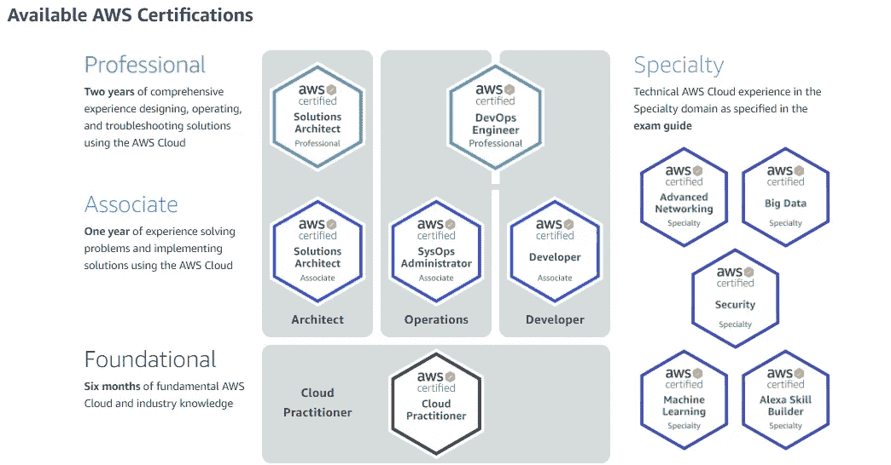

# 一个 AWS 认证值得吗？

> 原文：<https://towardsdatascience.com/is-an-aws-certification-worth-it-c6cbc25b4d06?source=collection_archive---------2----------------------->

泰勒·维克在 [Unsplash](https://unsplash.com/s/photos/server?utm_source=unsplash&utm_medium=referral&utm_content=creditCopyText) 上的照片

我获得 AWS 认证已经快四年了，从学校开始，这是应用数据科学项目的必修部分。从那以后，我在两年前重新认证，以保持认证，并保持我的知识新鲜。

# 什么是 AWS？

AWS 是亚马逊的一个分支，销售云计算解决方案。它是此类解决方案的最大供应商之一，仅次于微软 Azure 和谷歌云。

云计算的想法很简单:一家公司不再拥有自己的服务器，而是在另一家公司的数据中心租用服务器。由于该云服务供应商拥有大量的服务器，他们可以以较低的每台服务器成本实现这一点。

所有与云相关的东西目前都在 IT 界引起了轰动。许多大型迁移都集中在云上。它有真正的价值，但也改变了很多事情。

# 什么变化？

当服务器不再物理上位于您的旁边时，这将改变一些事情。不一定是非常根本性的 IT 变化:您仍然可以做同样的事情，底层硬件和软件通常是相同的或非常相似的，一旦一切就绪，一切都将恢复原样。

在 AWS 上，您不必再这样做了。照片由[乔丹·哈里森](https://unsplash.com/@aligns?utm_source=unsplash&utm_medium=referral&utm_content=creditCopyText)在 [Unsplash](https://unsplash.com/s/photos/network-cables?utm_source=unsplash&utm_medium=referral&utm_content=creditCopyText) 上拍摄

不，真正改变的是您在云中设置和管理所有这些虚拟硬件和软件层的方式。

由于设置 IT 的方式发生了变化，您也需要学习如何做到这一点。这就是 AWS 培训可以帮助你学习它的地方，AWS 认证可以帮助你证明你有这方面的知识。

# AWS 学习计划

可以拿到的认证有很多。

首先是云从业者，这是一个非常简单的入门级别认证。

然后在第二个层次，助理层次，你可以选择三种不同的路径:解决方案架构师(专注于根据最佳实践架构云系统)、SysOps 管理员和开发人员。

在专业层面，解决方案架构师需要后续培训，专业开发运维工程师的其他两个助理认证也需要后续培训。

专业认证略有不同，因为它们侧重于更具体的主题:这些认证没有级别。

截图来自:[https://aws.amazon.com/certification/](https://aws.amazon.com/certification/?nav=tc&loc=5)

AWS 还在他们的网站上提出了基于角色的路径，上面有你工作所需的一切:【https://aws.amazon.com/training/learning-paths/。

# 值得吗？

AWS 认证会直接给你找工作吗？不，绝对不是。拥有证书与拥有实践经验和实际知识之间仍有很大差距。

我老实说，入门认证挺没用的。也许它可以通过表明你对 AWS 感兴趣来帮助你，我认为这可以被许多公司看作是积极的，但这种水平并不能保证在 AWS 上有任何实际经验。

然后是关于助理认证。对我来说，这显示了一个不足以在 IT 和云上全职工作的水平，但我确实相信，显示你有足够高的水平在 AWS 上完成工作是有用的。此外，你还可以和专家交谈，质疑他们的观点。我相信认证在这里有附加值，因为通常很难证明中级技能水平:如果你在一些宠物项目等上使用 AWS，它可能很难被认真对待。

照片由[穆罕默德·里兹万](https://unsplash.com/@rizsam?utm_source=unsplash&utm_medium=referral&utm_content=creditCopyText)在 [Unsplash](https://unsplash.com/s/photos/degree?utm_source=unsplash&utm_medium=referral&utm_content=creditCopyText) 上拍摄

专业水平的认证表明你真正掌握了这个主题。我不认为如果你完全掌握了一种工具，认证是非常必要的:技术面试应该显示同样的结果。但由于不是每个招聘人员都能进行技术测试，我相信拥有证书在这里也有附加价值。

# 结论

总之，准备认证对于想要开始使用 AWS 的初学者来说非常有价值。这将迫使你学习基础知识，并有助于关注你所在领域最重要的话题。然而，除此之外，当进入需要 AWS 的工作时，在这个特定的 it 领域拥有实践经验是非常必要的。

我的建议是，在了解它们在云中的不同工作方式(或不同工作方式)之前，您需要了解它们在云之外的工作方式。为此，你需要在工作、学校或家里尝试一些东西。一旦你达到了这个水平，增加一个证书是完全值得的。