# 人工智能死了吗？

> 原文：<https://towardsdatascience.com/is-artificial-intelligence-dead-ceb3830033a1?source=collection_archive---------25----------------------->

## 先说 AI 状态的统计。

照片由 [Greg Ortega](https://unsplash.com/@antisocia1?utm_source=medium&utm_medium=referral) 在 [Unsplash](https://unsplash.com?utm_source=medium&utm_medium=referral) 上拍摄

在过去的几十年里，对人工智能的影响和趋势的兴趣激增，导致了许多问题和评论的出现。一个最流行的观点是，人工智能及其子领域已死，其他趋势性的先进技术将取而代之。AI 死了是真的吗？让我们开始吧！

# 经济。

## 乔布斯

> 人工智能在招聘市场上还有需求吗？哪些国家的人工智能工作正在增长？

不仅发达经济体的就业率一直在上升，许多新兴市场也是如此。下图显示了 2019 年各国人工智能雇佣指数。

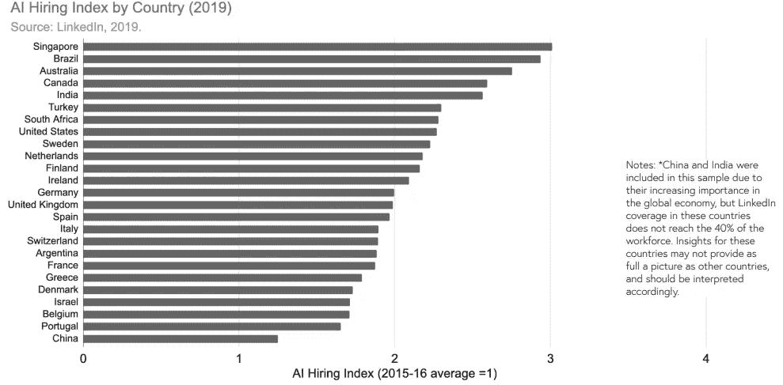

按国家分列的人工智能雇佣指数-2019 年

人工智能雇佣率是 LinkedIn 成员中拥有人工智能技能并在新工作开始的同一个月内将新雇主添加到其个人资料中的百分比，除以该国 LinkedIn 成员的总数。如果国家符合以下条件，则包括在内:

1.  充足的劳动力覆盖率(大约> 40%)；
2.  任何一个月至少 10 个 AI 人才。

符合这些条件的国家有:美国、荷兰、爱尔兰、丹麦、澳大利亚、英国、卢森堡、加拿大、新加坡、比利时、新西兰、挪威、瑞典、阿拉伯联合酋长国、法国、葡萄牙、瑞士、智利、西班牙、意大利、香港、芬兰、以色列、哥斯达黎加、巴西

下面的图表显示了美国哪些行业的人工智能工作份额正在增长。在各行业中，技术、服务部门和制造业对人工智能技能的需求增长最为显著。

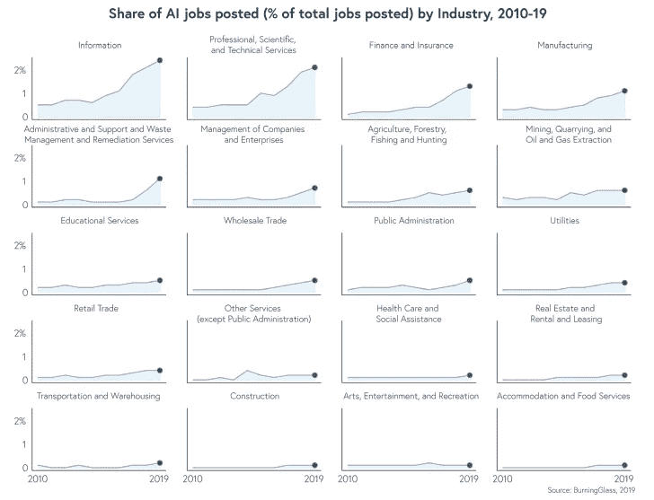

行业发布的人工智能职位份额-2019 年

## 投资

对人工智能初创公司的投资也在增长。2010 年至 2018 年间，资金以超过 48%的年均增长率增长。接受资助的人工智能公司数量也在增加，2018 年接受资助的人工智能公司超过 3000 家。

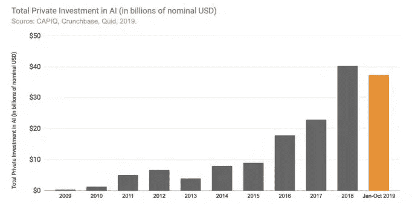

人工智能私人投资总额-2019 年

在美国，受资助的初创公司数量仍然很高，因为它一直是人工智能资助的领导者。但是，一些中国公司在 2018 年获得了高水平的投资，这使该国接近与美国持平。

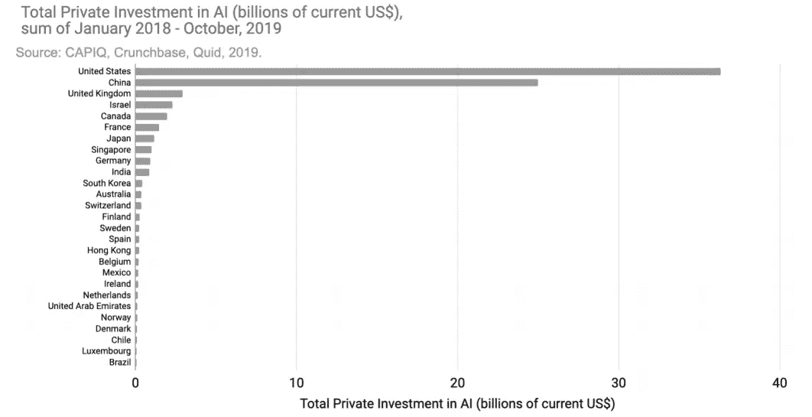

按国家分列的人工智能私人投资总额-2019 年

> 人工智能相关投资规模最大、增长最快的领域是哪些？

*   自动驾驶汽车(AVs)77 亿美元(占总数的 9.9%)，
*   药物、癌症和治疗(47 亿美元，超过 6.1%)，
*   面部识别(47 亿美元，6.0%)，
*   视频内容(36 亿美元，4.5%)，
*   欺诈检测和金融(31 亿美元，3.9%)。

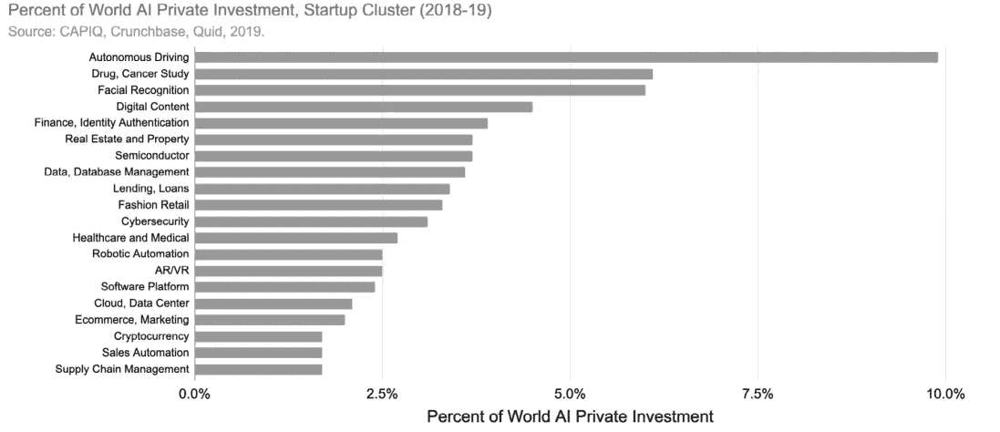

世界人工智能私人投资的百分比-资料来源:CAPIQ，Crunchbase，Quid，2019 年

> 全球哪些行业增长最快？

*   机器人过程自动化增长最快(2018 年超过 1B 美元)
*   供应链管理(2018 年超过 5 亿美元)，
*   工业自动化(2018 年超过 5 亿美元)。
*   其他部门也经历了全球私人投资的增长。

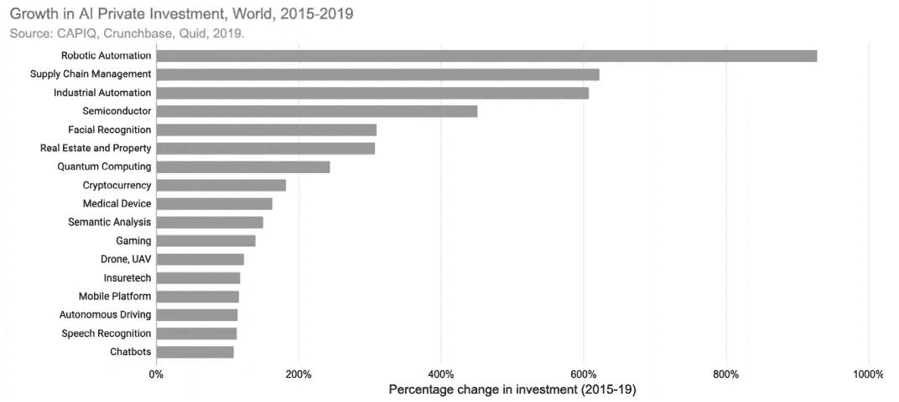

人工智能私人投资的增长-来源:CAPIQ，Crunchbase，Quid，2019 年

## 企业活动

越来越多的公司在全球范围内采用人工智能:

*   58%的公司正在至少一个职能或业务部门#使用人工智能，高于 2018 年的 47%。
*   人工智能整合在各地区的分布似乎比 2018 年更加均匀。
*   30%的人报告称，人工智能嵌入了他们业务的多个领域，而 2018 年有 21%的人这么说。

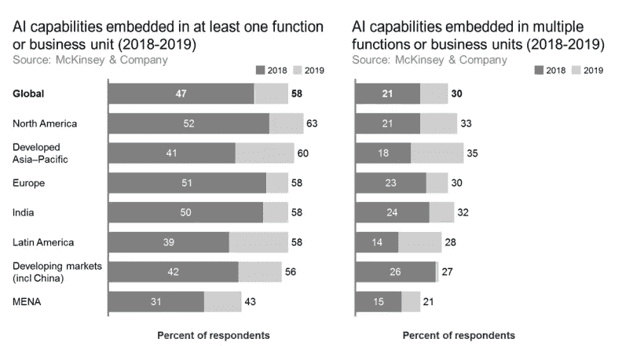

业务部门的人工智能能力-来源:麦肯锡公司 2019 年

组织最有可能将 AI 集成到为其行业提供核心价值的功能中。例如，金融服务业的受访者比其他人更有可能说他们的公司在风险职能部门采用了人工智能。

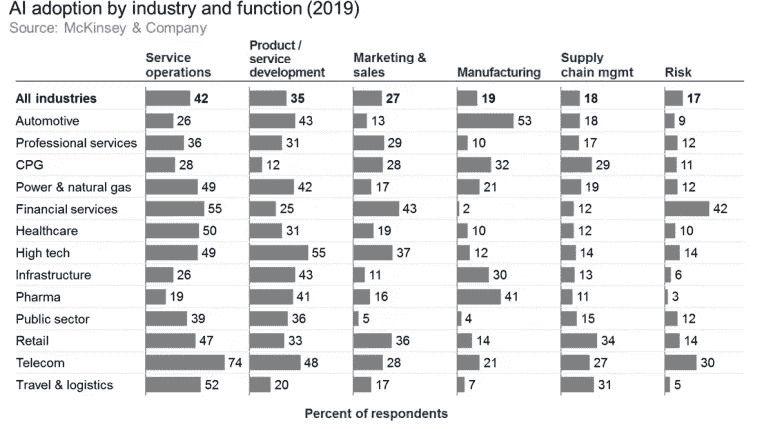

按行业和职能划分的人工智能采用情况-来源:麦肯锡公司 2019 年

组织采用的人工智能能力因行业而异。

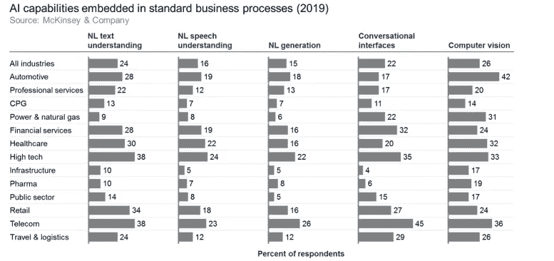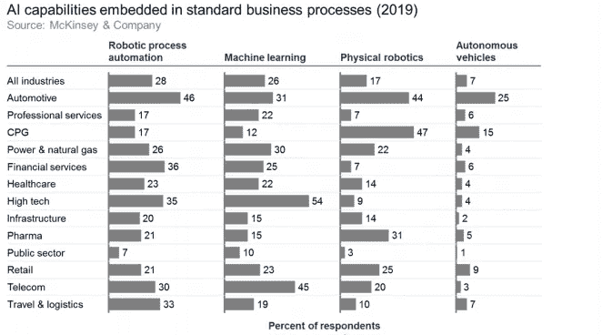

业务流程中的人工智能能力-来源:麦肯锡公司 2019 年

# 学术界。

## 在线学习

人工智能教育延伸到大学之外。在线学习在教育和发展全球劳动力的人工智能技能方面发挥着至关重要的作用。

## 大学入学人数

在美国大学，仅在斯坦福大学，人工智能导论的入学人数在 2012 年至 2018 年间就增长了五倍。

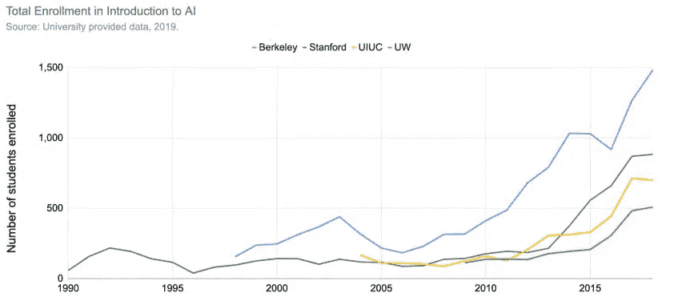

美国大学人工智能导论的总入学人数-2019 年

美国以外几所领先的计算机科学大学的人工智能和人工智能课程注册人数知道提供 2010-2019 学年数据的国际学校的相对增长。

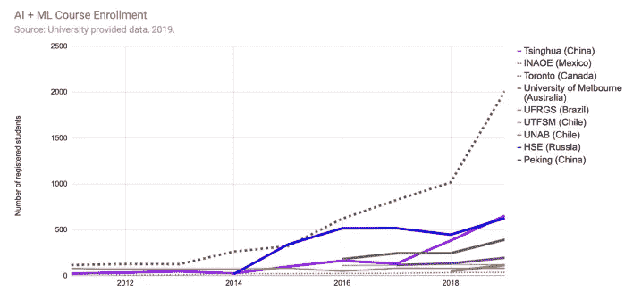

世界其他大学人工智能导论总录取人数-2019 年

# 公众的看法。

## 中央银行

世界各地的央行都对人工智能表现出浓厚的兴趣，特别是它预测地缘政治和宏观经济状况的能力，以及更好地理解监管和政策环境的能力。

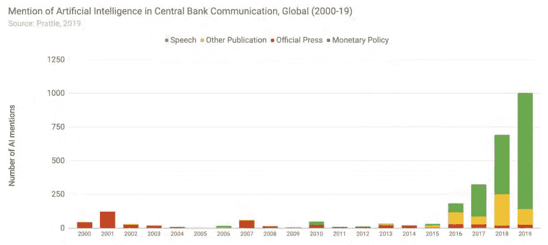

《央行通讯·全球 2019》提及人工智能

提及人工智能的中央银行通信显著增加，随着时间的推移，从其他出版物转向提及人工智能的演讲，显示出理解人工智能的巨大努力。

## 政府

政府越来越关注人工智能。在美国，数据显示，与前几年相比，2017-2018 年国会的活动增加了 10 倍以上。

美国国会人工智能提及-来源:彭博 2019

## 企业

提及 AI 的盈利电话*的份额有所增加，从 2010 年占总盈利电话的 0.01%增加到 2018 年的 0.42%。

> **收益电话会议**是上市公司管理层、分析师、投资者和媒体之间的电话会议，讨论公司在给定报告期(如一个季度或一个财年)的财务业绩

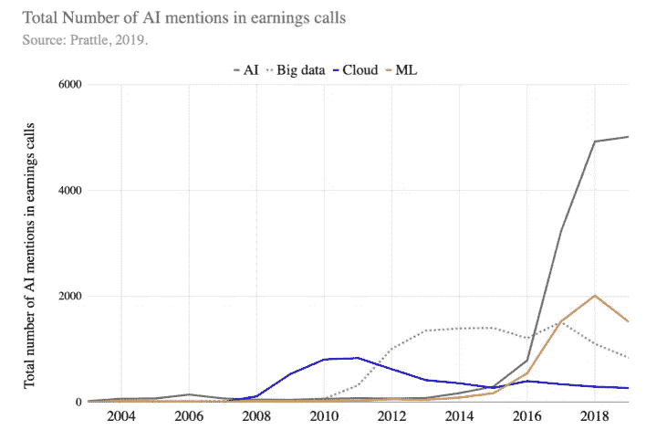

人工智能在赚取呼叫中的总次数-来源:Prattle，2019 年

## 网络搜索和全球新闻

查看在线新闻报道，下面的时间轴显示，“人工智能”是明显的赢家，其次是机器学习和深度学习。

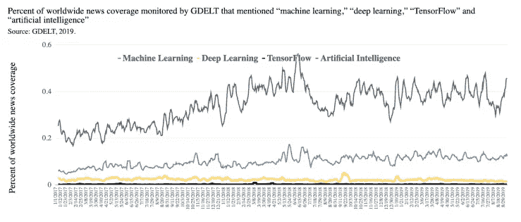

全球新闻报道的百分比-来源:GDELT，2019

# 2020 年及以后！

通过充当资本-劳动力混合体，人工智能提供了放大和超越当前资本和劳动力能力以推动经济增长的能力。研究揭示了前所未有的价值创造机会。

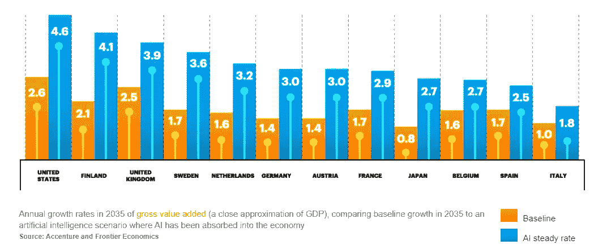

2035 年的年增长率—资料来源:埃森哲和前沿经济学

到 2035 年，人工智能(AI)在 12 个发达国家(目前占全球国内生产总值(GDP)的 50%)的经济影响将在未来几年继续增长，仅在瑞典就有超过 37%的增长。

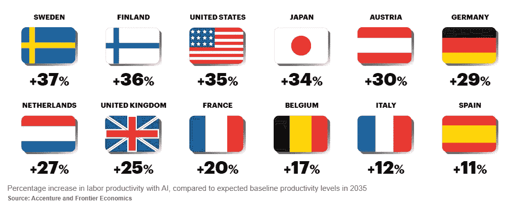

人工智能提高劳动生产率的百分比——资料来源:埃森哲和前沿经济学。

上面提到的统计数据表明，人工智能在过去十年中有了显著的发展，并将继续在几个领域中发挥最大的作用。人工智能通过自动化任务和改善价值创造过程，已经进入学术界、企业和公众认知的核心。

**参考资料:*提及的统计数据来自斯坦福大学 2019 年 HAI 年度报告和埃森哲研究。*