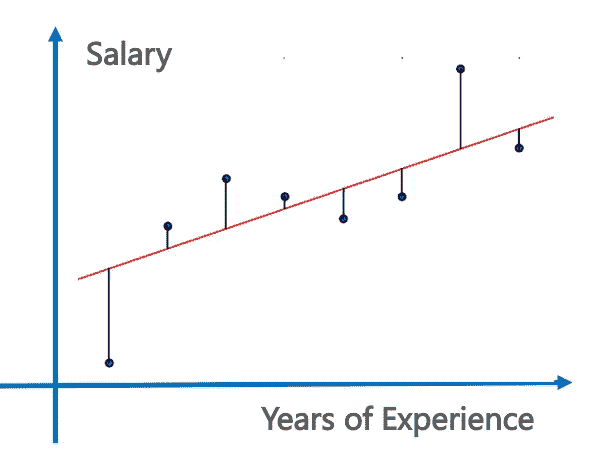
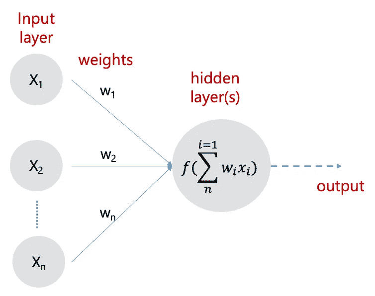

# AutoML 准备好投入使用了吗？

> 原文：<https://towardsdatascience.com/is-automl-ready-for-business-ffe4c2d8b5af?source=collection_archive---------45----------------------->

## [意见](https://towardsdatascience.com/tagged/opinion)

## 我们还需要数据科学家吗？

AutoML 工具在过去的几年里获得了越来越多的关注，这是由于技术进步和它们被“公民数据科学家”利用的潜力。公民数据科学(Citizen Data Science)是数据科学(DS)的一个有趣(通常有争议)的方面，旨在自动化机器学习(ML)/深度学习(DL)模型的设计，使其更容易被没有数据科学家专业技能的人使用。

> 在这篇文章中，我们将尝试理解 AutoML，它的承诺，今天什么是可能的？，AutoML 失败的地方(今天)？，它是只针对公民数据科学家，还是对熟练的数据科学家也有一定价值？


AutoML:基于来自 [Pexels](https://www.pexels.com/photo/woman-in-red-long-sleeve-writing-on-chalk-board-3769714/?utm_content=attributionCopyText&utm_medium=referral&utm_source=pexels) 的 [Andrea Piacquadio](https://www.pexels.com/@olly?utm_content=attributionCopyText&utm_medium=referral&utm_source=pexels) 的 pic

# AutoML 内部

让我们从机器学习(ML)的非常高级的入门开始。今天的大多数最大似然模型被监督并应用于预测/分类任务。给定一个数据集，数据科学家必须经历一个称为特征提取的艰苦过程，模型的准确性完全取决于数据科学家选择正确特征集的能力。为简单起见，可以将每个要素视为以 CSV 文件形式提供的数据集的一列。



图 1:预测问题的线性回归图解(图片由作者提供)

即使数据集只有一个特征，模型选择过程仍然起着至关重要的作用，因为需要根据数据集分布尝试不同的算法来找到最佳拟合。例如，让我们考虑一个由两列组成的数据集:“薪水”和“经验年数”。目标是根据经验水平预测工资。图 1 显示了问题场景的线性回归图。

然而，线性回归通常是低效的，其他回归技术，例如多项式、支持向量、回归树等。需要尝试找到最适合的。在这种情况下，最佳拟合对应于根据不同度量测量的最小预测误差(模型精度)，例如均方误差(MSE)；其一个例子是将数据点连接到图 1 中的(回归)线的线的长度的平方的平均值。

给定这个数据集和知识，数据科学家将通过编写程序来对数据集应用不同的回归模型。使用 ML 框架，例如 [scikit-learn](https://scikit-learn.org/stable/) ，这转化为编写/修改几行代码来实现模型，然后根据不同的误差度量来分析模型的准确性。

```
# *Training a Linear Regression model* from sklearn.linear_model import LinearRegression
regressor = LinearRegression()
regressor.fit(X_train, y_train)# *Training a Support Vector Regressor* from sklearn.svm import SVR
regressor = SVR(kernel = ‘rbf’)
regressor.fit(X, y)
```

我想现在您已经了解到目前为止在特征提取和模型选择方面的过程是可以自动化的。*这正是 AutoML 工具所做的。*

> 给定一个数据集，AutoML 工具将使用不同的特征集和数据分布应用已知的 ML 算法，在排行榜上显示按不同误差指标(预测/分类准确度)排序的结果。

# 深度自动化

现在让我们在深度学习(DL)环境中考虑 AutoML。DL 的优点是程序在没有监督的情况下自己选择特征集，即特征提取是自动的。这是通过在大型标记数据集上训练大规模神经网络(称为深度神经网络(DNNs ))来实现的。



图 2:人工神经网络(ANN)架构(图片由作者提供)

训练 DNN 发生在多次迭代(历元)中。每次前向运行都有一个反馈回路，其中在运行结束时识别的分类误差相对于地面实况(训练数据集)被反馈到先前的(隐藏的)层，以适应它们的参数权重——“反向传播”。图 2 中示出了一个样本 DNN 架构。

从实现的角度来说，如果我们要写一个神经网络(NN)来解决前面的‘员工工资’预测问题；数据科学家会使用 DL 框架编写类似下面的代码，例如 [TensorFlow](https://www.tensorflow.org/) 。

```
# Initializing the NN
ann = tf.keras.models.Sequential()
# input layer and first hidden layer
ann.add(tf.keras.layers.Dense(**units**=8, **activation**=’relu’))
# hidden layer
ann.add(tf.keras.layers.Dense(units=8, activation=’relu’))
# output
ann.add(tf.keras.layers.Dense(units=1, activation=’sigmoid’))
# compilation
ann.compile(**optimizer** = ‘adam’, loss = ‘binary_crossentropy’, metrics = [‘accuracy’])
# training 
ann.fit(X_train, y_train, **batch_size** = 64, **epochs** = 50)
```

然而，dnn 的开发和训练非常棘手。通常，DL 模型是由数据科学家团队精心设计的。这种手动设计 dnn 的过程很困难，因为所有可能模型的搜索空间可能组合起来很大，一个典型的 10 层网络可能有大约 1010 个候选网络！因此，设计网络的过程通常需要大量的时间和实验，即使是那些具有丰富 DL 专业知识的人也是如此。

在实践中，这转化为试错过程，尝试上述一些可配置超参数(粗体)的不同组合，例如隐藏层数、每层神经元数、激活函数、优化器、批量大小、训练时期数等。有一些已知的架构，例如人工神经网络—ann(预测)、卷积神经网络— CNNs(图像分类)、递归神经网络—RNNs/长短期记忆网络— LSTMs(时间序列预测)；已经证明对于特定类型的问题(在括号中)很有效。然而，除了这些知识和一些预先训练的神经网络的可用性(例如用于图像分类的 ImageNet 为新问题开发和训练 NN 的过程—****【NAS】***【1】*—在很大程度上仍然是一个未解决的问题。**

> **而且，这也是 AutoML 具有自动化神经架构搜索(NAS)潜力的地方，它通过高效的启发式和分布式计算以加速的方式覆盖搜索空间。**

**强化学习(RL)已被证明是 NAS 的一种有前途的方法[2]，其中控制器神经网络提出了一个“子”模型架构，然后对其进行训练并评估特定任务的质量。该反馈然后被用于通知控制器如何改进其下一轮的提议。这一过程重复了数千次——生成新的架构，测试它们，并向控制器提供反馈以供学习。最终，控制器网络学会将高概率分配给在保留的验证数据集上实现更好准确性的架构空间区域。**

# **AutoML 工具—最先进的**

**了解了一些 AutoML 内部知识，对 ML/DL 管道有了更好的理解；让我们来看看当前 AutoML 工具的成熟度。**

**公平地说，AutoML 正处于 DL 几年前所处的阶段——人们对它的期望很高。**

**Gartner 预计，“到 2020 年，超过 40%的数据科学任务将实现自动化”([链接](https://www.gartner.com/en/newsroom/press-releases/2017-01-16-gartner-says-more-than-40-percent-of-data-science-tasks-will-be-automated-by-2020))。**

**Forrester 分析师在其 2019 年 5 月的 Wave 报告[3]中表示，“几乎每个公司都将拥有独立的 AutoML 工具。我们预计，随着产品变得更好，以及人们对这些工具如何适应更广泛的数据科学、人工智能和人工智能前景的认识增加，这个市场将大幅增长”。在同一份报告中，他们将 [DataRobot](http://www.datarobot.com/) 、 [H2O.ai](http://www.h2o.ai/) 和 [dotData](http://dotdata.com/) 列为 AutoML 的三大领先提供商。**

**CB Insights [4]列出了目前超过 40 家汽车公司。在这里，重要的是要提到，虽然将一个工具标记为 AutoML 现在已经变得很“酷”，但是它们提供的 AutoML 功能(就 ML/DL 算法而言)并没有太大的区别。**

> **今天的 AutoML 工具的“自动化”部分在于它们提供端到端数据科学/机器学习平台的能力——允许你做从开发模型到在同一平台上大规模部署它们的一切事情。**

**当不同的团队在不同的平台上训练和部署 ML/DL 模型时，AI/ML 从业者将会意识到挑战。因此，今天的 AutoML 工具主要帮助解决许多已知 ML 算法的端到端训练部署问题。**

**此外，虽然成熟的 AutoML 工具，例如 DataRobot，可能相当昂贵；AutoML 最近变得非常容易访问，更普遍的云平台提供了集成的 AutoML 功能:[谷歌云的 AutoML](https://cloud.google.com/automl) 、[微软 Azure 的机器学习服务](https://docs.microsoft.com/en-us/azure/machine-learning/concept-automated-ml)和 [AWS Sagemaker AutoPilot](https://aws.amazon.com/sagemaker/autopilot/) 。公平地说，这些工具在现阶段非常有限，仅支持基于基本回归的预测和文本分类。例如，在这个阶段，它们都不支持深度学习(或 NAS)，这很可能是由于运行 NAS 的计算开销非常高。**

# **结论**

**最后，让我们回到最初的问题:“*AutoML 是否意味着数据科学家的终结，基本上是对专门数据科学技能的需求？***

**要回答这个问题，让我们从用户界面开始。对于 AutoML，我们指的是一种工具，它给定一个 excel/csv 作为输入数据，能够以合理的精度输出训练好的模型。*是的，目前的 AutoML 工具可以做到。***

**当模型需要改进时，挑战就出现了。记住，DS/ML 是一个迭代的过程。问题是，您很少会遇到在您提供的第一个数据集上获得非常高的准确性的情况。如果你做了就有问题，或者你的问题太琐碎-:) *所以 AutoML 的问题在它需要改进一个模型的时候就开始了。***

**让“可解释的人工智能”变得如此困难的推理同样适用于此。AutoML 工具对于为什么一个模型会有这样的行为的理解非常有限。它可以探索输入数据的分布，以指出可以改进的某些数据特征。然而，它将永远不能推荐添加新的数据，例如天气、位置等。会提高模型精度。这是因为它缺乏业务/领域知识。同时，目前缺乏技术知识来发现一种全新的神经网络结构。例如，虽然它可以为人工神经网络推荐正确的隐藏层数，但它的 NAS 将无法推荐添加“记忆”将解决 RNNs 的消失梯度问题，从而导致 LSTMs 的发现。**

> **今天的 AutoML 工具还不适合您的战略用例。然而，它们可以在企业数据科学模型开发的原型/MVP 和探索阶段提供重要的价值。**

**总的来说，今天的 AutoML 工具远不能取代你熟练的数据科学家——你仍然需要它们。然而，它们可以作为数据科学家的补充或独立的 DS/ML 平台，通过自动化构成任何新 DS 用例一部分的许多探索阶段，大大加快他们的工作。**

# **参考**

**[1]神经架构搜索文献综述，([链接](https://www.automl.org/automl/literature-on-neural-architecture-search/))**

**[2] Google AI:利用机器学习探索神经网络架构，([链接](https://ai.googleblog.com/2017/05/using-machine-learning-to-explore.html))**

**[3] Forrester New Wave:专注于自动化的机器学习解决方案，Q2 2019，([链接](https://www.forrester.com/report/The+Forrester+New+Wave+AutomationFocused+Machine+Learning+Solutions+Q2+2019/-/E-RES143845#))**

**[4]CB Insights:2020 年值得关注的人工智能趋势，([链接](https://www.cbinsights.com/research/report/ai-trends-2020/))**

**[5]比斯瓦斯。伦理人工智能:其对企业人工智能用例及治理的影响，走向数据科学，2020 年([链接](/ethical-ai-its-implications-for-enterprise-ai-use-cases-and-governance-81602078f5db))。**