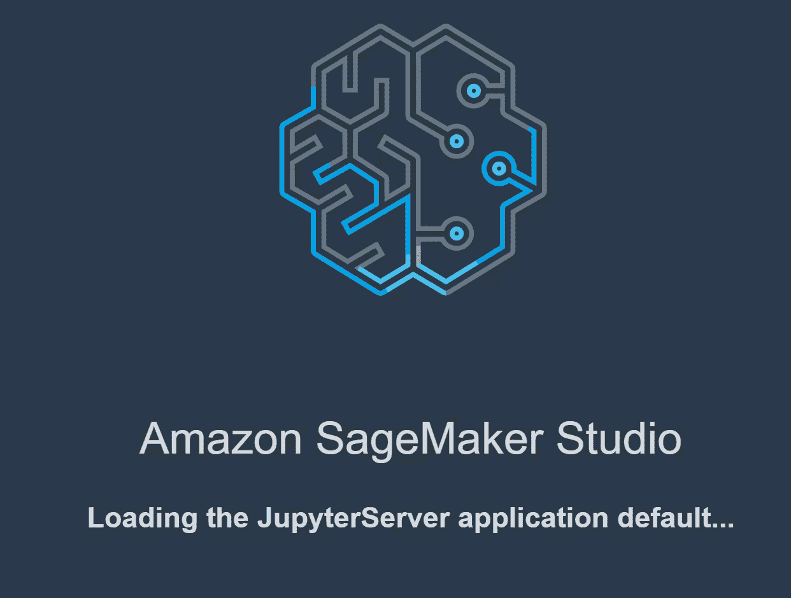

# AWS SageMaker Studio 自动驾驶仪准备好迎接黄金时段了吗？

> 原文：<https://towardsdatascience.com/is-aws-sagemaker-studio-autopilot-ready-for-prime-time-dcbca718bae7?source=collection_archive---------28----------------------->

## 带有一些评论的自动驾驶界面演示

丹尼尔·利维斯·佩鲁西在 [Unsplash](https://unsplash.com/s/photos/automation?utm_source=unsplash&utm_medium=referral&utm_content=creditCopyText) 上的照片

在过去的几年里，我一直在关注企业自动化领域的最新产品。在这段时间里，我看到了十几个应用程序的现场和远程演示。随着竞争对手频繁添加功能和改进界面，这一领域的发展使得保持更新成为一项挑战。最近 AWS SageMaker Studio 自动驾驶仪变得可用，所以我有一组商业案例想通过它运行。对于本文，我通过自动驾驶功能运行表格 Kaggle 数据集，并分享用户体验。

## 一、为什么要用 autoML？

使用 autoML 有各种各样的原因，包括让更广泛的受众可以访问机器学习，便利性，易用性和生产力。我研究的重点是数据科学家建立可重复业务流程的易用性，数据分析师、数据工程师或机器学习工程师可以接管该流程。易用性和丰富的用户界面功能是必须的。

## 为什么选择 AWS 自动驾驶？

AWS 是个畜生。他们以惊人的速度发布产品和更新。如果你已经在 AWS 生态系统中，尝试一下是有意义的。

AWS 还有一个吸引人的地方是，你可以在使用的基础上使用 SageMaker 和 Autopilot。不需要昂贵的许可证。不过，如果你能关注一下你的账单就更好了。正如我在我的[量子计算文章](/quantum-computing-for-23-cents-917e1f664cea)中提到的，这种设置允许个人访问和使用这些高级工具。有一些其他产品有不同的成本结构，使这不可能。

## 设置

以下所有信息都假设您已经设置了 AWS 帐户，包括账单。如果你是第一次设置你的账户，有一些[自由层选项](https://aws.amazon.com/free/?trk=ps_a134p000003yBfsAAE&trkCampaign=acq_paid_search_brand&sc_channel=ps&sc_campaign=acquisition_US&sc_publisher=google&sc_category=core&sc_country=US&sc_geo=NAMER&sc_outcome=acq&sc_detail=%2Baws%20%2Baccount&sc_content=Account_bmm&sc_segment=438195700988&sc_medium=ACQ-P|PS-GO|Brand|Desktop|SU|AWS|Core|US|EN|Text&s_kwcid=AL!4422!3!438195700988!b!!g!!%2Baws%20%2Baccount&ef_id=Cj0KCQjwp4j6BRCRARIsAGq4yMGFkcgdPrRLQB9KY30Sr6dUaK5v13V_29tTNcgbn7n3K7oOZhRDtmIaAqbTEALw_wcB:G:s&s_kwcid=AL!4422!3!438195700988!b!!g!!%2Baws%20%2Baccount&all-free-tier.sort-by=item.additionalFields.SortRank&all-free-tier.sort-order=asc)，尽管那只适用于前两个月的 [Sagemaker](https://aws.amazon.com/sagemaker/pricing/) 。

一旦你有了一个账户，如果你想做实验，你需要命名一个 S3 桶和文件夹。您将把您的数据文件加载到 S3 位置。

## 数据

只是为了使用一个对每个人都可用的公共数据集，我从 [Kaggle](https://www.kaggle.com/) 竞赛中抓取了几个数据集。还有一些可能的度量值的范围，您可以用它们来比较您的结果。* * *注意，阅读 Kaggle 竞赛规则详情。有些允许使用 autoML，有些不允许！您可以使用数据集，但不一定要将结果作为条目提交。

我从这两个 Kaggle 比赛中提取了训练数据集，并将它们加载到我的 S3 桶中的不同文件夹中。

[矛盾，我亲爱的华生。使用 TPUs 检测多语言文本中的矛盾和蕴涵](https://www.kaggle.com/c/contradictory-my-dear-watson/data)。在这个入门竞赛中，我们将句子对(由一个前提和一个假设组成)分为三类——T0、T1 或 T2。

6 列 x 13k+行—斯坦福 NLP [文档](https://nlp.stanford.edu/projects/snli/) n

*   `id`
*   `premise`
*   `hypothesis`
*   `lang_abv`
*   `language`
*   `label`

[真实与否？灾难推文的 NLP。预测哪些推文是关于真实灾难的，哪些不是](https://www.kaggle.com/c/nlp-getting-started/data)。

5 列 x 7503 条独特推文

*   `id` -每条推文的唯一标识符
*   `text` -推文的文本
*   `location` -发送推文的位置(可能为空)
*   `keyword` -推文中的特定关键词(可能为空)
*   `target` -仅在 train.csv 中，这表示一条推文是否是关于一场真正的灾难(`1`)或者不是(`0`)

## 开始自动驾驶训练和型号选择

自动驾驶仪在 AWS SageMaker 服务上。他们最近推出了一个名为 Studio 的界面。正是在这里，您可以启动自动驾驶实验。

从 AWS 控制台，导航到 SageMaker 服务。在那里你会找到工作室控制台的链接

作者截图

在那里你可以添加一个用户(你自己)和 Open Studio。

作者截图

这个链接将带你到 JupyterLab 的 SageMaker 工作室。您将看到一个自动构建模型的选项。那是我们想去的地方。

作者截图和 gif

您输入关于输入文件和初始设置的信息。然后你创造一个实验。在这个过程中达到这一步是非常简单的。界面很直观。

作者截屏

## 用户体验直线下降

好的——那还不错。我们在路上了…..

….这是 UX 团队在发布前冲刺的最后时刻。没有状态栏让您知道处理进行到什么程度。没有迹象表明幕后到底发生了什么。你坐着等待，希望有什么事情发生。

在分析数据步骤之后，您可以访问几个笔记本。

我打开数据探索笔记本，准备好一些像样的信息和可视化。那本笔记本里没有任何东西能提供简单的数据分析无法告诉我的真正见解。你可以在下面检讨自己。

极简数据探索——作者截图

最终，实验进行了，你开始在列表上看到试验。我注意到随着试验的完成和新试验的运行，度量标准也在改进。

作者截图

在测试运行期间，你可以仔细阅读“亚马逊 SageMaker 自动驾驶候选人定义笔记本”本笔记本包含模型调整过程的详细信息。你需要查阅这个笔记本来理解试验和输出。

作者截图

通过回顾这个笔记本，我可以看到模型似乎是 XGBoost 和线性学习者。它指定了您将使用的准确性/成功性指标。“这个笔记本将构建一个 [**二进制分类**](https://en.wikipedia.org/wiki/Binary_classification) 模型，该模型由**最大化**已训练模型的“ **F1** ”质量度量。“ **F1** ”度量适用于具有正类和负类的二元分类。它介于精确度和召回率之间，建议在负面例子比正面例子多的情况下使用。”

## 结果呢

可以在分配给您的 S3 存储桶中找到输出文件。但是所有的文件都是按试验 id 分类的。你必须知道你在寻找什么。

当试验结束时(或者如果您设置了 250 个作业限制，那么您会达到这个限制)，其中一个模型有一个小的星形指示器，表明它是试验中最准确的。

老实说，在这一点上，这个界面一点都不直观。我确实看到了一个部署模型按钮——假设通过 SageMaker 部署一个 API。

## 结论

缺少一个直观的 UI 来方便地访问模型选择和准确性度量，这使得这个工具超出了我的业务用例的范围。自动驾驶仪控制太多了。你可以自己微调，但是寻找你想要的东西的战斗似乎不值得。

我很可能会等待大约一年，并监控 AWS 为 AutoPilot 添加的功能。其他工具如 DataRobot 和 H2O.ai DriverlessAI 在可用性和可视化领域遥遥领先。

## 先睹为快

我过去评估过 H2O.ai 无人驾驶 ai，并将做一个新的测试来检查他们的最新功能。我也想看看 GoogleML。我对 DataRobot 有丰富的经验，所以不需要单独评估。

以下是其他用户界面的一些截图:

H2O.ai 作者截图

DataRobot 作者截图