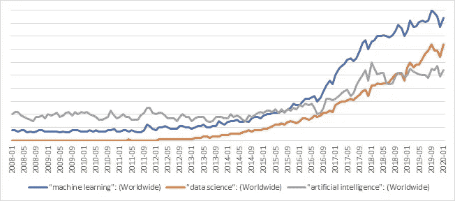
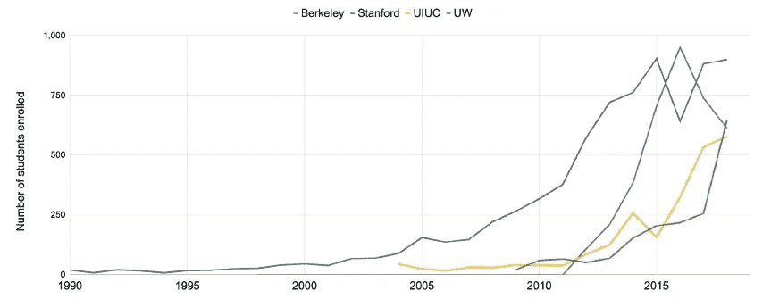
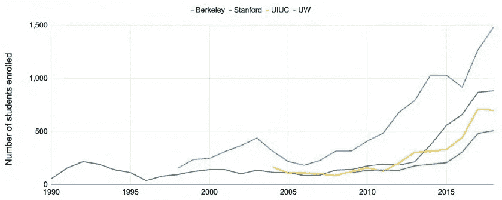
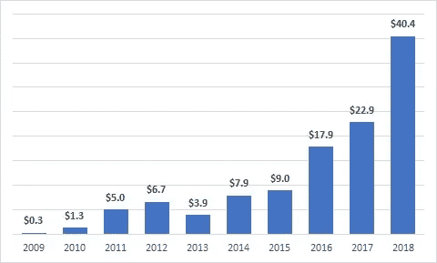

# 数据科学家真的是最性感的工作吗？太好了。

> 原文：<https://towardsdatascience.com/is-being-a-data-scientist-really-the-sexiest-job-around-hell-yeah-b652a20b302?source=collection_archive---------57----------------------->

## [数据科学领域的职业&人工智能](http://towardsdatascience.com/tagged/data-science-ai-careers)

## 为什么你应该认真考虑从事数据科学的职业

转子密码机(图片由 [skeeze](https://pixabay.com/users/skeeze-272447/?utm_source=link-attribution&utm_medium=referral&utm_campaign=image&utm_content=1147801) 来自 [Pixabay](https://pixabay.com/?utm_source=link-attribution&utm_medium=referral&utm_campaign=image&utm_content=1147801)

第二次世界大战爆发时，艾伦·图灵 27 岁，他开始为英国密码破译组织工作，帮助他们破译德国密码。

通俗地说，密码是一种通过将信息转换成代码来有条不紊地伪装信息的系统。换句话说，密码是一种实现信息加密的算法。第二次世界大战期间，密码系统被广泛用于保护战时机密。图灵和他的团队专注于密码分析来解码这些信息。在其核心，这种解码涉及建立反算法解构德国密码系统的工作，最著名的是纳粹德国的恩尼格玛密码机。图灵和他的团队在这方面取得了一些进展。

> 据估计，图灵的工作将战争缩短了两年多，拯救了 1400 多万人的生命。说说有影响！

有趣的是，在许多方面，图灵的工作，无论是密码分析还是他随后对早期计算系统的研究，都涉及到智能机器的一些初步发展。因此，这确实代表了人工智能本身影响的开端。

如果我们快进到几十年后的未来，有充分证据表明，人工智能的影响只会进一步增加——远远超出了战时的密码破译，进入了我们的日常生活。让我们举几个例子。

# **数据科学改变 LinkedIn 的增长轨迹**

2006 年，LinkedIn 还是一家雄心勃勃的小公司。就在那时，一位年轻的分析师在斯坦福大学获得物理学博士学位后不久，加入了 LinkedIn，成为他们的第一批数据科学家之一。他的名字是乔纳森·戈德曼。他一点也不知道他将会产生多么深远的影响，不仅是对 LinkedIn 的未来，也是对明确确立数据科学对全球公司的重要性的影响。

当时，LinkedIn 已经开始收集大量关于用户的数据，在这些数据中，高盛想到了一个有趣的想法。他意识到，虽然用户加入了网络，也邀请了他们的朋友/同事加入，但仍然存在差距。他们无法与已经在平台上的熟人联系。

他深入研究了关于用户的数据——谁在哪里工作，何时何地学习，与谁有联系，在哪里等等。他根据这些参数，围绕认识一个人的概率形成了假设，并对它们进行了测试。他寻找模式——例如，如果我和 X 一起工作，X 知道 Y，我知道 Y 的可能性有多大？最终，这是高盛打造“你可能认识的人”产品的基础，该产品现在是 LinkedIn 体验中无处不在的一部分。该功能一经发布，LinkedIn 的增长数字就迅速飙升。其余的，正如他们所说，都是历史了。

# 网飞开创了数据分析的新时代

网飞一直是一家深深植根于数据的公司。你们中的一些人可能记得，网飞最初是一家在线 DVD 租赁公司(在 2000 年代中期转向在线视频流媒体之前)。决定网飞早期成功的一个关键因素是，它能够将客户最有可能租赁的电影放在客户面前，而不是必须搜索整个目录才能找到感兴趣的内容。本质上，这是世界上第一个大规模推荐系统。

但是网飞做了一些改变游戏的事情。对于网飞，对于整个世界。

2006 年 10 月，网飞发起了一场比赛，开始时很谦虚，但很快就像滚雪球一样成为有史以来最大的机器学习比赛。

规则很简单。网飞向成功击败网飞内部电影推荐公司(名为 Cinematch)超过 10%的团队提供了 100 万美元的大奖(或者，技术上正确的说法是，要求将错误率降低 10%以上——RSME)。参与者被给予了大约 1 亿个评级的稀疏分布的训练数据集来构建他们的模型。

> 比赛持续了 3 年，共有来自 186 个国家的 40，000 多支队伍参赛。

网飞竞赛在应用于优化基于机器的推荐的分析领域带来了深刻的见解和相应的性能改进。它不仅彻底改变了推荐系统，其应用远远超出了电影，它迫使从业者在机器学习应用方面真正突破极限。今天，你很难找到一家企业对消费者的公司不以某种方式或形式利用推荐系统，包括配对！*(更多阅读我关于这个话题的文章:* [*《人工智能能否帮你找到爱情:了解婚介的生意》*](/can-artificial-intelligence-help-you-find-love-understanding-the-business-of-matchmaking-2b51a8cc8f76) *)*

现在我们已经确定了数据科学和人工智能对人类和商业的不可否认的影响，让我们看看这种影响是短暂的还是持续增长的。**简单的回答是——是的，一千次是的——持续的指数增长！但是不要相信我的话。让我们来看看几个硬数据点。**

# **公众的兴趣水平**

人们不得不做大量的原始研究或调查来了解公众的脉搏的日子已经一去不复返了。谷歌趋势现在只需点击几下鼠标就能提供这些见解。

具有讽刺意味的是，在这种情况下，数据帮助我们确立了数据日益增长的重要性！

图一。提供了从 2008 年到 2020 年谷歌上三个关键搜索词在全球范围内稳步显著增长的趋势——“机器学习”、“数据科学”和“人工智能”。

图 1:选择关键词的谷歌趋势数据*(2008 年 1 月-2020 年 1 月)*

# **专攻 AI 和机器学习的学生**

某一特定学科越来越受欢迎的主要指标之一是渴望在该学科接受教育的学生人数。2019 年的人工智能指数报告描绘了几所顶尖大学的这些趋势。图 2a 和 2b 分别提供了*【机器学习导论】*和*【人工智能导论】*课程报名人数的增长趋势。请注意，大学入学人数也受到座位数量的限制，所以这些图表虽然在最近几年飞速增长，但很可能不足以代表对这些学科的实际兴趣！

图 2a:机器学习导论*总报名人数(来源:2019 人工智能指数报告)*

图 2b:“人工智能导论”总注册人数*(数据来源:2019 人工智能指数报告)*

另一个有趣的学生统计数据是博士生人数的增长。根据 2019 年人工智能指数报告，人工智能已迅速成为美国计算机科学博士生最想要的专业。

> 与第二大热门专业(安全/信息保障)相比，人工智能专业的博士生人数是前者的两倍多！

# **投资开发人工智能能力**

我们生活在一个绝对资本主义的世界里。因此，资金流动的方向几乎总是衡量周围最热门事物的最佳指标之一。因此，我们关注人工智能初创公司吸引的总资金。

从 2009 年在人工智能领域投资 3 亿多美元开始，在不到十年的时间里，情况发生了迅速变化。2018 年，全球共有 404 亿美元投资于人工智能创业公司。**这是一个令人难以置信的增长，累计年增长率(CAGR)超过 70%！**

PE-VC 对 AI 的总投资(以十亿美元计)(来源:CAPIQ，Quid，Crunchbase，2019)

总结一下——人工智能、数据科学和机器学习已经真正到来。纵观近代历史，这门新兴学科对人们的生活方式和公司的经营方式产生了巨大的影响。这种趋势不仅会持续下去，而且毫无疑问将见证增长率的进一步爆发，从最优秀的人才和大量资金被吸引到这些领域就可以明显看出这一点。

## 如果有什么时候是进入一个新的职业领域的最佳时机，那就是现在！