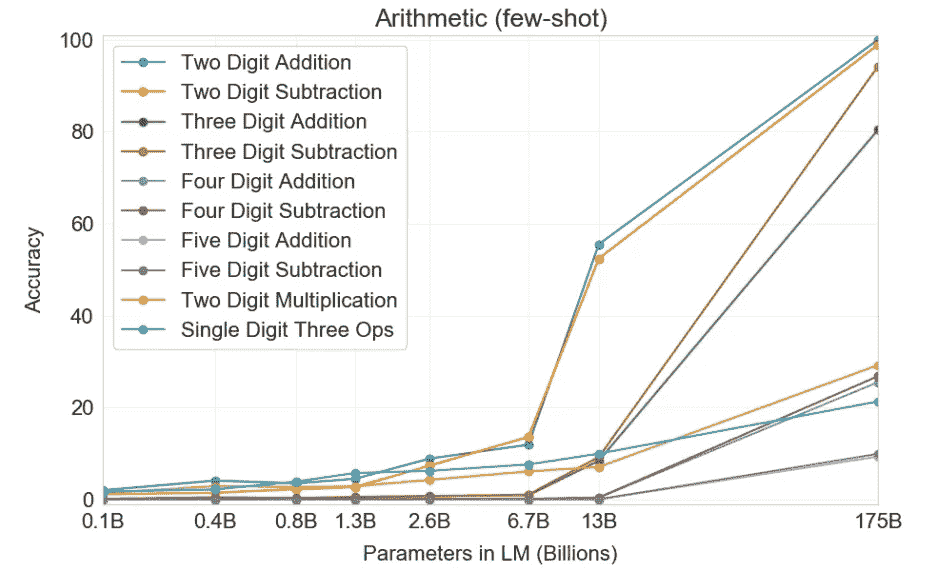
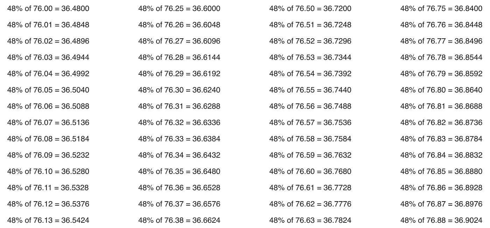

# 越大也越聪明吗？—开放人工智能发布 GPT 3 语言模型

> 原文：<https://towardsdatascience.com/is-bigger-also-smarter-open-ai-releases-gpt-3-language-model-adbb8b3b8126?source=collection_archive---------50----------------------->

## 对更大的语言模型的竞争正在进入下一轮。

图片:www.pexels.com

NLP 应用的进步是由使用 [Transformer 架构](https://medium.com/inside-machine-learning/what-is-a-transformer-d07dd1fbec04)的神经网络组成的更大的语言模型推动的。值此最近公布当前最大模型——开放人工智能的 GPT-3 的结果之际，我想仔细看看这些进展。

## 模型不仅仅是带有智能插值方法的巨大“查找表”吗？

2020 年 5 月 28 日，OpenAI 研究人员的一篇论文(【https://arxiv.org/abs/2005.14165】)发表在 ArXiv 上，内容是关于 GPT-3 的，这是一种语言模型，能够在许多基准语言处理任务中取得良好的结果，从语言翻译和新闻文章写作到问题回答。它的特别之处在于，这些结果是在没有对所考虑的基准进行微调的情况下**获得的，但是是由语言模型在没有任何进一步信息([零触发](/applications-of-zero-shot-learning-f65bb232963f))或几乎没有附加信息(“一次触发”或“几次触发”)的情况下获得的。**

GPT 3 号有不少于 1750 亿个参数。相比之下，最大版本的 GPT 2 有 15 亿个参数，世界上最大的基于转换器的语言模型——由微软在本月早些时候推出——有 170 亿个参数。

当 Open AI 在一年前发布上一代 GPT-2 时，媒体反响很大，这也是因为宣布不发布最大的型号，因为它可能会产生假新闻等有害的事情。与此同时，用这种模型从给定的上下文中生成新闻不再是什么特别的事情了。然而，正如实验所显示的，生成的文章不仅仅是从训练数据的文章部分拼凑起来的，而是真正新的。

乍一看，这些稿件往往与真实新闻难以区分。在当前的 GPT-3 论文中，一个结果是人们很难将生成的新闻文章与真实的新闻区分开来。在一个实验中，只有 52%的人被正确识别，这接近于切割所能达到的 50%。这也可能是因为一些真实的新闻项目是如此荒谬，以至于分界线不再能够被清晰地划分。

正如我自己对奥地利故事的实验所显示的，

 [## 一个 AI 系统怎么看待奥地利？

### 关于 GTP2 语言模型的一些实验

towardsdatascience.com](/what-does-an-ai-system-think-about-austria-573c2f17ca01) 

这些文章在很大程度上是语法正确的，读起来令人愉快，事实听起来很符合逻辑，但当一个人熟悉事实时，往往会被认为是不正确的。

似乎这个模型通过给定的上下文从一种“记忆”中过滤匹配的文章，然后将它们“插入”到一个新的故事中。记忆由大量参数形成，这些参数在用文本数据训练时被优化。GPT-3 在 2016 年至 2019 年期间收集的近 1 万亿个单词的 [CommonCrawl 数据集](https://commoncrawl.org/)上进行训练，以及与网络文本、书籍和维基百科相关的数据集。

这让我想起了深度学习只是美化了“曲线拟合”的说法，我在之前的一篇文章中讨论过:

 [## 看机器学习模型拟合曲线！

### 图灵奖获得者朱迪亚·珀尔的声明表达了当前流行的机器背后的简单机制…

towardsdatascience.com](/watching-machine-learning-models-fitting-a-curve-c594fec4bbdb) 

但这并不是真正的“理解”文本，甚至不是从文本中得出结论。正如这篇新论文中的结果所显示的，GPT-3 模型日子不好过，尤其是在需要真实结论的测试中。

文中一个有趣的实验也是尝试计算作为文本给出的例子，例如:

“48 加 76 是多少？”

由模型计算。这里显示，最大的模型(1750 亿个参数)允许两个或三个数字的简单加法和减法，但还不允许更长的计算。而这又没有为这个任务进行特别的微调！

图表来自论文【https://arxiv.org/abs/2005.14165 

好像“查找表”的大小对于较短的计算来说足够大，但是对于较长的计算来说不够大。这些“表格”的数据来自哪里？

在用于培训 GPT-3 的互联网文本中，有足够的这方面的材料。在互联网上搜索这些计算结果会提供如下表格:

截图来自 https://www.dollartimes.com/calculate/percentage/

我的问题是，模型和数据的进一步扩大是否会导致 NLP 应用程序的进一步实质性改进，或者是否是时候引入新的想法和方法了？