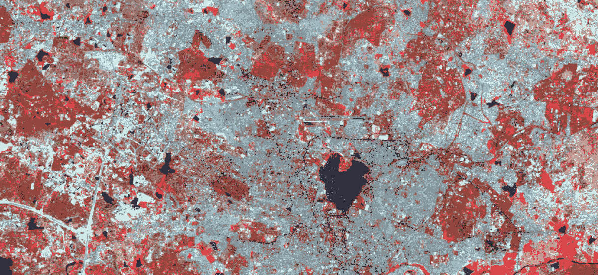
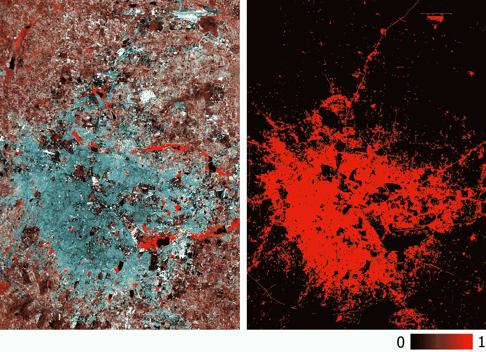
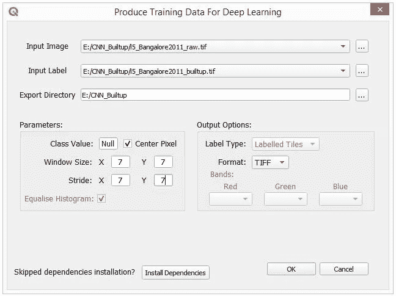
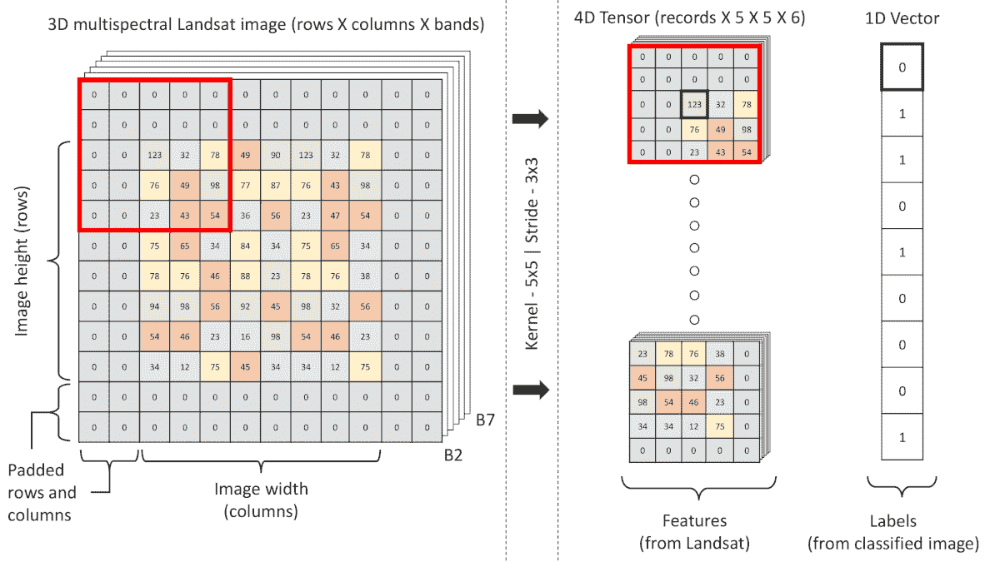
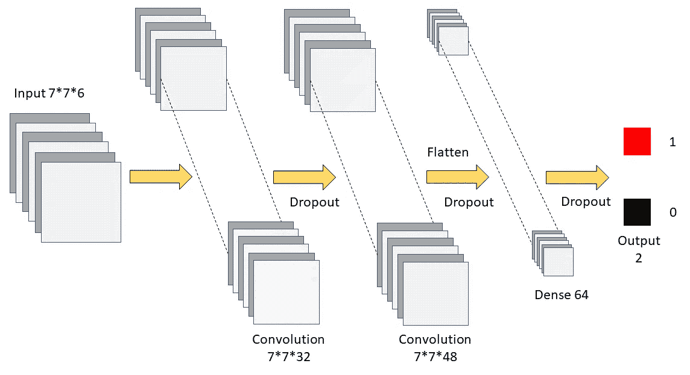
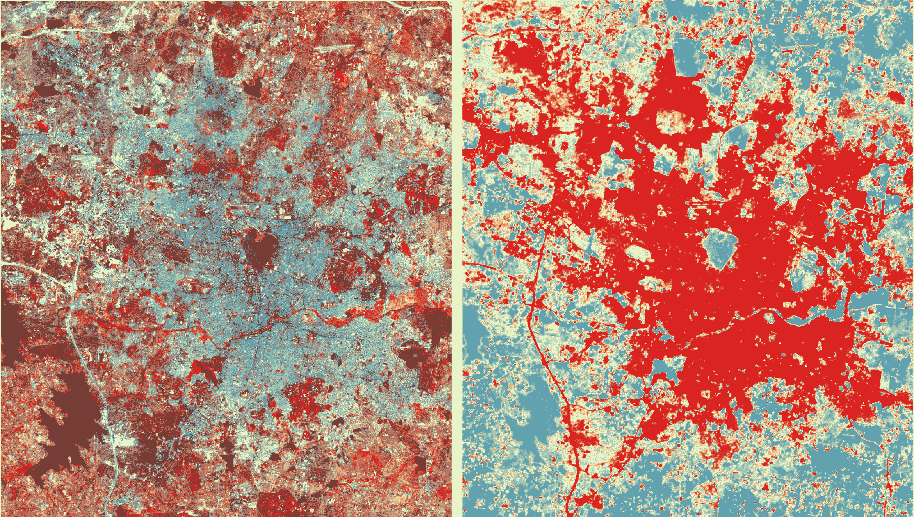
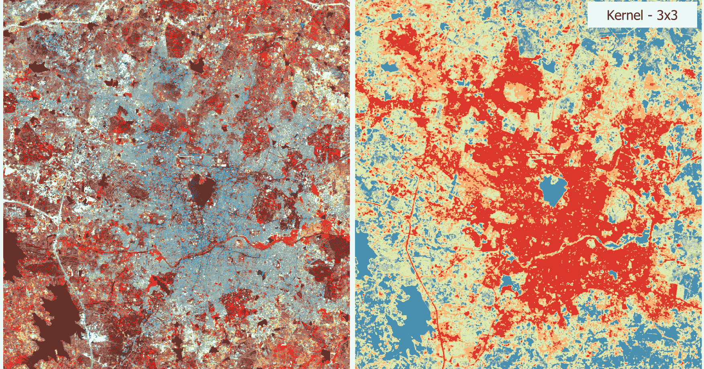

# CNN 在中分辨率卫星数据上也同样闪亮吗？

> 原文：<https://towardsdatascience.com/is-cnn-equally-shiny-on-mid-resolution-satellite-data-9e24e68f0c08?source=collection_archive---------12----------------------->

## Python 中的 Landsat 分类教程



卷积神经网络(CNN)的变体继续被誉为图像相关问题的强大机器学习(ML)算法。CNN 在多个领域获得了前所未有的准确性——基于对象的卫星图像分类就是近年来激增的此类应用之一。虽然基于对象的分类所需的高分辨率卫星图像不是免费提供的，但研究人员经常依赖免费提供的中分辨率数据(例如 Landsat——每个像素代表一个 30 米* 30 米的地块)。CNN 的机制阐明了它考虑相邻像素并依赖于它的模式和纹理，而不仅仅是一次一个像素。

在中分辨率卫星数据(如 Landsat)的土地覆盖分类中，目标是根据不同波段的数字编号(DN)值对每个像素进行分类。当从 CNN 模型的角度来看时，一个明显的问题是，“在确定像素的类别时，*位于几个像素之外的近邻或相邻像素的 DN 值会起任何作用吗？”大多数人可能会回答“不”。这是否意味着 CNN 尽管是解决形象难题的有力工具，但在这样的形象上会失败？仅凭假设就下结论太快了。在本帖中，我们将调查 CNN 模型在中分辨率数据上的可用性，在这种情况下，目标识别既不可能也不是目标。*

这篇文章被强烈推荐，非常适合地理空间领域的人们，他们想开始他们的 *CNN 遥感*之旅。

> 知识不是目的地，而是旅程。所以不要只是为了搜索脚本而向下滚动。*👀*

**使用的数据** 这里使用的是 2011 年班加罗尔 Landsat 5 多光谱数据的波段 2 至 6 及其相应的二进制构建层。陆地卫星 8 号或 2A 哨兵将是我们许多人的显而易见的选择，因为它们是最近的，并将在未来继续下去。但是不选择它们的原因是更高的辐射度和光谱分辨率；这将产生比大地卫星 5 号更好的结果。如果我们设法在 Landsat 5 数据(8 位像素深度)上获得好的结果，我们可以在稍加修改的情况下将其扩大到 Landsat 8 或 Sentinel-2A(两者都有 16 位数据)；但反过来可能不会很好。要了解更多关于如何为模型创建训练数据，您可以查看[这个视频](https://youtu.be/X7Hg9kVkbtI)。

对于那些在开始之前想要快速 ML 胶囊(受监督的)的人来说，它是在一个实体的几个特征(特征或 x)与其其他属性(值或标签或 Y)之间建立关系——我们为模型提供了大量的示例(带标签的数据)，以便它从中学习，然后预测新数据(未标记的数据)的标签。在这里，按照惯例，多光谱数据将被称为要素，而分类构建数据将被称为标注。



多光谱训练数据及其相应的二进制构建层

**先决条件** 我们将使用 Python 3.7.4 和以下库进行建模(查看[此视频了解安装](https://youtu.be/1G2tkMaoS8Q)说明):

1.  [*pyrsgis 0 . 3 . 9*](https://pypi.org/project/pyrsgis/)*—读写 **GeoTIFF***
2.  *[*sci kit-learn 0 . 22 . 1*](https://pypi.org/project/scikit-learn/)*—用于数据预处理和准确性检查**
3.  **[*Numpy 1 . 17 . 2*](https://pypi.org/project/numpy/)*—用于基本的数组操作***
4.  ***[*tensor flow 2 . 0 . 0*](https://pypi.org/project/tensorflow/)*—构建和部署 CNN 模型****

*****了解数据** 数据的分布在为特定目的选择模型时起着重要的作用。下图显示了所有波段中 DN 值的频率。***

***Landsat 5 多光谱直方图***

***直方图显示了不均匀的分布，像神经网络这样的模型对这种类型的数据分布很敏感，因为它们自然倾向于赋予具有较高值的特征更多的重要性。例如，频带 6 似乎具有相对大量的具有高 DN 值(高平均值)的像素。如果模型表现不佳，或者如果我们想最后一次提高模型的准确性，那么处理这个问题是值得的，现在，我们绕过对数据的任何更改，专注于 CNN 部分。***

# ******A 部分:读取图像芯片并存储为 Numpy 数组******

*****生成用于训练模型的训练样本** ***生成用于深度学习的训练数据*** QGIS 插件将帮助我们在进行模型训练之前生成训练样本并更好地可视化。通常，这是在后端完成的，但是可视化数据及其结构总是有用的，尤其是对于初学者。以下是我在这次迭代中使用的一组参数(如果需要，我们可以随时回来调整这些参数):***

****

**用于生成图像芯片的 QGIS 插件的屏幕截图**

**根据您传递的参数和您的计算能力，这一步可能需要几分钟。我使用了一个 7x7 步长的 7x7 窗口(窗口幻灯片)来生成训练样本，结果产生了 84，972 个图像芯片，足以训练一个 ML 模型，但我们将在接下来的步骤中减少这个数字。通过减少或增加步幅，随意生成更多或更少的图像。点击阅读更多关于插件用法的信息。**

**现在是编码的时候了！
下面的代码片段按顺序执行以下操作:**

*   **将工作目录更改为生成的图像芯片的位置**
*   **循环读取图像芯片**
*   **在四维 NumPy 阵列中堆叠芯片**
*   **显示一些关于数据的基本信息。**

```
**Input features shape: (84972, 6, 7, 7)
Input labels shape: (84972,)
Values in input features, min: 1 & max: 255**
```

**要素的形状显示数据堆叠为四维数组，其中第一个索引是记录的位置，第二个是图像的波段数，第三和第四个分别是图像碎片的高度和列数。
理想情况下，波段数应位于最后一个位置，如下图所示，这是 Tensorflow 对图像碎片的预期方式。稍后我们将着手解决这个问题。**

****

**CNN 模型的训练芯片生成模式(5*5 内核演示)**

## ****更新日期:2021 年 5 月 29 日****

**以上部分是为了帮助您理解后端工作流程。如果您不想走 QGIS 这条路，所有的步骤都可以使用下面的代码块以编程方式完成。请注意，以这种方式直接生成图像芯片将导致波段数位于最后一个索引的特征数组。为了使这个代码块与其余部分保持一致，我使用 NumPy 滚动了轴。稍后将使用“tf.transpose”撤消此操作。如果你愿意，你可以删除这个代码块中的‘roll axis’行，并在后面的代码块中‘transpose’行。**

****将 NumPy 数组保存为文件以便快速访问** 根据机器的功率，遍历文件可能会很耗时。为了避免每次运行脚本时出现这种情况，更好的方法是将 NumPy 数组存储在磁盘上。npy 格式)。下面几行将完成这项工作:**

# ****b 部分.数据预处理和训练模型****

**要从第二次开始运行该脚本，可以从阅读。npy 文件。现在，机器学习模型期望相同数量的所有类(这里是两个类)的例子。如果每个类中的训练数据数量相差很大，训练模型就很困难(但不是不可能)。让我们看看我们的数据。**

```
**Number of records in each class:
Built: 10082, Unbuilt: 74890**
```

**好吧！这看起来并不吸引人。假设我们在稍后阶段通过简单地计算已建或未建预测的比例来计算模型的准确性。如果模型训练不足，并预测一切为未建，它仍然具有 88%的误导准确性(100 *正确分类的未建/总记录)。这是因为未构建类中的训练样本数量占了绝大多数。修复这个是强制性的！
下面的代码片段将通过随机选取样本来减少未构建类中的训练样本数量，以匹配已构建类中的样本数量。**

```
**Number of records in balanced classes:
Built: 10082, Unbuilt: 10082**
```

**训练样本的总数已经显著减少，但是仍然比具有极度不平衡的类要好。**

****数据标准化** 缩放数据对于确保平等对待所有特征非常重要，因为神经网络对数据的分布很敏感，如第一幅图所示。数据可以在 0 到 1 的范围内(标准化)或-1 到 1 的范围内(标准化)。我们将假设所有六个波段的最大值和最小值分别为 0 和 255，从而对数据进行归一化处理。下面的代码片段将合并上一步中分离的特性，并将其规范化。**

```
**New values in input features, min: 0 & max: 1**
```

**从数据本身计算最小值和最大值始终是一个好的做法。但是对于卫星数据分类，如果我们希望模型预测其他一些区域的建筑面积，而这些区域的最小值和最大值与我们用于训练的区域存在显著差异，该怎么办呢？这是一场完全不同的辩论，我们不会讨论，也不会继续讨论 8 位数据的最小值和最大值的传统假设。**

****测试/训练分割** 为了能够在稍后阶段评估模型的性能，数据按照惯例被分割成两半，训练和测试。我们将为此定义一个函数，这里的训练测试比例是 60–40。**

****创建张量** 正如我们在开始时看到的，我们的特征数据中的波段数位于第二个索引处。为了能够使用 Tensorflow 建立模型，我们需要将 ***通道中的数据转换为最后一个索引*** 格式。Tensorflow 为此提供了一个*转置*函数，如下所示:**

```
**Reshaped split features: (12098, 7, 7, 6) (8066, 7, 7, 6)
Split labels: (12098,) (8066,)**
```

**赢得模型的关键是特性工程和构建正确的模型架构。特征工程是为了提取最有意义的信息或增强数据的内容，但这是一个相当大的主题，将在以后的单独文章中讨论。在[之前的帖子](/neural-network-for-satellite-data-classification-using-tensorflow-in-python-a13bcf38f3e1)中，一个简单的神经网络模型在没有任何特征工程的情况下令人满意地执行了组合提取(可能已经成功地建立了波段和组合类之间的关系)。因此，工程输入特征可能并不总是强制性的，它取决于问题和模型的复杂性。这里，我们通过简单地缩放数据(如前一步所做的)来摆脱“特征工程”。**

**模型的架构需要几周的时间来制作，因此，“*你的第一个模型永远不会达到预期”*。我只从输入和输出层开始检查基础精度。我继续添加层，并改变每层中的卷积数，以达到接近预期的结果。以下是我的理由:**

****

**这里采用的 CNN 模型架构**

**下面的代码片段将构建模型并对其进行训练。**

**与大多数深度学习模型不同，我们没有使用池层，它专注于在图像中找到对象。你可以在官方网站上随意阅读模型的每个参数的细节，相当好的[记录了](https://keras.io/models/sequential/)。**

**对于神经网络来说，它们记忆训练数据并且不能建立关系是非常常见的，这导致对新数据的不良预测，通常称为过拟合。因此，在训练后，我们使用测试数据交叉检查模型的准确性。**

```
**Confusion matrix:
[[3781, 269],
[252, 3764]]P-Score: 0.933, R-Score: 0.937, F-Score: 0.935**
```

**我们达到的精确度似乎令人印象深刻，对于不同的图像，您将不得不花费一些时间来达到正确的模型架构。为了方便起见，您可能需要添加几行代码，使用下面的代码片段将模型保存在磁盘上(HDF5 格式)。**

# ****c 部分.加载保存的模型以预测新的结果****

**现在，让我们看看模型如何处理新数据。下面的代码片段将:**

*   **加载保存的模型，**
*   **在存储器中生成图像碎片，以及**
*   **重复预测的所有预处理步骤。**

**下面定义的 **CNNdataGenerator** 函数可用于绕过我们在图像芯片生成开始时采用的 QGIS 插件步骤。**

**下图显示了印度海得拉巴一个新区域的预测建筑(红色)。**

****

**使用 CNN 模型(7x7 内核)对新数据进行预测。**

**总体而言，分类看起来不错，但对于混合的堆积像素-置信度值较低。检查 QGIS 中的结果显示，该模型对混合堆积像素不太有信心，这可能是因为它在训练期间没有看到足够的示例。您可以尝试通过减小步幅来解决这个问题，这可能会按比例增加训练功能的数量。另一个选择是使用稍微低一点的阈值来提取所有的堆积像素，这样应该就可以了。**

**关于我们实现的模型的极高精度，这也是我们的测试集中混合像素数量较少的结果。该模型在预测测试类方面表现良好，因为它们在多维空间中容易微分。然而，该模型很好地学会了区分纯像素的类别，并且似乎在新数据上工作得很好。**

**我们开始讨论的是中等分辨率数据的内核大小，为了研究这个问题，我使用了另外两个内核大小(3 和 11)。**

> **值得一提的重要一点是，深度学习架构是敏感的，也就是说，我们不能指望完全相同的模型架构在不同的内核大小上产生相似的精度。因此，预计会对体系结构进行一些小的修改。由于当前问题的简单性，相同的模型架构在不同的内核大小上产生了令人信服的结果。**

**使用不同的内核大小实现的准确性**

**现在，我们已经从不同的内核大小和来自[前一篇文章](/neural-network-for-satellite-data-classification-using-tensorflow-in-python-a13bcf38f3e1)的人工神经网络模型的输出中获得了最佳结果(至少对于一个基本的 CNN 来说),让我们使用所有的模型预测新的数据，并想象它看起来是什么样子。**

****

**对我来说，内核越大，预测的图像越平滑(希望你也能注意到这一点)。来自较大核的输出看起来像 100m 或 200m 分辨率数据的分类图像，这违背了原始图像的分辨率。**

**在 CNN 模型中，3x 3 内核是最好的选择。总的来说，看起来人工神经网络模型保留了最大分辨率，但是人工神经网络的精度和召回率比目前的 CNN 模型低(0.815 & 0.838)；可能是由于不平衡的训练课程和较大的数据量。保留最大分辨率(仅视觉上)并不能简单地得出 ANN 在中分辨率数据方面优于 CNN 的结论，我们相信统计数据！**

**我们构建的 CNN 模型是一个非常基础的版本，我们只调整了层数和每层中卷积滤波器的数量。然而，还有许多其他更重要的参数(步幅、激活函数、汇集、退出、时期、批量大小、学习速率等。)可以用来解决上述问题——为了避免延长帖子的时间，这里忽略了它们。**

**如果你觉得这篇帖子有用，不妨找我的另一篇帖子“ [***神经网络用于卫星数据分类使用 Tensorflow 中的 Python***](/neural-network-for-satellite-data-classification-using-tensorflow-in-python-a13bcf38f3e1)*有趣。请继续关注类似的帖子，了解一些我身边有趣的地理空间信息。 [Twitter](https://twitter.com/i_pratyusht) ， [LinkedIn](https://www.linkedin.com/in/pratyush-tripathy-b28a47146/)***

***完整的脚本、数据和训练好的模型可以在这个 [GitHub 库](https://github.com/PratyushTripathy/Landsat-Classification-Using-Convolution-Neural-Network)上找到。开放知识万岁！🎓👺***