# 新冠肺炎一级防范禁闭正在净化米兰的天空吗？

> 原文：<https://towardsdatascience.com/is-covid-19-lockdown-cleaning-the-skies-over-milan-42dbba1ec812?source=collection_archive---------25----------------------->

## 新冠肺炎控制如何影响伦巴第的空气污染水平

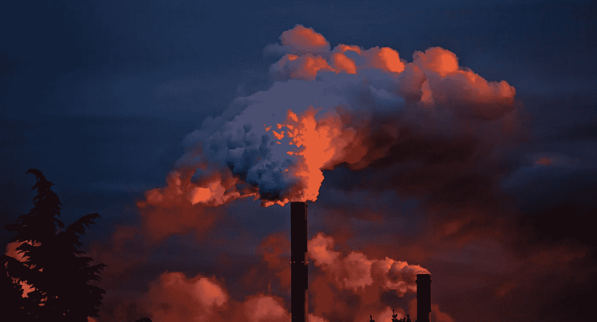

在 [Pixabay](https://pixabay.com/) 上的 JuergenPM

一个多月前，意大利政府在中国以外采取了最全面的措施来应对冠状病毒的爆发，锁定了 T2 人口最多、最富裕、生产力最高的地区:伦巴第。

随之而来的**旅行禁令**和**关闭所有非必要的商业和工业**对意大利脆弱的经济产生了巨大的影响，但也给了研究人员一个**独特的机会来收集数据和研究我们在从未见过的条件下生活的环境**。

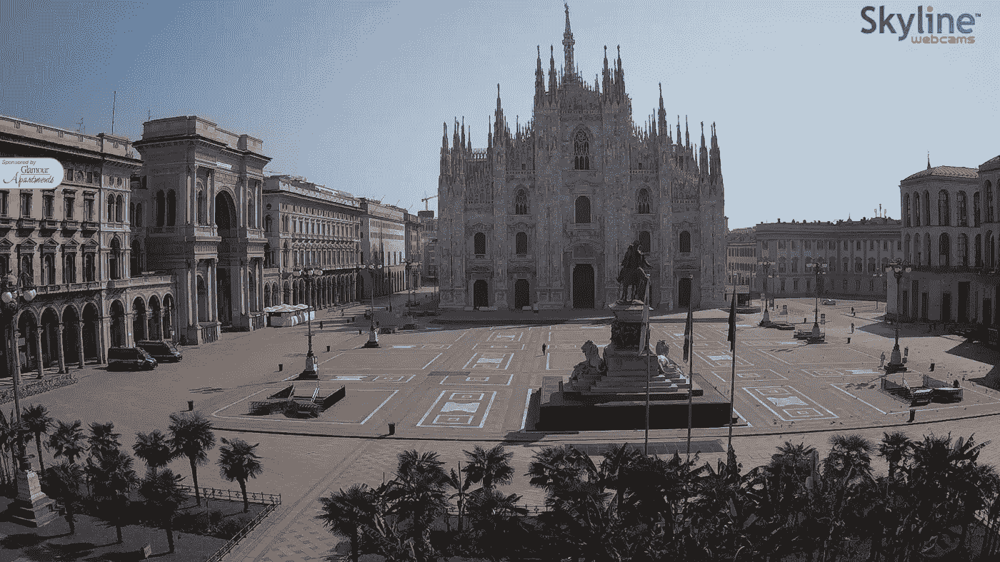

米兰大教堂及其空旷的主广场被封锁。根据《晚邮报》的报道，大教堂广场通常每天有超过五万人通过。([天际线网络摄像头](https://www.skylinewebcams.com/en/webcam/italia/lombardia/milano/duomo-milano.html))

事实上，**阻碍我们的大部分日常活动几乎抵消了污染等式中的人类成分**，并允许我们**研究当人类的贡献变得可忽略时环境如何反应**，这种方式在正常情况下根本不可能考虑。

> 我们的日常交流、活动和习惯对我们呼吸的空气质量有影响吗？

每个住在伦巴第的人都可以很容易地回答这个问题，只要看看明亮的天空，享受前所未有的晴朗的星空。然而，作为科学家，我们寻求数据来支持我们的经验，试图解释一个比我们肉眼看到的更复杂的现象。

# 伦巴第的空气污染

## 空气污染:它是什么？我们为什么要关心它？

我们把空气污染称为空气中化学成分的不均匀混合物。当我们谈论污染物时，我们可以指**气体**化合物——如二氧化碳和二氧化氮——以及大气**气溶胶粒子**，悬浮在空气中的不同直径的固体和液体物质，如 PM10 或 PM2.5

呼吸污染空气的长期健康影响包括**心脏病**、**肺癌**和**呼吸系统疾病**如肺气肿。即使在较低的浓度下，这些化学物质也具有毒性，长期接触可能会对健康造成影响。例如，PM2.5 颗粒非常小，它们可以在 30 分钟内渗入肺部，导致严重的呼吸问题。

根据[世卫组织](http://www9.who.int/airpollution/en/)，**每年有 420 万人因暴露在环境空气污染中而死亡**，而**世界上 91%的人口生活在空气质量超过指导限值的地方**。

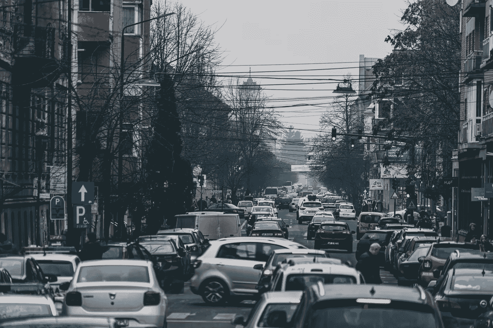

索林·格奥尔基塔在 [Unsplash](https://unsplash.com/)

## 呼吸毒素:为什么波河流域是欧洲污染最严重的地方之一

鉴于这些空气污染物的致命毒性，欧洲联盟已经制定了大量的立法，为空气中存在的许多污染物建立了基于健康的标准和目标。

2019 年**米兰在 2 月底**前超过了全年法定限额。同年年底，该市记录了 **135 天**(2019 年全年的 37%)污染水平远高于指导阈值。米兰和一长串城市一样有着糟糕的分数:威尼斯、都灵、布雷西亚、罗提、贝加莫、帕维亚、蒙扎等等。
所有这些城市都位于**同一个地理点:****波河流域**。截至今天，这里被认为是欧洲空气质量最差的地区。

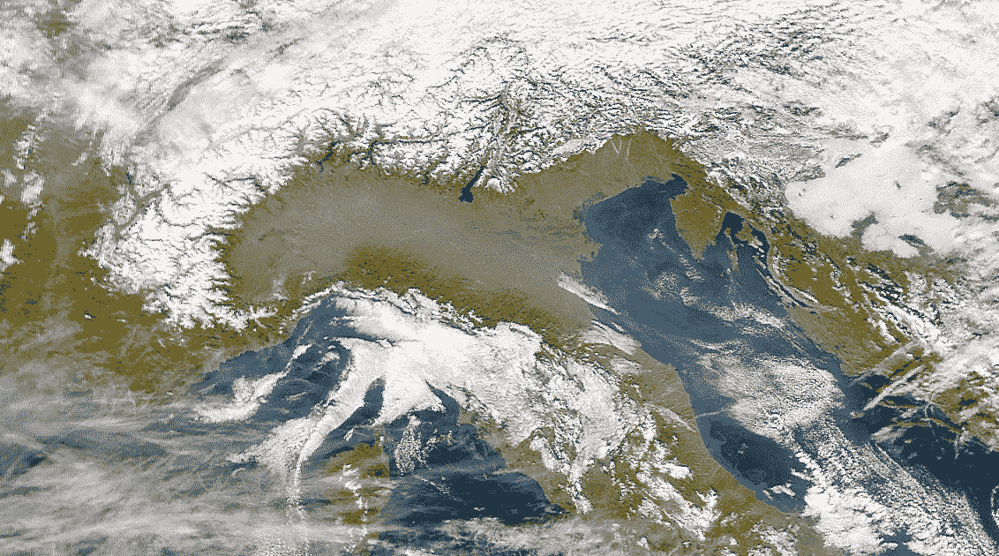

2020 年 1 月，SeaWiFS 卫星如何观测意大利北部伦巴第平原上空的空气

波河流域被称为意大利工业化程度最高的地区，主要工厂位于都灵、米兰和热那亚之间的工业三角地带。波河流域的大部分田地都被耕种，既供人食用，也用来喂养密集饲养的动物。

波河流域空气污染的大污点确实与**工厂**、**汽车**和**集约农业**、有关，但也是**非常不幸的地理构造**的结果。在这片被阿尔卑斯山环绕的平原上，风很少，长时间的逆温事件频繁发生。**这导致排放物停留在山谷中，而不是被吹走**。

croma concept visual on[pix abay](https://pixabay.com/)

# 空气污染和封锁:初步分析

## **问题**

既然我们介绍了空气污染的主要方面和我们的参考环境的特征，我们可以使用这些知识来收集适当的数据并尝试回答一些问题。

1.  封锁后空气质量有变化吗？
2.  怎么变的？哪种污染物变化最大？
3.  为什么变了？对于这种行为，有数据给出合理的猜测吗？

## 数据

为了回答这些问题，我们依靠伦巴第**地区环境保护局**([ARPA](https://www.arpalombardia.it/Pages/ARPA_Home_Page.aspx))。ARPA 有地面传感器，可以持续监控几个天气参数，如温度、风力、降雨量，以及重要的空气污染指标，如上述颗粒物。数据可以通过[这个表格](https://www.arpalombardia.it/Pages/Meteorologia/Richiesta-dati-misurati.aspx)询问。

在同一天的不同地点多次监测污染物。我们构建的数据集对这些观察值进行平均，以获得从 2018 年 1 月 1 日起**每天的单个值。因此，执行的分析不是空间分析，也没有考虑昼夜变化。**

以下是收集到的特征的**摘要**:

*   **年**:收集数据的年份(2018、2019、2020)
*   **日**:测量的日子(1–365)
*   **污染物**:污染物的日浓度(g/m^3)
*   **风**:日平均风力强度(米/秒)
*   **雨**:一天的降雨量(毫米)
*   **温度**:当天的平均温度(℃)
*   **封锁**:这一天是封锁日(布尔型)
*   **LockCount** :从隔离开始的天数(0-进行中)

监测的污染物有**二氧化氮**(NO2)**一氧化碳**(CO)**PM10**， **PM2.5** ，**臭氧**(O3)**苯**，**氨** (NH3)，以及**二氧化硫** (SO2)。

协调数据集可在此处找到:

 [## detsutut/ARPAdataHarm

### 这个库包含一个 R 脚本，可以用来合并和协调来自…

github.com](https://github.com/detsutut/ARPAdataHarm) 

## 1)封锁后空气质量有变化吗？

在检查数据之前，让我们先看看来自欧洲航天局的卫星图像:

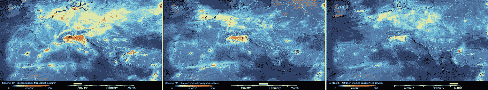

过去三个月欧洲各地的二氧化氮水平

ESA 的 Sentinel-5 强调了对流层中二氧化氮水平的明显下降趋势。这在波河流域尤其明显，但也影响到西班牙和中欧。类似的行为已经在香港、北京、上海和武汉出现。

这已经表明一些变化肯定正在发生，在一个范围太广而不能仅仅用当地的气候因素来解释的地区。然而，这些变化可能仍然是由于季节性趋势造成的。这就是我们需要核对数据的原因。

例如，让我们看看伦巴第地区过去三年的二氧化氮趋势。

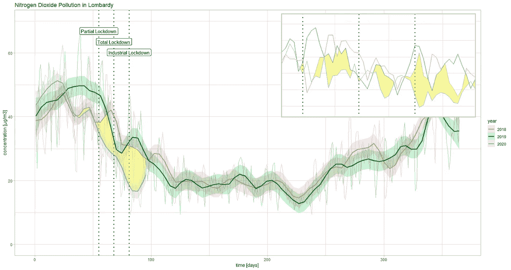

伦巴第二氧化氮污染趋势。黄色区域突出显示了 2020 年趋势与前两年的最小日值之间的距离。

正如我们从黄色突出显示的区域的大小可以看到的，****NO2 下降似乎不仅仅是季节性的**。**2020 年检疫期间测量的二氧化氮浓度低于我们在 2019 年和 2018 年同期经历的浓度**。
在此时间窗内执行 **ANOVA 测试**显示，三组之间确实存在显著差异，而 **Tukey 的多重均值比较测试**表明，这种差异在比较 2018–2020 和 2019–2020 时有意义，而在 2018–2019 时没有意义。**

**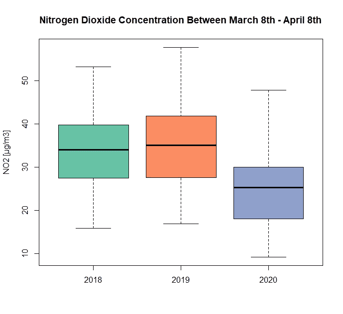**

**那么，*的空气质量在封锁期间发生了变化。***

## **2)空气是怎么变化的？**

**证明我们现在呼吸的二氧化氮浓度与我们以前呼吸的不同并不一定意味着空气污染因为封锁而下降，也不意味着所有涉及的污染物都在 T2 发生。**

**让我们测试一下其他污染物。一氧化碳、臭氧、苯、氨和二氧化硫的 **p 值也低于显著性水平** (0.05)。但 Tukey 对这些成分的测试显示，只有**苯**和**二氧化硫**在 2020 年有显著下降。**

**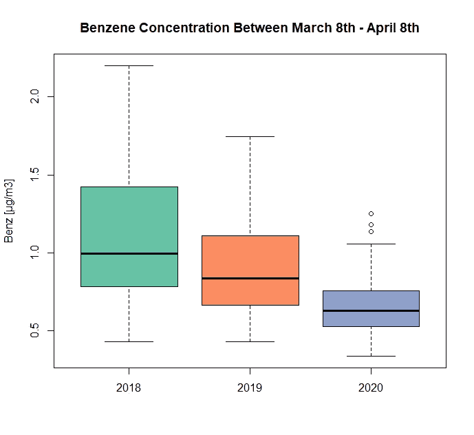****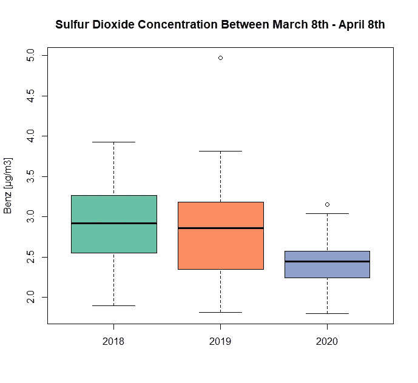**

**多年来苯(左)和二氧化硫(右)的箱线图。时间窗口:3 月 8 日(锁定开始)—4 月 8 日(记录的最后一天)**

****PM10** 和 **PM2.5** 的方差分析测试均为阴性，因此这里的猜测是它们**这些年来没有太大变化**(从统计学上来说:我们不能拒绝测试的零假设，因此说它们这些年来有变化是不安全的*。***

## **3)空气为什么变了？**

**既然我们知道一些污染物在封锁期间经历了前所未有的下降，而另一些没有，不言而喻，理解为什么会发生这种情况会很好。**

**这确实是一个微不足道的问题。**相关性并不意味着因果关系**，而且有太多的因素被包括在内，以至于**真的很难评估这种下降的直接因果路径**。因果关系还需要对主体的深刻理解，这在这里根本达不到。**

**然而，我们仍然可以使用相关性和文献来做出合理的猜测，排除尽可能多的压力因素。**

**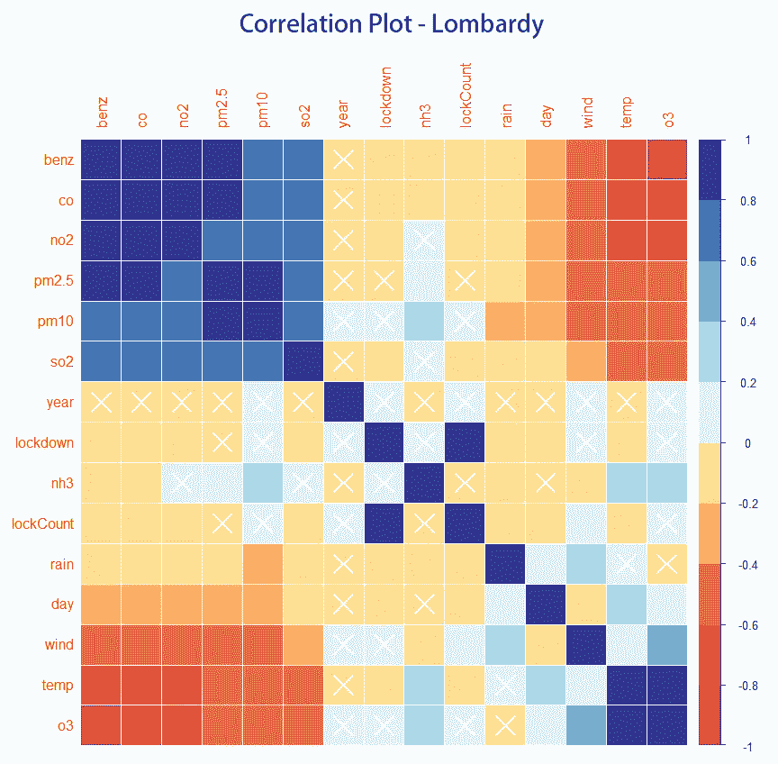**

**2018-2020 年期间空气污染物和气候因素的相关图。**

****方差分析倾向于排除季节性趋势是这些空气污染下降的主要原因**，但它们仍可能是由于**当地气候因素**。相关表清楚地表明**污染物与风、温度和**——对于 PM10 来说—**—**降水量有显著的负相关性。然而，在 2018 年、2019 年和 2020 年的 2 月和 3 月进行的一些测试显示，**气象条件在这些年里基本相同**。**

**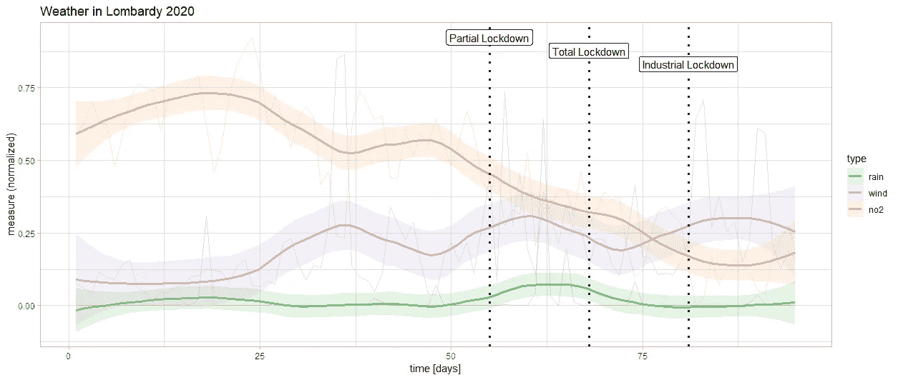**

**从 1 月 1 日到 4 月 6 日的降雨(绿色)、风力(紫色)和 no2(橙色)的标准化观测值。no2 水平和降雨之间没有相关性，但我们发现风和 NO2 之间有轻微的相关性。然而，这还不足以完全解释 NO2 的大量下降。**

**鉴于我们没有经历重要的局部气候变化，我们剩下的就是人类活动。人类活动以多种不同方式广泛造成空气、土地和水污染。**

**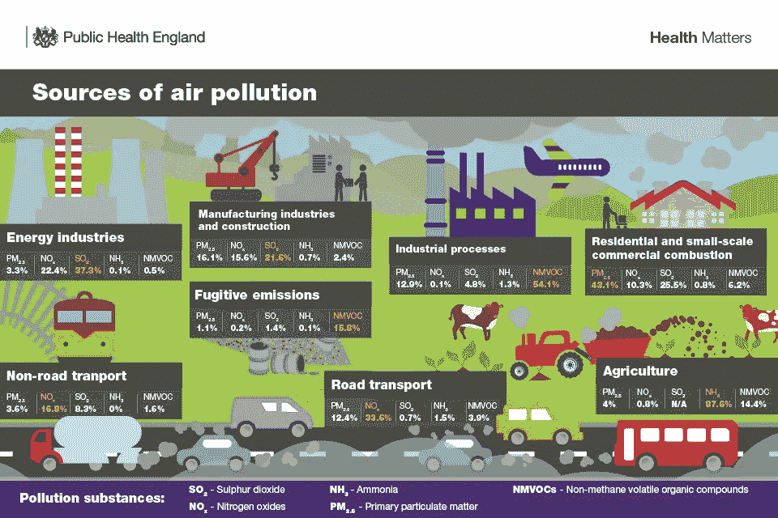**

**空气污染的来源([英国政府](https://www.gov.uk/government/publications/health-matters-air-pollution/health-matters-air-pollution)**

**相反，从我们看到的气候因素来看，绝大多数这些密集的人为活动在全国关闭后面临着历史性的下降。**禁止通勤**意味着**周围的车辆更少，**意味着**氮氧化物、颗粒物、一氧化碳和苯更少。封锁工厂**意味着**更少的工业流程**和**更少的能源消耗**(同样，更少的道路和非道路运输)**。****

**在我们分析的所有原因中，人类活动的强度是唯一与前几年相比发生重大变化的参数。这是**封锁**的直接后果，并允许我们合理猜测**隔离对我们呼吸的整体空气质量的积极影响**。**

**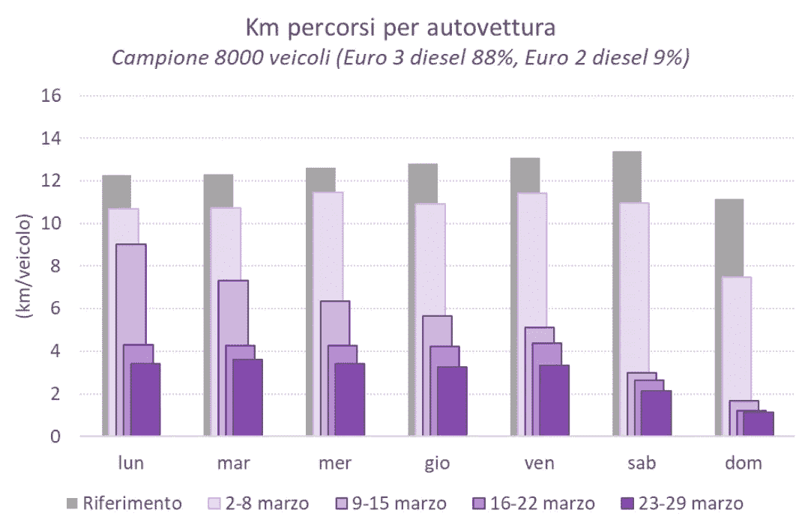**

**三月份每辆车行驶的公里数。封锁后，公里/车数量急剧下降。(ARPA)**

**假设封锁是空气质量改善的主要原因，我们仍然必须为那些浓度在隔离开始后没有太大变化的污染物找到合理的解释。考虑到**不同的人类活动排放不同的污染物**，并且**并非所有的活动都以同样的方式受到封锁的影响**，这是有动机的。**

**例如，让我们考虑一下颗粒物质。在这里，**住宅和商业燃烧**在排放中起着重要作用。关闭工业减少了商业成分，但增加了住宅成分，因为人们现在大部分时间都呆在家里。这可能导致**排放从商业来源向住宅来源转移**，尽管已经锁定，但仍将 PM10 和 PM2.5 锁定在平均水平附近。
另一个相关的例子是 **NH3** 。**农业是氨排放的最大来源**:到目前为止，欧洲超过 90%的 NH3 排放来自动物养殖、粪便处理和合成肥料。农业活动没有像工业活动那样遭受严重的封锁，这可能解释了为什么氨没有下降这么多。**

****

# **结论**

**在复杂的环境中研究正在发生的现象从来都不是一件容易的事情。然而，**的统计数据**提供了聪明的工具，帮助我们在**制定合理的猜测**，以便在未来验证或拒绝。**

**在这篇文章中，我们将我们的猜测集中在伦巴第的**空气质量上，展示了与前几年**同期相比**空气质量是如何显著改善的。****

**虽然空气污染的年内下降可能与季节性现象有关，但一年内统计上的显著下降需要进一步解释。由于**我们没有发现当地气候因素**的相关变化，唯一似乎发生巨大变化的是人类活动，由于新冠肺炎实施封锁，人类活动在上个月受到了极大的限制。尽管如此，并不是所有的活动都已经完全停止，一些污染物如 PM10 和 NH3 仍然保持在高浓度水平。**

**我们因此声明**新冠肺炎的封锁可能事实上是伦巴第上空的空气看起来前所未有的干净的原因。****

*****更新* * ***

***ARPA Lombardia 公布了一项* [*初步调查的结果*](https://www.arpalombardia.it/Pages/Qualit%C3%A0-dell%E2%80%99aria-durante-l%E2%80%99emergenza-Covid-19,-l%E2%80%99analisi-di-Arpa-Lombardia-.aspx#) *关于气压因素的变化和空气质量趋势数据所产生的限制性措施出台以对抗病毒的传播。这项调查似乎证实了整体空气质量的改善和国家封锁之间的联系。***

## **参考**

*   **[世卫组织谈空气污染](http://www9.who.int/airpollution/en/)**
*   **阿尔帕[伦巴第](https://www.arpalombardia.it/Pages/ARPA_Home_Page.aspx)东[皮埃蒙特](http://www.arpa.piemonte.it/news/inquinamento-da-particolato-pm10-il-riscaldamento-domestico?fbclid=IwAR1lvbvfkS0PqnkwM9Ke7Iq-7Qw9XkFaifBHmNXK9VAQ6PytLiJJwdqwNmk)**
*   **[Legambiente](https://www.legambiente.it/)**
*   **[常见空气污染物及其健康影响](https://www.health.nsw.gov.au/environment/air/Pages/common-air-pollutants.aspx)【新南威尔士州政府，2013】**
*   **[美国国家卫生研究院关于空气污染](https://www.niehs.nih.gov/health/topics/agents/air-pollution/)**
*   **[关于空气污染的 MEDLINE plus](https://medlineplus.gov/airpollution.html)**
*   **[伦巴第平原上空的空气污染](https://visibleearth.nasa.gov/images/53724/air-pollution-over-the-plain-of-lombardy)**
*   **[二氧化氮和细颗粒物正在威胁波河流域的空气质量](https://vitesy.com/blog/air-pollution/nitrogen-dioxide-fine-particles-po-valley-air-quality/)【Vitesy，2019】**
*   **新冠肺炎:中国上空的二氧化氮**
*   **[人为空气污染源](https://www.intechopen.com/books/air-quality/anthropogenic-air-pollution-sources)【F . pope scu 和 I.Ionel，2010 年】**
*   **[健康问题:空气污染](https://www.gov.uk/government/publications/health-matters-air-pollution/health-matters-air-pollution)【英国政府，2018】**
*   **[农业、氨和空气污染](https://www.clean-air-farming.eu/downloads-und-links?tx_downloads_download%5Baction%5D=show&tx_downloads_download%5Bcontroller%5D=Download&tx_downloads_download%5Bitem%5D=5&cHash=cf2f5882f8b4ae69ee76d77ca9ad072e)【IASS 概况介绍，2016】**

*****编者注:*** [*走向数据科学*](http://towardsdatascience.com/) *是一份以数据科学和机器学习研究为主的中型刊物。我们不是健康专家或流行病学家，本文的观点不应被解释为专业建议。想了解更多关于疫情冠状病毒的信息，可以点击* [*这里*](https://www.who.int/emergencies/diseases/novel-coronavirus-2019/situation-reports) *。***

** [## Tommaso Buonocore -作者-走向数据科学| LinkedIn

### 查看世界上最大的职业社区 LinkedIn 上 Tommaso Buonocore 的个人资料。托马索列出了 5 项工作…

www.linkedin.com](https://www.linkedin.com/in/tbuonocore/)**