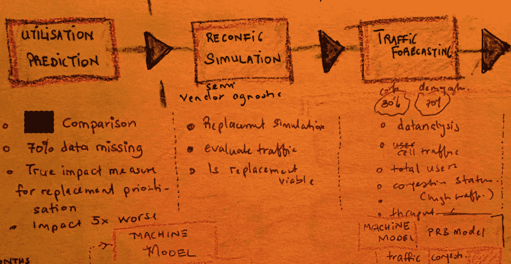

# 数据科学的成功超越了技术

> 原文：<https://towardsdatascience.com/is-data-science-really-a-technology-business-99bbcc5534b?source=collection_archive---------42----------------------->

## 复杂的算法光芒四射，由丰富的数据推动…但在更个人化的东西上蓬勃发展

我们做的第一个专业分析项目获得了巨大成功。随之而来的是认可、机遇……以及某种程度上错位的自信。

这让我们相信，通过稳健的方法、正确的工具选择和系统的数据分析，我们可以了解事情是如何运作的，并提供一个有人会付钱给我们的结果*。*

我们错得多离谱。

当最初的裂缝开始出现时，我们自然倾向于从工程缺陷开始。

错误的机器学习算法……糟糕的数据库选择……薄弱的界面……设计糟糕的数据处理……令人困惑的仪表盘……这些因素会阻碍我们追求的无缝客户体验。

# 但是数据科学可能会让人不知所措

网上如此多的技术内容不断让你怀疑你是否选择了正确的方法…以及正确的软件。

当新产品承诺在没有前期成本的情况下取得巨大进步时，它会刺激探索。而且有被转移的危险。

这可能需要一个僧侣的纪律来抵制潜入张量流的诱惑，其谷歌遗产和美味的口号**“一个完整的生态系统来帮助你用机器学习解决具有挑战性的现实世界的问题”**。

现在，如果时间不是短缺的话…而且是不可恢复的。

# 超越工程

最终，我们被迫质疑我们在其他领域的局限性。

也许我们的营销很差。也许我们正在解决一个不相关的问题。或者我们沟通得不够清楚。

毕竟，在短短的几年里，我们已经被那些无处不在的“十大数据科学失败”列表中突出的许多痛点所烫伤。

即使知道这一点也被证明是令人沮丧的——有太多的原因、太多的解决方案、太多的修正、太多的细节……而我们拼命寻找一个共同的线索。

简化一个威胁着我们的世界。

# 有共同的联系吗？

在经历了足够多的失败、不寻常的成功和多次应用建议的尝试后，圆点开始出现。

当我们试图加入他们时，我们发现在很大程度上，他们都绕过了人类动态，即数据科学和分析的概念…数据中有意义模式的发现、解释和交流过程(维基百科)。可能只是关于人和关系。

[John Thuma](https://medium.com/u/656eefc5a8fc?source=post_page-----99bbcc5534b--------------------------------) 在他的思想文章[中提到了这个问题](https://medium.com/datadriveninvestor/why-do-data-science-projects-fail-40ad5a5f1e3d)。他推断，数学和数据科学的复杂性可能会出现在理解的人和不理解的人之间的交流中。

如果没有共识，企业或项目在分析工作中取得领先的机会有多大？

# 错综复杂的需求网

我们刚刚花了数百个工时构建了一个 4G 移动网络交通拥堵预测模型。

这来自一个简短的陈述“我们需要你根据一周的历史数据来预测交通拥堵的可能性，这样我们就可以改善交通管理。”

在接下来的几周里，我们在多次会议上展示了我们的解决方案，并努力解决一些抛给我们的问题。

**业务案例负责人** —这些预测在 6 个月内的价值是多少？*(“这个问题很合理，但你不应该先问问你的团队吗？”我们默默地想)*

**中层经理** —营销部门想知道有多少用户在拥堵期间受到影响。*(“网络供应商不会更了解吗？”)*

**项目经理** —投入生产需要多长时间？*(“终于有我们能回答的了！”)*

**技术架构师** —我们需要预测未来 6 个月的流量模式。*(“打住，这不是另一个问题吗？”)*

**技术负责人** —网络容量将在 3 个月内增加，预测也是如此。*(“啊啊啊！”)*

我们的答案**“我们测试了一个模型，可以预测 70%的拥堵准确率”**显然*不够完整*。

令人难以置信的是，没有人关心预测准确性、潜在偏差、数据完整性和样本大小……忘记我们非常想解释的 K 均值辅助非线性回归模型吧！

相反，所有的道路似乎都通向**“你的黑匣子应该能告诉我我想知道的事情”**。

这不是第一次了…

# 技术的作用

我们不情愿地得出结论，在我们的工作中，拥有一个有效的数据科学解决方案仅仅是一个赌注…仅此而已。

它只是允许我们听到桌上真正的问题……这些问题似乎只有在建立了足够的信任后才会出现。

这些问题提供了关于业务及其人员的状态以及内部关系的更多背景信息。

在这一点上，有人可能会嘀咕:“这到底是从哪里来的？”到了高耸的山峰，以前看不见，挡住了前进的道路。

突然之间，Gartner 的[和其他](https://designingforanalytics.com/resources/failure-rates-for-analytics-bi-iot-and-big-data-projects-85-yikes/)的人不断抛出的 80%的数据科学项目失败率听起来毕竟不是编造的。

# 我们希望我们已经知道的

当涉及多方时，如何知道他们脑子里到底在想什么？

什么样的商业甚至个人背景影响了人们所说的话？

这与他们对你和你所代表的东西的看法有什么关系？

在团队层面上，如何从字里行间去理解同一个团队中人们之间的互动？

感受一下**“这会让我看起来更好吗”**有多重要？

鉴于通常有限的互动量，有可能得到更多的答案吗？

# 数据科学透视

似乎这些年来，我们一直忙于解决技术问题，以至于失去了一点人性。

或许……有没有可能……数据科学，这个被大肆宣传和吹捧的复杂算法、尖端软件和富有洞察力的数据领域，真的是一个**人的行业？**满载技术干扰？

这让我们有些害怕，因为突然之间，这不再仅仅是掌握技术、优化管道或提高精度…这些我们可以控制的事情！

在数据科学领域取得更大成就的秘诀是什么？

它可能只是我们与人联系、建立关系、说共同语言和理解他们来自哪里的努力。

(2020 年 1 月)冬日里的救生员巡逻，**南加州海滨**