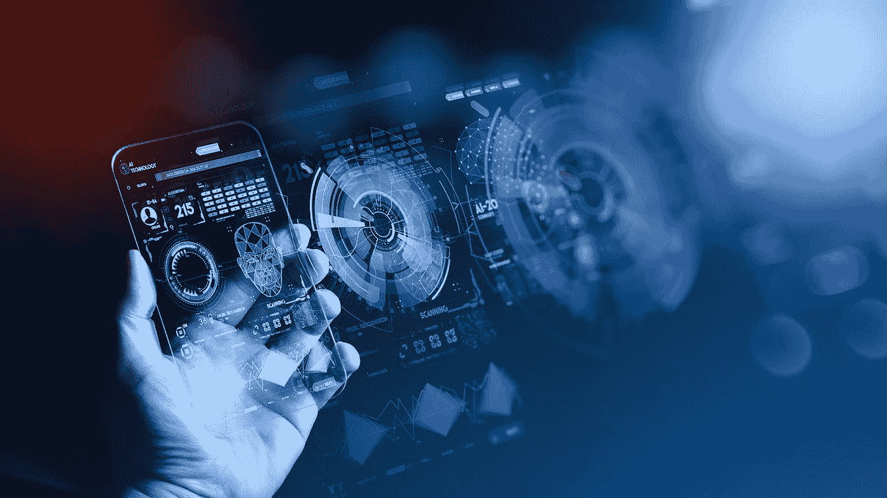
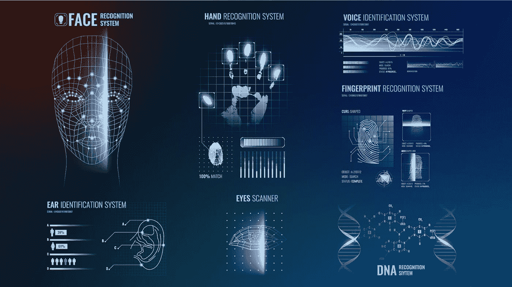
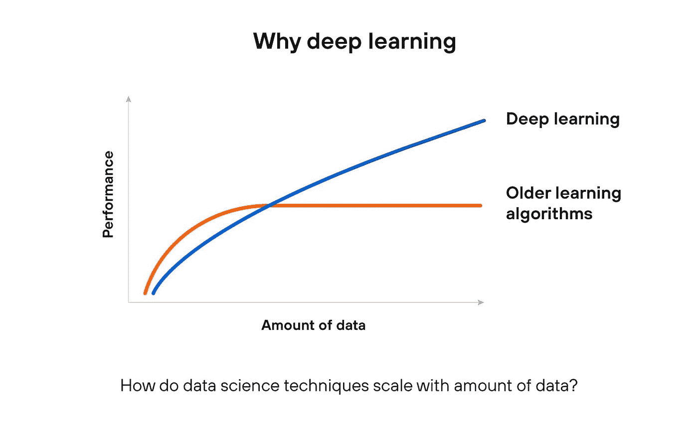
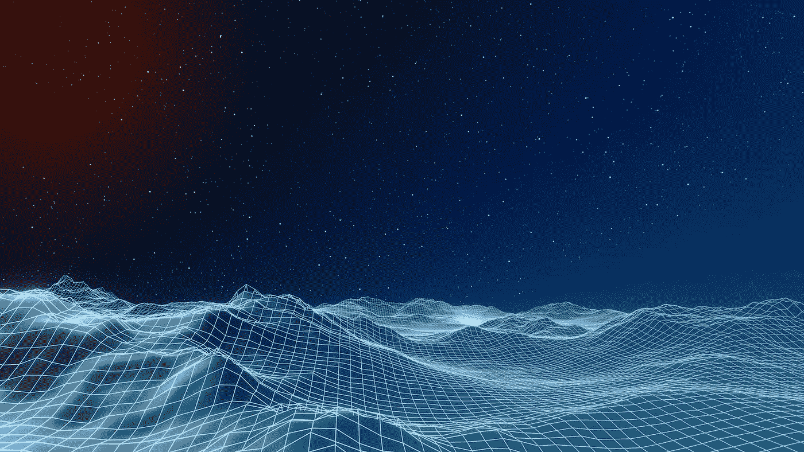

# 深度学习是不是碰壁了？

> 原文：<https://towardsdatascience.com/is-deep-learning-hitting-the-wall-d2f560419daf?source=collection_archive---------71----------------------->

## 深度学习——人工智能的钻石

*深度学习。由我们的设计师重新设计的* [*照片*](https://www.freepik.com/premium-photo/hand-touching-telecommunication-network-wireless-mobile-internet-technology-with-5g-lte-data-connection-global-business-fintech-blockchain_5988680.htm#page=2&query=AI&position=15) *。我们拥有这张照片的完全独家完全许可..*

在越来越多的机器学习(ML)相关项目、简化的 ML 框架和环境以及云中预先打包的 ML 解决方案的世界中，失望的声音越来越多。

这种不断增长的声音来自该领域的顶级专家，因此我们 Avenga Tech 希望花一点时间来分享我们对深度学习是否真的碰壁的看法。*企业 AI* 目前的状态是需要再一次重大突破，还是可以用现在的技术不着急？

Avenga 在[数据科学](https://www.avenga.com/our-expertise/data-services/)尤其是深度学习方面拥有丰富的专业知识。所以，我们在这里帮助你理解当前情况的原因和实际影响。

# 这是什么

AI 已经不恰当但肯定地成为了机器学习的代名词，机器学习几乎总是与深度学习有关(也是错误的，因为有更多的技术)，深度学习通常与卷积神经网络(CNN，一种学习如何识别和分类输入数据中的模式的人工神经网络)有关。

对于一组给定的问题，通常是模式识别，深度学习能够实现非常高的准确性、相对快速的学习，以及快速和低资源的模型执行，包括移动电池供电的设备。由于算法优化，以及利用 GPU 甚至更专业的硬件(即 TPU)的并行向量计算的巨大进步，几十年前的想法变得触手可及。

深度学习革命使得在实现之前不可能的事情变得流行起来。

# 成功案例

*人脸识别。由我们的设计师重新设计的* [*照片*](https://www.freepik.com/free-vector/biometric-recognition-systems-background_6479504.htm#page=1&query=face%20recognition&position=15) *。我们对这张照片拥有完全的专有权。*

计算机视觉就是其中的一个应用——拿起你的手机，它会以极高的速度和准确度识别你的脸(T21 ),并解锁手机。达到这种性能和质量水平需要很多年。

**语音识别** —和你的数字助理说话——语音识别百分比非常高。它可能没有答案，也无法像人类一样进行对话，但识别已经非常准确了。

**语音合成** —开车、跑步、上下班，声音是交流的唯一选项。语音合成的进步如此之大，以至于越来越难从真实的人声中识别出计算机生成的声音。

**自然语言处理** — **自动翻译**——今天还不完美，但比几年前好得多。今天任何语言写的网络文章，一键就能看懂。

**精选电脑游戏** — AI 赢棋，然后围棋，然后是星际争霸 2 游戏。进步是显而易见的，并且登上了新闻的头版。

ML 项目的数量在增长，机器学习专家越来越难找到。

在某种程度上，许多人认为，由于这些成功，我们将走向更通用的机器智能。只是给算法更多的数据和计算能力；一切都解决了！

# 失望和对更多的渴望

*机器学习。由我们的设计师重新设计的* [*照片*](https://www.freepik.com/premium-photo/conceptual-image-female-head-cut-out-wall-coming-out-wall_5740218.htm#page=1&query=minimal%20human%20face&position=29) *。我们对这张照片拥有完全的专有权。*

我们不断看到非常疯狂地缩小人工智能优于人类的领域，以人工智能(AGI)领域为代价，人工智能远远落后于人类的能力，似乎根本没有进步。

系统在很大程度上依赖于人类向它们提供大量的数据(比人脑需要的多几千倍)，执行大量的手动数据标记，并提供反馈。

即使这样，在数据集上训练并通过所有测试的模型，突然在不同的数据输入集中**失败**，原因不明，通常是在人类可能会犯错误的完全不同的场景中。例如，在著名的图像识别例子中，狼因为白色(雪)背景而被识别为狼，而当背景是绿色时就失败了。

另一个已知的问题是**学习过程**本身。基于过去的大量数据或实验室中准备好的数据→当一个模型面对一组新的真实世界数据时，它通常会失败，这个过程会再次重复。

例如，有时曼梯·里不认得我们的脸，以一种几乎不可能的理由让我们进去；正如我们在手机和笔记本电脑上不时体验到的那样。

仍然是人类定义了高级概念，比如动物的种类。DL 仍然处于非常低的水平，更高层次的概念支持很差。

DL 是在碰壁吗？用顶级数据科学家的话说似乎是这样。几年前，这似乎很容易。随着越来越大的数据集和更多的 TPU/GPU/CPU 能力，我们能够解决更多的人工智能相关问题。现在有更多的怀疑，新的做事方式有望被发现。

例如，汽车公司承诺自动驾驶汽车的日期为 2020 年或 2030 年，现在他们不再承诺自动驾驶汽车将成为可能。另一方面，人们只需经过几个小时的训练就能开车，并能正确识别他们以前没有见过的物体和情况。

DL 当前状态的另一个问题是，一方面缺乏**可预测性**，另一方面缺乏**可解释性**。大多数时候它运行得很好，但是人们想知道为什么。尤其是当 DL 被用于决策过程时——人们总是想知道为什么。目前，即使是顶尖的科学家也承认他们自己也难以解释网络的行为。

当前的算法集是在没有考虑这一需求的情况下构建的。就像黑盒一样，一些科学家声称将它们变得更容易解释会大大削弱它们的有效性。

# 更快、更好、更便宜并不聪明

DL 被期望在消耗更少能量的同时，基于更少量的数据更有效地学习和更快地概括。

人工智能，数字逻辑或其他什么，被期望发现，找出高层次的抽象，并从分布概括，领域和关系中完成它们。人们期望人工智能对世界有更好的了解，有类似人类的感知能力，并最终拥有“常识”。

现在可以说，DL 识别各种模式，但它不理解它们，因此它碰壁了。

一些科学家建议从头开始(就像新版本的进化算法)，并认为 DL 是一个死胡同解决方案。其他人看到了一条道路，就像从 DL 的当前状态向更通用的机器智能的迁移。科学家们也在关注自然，比如认知过程是如何工作的以及为什么，特别是在神经进化算法中，不仅网络本身的权重发生了突变，网络结构也发生了突变。也许元算法，设计算法的算法，就是答案？

# 让我们问问我们的专家

我们的机器学习科学家，有实践经验，分享他们的观点。

*Lyubomyr Senyuk，研发总监& D
Olena Domanska，ML 能力主管*

# 问:是深度学习本身有问题，还是深度学习实现的现状有问题？

让我们以语音合成和机器翻译为例:如果你去直截了当你得到一个丑陋的结果。生成的语音没有语调，真的很难听。你听得懂单词，但更复杂的语言结构却不存在，你的大脑努力识别声音在说什么。哪个是主要的，哪个是次要的？在翻译人员中，我们也有类似的情况。没有“理解”文本是关于什么的，就不可能翻译文本(除非用真正相近的语言)。然而，有统计机器翻译的 DL 技术可以给出令人印象深刻的结果，它们甚至可以进行交叉翻译；即日语到波兰语，仅具有在日语-英语和英语-波兰语上训练的模型。语音生成模型可以建立在类似的原理上，并且它们给出的结果更好听，但是在复杂的句子和真实人类使用语调的主题上，附加的解释元素 DL 语音合成模型通常失败。同样的情况也发生在译者身上:如果上下文超出了几个单词，这个模型就失败了

所以，DL 目前的状态在这里肯定是失败的，但关于 DL 本身很难说这一点。也许加入一些小的特征，可以让神经网络在运行中改变自己的拓扑结构，这将极大地改变这种情况，我们只需要将计算机的能力提高 100 倍，就可以达到可行的学习曲线，让这样的神经网络去模仿，例如 10 岁的人。

“思维机器”的概念并不新鲜，也就是说它们没有明确的指令。深度学习试图通过在人工神经元中使用数学矩阵操作来模仿人脑。尽管生物神经元激发了 DL 的想法，但人工神经元是一个简化得多的版本。世界上最大的神经网络由 1600 万个神经元组成，相当于一只青蛙的大脑大小。深度学习只是人工大脑思想的一种实现，它在大小、拓扑结构、信号处理和结构方面都有局限性。现在，我们甚至不明白人类的大脑是如何如此有效地工作的，我们也不明白一般的智力是如何工作的。如果我们发现了，DL 会怎么样？我们是否会想出一种新的方法来实现大脑，作为一台机器永远活着的想法将成为现实？让我们看看。

# 问:DL 真的碰壁了吗？

即使在创建了假设的类似人类的 NN 之后，我们也应该思考与它交互的方法。在这里，我认为，目前的 DL 方法肯定会碰壁。在给这个像虚拟生物一样的人类提供了大量数据，却没有对其决策做出合理解释之后，这绝对不是我们想要的。

深度学习仍然有着自始至终都存在的障碍:用于训练的标记数据量和计算能力。直到十年前，DL 还被该领域的大多数研究人员认为是一个死胡同。虽然第一个 CNN 是在 20 世纪 80 年代创建的，但直到从 CPU 上的计算切换到 GPU，允许多线程和更快的计算，它们才取得进展。CIFAR-10 和 ImageNet 数据集的创建带来了另一个提升。谷歌开发的用于执行张量计算的 TPUs 进一步推动了这一领域的发展。当前的 GPU 和 TPU 比以往任何时候都更强大，但增长速度不如以往。因此，我们接近“天花板”是一个合理的假设。然而，还有一项技术我们必须牢记在心——量子计算。它可能会在总体上改变和加速计算，但深度学习可能是受这项技术影响最大的技术之一。

最近，自然语言研究已经采用了一种新的范式:自我监督学习或自主监督学习，它使用大量的现有文本来预训练模型的参数，而不需要数据注释。人类可以从上下文中确定单词的语义。类似地，Word2Vec 算法根据周围的单词预测单词的语义上下文。自我监督学习遵循相同的原则，并使用自然可用的上下文。这种技术有可能解决 DL 的一个重大限制，但是需要大量的训练例子。

此外，就在几个月前，研究人员提出了一种更智能、更简单的训练神经网络的方法，称为彩票假设。主要思想是，一个大型神经网络将包含一个较小的子网，如果从一开始就进行训练，将达到与更大的结构相同或相似的精度。这个假设可以减轻 DL 的计算开销。

这个领域是如此年轻和受欢迎，以至于它的研究人员不断提出新的范例和架构。在最受欢迎的子领域:NLP 和 CV 有持续的改进。已经出现了令人惊讶甚至危险的结果，例如通过替换看起来和听起来像真实事物的面部或音频记录来伪造视频的能力，制作静止图像的动画，以及生成创造性的虚构文本、诗歌或其他文学艺术。

也许进展缓慢，但今天开发的某些东西可能是未来的突破。

# 问:在哪些领域使用其他技术更好？

这是一个棘手的问题。我可能会用一个例子来回答。想象一下，你想通过面部识别人，但你有不同角度的照片。更好的方法是分解任务，并进行一些面部参数测量，比如将旋转角度作为一个单独的子任务(也可以是 NN ),将分类作为一个单独的子任务，而不是将所有照片输入一个 NN。这为您提供了可用于调整全局算法和处理阈值的附加参数。

另一方面，如果我们更全面地思考相反的问题，“我们应该在哪里使用 DL？”我会回答，在医疗保健领域。生物生命对我们所谓的逻辑思维产生了非常复杂的挑战，因此计算机的二进制逻辑也是如此，所以拥有一个能够以高统计概率治愈人们的黑盒对于现在来说是一件大事，在未来，当 AI 能够建立理论并在这些理论的范围内解释其决策时也是如此。

另一个目前没有数字图书馆会更好的领域是机器人学。

很可能，我们都听说过波士顿动力公司。他们的机器人被设计用来完成各种任务，似乎是迄今为止最成功的发明之一。他们控制机器人运动的秘密是什么？他们根本不用深度/强化学习。

到目前为止，机器人技术是人们利用物理定律取得更大成功的领域。它限制了功能，但它仍然可以覆盖机器人引擎的足够好的部分。

深度学习总是渴望大量的数据来学习。在真实的机器人中不可能收集到这么多的数据。数以百万计的试验成本太高，执行时间太长。

一般来说，深度学习可以解决计算机视觉或自然语言处理等领域的多个复杂任务，但它不是万能的。深度学习在监督学习中最有效，这意味着模型是用标记数据训练的。它可以实现高精度，找到更复杂的模式，并且不需要显式的特征工程，但只有在足够的计算和标记数据的情况下才可能实现。在下图中，我们看到了经典机器学习模型和 DL 的性能如何依赖于**标记的**数据的数量:

*数据科学技术如何随着数据量而扩展。我们设计师画的一张照片。这是一张独特的照片。我们对这张照片拥有完全的专有权。*

对于标记数据量有限或需要快速原型化的问题，使用深度学习可能会矫枉过正。当我们实际上可以通过使用更简单的方法获得相同的结果时，例如用于分类的逻辑回归或随机森林，或者用于预测的线性回归/XGBoost 回归器，这将是对资源的浪费。当我们需要解释和说明结果时，从线性或基于树的算法开始理解特征重要性更有益。最后但同样重要的是数据质量，垃圾输入—垃圾输出。有了低质量的数据，任何模型的表现都很差，更不用说深度学习模型了。对 DL 来说，项目的领域并不重要。重要的是任务、数据和业务需求。

→ **阅读有关** [**的更多信息，了解 Avenga 数据科学团队在社区**](https://www.avenga.com/our-expertise/data-services/) **参与 Kaggle 竞赛时正在做些什么来帮助他们。**

# 深度学习的下一步是什么？

*深度学习的下一步是什么。由我们的设计师重新设计的* [*照片*](https://www.freepik.com/premium-photo/3d-rendering-abstract-highway-path-through-digital-binary-towers-city_6234088.htm#page=13&query=technology+digital+futuristic&position=8) *。我们对这张照片拥有完全的专有权。*

除了改进像胶囊神经网络这样的 DL 技术，胶囊神经网络是卷积神经网络的增强，还有一些重要的全球趋势应该提到，以描绘人工智能的未来:

*   当 NN 可以解释它的决定时的解释性人工智能。
*   当神经网络可以重用其经验时，迁移学习和类似的方法。
*   硬件加速器——改进当前神经网络执行并支持新型神经网络的特殊芯片。
*   当整体大于部分之和时，全球人工智能的全球网络将启用规则。

对于许多企业来说，深度学习的软肋是将神经网络视为黑盒决策者。这给项目带来了不便，因为在这些项目中，该模型具有显著的经济影响。对于许多企业来说，依靠 DL 模型的不可解释的结果来做出关键的决策和损失金钱是不可接受的。这就是为什么我们在可解释的人工智能方向上有很多研究，这些研究将能够提供数据和理由来证明这个决定。

其他研究课题:

*   扩大 NLP 的成功，以开放对话和交谈
*   多任务学习
*   常识推理
*   主动学习和终身学习
*   DL 在自动驾驶汽车中的应用

# 下一步是什么？

将深度学习和符号系统集成到混合人工智能架构中。由我们的设计师重新设计的 [*照片*](https://www.freepik.com/premium-photo/3d-rendering-abstract-highway-path-through-digital-binary-towers-city_6234088.htm#page=13&query=technology+digital+futuristic&position=8) *。我们对这张照片拥有完全的专有权。*

人工智能(AI)的梦想是理解让人类能够看到和听到、思考和推理、希望和梦想的神奇事物——大脑——是如何工作的，然后在智能系统工程中再造一个版本。

当前的 DL 模型擅长完成特定的任务和进行预测。DL 所缺乏的是类比或超越训练集进行推断的概念制造/生成能力，并且它的可解释性很差。幸运的是，DL 并不是唯一的 AI 工具。60 年代开创的符号人工智能是人工智能社区的主导范式，直到 20 世纪 80 年代末。符号推理的实现被称为规则引擎或知识图。这些是一组嵌套的“if-then”语句，得出关于实体及其关系的结论。在 DL 中，算法在建立输入和输出之间的关联时学习规则。在符号推理中，规则是通过人为干预创建的。这就是为什么符号人工智能在可解释性、泛化和整合先验知识方面如此强大，但在处理大量经验数据流方面却表现不佳。这两种方法相辅相成，因为前者的缺点是后者的优点，反之亦然。因此，将深度学习和符号系统集成到混合人工智能架构中，如结合深度强化学习的神经符号系统，可能是人工通用智能(AGI)的下一步，这种智能可以根据行为调整模式，并可以执行一般任务。如果能在这方面取得一些成就，那将是一件好事。

**→了解更多** [**AI、深度学习、高级分析和大数据如何辅助医药行业**](https://www.avenga.com/magazine/pharma-readiness-for-ai-special-edition-covid-19/) **进行临床试验管理和药物开发。**

# 最后的话

正如你所看到的，AI 不是一个简单的话题，因为在深度学习本身中，你的组织的实际商业价值来自于基于经验的技能。现代解决方案通常是几种技术和方法的恰当组合，即混合。

选择他们中的哪一个？在你的特殊情况下，如何扬长避短？我们的[人工智能团队随时准备帮助您](https://www.avenga.com/our-expertise/data-services/)在您的业务环境中找到合适的解决方案。