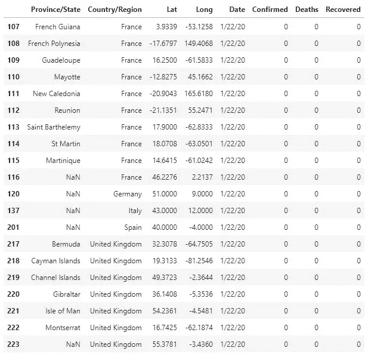
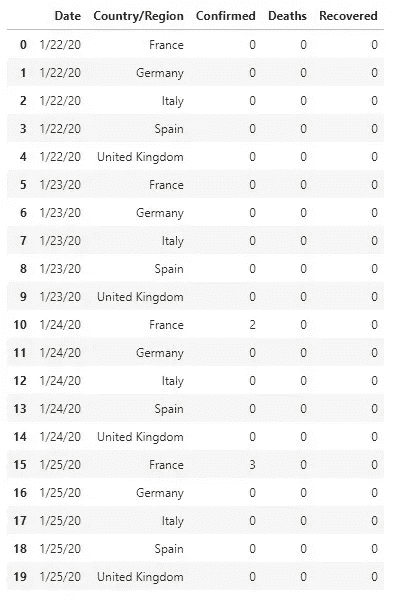
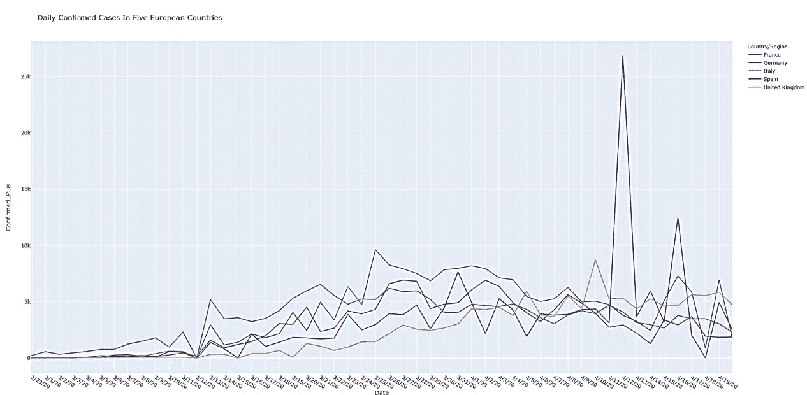
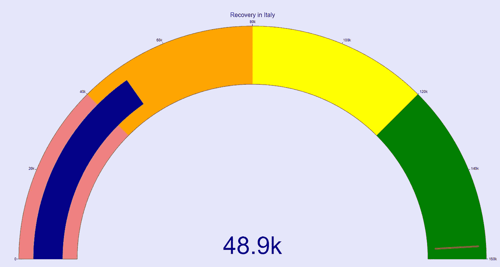
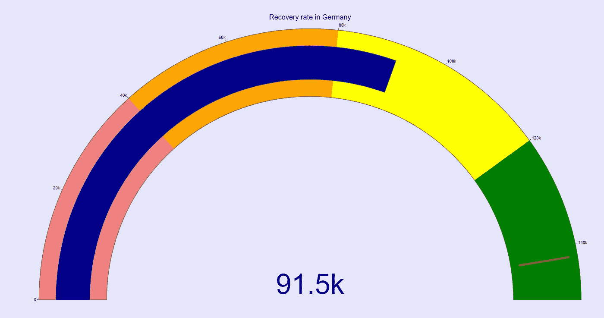
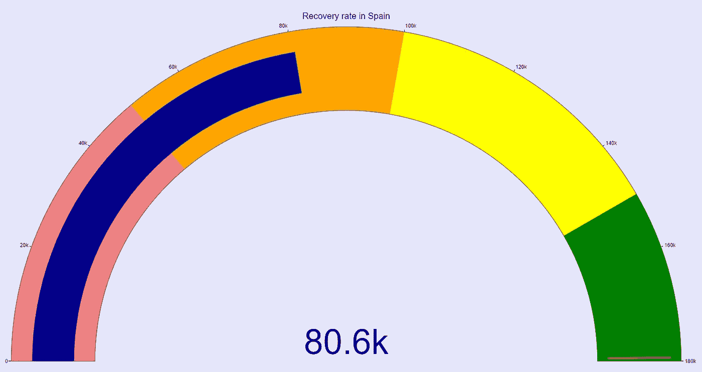

# 欧洲是否已经度过了新冠肺炎疫情的第一个高峰？

> 原文：<https://towardsdatascience.com/is-europe-past-the-first-peak-of-coronavirus-outbreak-d6410a578684?source=collection_archive---------46----------------------->


安娜斯塔西娅·切平斯卡在 [Unsplash](https://unsplash.com/s/photos/covid-europe?utm_source=unsplash&utm_medium=referral&utm_content=creditCopyText) 上的照片

***编者按:*** [*走向数据科学*](http://towardsdatascience.com/) *是一份以数据科学和机器学习研究为主的中型刊物。我们不是健康专家或流行病学家，本文的观点不应被解释为专业建议。想了解更多关于疫情冠状病毒的信息，可以点击* [*这里*](https://www.who.int/emergencies/diseases/novel-coronavirus-2019/situation-reports) *。*

2020 年 4 月 18 日,《华盛顿邮报》发布了一条激动人心的消息，标题是:

> 欧洲认为冠状病毒的第一波高峰已经过去

[](https://www.washingtonpost.com/world/europe/europe-is-emerging-from-the-pandemic-its-hospitals-stable-with-beds-available/2020/04/17/c7aa46cc-7f37-11ea-84c2-0792d8591911_story.html) [## 欧洲认为疫情冠状病毒的高峰期已经过去

### 伦敦-在整个欧洲，数字正在下降。有好消息分享。病毒正在被击退…

www.washingtonpost.com](https://www.washingtonpost.com/world/europe/europe-is-emerging-from-the-pandemic-its-hospitals-stable-with-beds-available/2020/04/17/c7aa46cc-7f37-11ea-84c2-0792d8591911_story.html) 

据新闻报道，整个欧洲的新冠肺炎感染人数已经显示出达到顶峰的迹象，并开始趋于平稳。更令人兴奋的事实是，新住院人数每天都在减少。这意味着可以腾出更多的重症监护室给有需要的人，也有更多的呼吸机可供使用。这与三月份最后一个月发生的事情形成了鲜明的对比，一些病人不得不睡在地板上等待医疗救助。

当我们都期待着我们的生活能够尽快恢复正常时，我们中的一些人可能仍然会思考:***是否真的有迹象表明冠状病毒在欧洲的爆发已经达到顶峰并开始消退？有没有更实质性的证据可以证明《华盛顿邮报》发布的消息是正当的？***

在本文中，我将介绍几种数据可视化技术，使用 Python Plotly 库来可视化新冠肺炎数据，并根据从 Kaggle 获得的数据集观察五个选定的欧洲国家(英国、法国、德国、意大利和西班牙)的疫情进展状态。为了实现这个目标，我将一步一步地介绍如何使用 Python Plotly 创建**时间序列折线图、条形图和量表图来检查欧洲的新冠肺炎记录。**

# 你需要什么

## 先决条件 Python 库

python Plotly—【https://plotly.com/python/ 

蟒蛇熊猫—【https://pandas.pydata.org/ 

*安装指南可在官方网页上找到。*

## 数据集

[冠状病毒报告](https://www.kaggle.com/imdevskp/corona-virus-report)(来自 Kaggle)

# 第 1 部分:数据预处理

## **1.1 探索数据**

在生成 Plotly 图表之前，让我们快速浏览一下从 Kaggle 获得的数据集。

预览数据集的 Python 代码


前 20 条记录(左)和后 20 条记录(右)

首先，我们使用熊猫*头*和*尾*方法(第 5 行& 6)来预览前 20 行和后 20 行记录。从预览图中，我们知道该数据涵盖了从 2020 年 1 月 22 日到 2020 年 4 月 20 日全球每日确诊、死亡和恢复的新冠肺炎病例的**累积总和。**

## 1.2 过滤数据

因为我们的目标是检查五个选定的欧洲国家(英国、法国、德国、意大利和西班牙)的案例，所以我们需要过滤原始数据。过滤后的数据应该只包括五个选定的欧洲国家的记录。为此，我们使用 Pandas ***isin*** 方法来过滤我们的数据(第 10 行)。

基于五个选定国家过滤数据的 Python 代码



过滤记录

## 1.3 汇总数据

现在，除了五个选定的欧洲国家之外的国家的记录都被筛选出来了。然而，我们当前过滤的数据还有一个问题。法国和英国等国家的每日数据是在省/州级别记录的，而德国、意大利和西班牙分别是在国家级别记录的。这个数据不一致的问题会给以后创建图表带来问题。

我们需要在国家级别而不是区域级别聚合我们的过滤数据，并且聚合数据应该按日期排序。幸运的是，Pandas 提供了在几行代码中完成这项任务的简便方法(第 14 -20 行)。

聚合数据的 Python 代码



汇总数据

我们可以使用 Pandas data frame***group by***方法对我们的日期和国家进行分组，并使用 ***agg*** 方法根据每个国家的每日确诊、死亡和康复病例总数汇总数据。

## 1.4 转换数据

在这个阶段，我们已经成功地过滤了数据，并根据日期对它们进行了排序。在我们继续绘制图表之前，还有一个步骤。每行记录中的确诊、死亡和康复病例数为**之前的累计数**。我们的目的是绘制一些时间序列图表，这些图表可以揭示每日新报告病例的进展情况，而不是累积的总和。从逻辑上讲，我们应该用前一个日期的数据减去当前日期的数据，以得出每日新病例的数量。Pandas 使我们能够使用 ***diff*** 方法转换数据(第 24、27、30 行)。

转换数据的 Python 代码


转换数据

我们将转换后的数据分配给三个新列，分别为 *Confirmed_Plus* 、 *Death_Plus、*和 *Recovered_Plus、**。*这三栏用于保存每日新增确诊病例、死亡病例和康复病例的记录(为**而非**累计数)。

**注:**

*diff 方法中设置的周期值是使当前行的数量减去前 5 行的数量。此处需要此设置，因为每天有五个国家/地区的记录，所以同一国家/地区的后续日期的每条记录都会在接下来的 5 行中交替显示。*

*fill na 方法(第 25，28，31 行)是将转换后的数据中的 NA 值替换为 0。*

# 第 2 部分:时间序列折线图

现在，我们准备使用[**Python Plotly Express**](https://plotly.com/python/plotly-express/)**包绘制我们的第一个折线图(第 27–28 行)。**

**Python 代码创建 Plotly 时间序列折线图**

**Plotly 时间序列折线图**

```
fig = px.line(df_filtered, x=”Date”, y = “Confirmed_Plus”, color=”Country/Region”, title=”Daily Confirmed Cases In Five European Countries”)fig.write_html('first_figure.html', auto_open=True)
```

**有了上面的两行代码，就生成了一个时间序列折线图。该时间序列折线图显示了欧洲五国从 2020 年 1 月 22 日至 2020 年 4 月 20 日的每日新增确诊病例。我们可以观察到，疫情大约在 2 月底开始爆发，自那以后，整个 3 月份的增长曲线越来越陡。**

**我们可以放大 Plotly 折线图来查看从 2 月 29 日起的增长率。**

****注:****

***要放大折线图，我们只需在图上按住鼠标并拖动鼠标，选择覆盖一系列日期的区域。***

****

**从折线图中，我们可以确定每个国家达到顶峰的日期:**

**法国:2020 年 4 月 12 日**

**2020 年 4 月 2 日**

**2020 年 3 月 21 日**

**西班牙:2020 年 3 月 25 日**

**联合王国:2020 年 4 月 10 日**

**意大利曾被报告为欧洲受影响最严重的地区，自 2020 年 3 月 30 日以来，该疾病已得到明显控制。尽管此后病例数仍在波动，但与其他选定国家相比，意大利记录的病例数一直较低。此外，自 2020 年 4 月 11 日以来，德国也显示出对该疾病的更好控制，目前每日病例数最低。**

**另一方面，法国的情况可能相当令人担忧，因为新病例在 2020 年 4 月 12 日的一天内突然激增至 26849 例。他们的第二个高峰发生在相对较近的时间，2020 年 4 月 16 日。英国的新增病例在 2020 年 4 月 10 日达到高峰后波动较小。然而，他们的病例数仍被认为相对高于意大利和德国。**

**从 2020 年 3 月 23 日至 4 月 11 日，西班牙在五个国家中显示出最高或第二高的病例数。即使在最近，他们的案件仍然波动很大。**

# **第 3 部分:条形图**

**上面的时间序列折线图为我们提供了五个选定的欧洲国家作为一个整体的新冠肺炎确诊病例的总体概况。现在，我们将创建五个条形图来显示每个国家的新冠肺炎数据趋势。**

**为此，我们需要再次过滤我们的数据(第 27 行)，并为每个国家创建一个数据子集(第 28 行)。这些过滤后的数据用于绘制条形图，以显示一个国家每天的确诊和恢复病例(第 30–33 行)。重复这些相同的逻辑步骤，为其余选定的欧洲国家创建多个条形图(第 35–65 行)。**

**Python 代码创建 Plotly 条形图**

**Plotly 条形图揭示新冠肺炎病例在法国**

**Plotly 条形图显示英国的新冠肺炎病例**

**Plotly 条形图揭示德国新冠肺炎病例**

**Plotly 条形图揭示西班牙的新冠肺炎病例**

**Plotly 条形图揭示新冠肺炎病例在意大利**

**与线形图相比，条形图为我们提供了额外的信息。我们不仅可以检查新确诊病例，还可以检查同一地块中的恢复病例(色标)。康复病例的数量可以让我们大致了解一个国家对疾病的控制程度，以及当前患者的医疗供应水平。**

**自 2020 年 3 月 28 日以来，意大利已显示出确诊病例稳步下降，自 2020 年 4 月 8 日以来，也显示出恢复数字的巨大迹象。另一个现在似乎得到更好控制的国家是德国。它显示，2020 年 4 月 2 日之后，确诊病例数下降更明显，其康复人数在五个国家中名列前茅。它在 2020 年 4 月 8 日一天之内就实现了超过 10000 例康复病例(几乎是当天确诊病例的两倍)。法国、英国和西班牙相对不稳定。自 2020 年 4 月 1 日以来，英国的确诊病例数一直很高，直到 2020 年 4 月 20 日，病例数没有明显减少。另一方面，法国和西班牙的确诊病例数波动较大。在 4 月中旬，病例数量有时会激增至异常高的水平。这可能是由于发现了以前未被发现的新的感染群体。**

# **第 4 部分:仪表图**

**Plotly 库提供的另一个有用的图表是仪表图。[仪表图](https://plotly.com/python/gauge-charts/)是一种显示单个值的指示器，用于估计目标进度。在这种情况下，我们假设每个国家的目标都是完全恢复。考虑到这一点，我们可以尝试为每个国家创建一个量表，以显示他们实现目标的程度。**

**要创建仪表图，我们只需**

*   **将 2020 年 4 月 20 日的累计回收金额设置为参数*值*(第 7 行)。**
*   **为图表设置一个相关的标题(第 9 行)。**
*   **为轴属性中的图表设置最小和最大值范围(第 11 行)**
*   **为具有指定颜色的条形设置数值范围(第 14–17 行)。该颜色条将用作显示当前成就水平的指示器。**
*   **设置阈值(目标)(第 20 行)。在这种情况下，阈值基于 2020 年 4 月 20 日确诊病例的累计总数减去死亡的累计总数。**

**其余的参数设置可以保留为默认值，并重新用于为另一个国家生成类似的仪表图。**

**为意大利创建仪表图的 Python 代码**

****

**意大利仪表图**

**为德国创建仪表图的 Python 代码**

****

**德国仪表图**

**为西班牙创建仪表图的 Python 代码**

****

**西班牙仪表图**

**为法国创建仪表图的 Python 代码**

****

**法国仪表图**

**上面的图表让我们清楚地了解了每个国家患者的康复率。在这些国家中，只有德国实现了超过 50%的回收率，而其他国家都低于 50%。这意味着欧洲国家仍有一场漫长的战斗要克服并度过这一关键时期，以提高其恢复率，同时抑制确诊病例的增长率。**

****注:****

**没有生成英国的仪表图，因为恢复记录中有太多可疑的异常值。这可能是由于一些人为错误，如错误的数据输入或其他不可预见的技术问题。但是，其余四个国家的轨距图应足以满足本文的目的。**

# **结束语**

**本文的主要目的是介绍几种使用 Plotly 库的数据可视化方法，以显示 2020 年 1 月 22 日至 4 月 20 日在五个选定的欧洲国家中新冠肺炎疫情的进展状态。由于数据每天都在定期更新，因此在您阅读本文时，这里提供的分析可能不再有效。此外，在检查一个国家的新冠肺炎疫情状况时，需要考虑更多因素，而不仅仅取决于几个变量，如确诊病例、死亡病例和康复病例的数量。**

**但是，我希望这篇文章仍然能够提供一个入门指南，帮助您使用 Plotly 库中的一些有用功能来创建一些信息丰富的图表，如时间序列折线图、条形图和数据可视化仪表图。希望你能从这篇文章中受益。**

# ****Github****

**这里展示的所有代码都可以在我的 [GitHub 库](https://github.com/teobeeguan/COVID-19-TimeSeriesCharts)中找到。**

# **参考**

1.  **[https://www . Washington post . com/world/Europe/Europe-is-emerging-from-the-the-疫情-its-hospitals-stable-with-beds-available/2020/04/17/c7aa 46 cc-7f 37-11ea-84 C2-0792d 8591911 _ story . html](https://www.washingtonpost.com/world/europe/europe-is-emerging-from-the-pandemic-its-hospitals-stable-with-beds-available/2020/04/17/c7aa46cc-7f37-11ea-84c2-0792d8591911_story.html)**
2.  **[https://plotly.com/python/plotly-express/](https://plotly.com/python/plotly-express/)**
3.  **[https://plotly.com/python/gauge-charts/](https://plotly.com/python/gauge-charts/)**