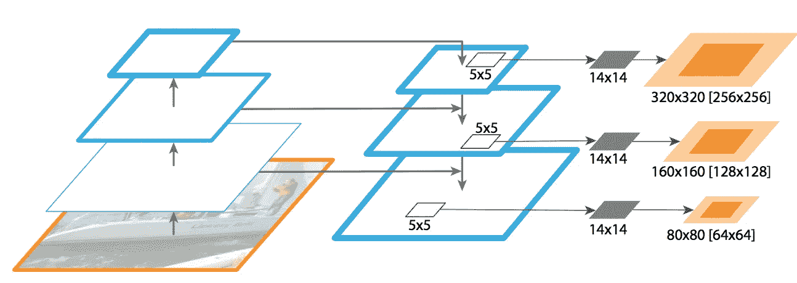
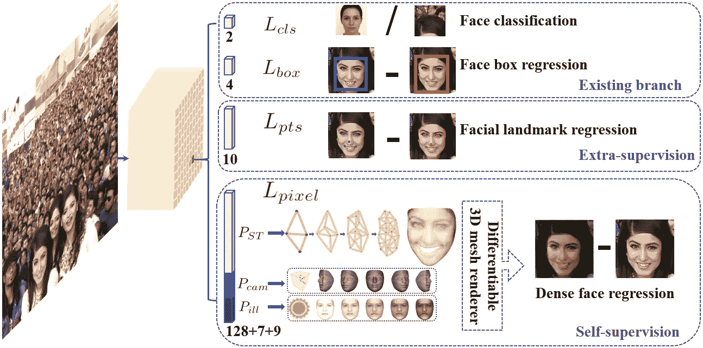
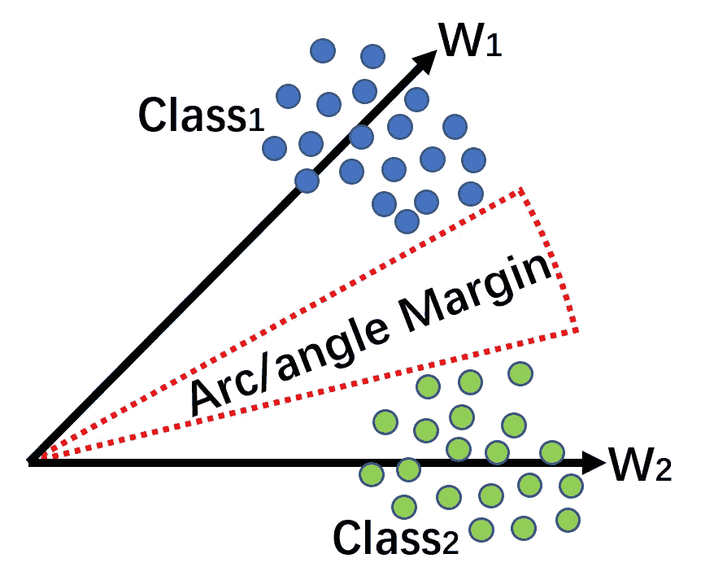

# 面部识别技术是种族歧视吗？解释了最先进的算法

> 原文：<https://towardsdatascience.com/is-facial-recognition-technology-racist-state-of-the-art-algorithms-explained-dbb1c95c4f5d?source=collection_archive---------37----------------------->

## 了解在新闻中引起轩然大波的人脸识别算法。

版权 2018 美国公民自由联盟。
最初由美国公民自由联盟发布于[https://www . ACLU . org/news/privacy-technology/wrong ly-arrowed-cause-face-recognition-cant-tell-black-people-apart/](https://www.aclu.org/news/privacy-technology/wrongfully-arrested-because-face-recognition-cant-tell-black-people-apart/)

这个人看起来眼熟吗？这是[罗伯特·威廉斯](https://www.nbcnews.com/business/business-news/man-wrongfully-arrested-due-facial-recognition-software-talks-about-humiliating-n1232184)，他被警方的面部识别系统错误识别，不得不被逮捕一天。随着这一事件在媒体上四处传播，重要的是要记住，在对技术如何工作的信息有限或不存在的情况下，批评技术是很容易的。无数媒体来源批评了该技术的每一个组成部分，而实际的算法仍然是谜。

在这篇博文中，我将通过一种既迎合有经验的专业人士又迎合普通无知读者的方式，来介绍最先进的人脸识别算法。我希望这篇文章能帮助你理解现在在新闻中被批评的算法，并帮助你将急需的信息带入关于这一争议的讨论中。

# 什么是人脸识别？

当我说“人脸识别”这个词时，各种视觉效果应该会浮现在脑海中，其中许多你可能还记得《詹姆斯·邦德》或《碟中谍》电影中主角的团队必须改变人脸数据库才能让主角进入秘密掩体。或者你可能会想到中国或朝鲜这样的国家使用人脸识别技术侵犯人们的隐私。

人脸识别的官方定义剥夺了所有的流行文化。简单来说，就是对人脸的检测和分类。这意味着面部识别系统应该有两个组成部分，首先检测图像中的面部，然后找到面部的身份。

*   人脸检测是一个非常类似于物体检测的问题，除了感兴趣的实体不是日常物体，而是个人的脸。
*   人脸识别是将检测到的人脸与预先存在的数据库中的识别图像进行匹配的问题。这是黑客在每部间谍电影中改变的同一个数据库。

# 人脸检测

为了理解人脸检测是如何工作的，让我们来看看最先进的算法， [RetinaFace](https://arxiv.org/pdf/1905.00641v2.pdf) 。现在不经意的读者们，不要一提到论文就跑。不要担心，在这篇博客中，我将尽我所能使算法尽可能直观，同时也避免困扰媒体的过度简化。

视网膜人脸算法在行话中被称为端到端或单级检测器。如果您熟悉对象检测策略，它类似于 SSD 或 YOLO 架构。

## 输出详细信息

RetinaFace 算法输出关于检测到的面部的三条信息:

*   面的边界框，由框的左下角及其宽度和高度表示。
*   表示眼睛、鼻子和嘴巴位置的五个面部标志
*   密集的 3D 点映射非常类似于你的手机用来识别你的功能，如 iphone 上的 Face ID。

## 特征抽出

用于目标检测的特征金字塔网络( [arXiv:1612.03144](https://arxiv.org/abs/1612.03144) ) (CC)

像大多数现代计算机视觉算法一样，RetinaFace 使用深度神经网络作为特征提取器。更具体地说，RetinaFace 使用 ResNet 架构以及全金字塔网络(FPN)来生成图像的丰富特征表示。

直观上，你可以想象这些特征捕捉到图像中不同层次的抽象特征。在人脸检测领域，这相当于对边缘进行早期特征编码，对眼睛、嘴巴、鼻子等面部特征进行中级特征编码，以及对人脸本身进行高级特征编码。FPN 只是允许模型利用高级和低级特征，这大大有助于检测图像中较小的人脸。

## 培养

训练是教导随机初始化的网络执行其任务的过程。训练的过程类似于教一个孩子在考试中取得好成绩。给孩子关于这个话题的信息，然后给他们一些评估测试，看看他们做得如何。深度神经网络的训练是类似的，除了给定标记的数据，在这种情况下，图像中的面部被标记，并且使用损失函数进行评估。要更详细地了解深度神经网络，请参见我的[博文](/a-hands-on-introduction-to-deep-learning-from-a-high-school-perspective-41be62ef00a7)。

通常，深度学习模型的训练过程是最重要的部分。整篇论文都是关于一个新的损失函数所带来的巨大改进。RetinaFace 算法也不例外。让我们检查用于训练 RetinaFace 的损失函数。

RetinaFace:野外单阶段密集人脸定位( [arXiv:1905.00641](https://arxiv.org/abs/1905.00641) ) (CC)

让我们一个一个地分解这个函数。

*   第一部分，人脸分类，简单地惩罚模型说在一个位置有人脸，而在图像中没有人脸。
*   “面部框回归”是预测面部的边界框坐标和标记面部的坐标之间的距离的一个有趣术语。具体来说，这个距离是使用所谓的平滑 L1 损耗计算出来的，你可以在下面看到它的图表。
*   面部标志回归类似于框回归损失，除了不是找到边界框之间的距离，而是找到预测的五个面部标志和标记的面部标志之间的距离。
*   最后的损失有点复杂，超出了这篇博文的范围。由于这些特征没有被标记，我们需要一些方法来帮助模型学习这些特征。为此，使用模型的输出特征来重建人脸，然后将重建的人脸与图像中的人脸进行比较

# 人脸识别

既然我们有了图像中人脸的详细信息，人脸识别系统的下一个任务就是对照 ID 图像数据库来识别人脸。

再次，我们将看看另一个国家的艺术纸，[弧面](https://arxiv.org/pdf/1801.07698.pdf)。在深入研究这个算法的细节之前，我们需要复习一下人脸识别的基础知识。面部识别使用一类称为暹罗网络的网络。以下是我之前关于此事的博文节选:

> 暹罗网络背后的核心直觉是试图学习面部的表征。这种表征类似于人类储存在大脑中的关于面部特征的信息，如面部特征的大小、肤色、眼睛颜色等。人类可以理解，如果它看到另一张具有相似特征的脸，那么新的脸很有可能属于同一个人。另一方面，如果人类看到新的面部与其先前看到的面部不匹配，那么人类再次制作新面部的表示以存储在其存储器中。
> 
> 这正是暹罗网络的运作方式。一个函数将人脸的输入图像转换成包含人脸特征表示的向量。然后，我们希望这个向量与同一张脸的向量相似，而与另一张脸的向量非常不同。
> 
> 简而言之，该模型学习如何提取人脸的重要特征，从而将人脸与其他人脸区分开来。一旦获得特征映射，就可以将其与数据库中要匹配的其他人脸的特征映射进行比较。

那篇[博文](/facial-re-identification-using-siamese-nets-d36df39da7c0)更深入地探讨了人脸识别的技术细节，以及完整实现它的代码。

再一次，暹罗网络的训练过程是奇迹发生的地方。暹罗网络首先在裁剪的人脸上被训练为完整的图像分类模型，其中该模型学习直接从图像中对人脸进行分类，而不需要任何识别图像。这需要在所使用的数据集中预先定义身份列表，这在大多数人脸识别数据集中是常见的。

## 输出详细信息

面部识别模型输出特征向量，该特征向量将面部特征编码成一些数字的列表，通常是 256 或 512。注意，这个向量不同于 RetinaFace 算法输出的密集特征，因为这些特征专门用于比较两张脸。

## 特征抽出

面部识别模型使用标准的、最先进的图像分类模型。ArcFace 算法使用 ResNet 架构。

## 培养

像 RetinaFace 一样，ArcFace 算法的症结来自于它的训练方式。正如我前面提到的，网络首先像正常的分类网络一样被训练，然后被微调到输出编码。

ArcFace:深度人脸识别的附加角度余量损失( [arXiv:1801.07698](https://arxiv.org/abs/1801.07698) ) (CC)

通常，分类网络使用交叉熵损失来输出类别概率的向量。对这个类向量的解释是，它输出图像的可能分类，以及模型对每个类的置信度。虽然这对于分类任务很有用，但 ArcFace 算法的设计者指出，在人脸识别中不应该考虑不确定性，因为一张脸不可能属于多个人。为了减轻这一点，他们设计了一个余弦损失，迫使输出类概率聚集在一个类周围。正如在上面的图像中可以看到的，这种损失使用一个余量来“推动”输出概率向量更接近任何类别，这被证明在人脸识别方面有巨大的改进。

通过佛潘在(【https://www.youtube.com/watch?v=tgnitF1irVM】T4)

这是 ArcFace 架构在 MNIST 数据集(手写数字数据集)上输出的特征向量的可视化效果。正如你所看到的，图像输出的向量紧密地聚集在一起，这在人脸识别中非常有用。

# 获得结果

人脸识别系统的典型流程是首先获得图像中每个人脸的位置和特征。然后将裁剪后的人脸输入人脸识别模型，得到特征向量。然后使用欧几里德距离函数将该向量与识别数据库中的其他向量进行比较。与面部向量“最接近”的识别向量告诉我们图像中的人的身份。

举一个更具体的例子，在 MNIST 数据集矢量的可视化中，我们假设深蓝色点对应于数字 4 的矢量，青色点对应于数字 3。这类似于我的脸的图像和你的脸的图像。如果我从另一幅图像中获得一个特征向量，并且它非常接近深蓝色的点，我会怀疑该图像是否是 a 4。类似地，我认为图像是 3 是毫无疑问的，因为数字 3 的向量离特征向量很远。

# 那么算法怎么可能是种族歧视呢？

正如你现在看到的，任何深度学习模型的训练过程都是其性能的关键，以及它继承的偏见。新闻中的问题与算法在识别非裔美国男子时的低性能有关，其他文章批评算法与女性斗争。

这个问题并不像《卫报》的文章所宣称的那样是“固有的种族偏见”。问题只是用于训练人脸识别模型的训练数据集。你可以这样想，如果一个人从未见过苹果，或者一生中见过一次，那么这个人将来会很难认出苹果，因为他们没有见过足够多的苹果来了解它们的样子。对这个人来说，解决办法就是简单地向他们展示更多的苹果。人脸识别模型正是如此。

我们所需要做的就是拿出更具包容性和平衡的数据集来训练模型，所有的偏见都会消失。

# 未来和结束语

面部识别算法可以成为安全和监控许多方面的关键工具。它们可以成为任何自动化监控系统的宝贵补充，并可以为公司节省数百万美元的人力成本。

对于那些对实现这些算法感兴趣的人，请查看一下 Tensorflow 2 对 [RetinaFace](https://github.com/peteryuX/retinaface-tf2) 和 [ArcFace](https://github.com/peteryuX/arcface-tf2) 的实现。

使用人脸识别的合法问题是对隐私侵犯的担忧。但那是另一天的话题:)

> 感谢你阅读我的博文！我希望你学到了一些东西，并在谈论人脸识别及其缺陷时更加知情。我很乐意在下面的评论中讨论这个问题！