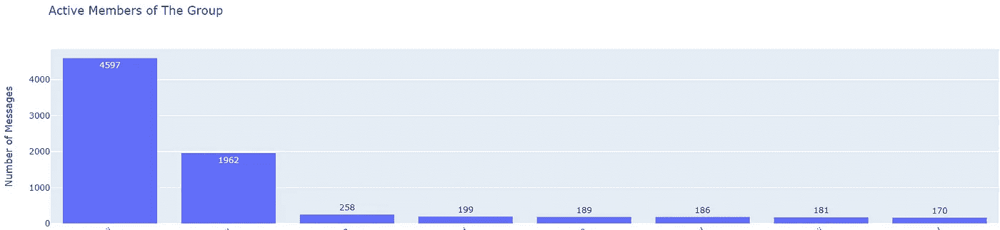

# 家庭团体有那么糟糕吗？结果会让你震惊

> 原文：<https://towardsdatascience.com/is-family-group-that-bad-results-will-shock-you-573f64e194be?source=collection_archive---------27----------------------->

## 文本处理、Plotly 图形和 Heroku 部署

## 分析 WhatsApp 群聊&构建网络应用

谁不知道 WhatsApp？它是广泛使用的移动应用程序，与设备操作系统无关。我们都使用这个应用程序在旅途中快速完成工作。我不知道其他国家的情况，但是在印度，**家庭团体因为在团体中分享垃圾/虚假信息而受到很多批评。这也意味着产生了大量数据，WhatsApp 给出了导出这些数据的选项！在本文中，我将向您展示如何挖掘这些数据，以**发现隐藏的事实**，并最终制作一个**可部署的 web 应用**。**


照片由[AARN·GIRI](https://unsplash.com/@_giri_?utm_source=medium&utm_medium=referral)在 [Unsplash](https://unsplash.com?utm_source=medium&utm_medium=referral) 上拍摄

在继续之前，让我们看看如何从组中导出这些数据:


作者提供的图片(在 Google Drawings 中创建)

# 数据预处理

文本文件包含消息的时间戳、作者和消息。如果数据被转换成一个 **pandas 数据帧**，那么数据处理和操作就很容易，在这里，我们将把这个文本信息转换成这个。该文件中的单个条目如下所示:

```
21/04/20, 5:47 pm - Author Name: Message sent
```

对于每一行，一个简单的正则表达式可以从该条目中提取日期和时间，在该日期拆分该行，分号将给出相同的作者和消息，但这里有几个问题:

1.  多行消息没有新的时间戳，因此需要将继续的消息**添加到主线程**中。
2.  有一些 WhatsApp 的默认消息，如:“消息是端到端加密的”或“XYZ 将你添加到组中”，这些消息可能有也可能没有时间戳，而且它们都不是多行的。这些可以打破我们的逻辑。此外，它们与我们的分析**无关**，可以跳过**。**

**考虑到这些情况，数据帧提取的代码可以引用如下:**

**将文本文件转换为熊猫数据框的抽象代码**

**我在这里没有包括整个实现，但是如果你想知道的话，你可以去我的 GitHub 库:**

**[](https://github.com/kaustubhgupta/WhatsApp-Groups-Analyser) [## kaustubhgupta/WhatsApp-群组-分析器

### 这个 Web 应用程序给出了关于 WhatsApp 群聊的详细报告。解散 GitHub 是超过 5000 万人的家园…

github.com](https://github.com/kaustubhgupta/WhatsApp-Groups-Analyser) 

除了将它转换成一个数据框，我也有兴趣知道关于群组中共享的表情符号的信息。这可以通过使用名为 emoji 的库来实现。对于每条消息，我们将检查它是否包含表情符号，然后为它们的计数创建一个单独的列。出于演示目的，我将分析我的家庭组。让我们看看新数据集是什么样子的:

```
df.tail(10)
```


作者图片

这是数据帧的尾部，您可以看到大约有 9k 行的**。日期列具有日期-时间数据类型，以便于操作，正如前面提到的，数据是在没有媒体的情况下提取的，包含媒体的消息被 WhatsApp 赋予了“媒体省略”的标签。现在我们的数据集已经准备好了，是时候回答一些问题了。**

# 家庭群只有媒体聊天吗？

所有包含消息的媒体都被重命名为忽略的消息，这使得对这些消息进行分组、计数并除以消息总数以获得媒体消息的百分比变得容易。代码实现将是:

```
((df[df['Message'] == ' <Media omitted> '].Message.count()) / (df.Message.count()))*100
```

当我在我的**家庭组**数据集上运行这个命令时，它返回了 **53.6%** 这意味着 100 条消息中有 53 条是照片、视频或任何 GIF。令人惊讶的是，当我在我的**学院组**数据集上运行相同的命令时，它返回了一个 **3%** 的结果！这意味着我们可以说，在某种程度上，这些小组有更多的媒体，但这种说法是很有争议的，因为我的大学小组有更少的媒体，但其他小组可能有更多的媒体。

# 家庭群体只使用一种表情符号吗？

表情符号是每个人都喜欢的东西。有时，人们只是在交谈时交换表情符号，以传达他们的情绪，减少交谈。探索表情符号在群体中的分布会很有趣。在继续之前，这里有一件事需要考虑。我的母语是印地语，当我从信息中提取表情符号时，一些语言字符被归类为表情符号。让我们来看看这个群体最常用的 10 个表情符号:


(家庭组分布)按作者分类的图像

这是一个甜甜圈图，通过观察它，我可以说这个组有很多变化！合十礼表情符号(🙏)占使用表情符号总数的 **32%** 。总共使用了 **20055** 个**19】表情符号，其中 **498 个**是独一无二的。如果我们看学院组分布，(😂)表情符号领衔排行榜:**


(学院组分布)按作者分类的图像

让我们探索更多的统计数据来理解这些组的性质。

# 活跃和懒惰的成员

我们有该小组成立以来每天的数据。因此，我们可以**分析该组成员**在任何时期的活动。这里我们将考虑从第一天开始的整体活动。为此，我们将按作者对数据进行分组，应用 count 作为聚合，并将它们绘制成条形图。另一种方法是使用 value count 函数直接获得每个作者的数量。无论您选择哪种方法，您都可以绘制数据，下面是一个例子:



作者图片

如果你仔细观察，你会发现这个活跃的成员发送了 **50%的群组信息！**你可以通过将最少的计数作为决定因素，为懒惰的成员绘制相同的图:


作者图片

当我在我的大学小组中运行相同的命令时，结果几乎是相同的，但我预计这里会有一个凸起。(因为在手机清理过程中，我丢失了很多数据，现在我只有有限的数据对应的组)

# 夜猫子还是早起的鸟儿？

这个问题很简单，哪个成员早上更活跃，哪个成员晚上更活跃。一个家庭团体通常有所有的亲戚和老年人，因为他们通常醒得早，很明显，在家庭团体的情况下，早上会有更多的活动，而在大学团体的情况下，晚上会有更多的活动。在我的分析中，我发现家庭小组的集体活动在上午 8 点到 9 点之间，而大学小组的集体活动在上午 11 点到下午 1 点之间。大学集体远足是因为这是我们讨论是否应该去实验室的黄金时间！


家庭小组活动(图片由作者提供)

现在看看其他小组活动:


大学小组活动(图片由作者提供)

# 节假日的组状态

我进一步分析了在重要节日的集体活动。这里我将考虑印度的国定假日。有一种强烈的观点认为，在假期，家庭团体充满了来自不明来源的信息，在某种程度上这是真的。虽然大学小组在这些天很少或没有活动，但家庭小组在这些天有很大的图表。选择的日期是共和国日、独立日、圣诞节和其他一些节日。我无法捕捉到排灯节或胡里节等更著名的节日的模式，因为这些节日没有任何固定的日期，它们的日期每年都在变化。以下是生成的一些图表:


作者图片

# 把所有的放在一起

分析部分已经结束，现在是时候把所有的东西放在一起，形成一个结构化的格式。为了使这种分析对每个用户都是可访问的，在那里他们可以获得他们自己上传的数据的报告，我必须构建一个 web 应用程序来服务于这个目的。我将整个分析代码分为 3 个阶段或模块。一个模块帮助处理、清理和创建数据框。一个模块生成我在这里展示的所有统计数据(只有原始数据)，另一个模块生成要在 web 上呈现的交互式图形。我用 Heroku 部署了这个应用程序，它是用 flask framework 构建的，jinja 模板帮助将这个后端连接到 web 前端。这款网络应用名为 [Whatsapp-Analyzing](https://whatsapp-analyzing.herokuapp.com/) 。


演示如何使用这个网络应用程序

# 结论

在本文中，我们介绍了如何访问 WhatsApp 数据、处理信息、回答一些流行的问题，以及最终在 could 平台上部署应用程序。根据对数据的理解程度，可以发现很多东西。我没有给出图片中显示的 Plotly 图形的代码实现，因为这会使文章变得混乱。所有代码都可以在我的 [GitHub 库](https://github.com/kaustubhgupta/WhatsApp-Groups-Analyser/)中找到。

这篇文章提出的问题“家庭团体有那么糟糕吗？”毫无根据。每个群体都有几乎相同的趋势，但是的，有一些因素，其中一个胜过其他人，但不能一概而论。让我知道你的想法，你可以在 medium 上关注我，以获得更多有见地的故事的通知。说完了，再见！

您可以通过以下方式与我联系:

[](https://www.linkedin.com/in/kaustubh-gupta-612767ab/) [## Kaustubh Gupta -机器学习作家- upGrad | LinkedIn

### 嗨，我是一名 Python 开发人员，能够进行 Web 抓取、Selenium 自动化、数据科学、后端 Web 开发…

www.linkedin.com](https://www.linkedin.com/in/kaustubh-gupta-612767ab/) [](https://github.com/kaustubhgupta) [## kaustubhgupta -概述

### 技术爱好者|程序员| Python |数据科学|深度学习| Flask l Django l 开源贡献者…

github.com](https://github.com/kaustubhgupta)**