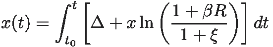

# 财务独立是财富的产物吗？

> 原文：<https://towardsdatascience.com/is-financial-independence-a-product-of-fortune-22905a48107b?source=collection_archive---------44----------------------->

## 用蒙特卡罗方法和 Python 模拟随机微分方程


在雾中航行很困难，但并非不可能。波兰 [2020](https://private.zerowithdot.com/travelling/) 。作者照片。

# 介绍

这是工作的第二部分，试图找到通往**财务独立**的秘方——一个你不再需要工作来养活自己的阶段。

在[之前的文章](/financial-independence-simulating-odes-with-python-c9b5468dbe74)中，我们试图通过一个常微分方程系统(ODE)来描述个人财务问题，后来我们使用 python 对其进行了数值求解。给定一组输入参数，我们的数值模型能够确定你的财务状况。

在这篇文章中，我们把它带到下一个阶段。我们在等式中加入随机性来解释生活的不可预测性。这一次，我们想知道**你的财务成功在多大程度上真正掌握在你手中？**

我们将通过重温数学和添加一些随机贡献来开始这一旅程。然后，我们开始使用所谓的蒙特卡罗方法模拟一些假设的场景。最后，我们将使用我们的增强模型，在世界历史数据的帮助下预测您的机会。

让我们开始吧。

# 数学重温

[最后一个模型](/financial-independence-simulating-odes-with-python-c9b5468dbe74)依赖于两个耦合的微分方程系统，为了简单起见，我们将简化为一个:


这个等式通过 *x* 来模拟你的*总财富*，这是一个随时间变化的变量。它的左边是导数，右边由两个起作用的项组成:

*   δ(t ),表示年度余额:所有收入减去所有费用和税收——简单地说就是每年之后还剩多少。
*   *x* ln(⋅)，表示*投资*和*通货膨胀*的合力，产生复利。请注意它本身的比例性，更多关于为什么这些术语位于对数之下，你可以在[早期文章](/financial-independence-simulating-odes-with-python-c9b5468dbe74)中找到。

这里，三个参数代表:

*   *R* -你投资的预期平均利率，
*   *ξ* -年平均通货膨胀率，
*   *β* ∈ [0，1]——你选择投资的那部分财富，我们称之为*承诺系数*。

第二项可以用一个数字 ln *λ* 来表示，并理解为*有效利率*。因此，每当 *λ* > 1 时，你赚钱，而 *λ* < 1 与你一起亏损。

方程本身是一个*线性*一阶微分方程，可以解析求解。然而，由于我们稍后将“随机化”它，我们将坚持使用数值方法并使用 python 集成它。

## 重要的评论

我们使用*标准化的*值来表示 *x* 和δ，以使该方法尽可能适用于任何国家、货币或个人态度。因此，δ= 1 可以简单地解释为“你设法存下了你承诺的 100%”，例如，这可以转化为三个月的“财务枕头”。

就财务独立而言，这种方法将一个收入 10 万美元、支出 5 万美元的人与另一个收入 1 万美元、支出 5 万美元的人置于同等地位。毕竟，财务独立被理解为一种状态，在这种状态下 *x > 0* ，产生的金额为正，尽管δ≤0。换句话说，增长至少补偿了损失，并且不需要主动工作。因此，你可以永远坐着吃饭。

# 确定性解决方案

为了找到解决方案，我们需要计算:



这只是一个函数。这里，我们任意设置 *t0* = 25，我们将平衡函数建模为


第一个区间，我们称之为*活跃时间*，因为它代表了我们大多数人都在积极工作和赚钱的时间。第二个区间代表退休，在这段时间内 *xp* 表示平衡。让事情变得更困难的是，我们让*XP*1。因此，对于一个合理的养老金计划，我们可以假设 *xp* = 0，这意味着你可以花掉 100%的养老金，而这不会影响你的总财富。


图一。x 的确定性级数。左上:承诺因子扫描，右上:改变初始条件，左下:有效利率扫描，右下:活跃时间扫描。在所有情况下，平衡函数在活动期间设置为 1，此后设置为-0.5。图片作者。

为了测试不同参数的影响，我们展示了在不同条件下 *x* 的级数(图 1)。正如我们所见，高投资承诺 *β* ，高预期利率 *R* ，以及更长的活跃期 *T = t - t0* 导致在增长产生更多增长的机制中找到解决方案。相反，初始条件 *x0 = x(t0)* 根本不影响增长——只影响 *x* 的绝对量。

# 成功条件

如前所述，当 *x，dx/dt > 0* 而δ*≤0*时，我们财务独立的条件得到满足。我们应该强加的另一个条件是，这个阶段是永久性的，也就是说，一旦达到这个阶段，就没有必要再回来做固定工作。

然而，一旦我们考虑了随机性，第二个条件将会把这一点变成方程稳定性问题的一个相当麻烦的分析。为了避免这种情况，并考虑到典型的先挣后花的生活场景，我们将坚持把δ表示为以下函数


也就是说，一旦你过了退休年龄，你的年度余额预计将是你之前活动时间余额的-50%。因此，如果你退休后( *t > t0* + *T* )保持正值，并且的导数平均为正值，我们就称之为成功。

# 增加生活的随机性

这是一个有趣的部分。“主”方程为我们提供了一个完美决定论世界的解决方案。事实是，无论是你的条件还是(尤其是)市场的条件都不一样。自然，我们需要考虑过程中的一些随机性，但要以一种我们的模型仍然有意义的方式来做。

出于这个原因，我们将用参数化分布代替方程的参数。然后，我们将使用所谓的[蒙特卡罗方法](https://en.wikipedia.org/wiki/Monte_Carlo_method)来找出它将我们引向何处。一旦我们通过多次迭代收集了结果，我们就可以使用统计数据来讨论结果。

# 参数化

影响因素可分为人为因素和市场因素。因人而异的因素是δ和 *β* ，因为只有这两个因素会受到你的决策的影响。相反， *R* 和 *ξ* 更多的是世界的状况，除非你是其中的一个砖石，否则你对其没有影响；)

数学上，我们可以通过以下方式注入高斯噪声来说明平衡函数的随机性:


其中δ定义为早先的，而 *N* 是特定方差的零中心高斯噪声。

类似地， *R* 和 *ξ* 可以使用高斯噪声建模为:


# 对于β，我们有β

*β* 的建模要复杂一些。由于 *0 ≥ β ≥ 1* ，不能用正态分布，但可以用所谓的[贝塔分布](https://en.wikipedia.org/wiki/Beta_distribution)代替。该发行版不仅支持约束，还为我们提供了两个参数(我们将它们命名为和以避免重载)，


这在很大程度上“描绘”了人们对投资的总体态度。

# 履行

有了这种武器，我们可以建造一个“模拟生活”的课堂。

```
class RealLife:
    def __init__(self):
        self.t0 = 25                        # starting age
        self.beta = np.random.beta(2, 5)    # somewhat natural
        self.mu_r = 0.05                    # investment rate avg
        self.sigma_r = 0.25                 # investment rate std
        self.mu_xi = 0.028                  # inflation avg  
        self.sigma_xi = 0.025               # inflation std
        self.x0 = 0.0                       # initial wealth
        self.balance_fn = self._rect        # balance fn (callable)
        self.sigma_delta = 2.0              # balance fn std

        self._rs = []
        self._xis = []
        self._deltas = []

    def live(self, x, t):
        delta = self.sigma_delta * np.random.randn()
        r = self.sigma_r * np.random.randn() + self.mu_r
        xi = self.sigma_xi * np.random.randn() + self.mu_xi

        self._rs.append(r)
        self._deltas.append(delta)
        self._xis.append(xi)

        rate = self.balance_fn(t - self.t0) \
             + np.log(1 + self.beta * r) * x \
             - np.log(1 + xi) * x
        return rate

    def _rect(self, t, t0, duration=30, floor=-0.5):
        x = np.where(t - t0 <= duration, 1.0, floor)
        mask = np.where(t > t0, 1.0, 0.0)
        return x * mask
```

在这里，所有参数都被设置为类似于真实场景，但是基于历史数据的结果在最后给出。

还有一点很重要，即`self.beta`被认为是与时间无关的。因此，我们可以将其解释为一种情况，即一旦一个人出生(一个对象被实例化)，投资承诺就被选择并保持不变。由于我们将使用蒙特卡罗方法，我们应该期望在人群中有足够的随机性(在多次运行之后)。

接下来，我们需要对新的随机微分方程进行数值积分。由于`scipy.integrate.odeint`表现不佳，我们创建了与`odeint`接口匹配的例程`sdeint`。

```
def sdeint(func, x0, t):
    x = np.zeros(t.size, dtype=float)
    x[0] = x0

    for i, dt in enumerate(t[1:]):
        x[i + 1] = x[i] + func(x[i], dt)

    return x
```

最后，模拟代码可以包装在下面的函数中。

```
import numpy as np
import pandas as pd

def simulate_with_random(you):
    t0 = np.linspace(0, you.t0 - 1, num=you.t0)
    t1 = np.linspace(you.t0, 120, num=(120 - you.t0 + 1))

    x_t0 = np.zeros(t0.size)
    x_t1 = sdeint(you.live, you.x0, t1)

    df0 = pd.DataFrame({'time': t0, 'x': x_t0})
    df1 = pd.DataFrame({'time': t1, 'x': x_t1})
    return pd.concat([df0, df1]).set_index('time')
```


图二。随机化方程的积分结果。在这里，投资率和通货膨胀率标准差被赋予相同的“sigma”。在所有情况下，我们让它运行 50 次。图片作者。

# 蒙特卡洛

现在，我们让它运行 1000 次，增加期望的 *R* 。此外，我们随机化活动时间 *T* 以完全随机化群体。图 3。显示结果。


图 3。完全随机化方程的蒙特卡罗模拟。平衡功能的活动时间被设置为 15 到 40 年之间的随机整数。图片作者。

正如我们所看到的，无论何时，经济独立几乎是不可能的。这是因为 ln*λ*0，并且在积分之后，解经历指数衰减，并且方程保持稳定。然而，由于活动时间 *T* 和承诺因子 *β* 的影响，增加 *μR* 也不能保证成功。即使对于人为的高 *μR* ，由于上述原因，很大一部分运行会失败。

好在 *β* 和 *T* 都是取决于每个人个人选择的因素。因此，如果我们将这些冻结，同时让 *R* 和 *ξ* 保持随机，我们应该能够至少在一定程度上估计出你成功的几率。

# 你对抗历史数据的机会

要想感受一下对抗市场是什么感觉，我们需要插上 *μR、* *σR、* *μξ* 和 *σξ的一些合理值。*假设“历史重演”，我们可以论证我们可以利用历史数据模拟未来。为了得到通货膨胀的数值，我们使用美国的历史(1914-2020 年)数据。类似地，为了估计市场在均值和方差方面的行为，我们使用了 1928-2020 年的数据。

根据数据我们有*ξ*= 3.24+/-4.98%*R*= 7.67+/-19.95%。

接下来，我们扫描 *T* 和 *β* ，同时使用我们刚刚计算的值。

```
from itertools import product

t = np.linspace(0, 120, num=121)
ACTIVE_TIME = np.linspace(10, 40, num=31)
BETAS = np.linspace(0.0, 1.0, num=11)
np.random.seed(42)

diags = []
for wy, beta in product(ACTIVE_TIME, BETAS):
    for _ in range(1000):
        you = RealLife()
        you.mu_r = 0.01 * mu_r          # S&P500 mean
        you.sigma_r = 0.01 * sigma_r    # S&P500 std
        you.mu_xi = 0.01 * mu_xi        # inflation mean
        you.sigma_xi = 0.01 * sigma_xi  # inflation std
        you.beta = beta                 
        you.balance_fn = lambda t: rect(t, you.x0, wy)
        df = simulate_with_random(you)

        passive = int(float(df[df.index > you.t0 + du] \
                    .diff().sum()) > 0)

        diags.append({
            'active': wy,
            'beta': you.beta,
            'avg_r': you.get_average_r(),
            'avg_delta': you.get_average_delta(),
            'avg_xi': you.get_average_xi(),
            'passive': passive,
        })

df = pd.DataFrame(diags)
df_agg = df[['active', 'beta', 'passive']] \
    .groupby(by=['active', 'beta'] \
    .mean() \
    .unstack() * 100
```

# 决赛成绩


图 4。每个(T，beta)对与历史市场数据的 1000 次运行的最终结果。结果以%表示。图片作者。

图 4。显示了每个( *T* ， *β* )对的蒙特卡洛模拟的最终结果。正如我们所看到的，任何 1/2 的收入实际上都将你排除在经济独立之外。事实是，如果你梦想为自己争取一个光明的未来，你需要学会投资——不管这对你意味着什么。这可能意味着从一个普通的交易者到一个熟练的企业家——你需要学会增加你所拥有的。

第二重要的因素是你的活跃时间。然而，这一次更应该被看作是一个积累财富的“机会”窗口。时间越长，你就越有可能获得足够的“燃料”让你的财务之船飞起来。

然而，即使有 100%的承诺和 40 年的艰辛，胜算似乎对你不利！幸运的是，你应该记得我们对δ(t)函数使用了一个过于简化的模型。事实上，如果你设法将所学转化为更高的薪水，并且远离过度消费的诱惑，你的财富会积累得更快。此外，没人说你会被留给市场“反复无常”。除非你唯一的投资策略是将你的钱安全地分配给一些基金，否则即使在暴风雨中，你也可能会学会导航和航行。

考虑到这一点，请将这些结果作为鼓励你尝试的一种方式，因为它们不是最终的食谱，而是试图找出什么是重要的。祝你好运！

PS。如果你想玩代码，自己模拟，可以在 [Github](https://github.com/OlegZero13/Data-Science-Algorithm-Gallery/blob/master/Personal_Financial_Simulator_with_ODE.ipynb) 上找代码。

# 还会有更多…

我计划把文章带到下一个层次，并提供简短的视频教程。

如果您想了解关于视频和未来文章的更新，**订阅我的** [**简讯**](https://landing.mailerlite.com/webforms/landing/j5y2q1) **。你也可以通过填写[表格](https://forms.gle/bNpf9aqZJGLgaU589)让我知道你的期望。回头见！**

*原载于*[*https://zerowithdot.com*](https://zerowithdot.com/financial-independence-monte-carlo/)*。*