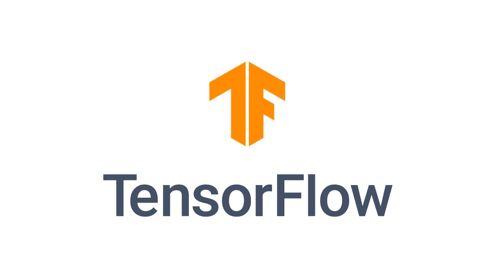

# 通量比张量流好吗？

> 原文：<https://towardsdatascience.com/is-flux-better-than-tensorflow-d39d3ba8c0ce?source=collection_archive---------8----------------------->

## 放松点。Flux 是机器学习库，不会让你张量！


(src = http://fluxml.ai)

# 什么是通量？

Fl ux 是一个机器学习库，用于多范例、快速、麻省理工学院开发的统计编程语言 Julia。Flux 的核心特征是取 Julia 码的梯度。换句话说，Flux 能够接受另一个 Julia 函数和一组参数，并返回一个梯度。Flux 是一个非常酷的包，因为它能够做很多 Google tensor flow 能够做的事情，但是是在一个“由用户开发”的包中。此外，Flux 具有用 Julia 编写的优势。虽然这也意味着 Flux 遭受了其他 Julia 软件包所遭受的同样的缺点，但是这种交换并不可怕。

[如果你想真正了解 Flux，我这里有一个关于在 Flux 中批处理和训练卷积神经网络的介绍性教程。](/a-swift-introduction-to-flux-for-julia-with-cuda-9d87c535312c)

# 什么是张量流？

Tensorflow 是数据科学工具箱中的经典工具。根本不会编程的人甚至知道 Tensorflow 是什么，这是有充分理由的:

> Tensorflow 太牛逼了。



https://www.tensorflow.org/(src =

Tensorflow 由“谷歌大脑团队”开发，并于 2015 年 11 月在 Apache 许可下发布。Tensorflow 为许多现代机器学习算法背后的梯度模型提供动力，包括谷歌、英伟达、高通、联想和数百家公司使用的算法。Tensorflow 不仅在 Python 中，而且在整个机器学习中已经成为一个主要部分。

# 我喜欢通量的地方

Flux 是一个很棒的机器学习框架，因为它带来了许多有趣的想法和一些非常酷和简单的语法。有很多个人主义在不断变化，但总的来说，好处归结为一些关键因素。

## 朱莉娅

你可能已经知道了，Flux 是给 Julia 的。用 Julia 编写的 Flux 比用 Python 编写的软件包有很大的优势。Julia 是一种快得多的语言，在我看来，它的语法比 Python 好(这是我个人的偏好。)

然而，这也带来了巨大的代价。Julia 在很大程度上仍然是一门相对较新的语言，其用户基础远不如 Python。在这种情况下，Julia 失去了像 Python 这样庞大的语言所带来的大量支持。这意味着虽然 Flux 在某种程度上可能是更好的解决方案，但它不一定适用于所有情况。这是因为你很难找到任何打嗝的答案。首先很难找到学习如何使用这种语言和软件包的文档，尽管这正在稳步改善。

## 很酷的语法！

我之前说过，比起 Python，我更喜欢 Julia 的语法。虽然这纯粹是主观的，但不主观的是 Julia 语言的可变性，随之而来的是一种完全不同的、非常酷的在 Julia 内部创建渐变模型的方式:

> 句法表达

这些真的很酷，如果你想了解朱莉娅，你一定要好好看看它们。它们主要用于两种特定情况:

*   环

```
f(w) = v = v + 5 for v in w
```

*   功能操作

```
f(w) = w + 5 - 6
```

然而，Julia 中的语法表达式可以以数百种其他方式使用，这些方式都很有趣，使程序员更加容易和直观。

> 但是这如何适应通量呢？

Flux 充分利用了这些通用表达式，并将它们作为整个库的基础。看一看 Flux 文档中的这个例子:

```
julia> **using** Flux
julia> f(x) = 3x^2 + 2x + 1;  
julia> df(x) = gradient(f, x)[1]; *# df/dx = 6x + 2*  julia>
df(2) 14  
julia> d2f(x) = gradient(df, x)[1]; *# d²f/dx² = 6*  
julia> d2f(2) 6
```

# 我喜欢 Tensorflow 的地方


(src = http://Google.com/)

Tensorflow 以一种完全不同的方式拥有自己的语言优势，Python 是一种非常通用的语言，因为大多数其他高级语言都能够与之接口，而且它是基于 c 的。然而，Flux 和 Julia 的致命弱点绝对是 Tensorflow 和 Python 的流行。

## 很容易找到帮助

使用任何受欢迎的东西的好处；正如需求随着供应而增长，可用性随着用户而增长。使用产品的人越多，关于产品的对话就越多，这对于 Tensorflow 或 Flux 这样的工具来说是绝对有用的。

## 遵循规则

我可以推测，数据科学家在尝试使用 Flux 时会遇到的一个大问题是，很多事情的处理方式都与其他地方截然不同。Flux 使用一种非常特定于语言的语法，这种语法不符合高级 ML 代码的典型类型。然而，在对冲的另一边是 Tensorflow，他采取了完全相反的方法，并倾向于符合机器学习内部已经建立的东西。

## 庄严的

毫无疑问，Tensorflow 臭名昭著。这是有道理的，因为 Tensorflow 不仅在这个行业存在的时间更长，而且还得到数据巨头谷歌的支持。说到底，对于一个拥有数百万开发人员的企业来说，使用一个工具来维护和改进软件要比少数几个 Github 维护人员容易得多，这些维护人员甚至不得不去做他们的日常工作。

# 结论

我认为 Flux 非常酷，我非常喜欢在其中工作。Tensorflow 在我心中有一个特殊的位置，但看到更多的人在他们的模型中使用 Flux 肯定会很有趣。Flux 带来了一些非常酷的想法，虽然这使它非常独特，但它也有一个非常陌生的用法。通量会取代张量流吗？很可能不会，也不可能，但是通量能代替张量流吗？

> 是啊！

Julia 当然仍然是一个婴儿，许多软件包都徘徊在足够包容的边缘，可以依赖，但不管它年轻与否，Julia 肯定是数据科学中现在和未来的一种伟大语言。谁知道呢？在 10 到 15 年内，我们很可能会看到 Julia 的使用激增，随之而来的还有 Flux 的使用。