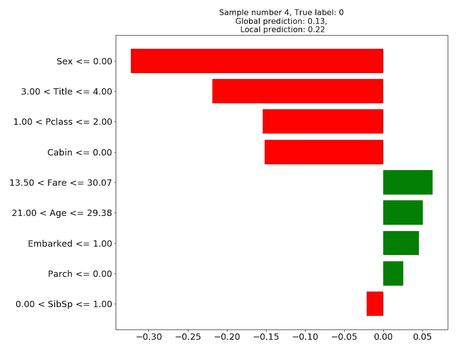
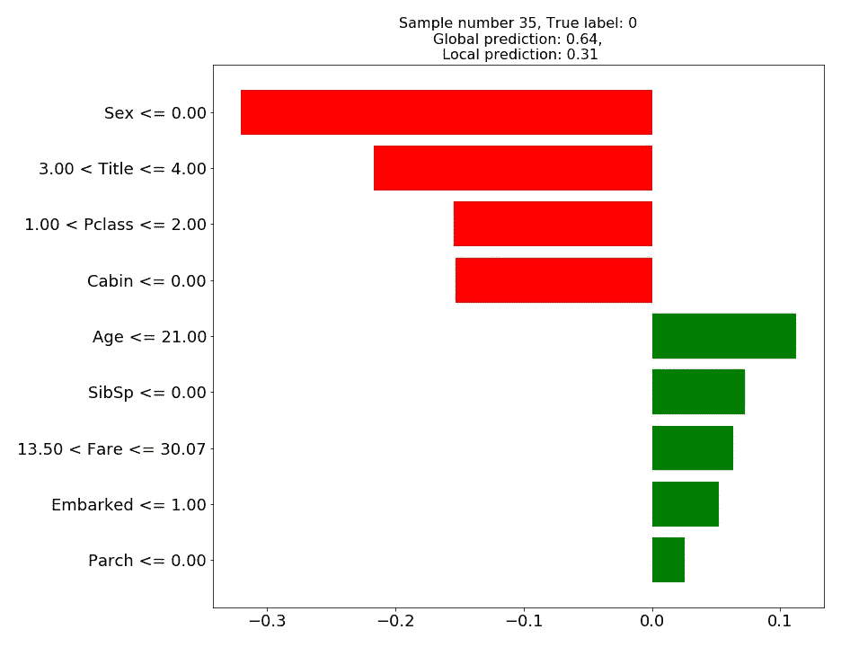
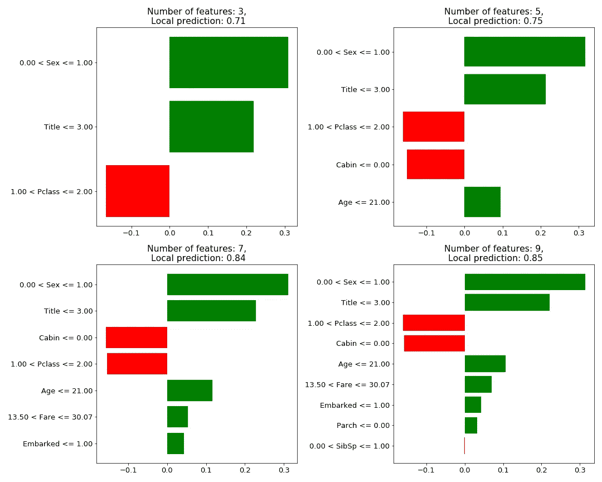
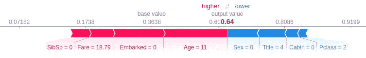
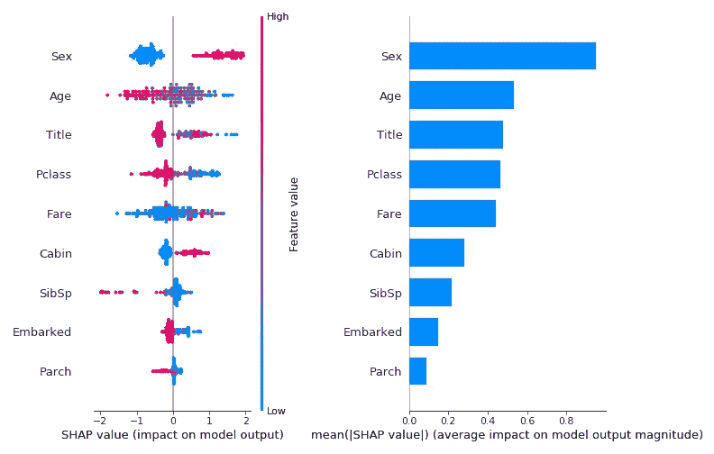

# 容易解释吗？局部可解释性

> 原文：<https://towardsdatascience.com/is-it-easy-to-explain-local-explainability-4f325565210c?source=collection_archive---------21----------------------->

## 我为什么要相信你的解释？对最常见的解释方法，它们的优点和局限性有更批判性的观点。随着对可解释性需求的增加，越来越多的公司、专业人士和组织引入了一些方法来为他们的模型产生解释。然而，这些方法能实现吗？我们能相信他们的结果吗？

照片由[安德里亚斯亲切的](https://unsplash.com/@jxndreas?utm_source=medium&utm_medium=referral)在 [Unsplash](https://unsplash.com?utm_source=medium&utm_medium=referral) 上拍摄

在这篇博文以及已经发表的另一篇博文中，我们旨在调查非线性模型可解释性的现有方法，重点关注实用性、局限性以及现有实现方法的开箱即用行为。
**在当前的**博文中，我们将着重于局部解释。
链接到**上一篇关于全局可解释性的博文**可以在 [**这里**](/is-it-easy-to-explain-part-i-global-explainability-in-boosted-trees-cac51ae63a4c) 找到。

如前一部分所述，可解释性方法大致可以分为全局解释和局部解释。虽然当我们处于研发阶段时，从整体上对模型进行说明更有意义，并且可能对专业人员(如数据科学家)更有用，但本地解释也意味着对最终用户的解释。这些人可能是监管者、公司或从模型预测中受益的人。这意味着给出正确的解释是不够的。你还需要它对人类来说清晰易懂(你可以在米勒的综述(1)中读到更多关于什么构成了“好的”解释)。重要的是，当解释是出于监管目的时，你需要它提供一些保证，你所看到的确实解释了预测。

**在这篇博文中**我将讨论现有的两种最流行的局部可解释方法:

1.  [石灰](https://github.com/marcotcr/lime)
2.  [SHAP](https://github.com/slundberg/shap)

这篇文章中使用的所有代码的笔记本可以在这里查看。

# 模型和数据

我将在这一部分使用的数据是 Kaggle 的经典“**泰坦尼克号:机器从灾难中学习**”。关于数据集的更多细节可以在[这里](https://www.kaggle.com/c/titanic)找到。我所使用的数据的预处理阶段是非常基本的，可以在上面 ***链接的知识库中查看。***

我选择使用的型号是 **XGBoost** 。这是一个基于决策树的集成模型。关于树集合模型和 boosting 的简要说明可以在本系列的第一部分中找到。

完整的 XGBoost 类，也包括使用贝叶斯优化的超参数搜索，可以在这里找到。该类的当前用法:

# **石灰**

关于石灰已经写了很多，也说了很多。我不会进行太多的技术解释，这些可以在许多其他来源中找到(例如在[这本伟大的书](https://christophm.github.io/interpretable-ml-book/lime.html)或[的文档](https://eli5.readthedocs.io/en/latest/blackbox/lime.html))。但是，简单地说，我将解释基本的想法，并转移到实际应用和限制。

总的来说，这个想法很简单:问题的整个空间是复杂的，因此不能用简单的线性模型来建模，所以我们改为训练一个更高容量的“黑盒”模型。然而，给定一个特定的实例(样本)和它周围的一个小环境，我们也许可以假设**局部线性**，在这个局部环境上训练一个线性简单模型，并产生一个“实例相关”的解释。这个简单的线性模型被称为**代理模型。** 局部训练的数据是通过置换我们想要解释的感兴趣的实例获得的。使用欧几里德距离度量，通过它们与原始样本的距离对生成的样本进行加权。标签是通过探测我们的黑盒模型获得的。

需要记住的一件非常重要的事情是，代理模型是我们模型的近似模型，而不是精确的复制品。因为(a)局部线性是一个假设，并且(b)我们产生一个**单独的**训练模型，该模型具有 K 个特征、N 个样本和来自不同于基本事实的分布的标签。原始模型和代理模型并不总是产生相同的预测。

让我们将石灰解释应用到测试数据中的几个例子。

理论上，使用石灰可以像运行这两行代码一样简单:

然而，要用 XGBoost 运行 LIME，我们需要生成一个包装器类(存储库中的主函数),它处理一些输入输出匹配。

以下图的类别用途:

**>样本#4:男性，年龄= 27 岁，头衔=先生……没有活下来**

图 1:测试样品 4 的石灰说明

在图 1 中，我们可以看到局部线性模型的预测(0.22)与全局模型的预测(0.13)相对接近。根据当地的模型，这位先生的死亡预测主要是因为他是一个“他”和一个“先生”，属于 C 类，而他的年龄会对他有利。最后，他的家庭地位(Parch，SibSp)似乎在预测中起很小的作用。
解释不是很明确，特别是对于连续的特征。虽然 27 岁似乎有助于生存，但这是否意味着年龄越大或越小越糟糕呢？多少钱？

让我们看另一个例子:

**>样本#35:男，年龄= 11 岁，头衔=先生……没有活下来**

图 2:测试样品 35 的石灰说明

这种情况展示了局部预测(0.31)和全局预测(0.64)之间可能的**不匹配**。事实上，看起来本地模型比全球模型更准确，因为这个个体根据真实标签没有存活下来。我们的代理模型是“正确的”,而我们的 XGBoost 模型是“错误的”,这是一个巧合，而不是一个特征。
代理模型应该解释**我们的复杂模型**的预测，不管它是对还是错。在我们开始考虑解释的正确性或质量之前，他们的预测将是相同的，这是非常重要的。

LIME 方法的另一个潜在缺点是需要手动选择我们的代理模型将要训练的特性的数量，以及定义本地环境大小的内核的大小。

理论上，LIME 优化器应该最小化复杂性，从而最小化特征的数量，同时最小化损失，从而得到一些最佳的特征数量。实际上，我们需要将特征的数量(K)传递给模型。这影响了解释的稳定性，如下所示:

**样本#42:女性，年龄=63 岁，头衔=夫人…幸存**

图 3:具有不同 K 值的测试样品 42 的石灰说明

看起来改变 K 对结果有潜在的两种影响:(1)它可以稍微改变局部预测值，以及(2)它可以改变顶部选择的特征，当从 5 个特征转移到 7 个特征时可以注意到。当选择 K=5 时，第三个重要的特征是“Pclass ”,而当选择 K=7 时，特征“Cabin”占据这个位置并将“Pclass”向下推一位。对这种现象的部分解释是特征依赖。一些特征只有在与其他特征相结合时才能成为“好的”预测器。因此，只有当“足够”的特征被允许用于训练时，组合才是可能的。
由于 K 是手动给定的，因此缺乏稳定性是一个主要缺点。对于相同的训练模型和测试集，使用不同的 K 可能会改变解释(特别是如果它是基于前 X 个特征的子集)。

虽然石灰简单易懂，相对容易使用，但它也有许多缺点。即，局部线性假设，需要手动定义 K 个要使用的特征，主要是替代模型预测和我们的复杂模型预测之间的潜在不一致。最后，LIME 输出的值似乎缺乏比较价值和意义。每个特性的价值代表什么？这些值和本地模型预测之间的关系是什么？给定多个样本，看看它们在 LIME 中的特征值，能推断出什么吗？

# SHAP

[SHAP](https://arxiv.org/abs/1705.07874) 是一个基于 shapley 值方法的局部可解释模型。Shapley 值法是一种有理论基础的博弈论方法，主要缺点是计算量大。
SHAP 通过提出两个子方法解决了这个问题:KernelSHAP 和 TreeSHAP。因为我们试图解释我们的 XGBoost 模型，所以使用 TreeSHAP 模型更有意义。但首先，我将简要说明沙普利价值方法和 SHAP 的主要创新。

在匀称的价值观中，我们把我们的特征(或它们的组合)视为玩家。这些玩家可以组成“联盟”玩游戏。一场比赛的结果是我们的预测。**我们的目标**是计算一个特征对不同联盟预测的平均贡献，并与所有实例的平均预测进行比较。匀称的价值就是来自这一特征的贡献。然而，随着特性数量的增加，遍历所有的联盟成指数级增长。这就是 SHAP 应该帮忙的地方。

KernelSHAP 将解决方案视为之前引入的石灰和 Shapely 值的组合。这个想法是训练一个代理模型来学习不同联盟的价值。在不同的排列中，缺少一些特征。缺失的特征由来自其边缘分布的样本代替(很像第一部分中描述的全局置换方法)。**与 LIME** 不同，联盟不是根据距离度量(欧几里德)而是根据联盟理论(大和小排序更重要)来加权的。
在这篇博文中，我们不会讨论 KernelSHAP，但是需要注意的是，它有一个置换方法的主要缺点:当置换一个不存在的特征时，它忽略了特征之间的任何依赖关系，因此产生了许多不真实的组合。此外，虽然许多公司将 SHAP 值视为 shapely 值，因此对其正确性有数学保证，但 KernelSHAP 是一种**近似**方法，并不能给出精确值。

**TreeSHAP** 提出了一种算法，该算法随着特征的数量以多项式速率增长。此外，Shapley 值的可加性意味着我们可以通过对单个树进行加权平均来计算树集合的 Shapley 值。TreeSHAP 算法只采用树中“允许的”路径，这意味着它不包括置换方法中的非现实组合。相反，它采用某个联盟“可到达”的所有最终节点的加权平均值。

让我们看一个类似 LIME 的例子，用 TreeSHAP 来解释这个预测。

**>样本#35:男性，年龄= 11 岁，头衔=先生……没有活下来**

红色箭头表示提高预测的要素，而蓝色箭头表示降低预测的要素。基本值是所有预测的平均值。输出值是全局模型输出。每个特征旁边的值是目标样本中该特征的实际输入值，**而不是 shapley 值！**最后，虽然箭头的大小与推力的大小成正比，但它们实际上是用对数比数而不是概率来衡量的。下面将详细介绍这一点。

看一下这个具体的例子，我们可以发现石灰预测的两个主要差异:

1.  SHAP 解释了我们模型的预测。也就是说，它不会训练另一个模型，因此让我们的解释者预测和解释不同的结果是没有危险的。
2.  TreeSHAP 着眼于与一般基值相比的特征重要性，而 LIME 训练局部模型。这意味着，当在本地环境之外观察时，一些特征，如年龄，可能具有相当不同的影响。

## **SHAP 工作空间:对数优势与概率**

在分类中，很容易将全局输出视为一个类的概率，一个介于 0 到 1 之间的值。然而，它不是可加的。因此，TreeSHAP 在对数优势空间中工作，输出 shapley 值作为对数优势贡献。由于对数优势空间中的输出很难解释，因此将其转换回概率是有意义的。这是通过使用上面的可视化函数中的“链接”参数来完成的，事实上，力图的可视化刻度标签显示的是概率。但这只是变换了轴(现在不是线性的，因此分布不均匀)，而不是单个的 SHAP 值。如果出于某种原因，您需要特性的单个 SHAP 值，您只能使用**近似法**来获得它们(至少是有效的)。您需要将输出值和基础值转换为概率，并拉伸它们之间的 SHAP 值。
***注*** :在最新版本(0.34)中增加了一个*model _ output = ' probability '*的选项。使用此选项，我们可以使用 DeepSHAP 重定标器直接将 SHAP 值转换为概率。然而，它只适用于“干预性”特征扰动，这意味着它使用因果推理规则来打破特征之间的依赖关系，并需要背景数据集。

## SHAP 全局可解释性

这一部分可能属于“第一部分:全局可解释性”的博客文章，但是我认为在这里，在阅读了关于 SHAP 的解释之后，会更好地理解。

SHAP 可用于使用所有本地实例的组合或平均来进行全局解释。为此，我们可以使用“条”选项和“点”选项绘制汇总图，以生成两种类型的图:

左侧图中的每个点都是单个要素的单个实例中的 shapley 值。颜色代表该特定实例中的特性值。在右图中，我们可以看到所有实例中每个特征的平均 shapley 值。虽然右边的图产生了“特征重要性”的一些版本，如在全局可解释性部分中所描述的，但是在这种情况下，重要性值表示特征影响结果的程度，而不是模型性能或模型构造。然而，右边的图没有显示影响的方向，此外，也没有显示特征值和特征影响之间的相互作用。这些可以在左图中看到。看左边的图，我们可以清楚地看到一些特征(性别，客舱等..)在他们的价值和**的影响方向之间有很强的关联。**另一个选项(有点类似于 SibSp 特性)是在值和**影响幅度**之间建立强关联。

# 摘要

*   虽然相对简单且易于使用，但石灰法不能满足监管机构的要求，应谨慎使用，以确保最终用户的可解释性。事实上，代理模型可以潜在地解释一个完全不同的预测，这是令人担忧的。
*   SHAP 方法有很多优点。首先也是最重要的，源于博弈论，背后有数学证明。这对监管者来说当然是很有吸引力的。其次，它解释了预测本身(考虑到时间因素，这并不明显)。第三，至少对于 TreeSHAP(但是对于 KernelSHAP 来说**不是**),它通过只使用有效的树路径消除了所有排列方法中的依赖性问题。最后，对 SHAP 值的解释是相对直观的:“每个特征导致偏离基准值的程度”。记住这一点，并不是一切都是完美的。SHAP 解释仍然缺少对反事实解释的引用(改变特征的值将如何影响结果)。此外，与 LIME 给出的简单解释不同，SHAP 提供的解释包括所有功能，这很难让人理解和使用。
*   虽然没有在本文中讨论，但是 LIME 和 KernelSHAP 也可以用于非结构化数据，比如图像和文本。对于这样的数据，两种模型都依赖于额外的强假设和启发来产生将被使用的特征。然后，在 SHAP 置换这些特征是幼稚的，不一定有任何意义。
*   最后，两篇博文中回顾的大多数方法都将特性视为独立的个体。它们既没有解决特征相关性，也没有解决特征依赖性。但是，虽然像 TreeSHAP 这样的方法解决了特征依赖偏差，但是没有一种方法在解释中结合了一个以上的特征。也就是说，他们忽略了“整体大于部分之和”的现象。这是所有解释方法的一个主要缺点。

## 参考

1.  米勒蒂姆。"人工智能中的解释:来自社会科学的见解."*人工智能*267(2019):1–38。
2.  [https://christophm.github.io/interpretable-ml-book](https://christophm.github.io/interpretable-ml-book)