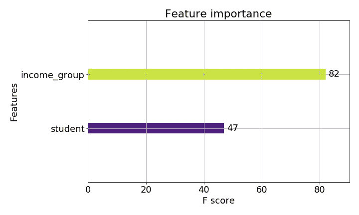
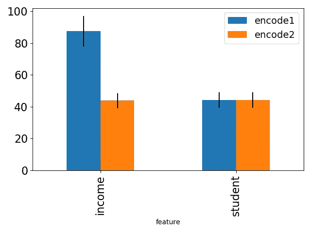
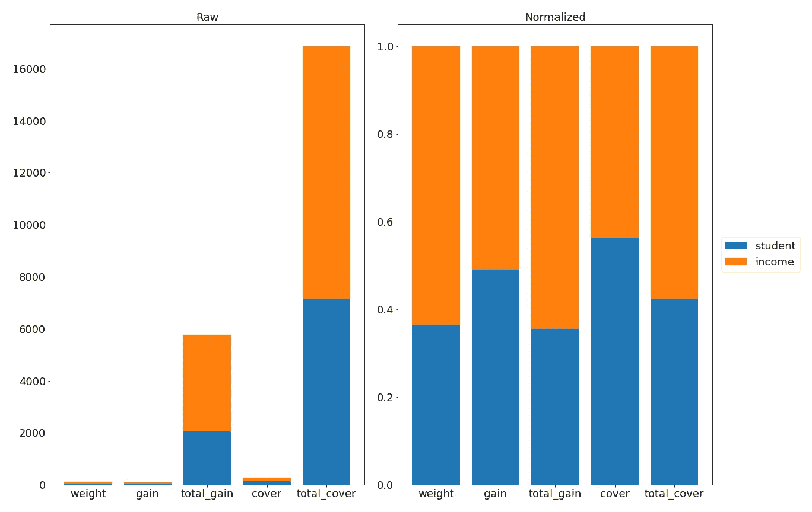
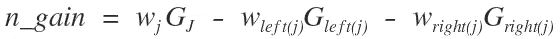
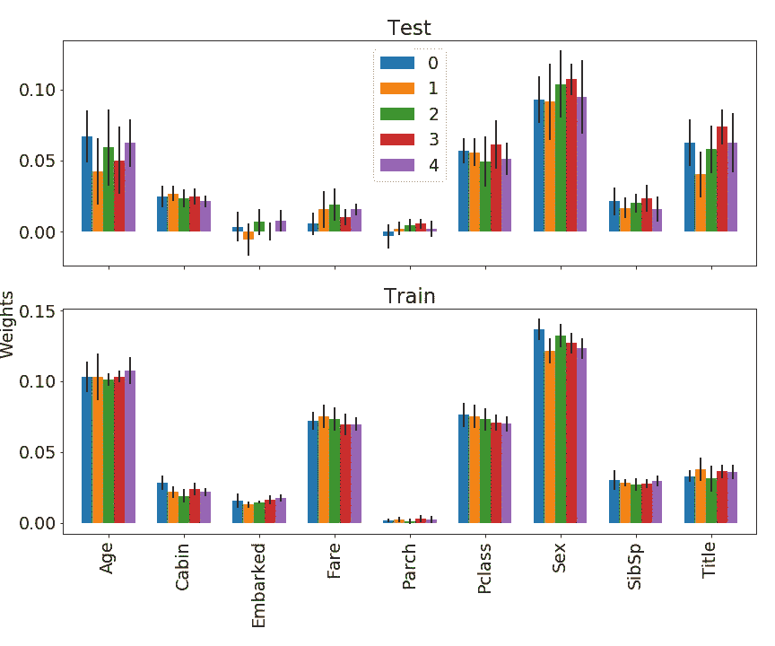
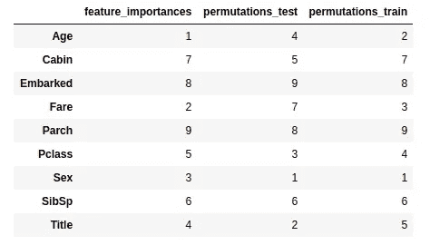
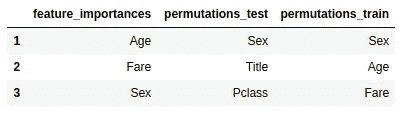
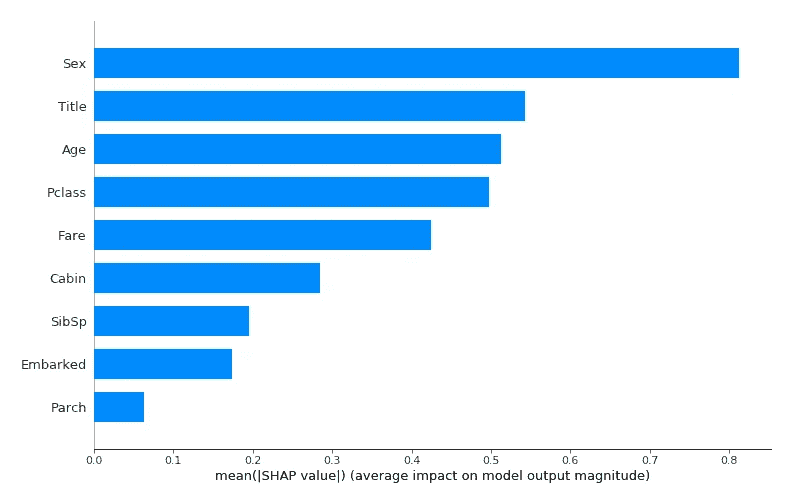

# 容易解释吗？增强树的全局可解释性

> 原文：<https://towardsdatascience.com/is-it-easy-to-explain-part-i-global-explainability-in-boosted-trees-cac51ae63a4c?source=collection_archive---------18----------------------->

## 我为什么要相信你的解释？对最常见的解释方法，它们的优点和局限性有更批判性的观点。随着对模型可解释性需求的增加，越来越多的公司、专业人士和组织引入了一些方法来为他们的模型产生解释。然而，这些方法能实现吗？我们能相信他们的结果吗？

[毛绒设计工作室](https://unsplash.com/@plushdesignstudio?utm_source=medium&utm_medium=referral)在 [Unsplash](https://unsplash.com?utm_source=medium&utm_medium=referral) 上的照片

在这篇博文以及以后的一篇博文中，我们的目标是调查现有的非线性模型可解释性的方法，重点关注实用性、局限性以及现有实现方法的开箱即用行为。
**我们将从**全局解释开始，特别是那些在树和提升树上实现的解释。一篇关于本地可解释性的**未来文章**的链接将会在发表后添加到这里(很快……)

随着模型变得越来越复杂，它们通常也变得更像一个“黑箱”。虽然准确性似乎有所提高，但在许多领域这还不够。为了让人们和监管者相信模型做出的预测，他们通常需要推理——理解**什么** **导致**模型做出某种预测。此外，研究、开发、尤其是调试黑匣子几乎是不可能的。对模型中活跃力量的洞察有助于数据科学家和专业人员更好地理解他们的模型以及模型何时更有可能失败。

虽然存在许多解释的方法，我们可以粗略地把它们分成两大类:(1)全局解释和(2)局部解释。
全局可解释性努力从整体上展示关于模型的一些东西，从整体上接近它，而局部解释与小环境或特定实例相关。

全局可解释性对于“幕后”目的特别有用。当我们想要了解我们的模型依赖于哪个特性，并且能够调试它，识别数据泄漏或者考虑执行特性选择时。

**在这篇博文**中，我将关注三种不同的**全局可解释性**方法:
**1** 。树构建措施(特征重要性)
**2** 。
**模型评分措施(排列)3。**全球化的本地方法(SHAP)

这篇文章中使用的所有代码的笔记本可以在这里查看。

# 特征重要性

我将讨论的第一种全局可解释性方法是基于树的模型特征重要性。为了演示所提出的一些观点，我将首先创建一个合成数据集，并在其上训练一个 XGBoost 模型。这是一个非常简单的玩具数据，实际上并不需要所使用的 XGBoost 形式的“大枪”,但是请耐心听我说一会儿。

## 玩具数据和模型

一些背景:我们正在与一个非营利组织合作，该组织需要帮助从 18-25 岁的人群中识别潜在的奖学金候选人。获得奖学金最明显的条件是成为一所公立大学的学生。此外，平均收入对个人的机会也有影响。为了帮助他们，我们构建了一个 **XGBoost** 模型，该模型基于奖学金获得者的历史数据和这两个特征输出分类预测:
1。此人目前是否是学生
2。收入平均值根据四分位数分类:Q1(最低)，Q2，第三季度，第四季度(最高)。
由于 XGBoost 不能处理分类数据，我们必须进行标签编码或热编码。我们选择标签编码，因为四分位数显然有一个内部顺序。四分位数 1 将被编码为 0，Q2 被编码为 1，以此类推..

对于模型，如上所述，我们使用 XGBoost。这是一个基于决策树的集成模型。
简而言之，树集成模型属于两种方法中的任何一种:Bagging 或 Boosting。虽然 Bagging 利用组合来自多个树的多个决策来形成最终预测，但是 Boosting 更加动态。在提升中，学习是连续的，其中错误分类的样本在随后的学习器中被给予更高的权重。
XGBoost 代表“极限梯度提升”。梯度推进是推进的特例，而极端梯度推进是极端梯度推进。在梯度推进中，我们使用梯度下降作为优化器和损失函数。每棵树都试图恢复前一棵树的损失。

完整的 XGBoost 类，也包括使用贝叶斯优化的超参数搜索，可以在这里找到。该类的当前用法:

在训练了 XGBoost 模型之后，我们构建了我们的决策树集合。在这一阶段，人们很容易开始询问每个特征在构建树的过程中所扮演的角色。但是，由于这是一个树的集合，并且在一个梯度上有更多的树，简单地看树的节点和分支并推断这是不可能的。幸运的是，XGBoost python 模块有一个绘图 API，它提供了一个“plot_importance”函数，可以为我们绘制各种特性的重要性。这个函数可以作为黑盒，**但是我们实际得到的是什么呢？**

## **重量度量**

有趣的是，比较 XGBoost 中不同特性重要性的默认度量是**权重**。来自[文档](https://xgboost.readthedocs.io/en/latest/python/python_api.html#module-xgboost.sklearn):

> ***'*** *权重* ***':*** *一个特征被用于跨所有树拆分数据的次数*

对具有上述合成数据的训练模型使用 plot_importance 给出以下结果:

图 1:使用权重度量的特性重要性

结果似乎表明，收入群体比是否是学生更重要。但是，如果我们改变一个小事情:对收入组进行稍微不同的编码，那么现在我们在组号 0 而不是 1 之后:

接下来，我们在两个数据集“编码 1”和“编码 2”上训练模型 n 次(100 ),并绘制两者的平均特征重要性和标准偏差:

图 2:使用两种标签编码之间比较的权重度量的特征重要性。

突然间，学生特征和收入特征变得几乎同等重要！简单地改变编码会导致函数输出完全不同的结果。

这个非常简单的例子演示了使用“重量”度量时可能出现的一个主要问题。由于权重被定义为一个特征被用于分割数据的次数的**，因此与多分类/连续特征相比，它非常偏向于二元特征。简单地改变编码可以让模型对收入群体进行更少的划分，从而降低其重要性。但是一个特征所负责的分裂数量真的证明了它的重要性吗？**

## 其他功能重要性指标

图 3:使用所有可用指标的特性重要性

特征重要性函数为我们提供了更多的度量选项。上面我用所有选项绘制了重要性结果，原始(左图)和归一化(右图)。对比结果真的很混乱。对于特征重要性问题，每个度量产生不同的结果，不仅仅是绝对值，还有特征之间重要性的相对分布。那么哪个标准是正确的呢？哪个特性更重要？

通过检查每个度量标准，至少可以提供这些问题的部分答案。

> **增益** — *所有分割的平均增益用于*
> 
> **总增益** — *该特性在*中使用所有分割的总增益

***注*:**XGBoost 中的“增益”是指分割的平均值，而通常不是(此处与“总增益”相同)。

增益表示由于分离而获得的纯度。这由到达该节点的数据量来加权。
在**常规决策树**中，使用“基尼指数”计算增益:

c——类别总数

对于标签中的每个类，随机选取该类的概率乘以互补概率。

该指数是为每个节点计算的，增益由通过该节点的数据的纯度相对于子节点的纯度的增加来定义。完整的等式还包括基于到达每个节点的样本百分比的加权归一化:

w —到达每个节点的样本百分比，G —基尼指数

**在 Xgboost 中，所用的增益有点复杂。**有兴趣的可以在这里阅读文档[中的完整描述。](https://xgboost.readthedocs.io/en/latest/tutorials/model.html)

> **Cover** — *使用该特性的所有分割的平均覆盖率。*
> 
> **总覆盖率** — *所有分割特征的总覆盖率用于*

从代码文档中(不容易找到):“覆盖率是分类到叶子的训练数据的二阶梯度的总和，如果它是平方损失，这简单地对应于该分支中的实例的数量。节点在树中越深，这个度量就越低，这意味着，对于每个分裂，我们需要计算每个样本的二阶梯度，并乘以样本的数量。
对于 p(预测)和 y(真实标签)，在“reg:logistic”目标的情况下，成本函数是 **(y-p)，**，因此二阶导数是常数。而对于“二元:逻辑”目标的情况，成本函数是**-(y * log(p)+(y-1)*(log(1-p))**，二阶导数(关于 x，用 p=1/(1+e^-x)是 p(1-p)。

查看图 3 和各种指标的定义，我们可以得出一些一般性的观察结果:

*   **权重**、**覆盖**和**增益**对每个特征参与的分割数量敏感。虽然**权重**随着分割数量的增加而增加，从而有利于具有更多面元的特征，但是如果分割发生在树的深处，则**覆盖**和**增益**随着分割数量的增加而减少，从而导致相反的效果。考虑使用“总增益”或“总覆盖”。
*   在选择用于评估和可解释性的指标时，另一个考虑是在创建树时查看 XGBoost 优化器使用的指标。如果没有参数传递给优化器，那么 XGBoost 的默认选择是“gain”度量(1)。

# 排列重要性

另一种推断特征重要性的方法是看当特征不存在时分数是如何被影响的。确切地说，这个特性并没有被完全丢弃，因为我们需要它来构建模型，而是被“噪声”所取代。噪声是从与原始数据相同的分布中抽取的随机值。为了避免需要为特征产生新的值，通过混洗现有数据来引入噪声。

## 数据和工具

对于这一部分以及以后的部分(包括未来的帖子)，我将使用来自 Kaggle 的更复杂和更高维度的数据集:“**泰坦尼克号:机器从灾难中学习**”。关于数据集的更多细节可以在[这里](https://www.kaggle.com/c/titanic)找到。

**eli5** 包提供了与许多模型兼容的排列重要性包装器。我们将使用它。
***注*** :我们用于排列重要性计算的测试集是**不是**ka ggle 提供的测试集，而是从训练前的训练集分离出来的随机生成的测试集，因此有标签。

eli5 置换功能重要性函数的最基本用法如下所示。

使用这个函数，我连续五次置换测试集和训练集，收集输出并绘制它们:

图 4:根据训练集和测试集计算的排列特征重要性

y 轴显示了不同特征的权重，即导致置换该特定特征的得分的减少。值越高，影响越大，因此特性的重要性也越大。
不同颜色的条代表整个函数的单独运行，而误差条代表由排列产生的运行内标准偏差。

**应该用训练集还是测试集？**直观上，评分的评估应该在测试集上进行，因此特征重要性也是如此。具体来说，我们希望了解模型没有训练的样本上的特征的重要性，从而使用测试集。或者，出于调试目的，我们可能想要评估我们的模型。在这种情况下，我们希望了解它在多大程度上需要一个特定的特征来进行预测，然后使用训练集可能更有意义。
最后，也许**比较**训练集和测试集之间的排列重要性可以给我们最深刻的见解。特别是，训练集和测试集中的特征的顺序和重要性之间的不匹配可以揭示我们的模型中缺乏泛化能力。

在任何情况下，是否使用测试集、训练集或比较它们的决定应该基于我们的目标:我们想要评估我们的训练过程还是我们想要评估新数据上的特征的使用。

**应该如何处理方差？**内部方差(运行中的标准偏差)和交叉方差(图 4，不同颜色的条)都存在。这当然是由于算法中的随机性，以及当我们将排列等同于“丢弃特征”时，我们实际上是在使用现有的值，这可能导致所有不同的组合。特别是在小数据集，这甚至可以导致组合，甚至增加分数。当然，这种变化是有问题的，但是可以通过平均重复次数来稳定。

**如何处理特征依赖和关联？**这是该方法的一个主要问题(事实上，也是大多数被审查方法的主要问题)。相互依赖的特性的重要性只有在一起衡量时才有意义。考虑到它们的组合，它们将成为强有力的预测器，而它们中的每一个单独也不能解释输出。目前在库中没有一个选项来排列特征的组合。

此外，随机排列的相关特征可能会导致不太可能的组合，这些组合可能被认为是不符合分布的。这可能会产生偏差，导致表示“特征丢失”情况的错误值。

# 比较和对比

为了比较所讨论的方法，我们将查看排列部分中出现的相同的巨大数据。我们将比较所有特征的重要性排序(忽略实际值): XGBoost 特征重要性函数与测试集上的“总增益”度量和置换方法以及训练集上的置换方法。

上表显示了每种方法的特性重要性排序。根据该方法，排名#1 的特征是最重要的特征，而排名#9 的特征不太重要。
从表中可以很容易地看出，虽然在测试数据上计算的排列和在训练数据上计算的排列之间存在一些相似性，但是使用总增益方法与特征重要性的相关性很小。事实上，在所有三个模型的前三个特性中，只有一个特性是三者共有的:

有趣的是，但并不奇怪(如果你读了这篇博文的第一部分)，特征重要性明显优先于连续/分类特征，如年龄或费用。请注意，即使我们使用一次性编码并将合成特征之间的得分相加也是如此(如果您使用诸如“增益”之类的平均重要性度量，则不能直接这样做)。

最后，为了与一种已知的局部方法进行比较，这种方法有更多的理论基础，我们还将与 SHAP 方法进行比较。关于局部预测的 SHAP 方法的更多解释，你可以在即将发布的《局部可解释性 ***系列文章中阅读。不过，在这里，我将对测试集中的所有实例使用 SHAP 方法，并对它们进行平均，以产生一个全局解释。***

图 5:使用平均 SHAP 值的全局解释

在上图中，我们看到各种特性的**平均绝对值 SHAP** ，因为它们是在整个测试集上计算的。这里的一些更“重要”的特征在先前测试的全局方法中也排名较高(性别、年龄、费用)，而其他特征(客舱、头衔)在全局方法中排名相对较低，但是当使用局部方法进行全局观察时，似乎具有更大的影响。总的来说，SHAP 方法似乎产生了一种其他两种方法的混合结果，对分类(标题)、连续(年龄)和二元(性别)特征都给出了较高的排名。我们将在以后的博客文章中讨论它的优点和局限性。

# 摘要

*   我们讨论的这两种方法各有优缺点，但是虽然特征重要性方法只适用于基于树的模型，但是置换方法是模型不可知的，并且被广泛使用。
*   置换方法可用于训练集或测试集(或两者)。这是一个重要的决定，它取决于解释的目标。比较特征对训练集的贡献和对测试集的贡献，一方面可以帮助理解模型的泛化，另一方面可以发现过度拟合。
*   在置换方法中忽略特征依赖性和相关性意味着被评估的许多组合实际上是不可能的，但是用作比较模型性能下降的参考。
*   也许这些方法最明显的限制(剧透:这些方法也将在以后的文章中介绍，将处理局部可解释性)是不能产生交互相关的解释。即使在我们超级简单的玩具数据中，两个特征(作为学生或收入群体)都不能单独解释这个结果。这是他们的组合(作为学生**和**属于收入组 1)造成的结果，然而没有一种方法可以产生这种解释。

总的来说，虽然还没有方法被证明能够完整地回答“在我们的模型中，哪些是最重要的特征”这个问题，但是“重要”到底是什么意思还不是很清楚。重要性应该反映我们的模型在构建过程中最依赖的特征吗？或者是那些最有帮助的概括？或者，也许我们应该看看能够实现最佳平均精度的特性？
与此同时，似乎通过仔细检查我们的数据(依赖性、二进制对分类对连续特征)并牢记特定的意图，我们可以开始在这些方法之间导航。

## 参考资料:

1.  [https://homes.cs.washington.edu/~tqchen/pdf/BoostedTree.pdf](https://homes.cs.washington.edu/~tqchen/pdf/BoostedTree.pdf)
2.  [https://christophm . github . io/interpretable-ml-book/](https://christophm.github.io/interpretable-ml-book/)