# 有没有可能不用编码就做出机器学习算法？

> 原文：<https://towardsdatascience.com/is-it-possible-to-make-machine-learning-algorithms-without-coding-cb1aadf72f5a?source=collection_archive---------32----------------------->

## 我准备了一个简单的应用程序，向您展示在一个叫做 Orange 的有趣工具的帮助下，这是如何实现的。

马库斯·温克勒在 [Unsplash](https://unsplash.com/s/photos/machine-learning?utm_source=unsplash&utm_medium=referral&utm_content=creditCopyText) 上的照片

我坚信，用代码制作自己的机器学习算法或任何预测模型的前一步是理解基础知识，并知道如何理性地解释模型。

很多时候，当我们将机器学习或数据分析模型与编码联系在一起时，我们认为建立它是一项非常困难的任务。这里你还有另一个障碍要解决！但是，如果你一开始就专注于理解其背后的理论，那就不一定了。这里有一个小指南来帮助你完成这个过程。

## 目录:

> 1.数据分析的重要性。(1 分钟读取)
> 
> 2.机器学习贡献。(1 分钟读取)
> 
> 3.理解基础知识:数据验证过程，不平衡数据集，监督和非监督方法。(2 分钟读取)
> 
> 4.决策树和随机森林介绍。(2 分钟读取)
> 
> 5.应用程序使用橙色。(6 分钟读数)

# 1.为什么选择数据分析？

如今，我们可以从成千上万的数据源中提取、转换和加载数据，包括股票价格、医疗记录、调查、人口普查和记录行为等。此外，我们可以应用这些技术的领域非常广泛，每个领域都有广泛的有用应用，例如欺诈检测、信用评分和与金融领域相关的资产分配。

但是我能用这些知识为一家公司做多少贡献呢？ 很多！就把自己放在银行信贷风险分析师的位置上。我应该借钱给这个客户还是拒绝他的申请？我应该要求他或她提供多少信息，而不冒失去与贷款相关的利率的风险？他的定期工资单够了吗？还是我也要问他其他金融机构的信用记录来保证还款？”。数据分析和机器学习模型在自动化日常任务(如本任务)、处理大量信息和优化指标以增强业务可持续性方面发挥着重要作用。

> 最终目标是对数据做出有意义和可解释的推断，提取变量之间的关系，并检测模式以预测变量的结果。

我们来看看**科技公司**的案例。为了实现和增长他们的商业价值，他们的重点必须放在**提高业务指标和取悦用户上**。数据分析为这些公司提供了不断变化的**洞察力**和**指标**，使他们能够打造更好的产品。**使命**:了解用户，所提供的产品如何融入他们的生活，他们的动机是什么，他们的体验如何，以便改进它。所有这些以及更多的都可以通过使用数据来实现。

# 2.机器学习在这一切中扮演了什么角色？

实话实说，**在你的公司预算中可能不需要机器学习**。这是为什么呢？因为大多数公司需要在流程、客户体验、成本降低和决策制定方面进行改进，所有这些都可以通过实施传统的数据分析模型轻松实现，而无需借助更复杂的 ML 应用程序。

尽管如上所述，传统的数据分析模型是静态的，并且对于快速变化的非结构化数据输入的使用**有限，这些数据会快速且不断地发生变化。这时，对能够分析数十种输入和变量的自动化流程的需求就出现了。**

此外，两种方法的**解析过程**有很大不同，因为 ML 模型侧重于从用户处接收已确定目标的输入，并从快速变化的数据中学习哪些因素对实现该目标很重要，而不是由用户设置将决定目标变量结果的因素。

> 它不仅允许算法进行预测，还允许算法与预测进行比较，并调整结果的准确性。

# 3.了解基础知识:

***数据验证过程:*** 在执行机器学习算法并选择我们可以分析数据的最佳方式的过程中，我们将其分成两个子集:*训练子集*和*测试子集*，以便*将*我们的模型与**训练数据**相匹配，并对**测试数据**进行预测，作为对现实问题**的模拟。**

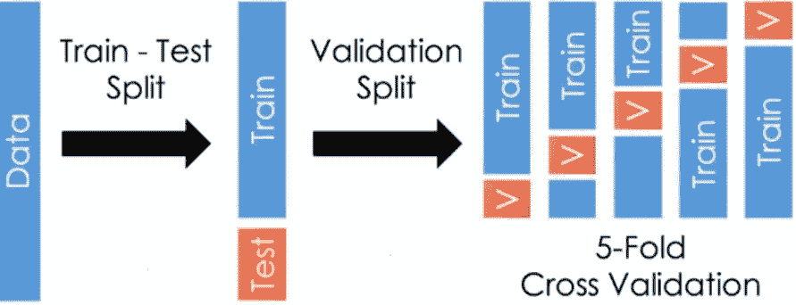

作者图片

我们如何执行数据分割并不简单，因为我们不想**偏向**任何子集。例如，在处理一个公司客户样本的数据时，我们不希望分割训练和测试子集，而不在两个子集中包含每个类别的**同等代表样本。因此，我们说数据拆分必须以**分层**和**随机**的方式进行。**

***不平衡数据集:*** 当一个类的实例比另一个类的实例多得多时，就称数据不平衡。在数据分类过程中，模型可能没有足够的类实例来了解它，结果会使分析产生偏差。

作者图片

有几种采样方法可以处理这个问题，包括*欠采样、过采样、合成数据生成和成本敏感学习。*在本文中，我将深入探讨过采样。

***监督和非监督模型:***

*   **监督学习**:包括手动告诉模型我们想要为训练数据集预测什么标签。
*   **无监督学习**:由于我们不知道标签，我们要求模型根据每个元素具有的更明显的特征来对数据集中的元素进行分组。

# 4.决策树和随机森林简介

**决策树**算法的结构是关于数据集中观察值的问题和答案的层次结构，以帮助模型进行分类。下面的方案就是一个例子，它简化了确定棒球运动员工资的基本问题结构:

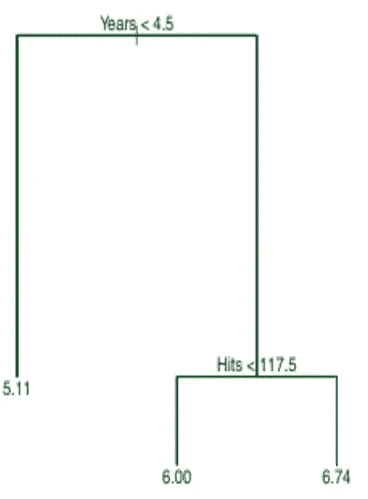

决策树示例—作者图片

在该图中，我们看到了一个两级决策树的表示，其中第一步分类与个人作为职业球员的年数相关，而回答该问题的条件是每个赛季的命中数。在这个例子中，联盟中每个球员的工资将按照这个模型的指导方针来确定。

> 最合适的模型将是更好地代表所研究的变量之间的实际关系的模型(如果棒球运动员的工资和多年的经验是线性相关的，那么线性回归可能是最合适的模型)。随机森林是各种技术之一，这些技术允许我们表示变量之间更复杂的关系，这些关系不一定是线性的、指数的或对数的。

例如，在一个球员的经验少于 4.5 年的情况下，他的工资的决定完全取决于他的职业经验，而不是击球次数。

问题方案的最终目标是**以一种尽可能不同的方式分割观察结果**。最后，将根据满足的不同条件对观测结果进行分组:

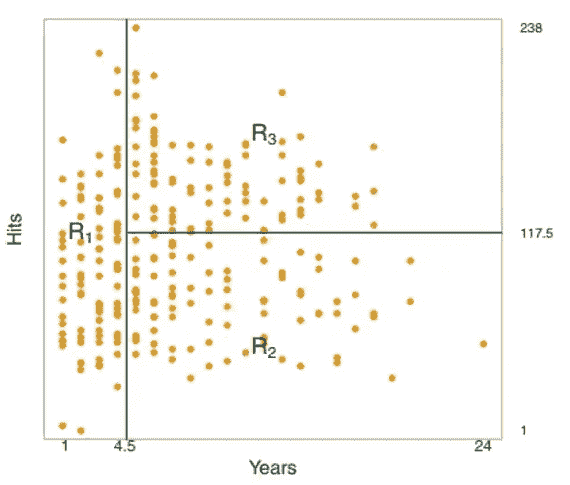

决策树分类示例—按作者分类的图片

# 随机森林

利用决策树的分类机制是基于大量个体树的“集合”。让我们用一个简单的比喻来说明这个概念:

[盲人摸象，公共领域](https://en.wikipedia.org/wiki/Blind_men_and_an_elephant)

*每个盲人都有一个任务:根据他触摸的身体部位推断出动物*。就本文的目的而言，这个比喻意味着每个盲人都是一个模型，而大象就是要预测的价值。如果他们都接触同一个部位，他们可能会错误地推断出哪个是动物。因此，最好将它们分散开来，以便能够从不同的“信息”集中“学习”。此外，我们将尝试**组合**独立预测无效的模型(或盲人),以优化模型的输出。

*代替触摸动物的一部分*，该模型将实际分析一个选定的数据集(通过样本的重新定位)，该数据集通过 [**引导**](/an-introduction-to-the-bootstrap-method-58bcb51b4d60) 获得。不幸的是，这种方法不能保证所选数据集不相关，主要是因为"*"强预测值通常优于其他指标。这就是**随机森林**发挥作用的地方，因为它的主要功能是随机选择数据集，忽略“强”预测。*

# *5.我们要用什么工具？*

*[Orange](https://orange.biolab.si/) 是一个开源工具，它允许我们执行广泛的数据操作任务，如数据可视化、探索、预处理和建模创建，而无需使用 Python、R 或任何其他代码。如果你是在这条漫长的学习道路上迈出第一步，这是最理想的。*

*它也适合更高级的用户,因为它包括 Python 窗口小部件，可以输入 Python 脚本来补充它所提供的窗口小部件。进入下面的[链接](https://orange.biolab.si/download/#windows)继续安装程序。*

## *1.打开一个新文件*

*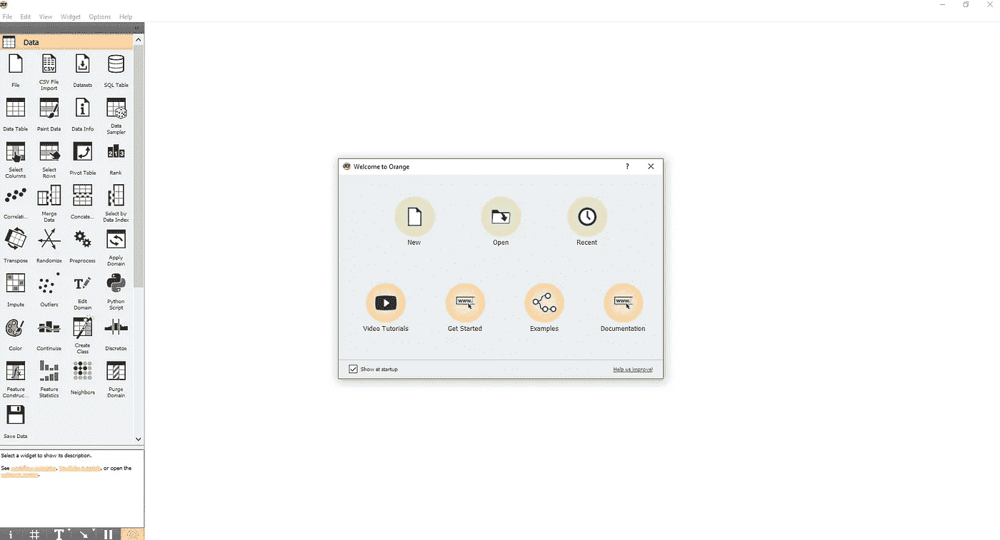*

*初始用户界面—作者图片*

## *2.将**文件**小部件拖到画布上，并通过双击文件小部件浏览本地服务器中的数据集。*

*在这种情况下，我将利用一个数据集，该数据集包含一家金融机构的 150，000 名客户的样本。“SeriousDlqin2yrs”列将是准备我们的模型时的目标变量。*

*你可以在我的 GitHub 的[链接](https://github.com/Jotaherrer/ml_credit_scoring)中找到数据集。*

**注意*:不要担心灰色的“应用”按钮，因为它仅用于确认对每个特性中的值所做的更改，例如在修改“角色”或“值”选项卡之后。*

**

*文件加载界面—作者图片*

***3。可视化数据集的默认特征和分布** 从左侧面板的“数据”和“模型”和“可视化”中拖动“特征统计”和“分布”小部件。使用这些工具，您可以更好地查看数据集中每个要素的描述性统计数据，例如平均值、离差、最小值、最大值和缺失值。*

*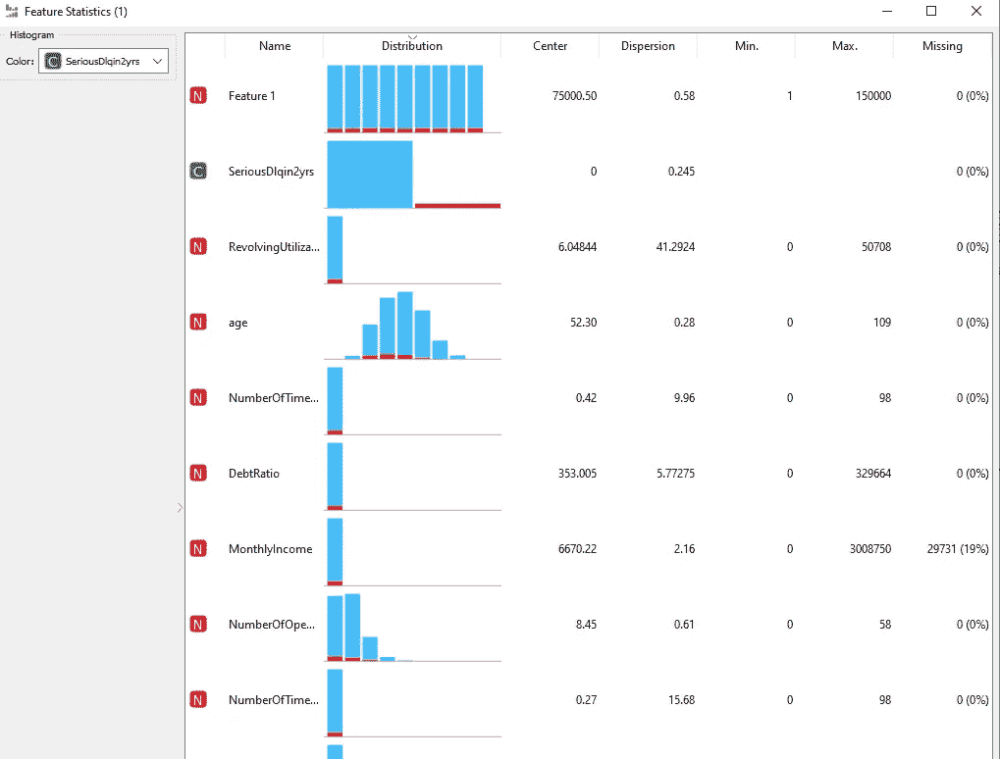*

*要素统计微件-按作者分类的图像*

*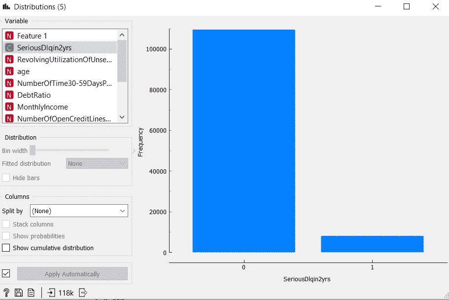*

*分发小部件-按作者分类的图像*

## *4.选择行*

*过滤列数据以避免干扰分析准确性的不正确值。我们可以为特性设置条件，例如值低于 X 数量或等于 Y 数量。*

*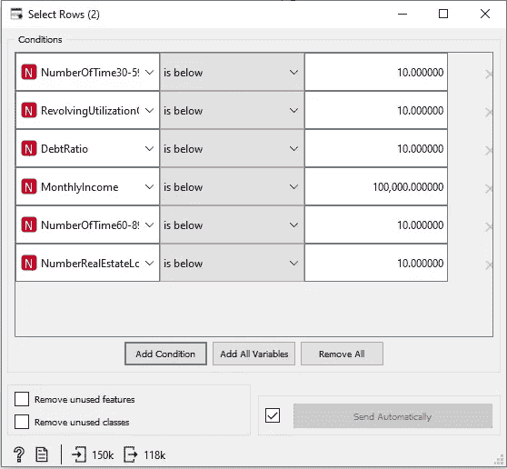*

*选择行—按作者选择图像*

## *5.选择列*

*从原始数据集中选择用于分析的重要要素，并使用微件“选择列”创建仅包含这些要素的新数据集。这是一个小部件，您可以在其中确定选定的列，并指示目标变量以供进一步分析。*

*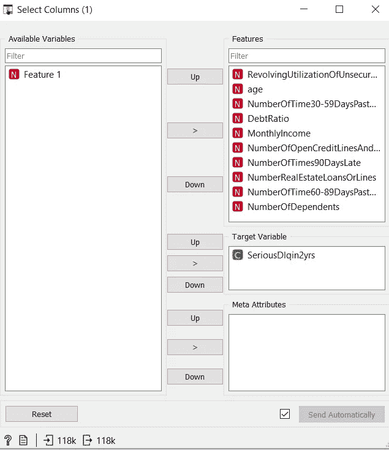*

*选择列界面-按作者分类的图像*

## *6.数据采样器*

*数据采样器小部件用于将过滤后的数据集分成训练和测试子集。在 Orange 的界面中，我们可以选择一个“**采样类型**”来输入我们想要的采样方法。特别是，我选择了全部数据的 70%作为“训练样本”，剩下的 30%作为“测试样本”。正如本文前面提到的，正如 Orange 的界面所反映的，子集的数据选择是通过分层样本随机进行的。*

*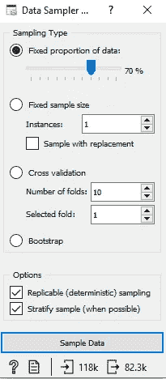*

*数据采样器界面—作者图片*

## *7.不平衡的数据集分辨率*

*为了解决上面解释的不平衡数据集问题，我决定执行**过采样**技术，而不是 **SMOTE** ，因为我认为 Orange 中不包含此功能的小部件。*

*1 .选择“**默认**值，这是来自训练子集的少数类，因为我们想要随机复制观察值以平衡数据集。在可视化中，您将看到小部件之间的链接或边有图例，您必须在图例中指出您想要将什么数据传递给“接收”小部件。在这种情况下，“选择行”小部件包含一个训练子集，从中发送“匹配数据”或“默认值”。另一方面，我们发现“不匹配的数据”，即来自训练子集的“无默认值”，它们被直接发送到“**连接**小部件。*

***过采样**方法的一个优点是，相对于*欠采样*，它不会导致信息损失。它的缺点是，由于它只是简单地在原始数据集中添加重复的观察值，它最终会添加几种类型的多个观察值，从而导致*过拟合*。*

*2.**数据样本**小部件随机复制固定数量的观察值*

*3. **Concatenate** 小部件将新的观察结果与“旧的”观察结果连接起来，以便最终获得一个平衡的数据集提交给我们的模型。*

**

***橙色画布——作者图片***

## *8.使用随机森林对平衡训练数据集执行预测*

*让我们继续有趣的部分:建模随机森林。要执行此任务，请从“**模型**”部分选择小部件“**随机森林**，并将其链接到平衡训练数据集。*

*我们将测试“深度”超参数，以优化模型。超参数是模型的一种“设置”,可以通过调整来提高性能。对于随机森林，超参数包括:*

1.  *林中决策树的数量*
2.  *分割节点时每棵树考虑的特征数量，也称为模型的“深度”或“增长”。*

*如下图所示，第一个模型有一个 3-tree 深度限制，第二个模型在优化中的深度没有限制。*

*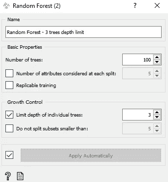*

*具有 3 棵树深度限制的随机森林—图片由作者提供*

*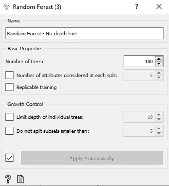*

*没有深度限制的随机森林—图片由作者提供*

## *9.测试和分数小部件*

*这个小部件用于根据训练数据集评估模型的结果。它将根据定义的折叠数执行交叉验证。这些折叠是从训练样本中创建的子集的数量，该训练样本将在回合中运行以评估整个数据集。*

*生成的界面是所用模型的列表，作为性能与获得的指标的比较。在下一步中，我将解释每个指标的含义。*

*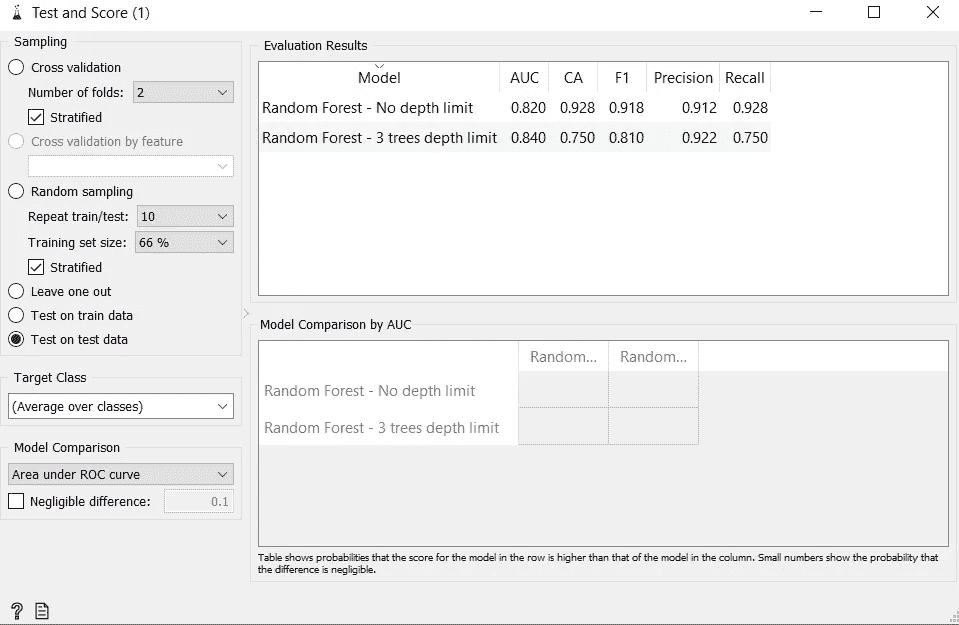*

*测试和评分界面—作者图片*

## *10.混淆矩阵*

*为了简化练习，我将使用我们运行的两个模型中最有效的模型进行解释。混淆矩阵是一种性能测量工具，用于根据预定的指标评估机器学习模型。输出是一个包含如下值组合的表:*

*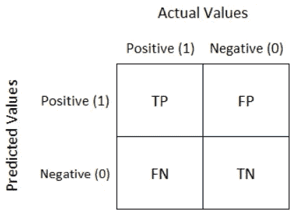*

*Sarang Narkhede，[理解混乱矩阵](/understanding-confusion-matrix-a9ad42dcfd62)*

1.  ***真正的正面结果(TP):** 模型正确预测了正面结果(例如，它预测它将“不会违约”，并最终没有违约)。*
2.  ***真正的负面结果(TN):** 模型正确预测了负面结果(例如，它预测它将“违约”并结束违约)。*
3.  ***假阳性结果(FP):** 模型未能预测到阳性结果(例如，它预测到它将“违约”，但最终没有这样做)。*
4.  ***假阴性结果(FN):** 模型未能预测到负面结果(例如，它预测到它将“不会违约”，并结束了这种预测)。*

*该矩阵作为一个小部件包含在 Orange 中，具有以下界面:*

**

*混淆矩阵界面—图片由作者提供*

*对于测量**召回**、**精度**、 **F1 得分**、**精度**和 **AUC-ROC** 曲线极其有用:*

*   ***准确率**:模型成功分类的预测比例。*

*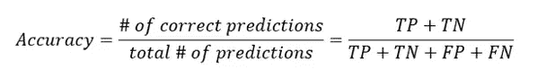*

*   ***精度:**所有正面预测中正确预测结果的比例。*

*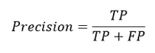*

*   ***回忆**:模型正确预测的积极结果部分。*

*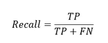*

*   *F1 分数:它是精确度和召回率的结合，也用来衡量测试的准确性。*

*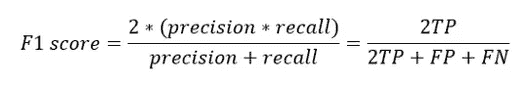*

# *结论*

*这篇文章的动机是展示如何在没有一行代码的情况下应用复杂的机器学习算法，但我最终认为它是一个理论推动者，希望能成为阅读这篇文章的每个人的动力。*

# *参考*

*   *[1] [不平衡分类问题](https://www.analyticsvidhya.com/blog/2016/03/practical-guide-deal-imbalanced-classification-problems/)。*
*   *[2] [橘子工作流程](https://orange.biolab.si/workflows/)来自官网。*
*   *[3]监督和非监督学习- [Sklearn 文档](https://scikit-learn.org/stable/tutorial/machine_learning_map/index.html)。*
*   *[4] Sarang Narkhede，[理解困惑矩阵](/understanding-confusion-matrix-a9ad42dcfd62) (2018)，[走向数据科学](https://towardsdatascience.com/)。*
*   *[5] Gareth James，Trevor Hastie 和 Robert Tibshirani，(2014)，[统计学习介绍](https://faculty.marshall.usc.edu/gareth-james/ISL/)*

*感谢您花时间阅读我的文章！如有任何问题、建议或意见，欢迎联系我:herrera.ajulian@gmail.com*