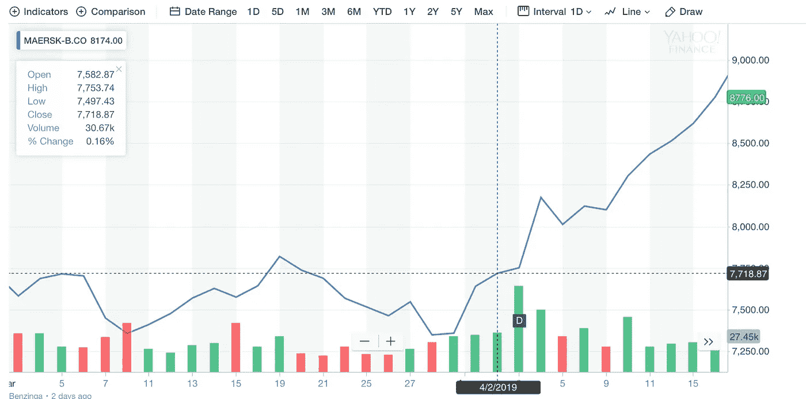
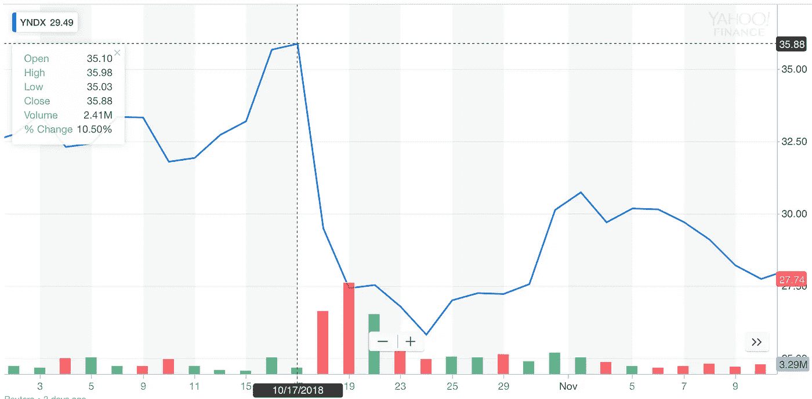
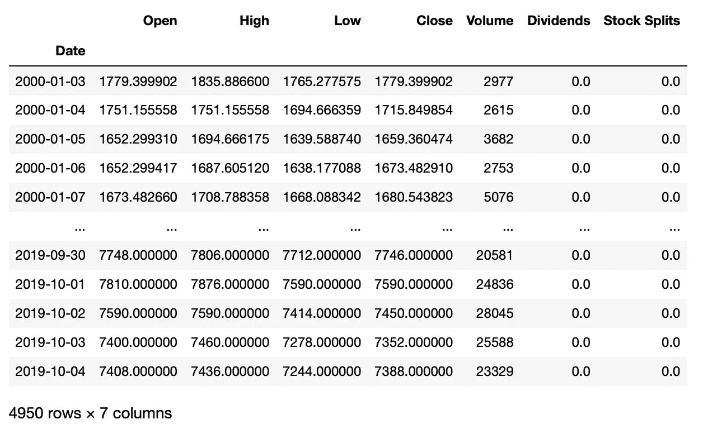
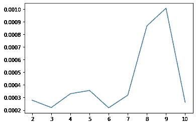
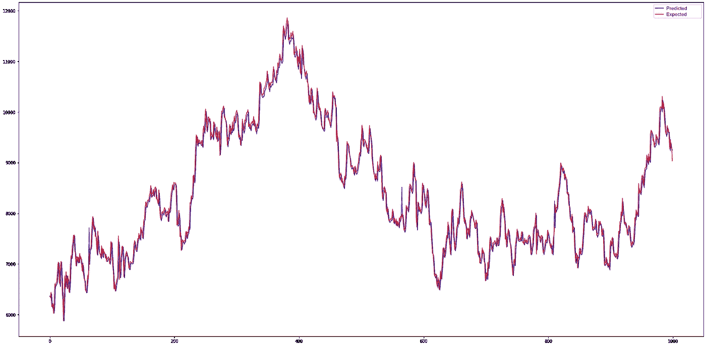

# 有可能用神经网络预测股票价格吗？

> 原文：<https://towardsdatascience.com/is-it-possible-to-predict-stock-prices-with-a-neural-network-d750af3de50b?source=collection_archive---------2----------------------->

当谈到时间序列预测时，读者(听众、观众……)开始考虑预测股票价格。预计这将有助于确定何时卖出，何时买入更多。有时我们会看到描述如何做到这一点的论文。论文[1]在这里提供了一个例子，作者甚至提供了一些结果。然而，Chollet 的《用 Python 进行深度学习》一书强调，人们不应该试图使用时间序列预测技术来预测股票价格。Chollet 在某种程度上解释说，在股票市场的情况下，关于以前状态的数据不是估计未来状态的良好基础。在文献[3]中，作者甚至得出结论，股票价格是鞅，因此，未来价格的最佳估计(就估计误差而言)是当前价格。

那么，有没有可能用神经网络来预测股票价格呢？

# 一些理论

***免责声明*** *:本理论概述反映了本人对该课题的认识，因此可能会使用不正确的术语，完全不正确等等。所以如果你知道的比我多，你可能会笑死。我警告过你。*

什么是份额？股票是证明持有者有权要求分享公司利润的文件。这意味着股票的价格应该取决于公司的利润。此外，股票的价格并不取决于确切的公司利润，而是预期利润。这意味着股票的价格代表了市场交易者对未来利润的看法。而且观点可能是错误的。我们都记得这样的故事:初创公司成本很高，但最终似乎没有提供任何革命性的东西，然后几乎完全失去了市场价格。因此，我们可以得出结论，股票价格取决于市场交易者的主观意见。

考虑下图。该图描绘了马士基公司的股价走势图。可以看到，在 2019 年 4 月 2 日，一股股票的价格是 7718 DKK。第二天的价格是每股 7750 DKK。原因是什么？我们可以在图的底部看到一个小写字母`D`。这封信意味着公司在这一天支付股息，显然，股息大到足以刺激需求。所以，即将到来的事件会导致价格上涨。



马士基股价

现在考虑另一个情节。这张图显示了 Yandex 的股价。这几天，我们听到有传言称，其中一家银行将收购 Yandex。通常，在这种谣言中，股价会上涨，因为这意味着买方将从市场上购买股票，从而增加需求。这一次，投资者认为这些都不是好消息。



Yandex 股票价格

我们可以在这里得出一个简单的结论:股价主要取决于交易员对公司未来的*看法*，而不是之前的价格本身。因此，用以前的价值来预测未来的股票价格是没有意义的。

我们应该使用目标所依赖的，或者至少是相关的值来预测一些事情。就股票价格而言，人们必须考虑市场之外的事件。很可能，使用神经网络来预测这样的事件是不可能的。事实上，更多的交易者破产了，而不是成为亿万富翁，这告诉我们，一个人并不经常能够预知未来。想知道更多关于预测不可预测的事情，请阅读纳西姆·尼古拉斯·塔勒布的《黑天鹅》一书。

# 实践

理论上，理论和实践是高度相关的，但实际上，它们并不相关。在这里，我们将尝试预测一些事情，看看会发生什么。

我们将训练一个神经网络，它将使用 n 个已知值(以前的价格)预测第(n+1)个价格。我们假设两次后续价格测量之间的时间是恒定的。首先，我们需要数据集。我们可以在雅虎财经[了解股票价格](http://finance.yahoo.com/)。

我们将预测每日价格，这意味着一天在数据集中用一个值表示。我们将使用前几天的收盘价来预测收盘价。我们将使用马士基作为测试公司。
我们将使用`yfinance` Python 包获取数据。我们应该考虑到雅虎可能会改变他们的 API，所以软件包可能会意外停止工作。这种情况至少已经发生过一次，所以我们必须为其他变化做好准备。所以，让我们安装软件包:

```
pip install yfinance
```

有关如何使用该软件包的更多信息，请参见[此处](https://github.com/ranaroussi/yfinance)。现在，让我们联系市场:

```
import yfinance as yf# create the object that represents Maersk stock data
# here MAERSK-B.CO -- is the Maerks's ticker
maersk = yf.Ticker('MAERSK-B.CO')
```

我们还没有下载任何数据，我们只创建了可以用来请求数据的对象。雅虎财经为马士基提供股息信息，正如我们已经看到的，股息影响股价。因此，我们希望神经网络在预测价格时将股息考虑在内。这意味着，当我们告诉网络使用前几天的一组价格来预测某一天的收盘价时，我们还需要为它提供一个标记，来告诉它当天是否支付股息。要获得支付股息的日期，请检查`maersk.dividends`属性。为了得到股票价格，我们称之为`history`方法。该方法需要几个参数，我们对`period`和`interval`特别感兴趣。

`period`参数定义了我们请求数据的时间段。该参数支持一些预定义的字符串值，我们将使用其中的一个。我们传递字符串`’max’`,它告诉我们所有可用的数据:从股票上市的第一天开始，直到今天。使用`start`和`end`参数可以定义精确的周期。然而，由于我们将使用所有可用的数据，我们将使用`period`参数并传递`’max’`。

`interval`参数告诉该方法两个连续值之间的间隔。它采用一个预定义的值，我们将传递`’1d’`到那里，因为我们将使用每日价格。

你可以在这里阅读更多关于`history`方法及其论据[的内容。](https://github.com/ranaroussi/yfinance/blob/25f911762caf04e833330b6d8e350e01cbb1adc8/yfinance/__init__.py#L278)

所以，是时候拿点数据了！

```
history = maersk.history(period='max', interval='1d')
```

现在`history`变量保存了一个包含价格的熊猫数据框架。让我们来看看它们:



马士基股价数据框架

是时候准备数据了。当设计一个神经网络来预测时间序列时，应该决定网络将有多少输入。在我们的例子中，我们必须选择输入网络的价格数量来预测下一个价格。由于我们现在不知道这个数字，最好能够生成具有不同输入量的数据集。幸运的是，Keras 开发人员已经考虑到了这一点，现在 Keras 提供了一个时间序列生成器，可以生成具有不同输入量的数据集。在时间序列预测的情况下，输入值和目标值都来自同一个序列。这意味着我们使用大小为`j`的滑动窗口，其中`j`是我们用来预测第`(j+1)`个值的值的数量。换句话说，我们取时间序列的`j`个后续元素(`{x₁, x₂, ... xⱼ}`)，然后取第`(j+1)`-个元素(`x₍ⱼ₊₁₎`)并将其设置为目标值。该对(`j`值，`(j+1)` -th 值)构成单个训练示例。为了进行另一个训练示例，我们将滑动窗口移动一个，并使用`{x₂, x₃, ... x₍ⱼ₊₁₎}`作为输入，使用`x₍ⱼ₊₂₎`作为目标值。

Keras 为我们提供了 [TimeseriesGenerator](https://keras.io/preprocessing/sequence/) 类，我们将使用这个类来生成训练集。这里唯一的困难是，我们还希望网络将红利考虑在内。因此，我们必须编写一个函数，使用`TimeseriesGenerator`类来生成训练集，然后用有关红利的信息丰富生成器的输出。

```
def generate_series(data, value_num):
    close = data['Close']
    dividends = data['Dividends']
    tsg = TimeseriesGenerator(close, close,
                              length=value_num,
                              batch_size=len(close))
    global_index = value_num
    i, t = tsg[0]
    has_dividends = np.zeros(len(i))
    for b_row in range(len(t)):
        assert(abs(t[b_row] - close[global_index]) <= 0.001)
        has_dividends[b_row] = dividends[global_index] > 0            
        global_index += 1
    return np.concatenate((i, np.transpose([has_dividends])),
                           axis=1), t
```

该函数有两个参数:我们希望它处理的数据集(`data`参数)和序列应该具有的输入值的数量(`value_num`参数)。

如您所知，神经网络是使用梯度下降来训练的，该梯度下降采用成本函数的梯度。最简单的方法假设我们使用整个数据集计算成本函数梯度。然而，这也有不好的一面。首先，数据集可能*非常*大，这将使得计算梯度非常耗时。其次，如果数据集*非常*大，那么梯度值也可能*非常*大，大到根本不适合机器精度。当然，第二个问题在极端情况下通常很重要(有点双关的意思)。一些聪明人指出，我们实际上并不需要精确的梯度值[4]。我们只需要它的*估计*来确定我们应该向哪个方向移动以最小化成本函数。因此，我们可以使用训练样本的一个小子集来估计梯度。当然，我们最终将遍历整个数据集，但没有必要一次计算整个数据集的梯度。我们可以将数据集分成几个称为批处理的子集，一次只处理一个批处理。我们使用为单个批次计算的梯度来更新网络的权重。一旦我们处理了所有的批次，我们可以说我们已经运行了一个单一的训练时期。在单个训练期内，可能有多个时期，确切的时期数取决于任务。同样聪明的人强调训练的例子一定要洗牌[4]。这意味着一对后续的训练样本不能属于同一批。
让我们测试该函数并生成一个使用四个输入值的数据集。

```
inputs, targets = generate_series(history, 4)
```

让我们看一个例子。

```
# print(inputs[3818])array([1.246046e+04, 1.232848e+04, 1.244496e+04, 1.274000e+04,
       1.000000e+00])
```

正如我们所看到的，一个训练示例是一个具有四个价格和一个额外的五分之一值的向量，该值指示当天是否支付股息。请注意，值相对较大。事实上，从 767.7 到 12740.0 的接近价格范围神经网络不适合这样的范围，所以我们必须将数据标准化。我们将使用最简单的归一化策略，最小最大归一化。

```
h_min = history.min()
normalized_h = (history - h_min) / (history.max() - h_min)
```

因为我们已经修改了初始数据，所以我们必须重新生成数据集。

```
inputs, targets = generate_series(normalized_h, 4)
```

我们来看一下归一化的数据。

```
# print(inputs[3818])array([0.9766511 , 0.96562732, 0.97535645, 1\.        , 1\.        ])
```

正如我们所看到的，这些值现在的范围是从 0 到 1。这使得任务更容易。然而，我们现在必须保留`h.min()`和`h.max()`，这样我们就可以在预测价格时对网络输入进行归一化处理，并对其输出进行反归一化处理，以获得准确的值。

最后，是神经网络的时候了。该网络将具有`(n+1)`输入、`n`价格和一个红利指标，以及一个输出。我们还需要确定`n`。为此，我们将编写一个函数，用指定数量的输入创建一个神经网络。我们使用`input_shape=(n+1,)`表达式来包含股息指标。

```
def create_model(n):
    m = models.Sequential()
    m.add(layers.Dense(64, activation='relu', input_shape=(n+1,)))
    m.add(layers.Dense(64, activation='relu'))
    m.add(layers.Dense(1))
    return m
```

在训练网络之前，我们将数据集分为两部分:训练集和测试集。我们将使用训练集来训练网络，使用测试集来测试未知数据的网络性能。在训练网络时，我们永远不会使用测试集的例子。

```
train_inputs = inputs[:-1000]
val_inputs = inputs[-1000:]train_targets = targets[:-1000]
val_targets = targets[-1000:]
```

让我们再写一个函数。这个函数将帮助我们决定网络应该有多少个输入。该函数采用输入的数量来检查要训练的时期的数量。该函数将创建一个网络，为其准备数据，然后训练网络并在测试集上评估其性能。

```
def select_inputs(data, start, end, epochs):
    models = {}
    for inputs in range(start, end+1):
        print('Using {} inputs'.format(inputs))
        model_inputs, targets = generate_series(data, inputs)

        train_inputs = model_inputs[:-1000]
        val_inputs = model_inputs[-1000:]
        train_targets = targets[:-1000]
        val_targets = targets[-1000:]

        m = create_model(inputs)
        print('Training')
        m.compile(optimizer='adam', loss='mse') 
        h = m.fit(train_inputs, train_targets,
                  epochs=epochs,
                  batch_size=32,
                  validation_data=(val_inputs, val_targets))
        model_info = {'model': m, 'history': h.history}
        models[inputs] = model_info
    return models
```

现在，让我们用 2 到 10 个输入训练网络 20 个时期:

```
trained_models = select_inputs(normalized_h, 2, 10, 20)
```

训练完成后，我们可以得到一个简短的总结，代码如下:

```
model_stats = {}
for k, v in trained_models.items():
    train_history = v['history']
    loss = train_history['loss'][-1]
    val_loss = train_history['val_loss'][-1]
    model_stats[k] = {'inputs': k, 'loss': loss, 'val_loss': val_loss}
```

打印`model_stats`值，我们可以看到摘要:

```
{2: {'inputs': 2,
  'loss': 6.159038594863468e-05,
  'val_loss': 0.0006709674960002303},
 3: {'inputs': 3,
  'loss': 7.425233190960614e-05,
  'val_loss': 0.00021176348975859583},
 4: {'inputs': 4,
  'loss': 7.471898652647588e-05,
  'val_loss': 0.00022580388654023408},
 5: {'inputs': 5,
  'loss': 8.866131339595126e-05,
  'val_loss': 0.00027424713294021784},
 6: {'inputs': 6,
  'loss': 7.322355930846842e-05,
  'val_loss': 0.0003323734663426876},
 7: {'inputs': 7,
  'loss': 8.709070955596233e-05,
  'val_loss': 0.0004295352199114859},
 8: {'inputs': 8,
  'loss': 8.170129280188121e-05,
  'val_loss': 0.00024587249546311797},
 9: {'inputs': 9,
  'loss': 7.327485314296024e-05,
  'val_loss': 0.0003118165017804131},
 10: {'inputs': 10,
  'loss': 8.064566193526276e-05,
  'val_loss': 0.0003668071269057691}}
```

正如我们所看到的，用测试集计算的误差总是稍大于为训练集计算的值。这意味着网络对已知数据(训练示例)的处理略好于未知数据(测试示例)。

我们现在可以根据网络的输入数来绘制测试误差。

```
import matplotlib.pyplot as pltval_loss = []
indices = []
for k, v in model_stats.items():
    indices.append(k)
    val_loss.append(v['val_loss'])plt.plot(indices, val_loss)
```



不同输入数网络的测试误差

通过该图，我们可以看到哪个网络的测试误差最低。确切的结果可能会随着时间的推移而变化，这取决于通过雅虎财经获得的历史数据量。

有一个有趣的观察。如果一个人运行这个脚本两次，那么他们会收到不同的结果。换句话说，最低的测试误差由不同的网络产生。由于网络之间的唯一区别是输入的数量，因此我们可以得出结论，测试误差并不那么依赖于输入的数量。这反过来支持了最初的猜测，即我们无法用神经网络来预测股票价格。显然，网络训练忽略一些输入，推断输出不依赖于它们。

请记住，我们已经将数据标准化了。现在让我们计算网络的精确误差。

```
close_min = history['Close'].min()
close_max = history['Close'].max()
for k in model_stats:
    e = ((close_max - close_min) * model_stats[k]['val_loss'] + close_min)
    print(k, e)
```

输出:

```
2 771.0400773414451
3 770.341964375037
4 771.6538168560887
5 771.9637314503287
6 770.3164239349957
7 771.5147973106168
8 778.0784490537151
9 779.7546236891968
10 770.8432766947052
```

哇！误差非常大。即使对于已经显示最低测试误差的网络，精确误差也非常大。老实说，在决定购买哪些股票时，我不会相信一个有这种错误的网络。我也不会建议其他人相信它。

现在我们可以画一个图表，比较准确的价格和预测的价格。



将预测价格与目标价格进行比较

正如你所看到的，图表并不经常匹配。

我们得到了未知数据的大误差值。这意味着网络未能预测收盘价。也许，我们可以通过改变网络架构来改善结果，让它适应更多的时代。我不认为我们能得到更多的数据，因为我们已经使用了所有可用的数据。使用不同公司的数据训练一个网络是可能的，但是由于这些公司可能具有不同的属性，它们的股票价格可能根据不同的规律变化，这只会使网络混乱。

我们要注意的是，网络本身并不预测股价。相反，它试图使用给定值来猜测序列的下一个值是什么。这是因为价格并没有编码下次价格会如何变化。如果价格增长了一段时间，那么不能保证下一分钟不会降低。价格主要受网络不知道的外部事件的影响。

或许，我们将能够使用神经网络进行短期预测，以确定未来几分钟内的价格变化。这可能是因为我们预测的时间段越短，外部事件发生的变化就越小。但是，在这种情况下，使用线性回归模型来预测价格变化的方向可能会更好。

如果我们仔细观察股价图，我们会发现变化看起来是随机的。如果我们只有价格而对外部事件一无所知，这可能是真的。因此，股票价格看起来确实像一个鞅，一个我们无法预测的过程。我同意 Chollet 的观点，你最好不要用神经网络来预测股票价格。

**更新**

我在这里看到了[另一篇关于致力于股票预测的数据科学的帖子](/what-happened-when-i-tried-market-prediction-with-machine-learning-4108610b3422)。作者尝试使用技术分析向神经网络输入更多可用于预测的值。然而，作者没有成功，他得出的结论是，股票价格大多是一个随机过程，不能根据其自身的价值来预测。这个结论与这篇文章的发现相吻合:你不能用神经网络来预测股票价格，即使使用技术分析来获得更多的数据统计。

**参考文献**

1.  Bugorskij，v . Ispol ' zo vanie nejronnyh setej dlya modelirovaniya prognoza kotirovok cennyh bumag/v . Bugorskij，a . Sergienko//Prikladnaya informatika。— 2008.—编号 3(15)。(俄语)
2.  Chollet，f .使用 python 进行深度学习— 2017 年。—曼宁出版公司。
3.  Elliot，a .时间序列预测:预测股票价格/ A. Elliot，C. H. Hsu // ArXiv 电子版。— 2017.
4.  伊恩·古德费勒。深度学习/伊恩·古德菲勒、约舒阿·本吉奥、亚伦·库维尔——麻省理工学院出版社，2016 年。