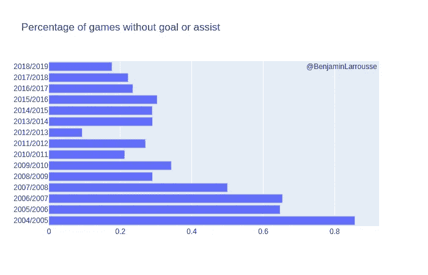
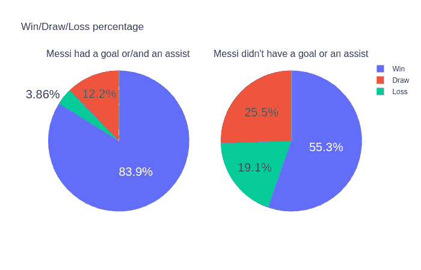
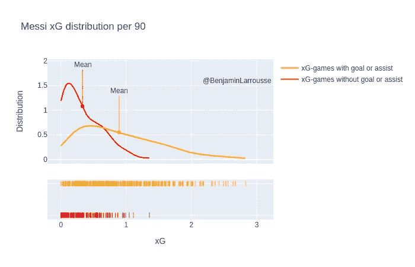
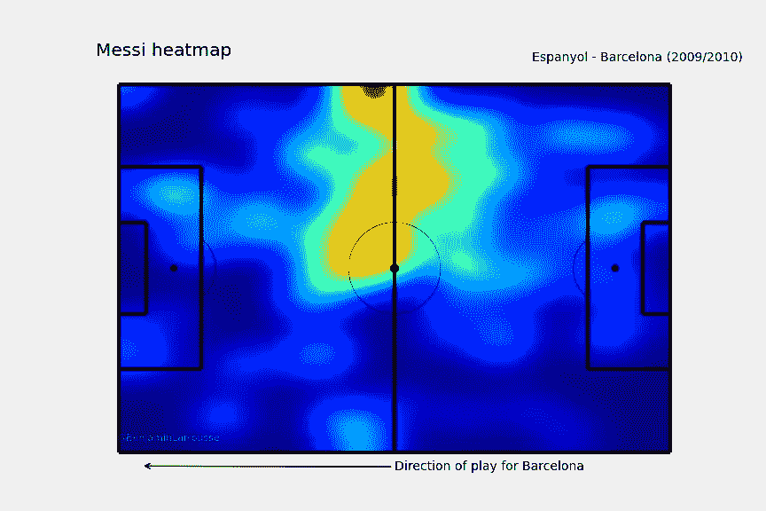
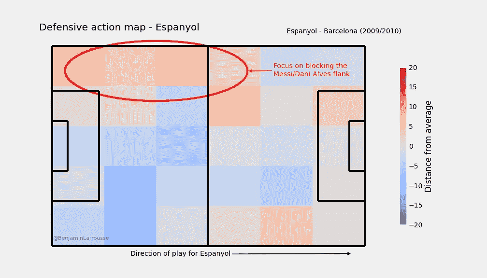
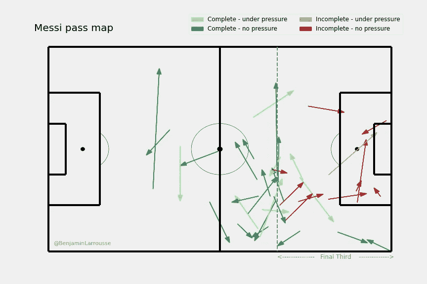
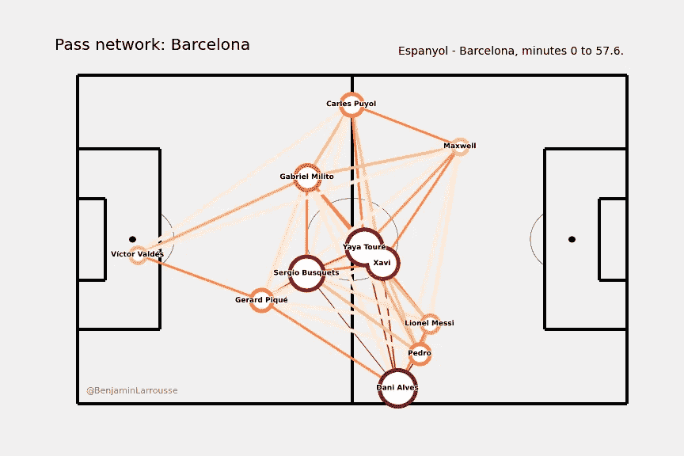
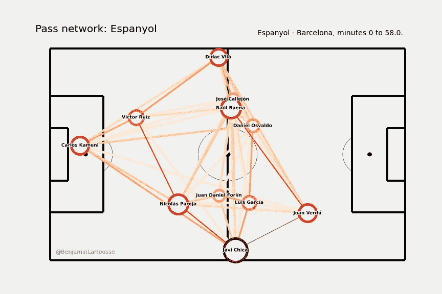
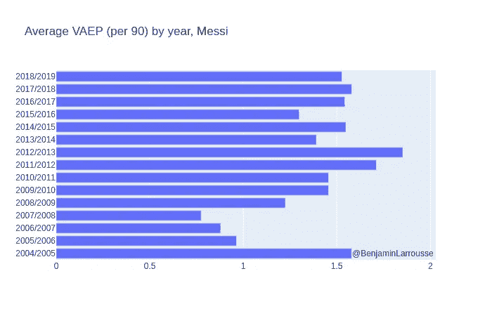
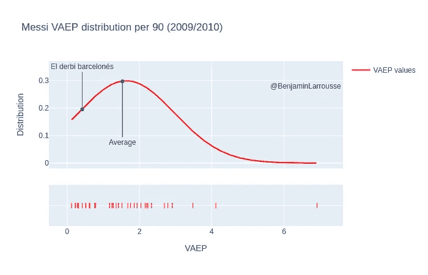

# 有可能防守梅西吗？数据视角。

> 原文：<https://towardsdatascience.com/is-it-possible-to-stop-messi-a-data-perspective-cf4e2d900181?source=collection_archive---------30----------------------->

## 或者我是如何分析 2009/10 赛季巴塞罗那德比的。

照片由来自 [Pexels](https://www.pexels.com/photo/aerial-view-of-soccer-field-1171084/?utm_content=attributionCopyText&utm_medium=referral&utm_source=pexels) 的[迈克](https://www.pexels.com/@mike-468229?utm_content=attributionCopyText&utm_medium=referral&utm_source=pexels)拍摄

最近几年，足球过程(球探、管理训练负荷、赛前/赛后分析等。)正在缓慢但肯定地朝着更有数据依据的决策方向发展。对于一个热爱足球的数据分析师/科学家来说，越来越多的数据集可以免费访问，这为足球数据探索带来了机遇。作为一名足球迷，当 [Statsbomb](https://statsbomb.com/) 在 2019 年发布完整的[梅西数据传记](https://statsbomb.com/2019/07/welcome-to-the-messi-data-biography/)数据集时，我非常兴奋。随着最近新冠肺炎疫情实施的隔离，我有了一些空闲时间，我决定好好利用。这是我在梅西兔子洞深处的故事。

所有相关代码、**交互式可视化**等等，都可以在我的 [github 项目](https://github.com/BenjaminLarrousse/statsbomb-messi)中找到。

**TL；梅西是个天才，你无法阻止他。还是可以？**

# 1.再一次:莱昂内尔·梅西

## 1.1 数字爱情

有人可能想知道为什么还要写一篇关于梅西的文章。嗯，首先是因为他的整个西甲职业生涯都可以在一个单独的数据集中免费获得。直到今天，这是唯一一个完整的关于单个球员的数据集(考虑到球员已经到了职业生涯的末期)。

第二，因为我确信我们并不了解梅西的一切。已经有很多关于他的报道:得分技巧、组织核心、与 c 罗的广泛比较等等。也许你已经读到过[梅西是不可能的](https://fivethirtyeight.com/features/lionel-messi-is-impossible/)，或者[他走得比大多数球员跑得都好](https://fivethirtyeight.com/features/messi-walks-better-than-most-players-run/)。

但是据我所知，防御方面还没有被广泛地探索。当我埋头于数据传记时，我开始想是否有可能阻止梅西？而如果有，如何只用数据来描述？

由于足球比赛中的事件数据倾向于比赛的进攻方，因为防守有更多的“无球”事件，所以分析起来更加困难。跟踪数据要容易得多(假设数据足够准确),因为我们随时都知道球员的位置，但这并不意味着在事件数据中什么也找不到。防守行动、压力事件，加上预期目标、 [PPDA](https://statsbomb.com/2014/07/defensive-metrics-measuring-the-intensity-of-a-high-press/) 或 [VAEP](https://arxiv.org/pdf/1802.07127.pdf*) 等先进指标，足以让它在“阻止梅西”的任务中有所作为。

## 1.2 更强、更好、更快、更强

*如何阻止梅西？*

这个百万美元的问题让每一个面对他的教练都紧张得要命。他是(有史以来)最伟大的球员之一，自 2004 年以来，他在巴塞罗那俱乐部撕开了防线。

看看他的赢/平/输分布就知道了:

梅西总体获胜统计(2004/05–2018/19)。452 场比赛 339 胜 39 负。

从 2004 年第一年到 2018/19 赛季结束，梅西出场 452 场，共 **419 粒进球，158 次助攻**。

梅西进球再分配(2004/05–2018/19)。

如果我们只考虑开放式比赛目标:

*   336 个目标共 253.6 xG ( [预期目标](https://youtu.be/zSaeaFcm1SY))。
*   对于 xG 小于 0.05 的射门，22 个进球总共 14.5 xG。

只是为了好玩，这是他的(公开比赛)目标，具有**最小 xG 值**(所有数据集的):0.024。奇怪的是，这看起来不像是梅西打进的最难的进球，但他的射门距离相当远，而且在他面前有很多对手。

具有最小 xG 值的目标。希洪竞技—巴塞罗那足球俱乐部(2015/16 赛季)的开场进球

光是这些数据就显示了梅西作为一名得分手有多伟大，而这只是他所能做到的一小部分。如果你想了解更多关于梅西的(高级)数据，尤其是他的运球技术，你可以看看 Statsbomb 的文章:

*   [年轻的梅西](https://statsbomb.com/2019/07/monday-post/) : 2004/05 到 2007/08。
*   瓜迪奥拉时代:2008 年 9 月至 2011 年 12 月。
*   [Pic 梅西](https://statsbomb.com/2019/07/messi-data-biography-analysis-and-data-release-2012-13-to-2015-16/) : 2011/12 到 2015/16。
*   [最后部分](https://statsbomb.com/2019/12/messi-data-biography-15-seasons-now-complete-and-available/) : 2016/17 至 2017/19。

你也可以在这个[笔记本](https://github.com/BenjaminLarrousse/statsbomb-messi/blob/master/notebooks/06-EXTRA-advanced_messi_stats.ipynb)里找到我自己处理的数据(参见相关的[数字文件夹](https://github.com/BenjaminLarrousse/statsbomb-messi/tree/master/figures/advanced-stats))。

所以，总而言之，显而易见的是:很难防守梅西这样的球员。

# 2.毕竟是人类

无论梅西有多伟大，有时他也会有糟糕的比赛。例如，从 2004 年到 2019 年，他有一些比赛没有进球或助攻。这并不意味着这是一场糟糕的比赛，但至少梅西不是决定性的。

为了说明这一点，我们可以看看梅西没有进球或助攻的比赛的百分比。

梅西赛季“糟糕比赛”的百分比(注意，2004/05 赛季的样本量很小)

如你所见，梅西不增加他的统计线并不常见。这并不总是坏事，但对梅西的成绩有影响:

梅西得分或助攻的效果(2004/05–2018/19)。

确实不全是梅西的问题，这个图缺少了一些脉络(对手的实力，当天队友的素质，比赛的赌注等等。)，但仍然是胜率的巨大下降。

如果我们考虑 xG，当然也有很大的不同，如下图所示。没有进球或助攻的比赛表现出了更慢的 xG 输出，平均为 0.33，而他进球或助攻时为 0.89。这意味着他得分机会更少，但主要是(平均而言)他得分的位置更差。嗯，有时候他只是运气不好，就像那场比赛，他输出 1.35 倍，没有得分。

梅西 xG 分配取决于他得分或助攻一个进球。

这表明，有时候，降低梅西的影响力是可能的。

为了分析如何防守梅西，我选择专注于一场比赛:这更容易可视化，并为未来在更大范围内的分析提供了一些思路。

我是怎么选择这样一个游戏的？我决定关注 2009/10 赛季的*:*

*   对于梅西(众多赛季之一)来说，这是一个伟大的赛季:*西甲 35 场比赛 34 粒进球 10 次助攻*。
*   这是佩普·瓜迪奥拉在巴塞罗那俱乐部的最佳西甲赛季:99 分，当时是拉利加的纪录(现在被皇家马德里 2011/2012 赛季和巴塞罗那 2012/2013 赛季的 100 分击败)。

由此出发，我选择整个赛季梅西 xG 输出最小的比赛。输入:

> 埃尔德比加泰罗尼亚语

这也是瓜迪奥拉和 T2、波切蒂诺和 T3 之间的对决，这让事情变得更加有趣。

# 3.面对面

## 3.1 时间的碎片

在讨论梅西在这场比赛中是如何被阻止的之前，先了解一下背景。这场比赛是一场德比，因此根本不是一场友谊赛。它结束了(*剧透警报！平局:0 - 0。*

但这不是一个无聊的游戏，尽管:

*   *巴萨*只有 4 次射门，总 xG 0.11。
*   *巴塞罗那西班牙人*有 10 次射门(0.61 xG)。
*   梅西输出 **0.03** **xG 助攻**，相比 2009/10 赛季平均 **0.23** 。
*   他没有得到达尼·阿尔维斯的帮助，阿尔维斯在 58 分钟后得到一张红牌。

我当时没有看这个游戏(现在也没有)，但是我确信毛里西奥·波切蒂诺有一个计划。下面的数据分析将试图揭开他的计划。

## 3.2 做对

关于这场比赛，我们首先要问的是:有没有一个**反梅西的计划**？

如果我们看看梅西的热图和西班牙人的防守图，我们可以看到西班牙人确实在他们的左翼防守更多(特别是他们**在那里压得更多**),那里是梅西喜欢的地方，也是丹尼尔·阿尔维斯花费大部分时间的地方。

看起来梅西是被故意针对的。

第二，梅西能够做到他平时做的事情吗？我指的是疯狂的运球，超出世界范围的投篮和不可能的传球。好吧，看看他的通行地图，我们可以看到，这不是照常营业:

梅西传球图，西班牙人-巴塞罗那足球俱乐部(2009/10 赛季)。

正如我们在上图中看到的:

*   几乎所有成功的传球都离球门很远。
*   没有多少**垂直**通过。
*   最终第三遍几乎总是不完整。
*   西班牙人在传球上没有太大的压力。也许他们想阻止传球者，而不是梅西本人。

巴塞罗那的通行证(在达尼阿尔维斯红牌之前)证实了这一点。我们可以看到前面三个(梅西、佩德罗、马克斯韦尔(？))被牵扯进去了。

达尼阿尔维斯红牌前巴萨传球网。图灵感来自[追踪](https://github.com/Friends-of-Tracking-Data-FoTD/passing-networks-in-python)的好友。

相比之下，西班牙人的传球网络显示他们试图从两侧进攻，避开*布斯克茨/亚亚·图雷/哈维*三角，并且有一些传球选择到*凡尔登*。

西班牙人传球网先于达尼阿尔维斯红牌。图灵感来自[追踪](https://github.com/Friends-of-Tracking-Data-FoTD/passing-networks-in-python)的好友。

为了更进一步，需要一些高级度量。我选择求助于**通过估计概率来评估行为(VAEP)** 。我不会详细说明 VAEP 是什么，因为这超出了本文的范围，但你可以在这里找到[的原始论文](https://arxiv.org/pdf/1802.07127.pdf)。

简而言之，这是一种给足球中的每个动作分配一个*概率值*的方式，而不仅仅是射门和进球。例如，成功通关的 VAEP 值为+0.3，而失败的通关的 VAEP 值为-0.19。

VAEP 是分析球员在比赛中贡献的一个很好的工具(除了其他工具，参见[美国足球分析文章](https://www.americansocceranalysis.com/home/2020/5/5/goals-added-and-the-great-possession-shift)对这些工具的比较)，因为它考虑了所有的行为，甚至是**防守行为**。KU Leuven 团队甚至发布了他们的**足球运动员动作描述语言(SPADL)** 的替代版本，称为[原子 SPADL](https://dtai.cs.kuleuven.be/sports/blog/introducing-atomic-spadl-a-new-way-to-represent-event-stream-data) 。这种选择有两个主要优点:

*   它为镜头分配更好的(*即*更接近真实)值。
*   它导致更稳定的动作值。

最后但同样重要的是，整个项目可以在 github 上公开访问。S **操作**包有一个带 *SPADL* 的主分支，以及一个用于 *atomic-SPADL* 的原子分支。

在用 *atomic SPADL* 拟合一个模型后，我们可以通过 VAEP 的镜头探索梅西数据集。例如，这是梅西每个赛季的平均 VAEP(每 90 分)。

原子 VAEP 模型。

如果我们特别关注 2009/10 赛季，我们可以看到梅西的 VAEP 价值观的分布以及德比的所在地。这证实了对拉普尔加来说这不是“那些夜晚中的一个”。

VAEP 不仅仅属于梅西。以下是所有德比球员的名单，按照 VAEP 值(每 90 分)排名:

西班牙人队的 VAEP 价值(2009/10 赛季)。梅西尽管表现“糟糕”，但仍排名第六。佩德罗和马克斯韦尔没有做太多，阿尔维斯也一样。

考虑到最高的 VAEP 价值来自维克托·巴尔德斯，我们可以有把握地说，西班牙人不仅防守做得很好，他们也有一些很好的进攻阶段。

根据这一分析，我们有一些西班牙人成功阻止梅西的关键因素:

*   锁定左翼，以尽量减少梅西/D .阿尔维斯的连接，特别是:在那里施加更多的压力。
*   减少梅西在最后三分之一的传球选择。
*   从侧翼进攻避开巴萨的中场，迫使他们防守:“进攻是最好的防守形式”。

# 4.超出

梅西的分析是更好地理解足球防守的第一步。

它表明，有了‘基本’的统计数据和更先进的工具(VAEP ),就有可能获得防御性的洞察力。从这里可以做很多事情:

*   多分析一些梅西 xG 输出少的比赛，才能找到大体趋势。
*   分别使用*进攻*和*防守* VAEP 值来评估(例如)特定球队或球员的防守输出。
*   从 VAEP 价值观的角度分析梅西最差的 10 场比赛。
*   评估该数据集中的其他*明星玩家*是如何被阻止的。

即使只是为了好玩，这种分析在现实生活中也是有用的。

感谢阅读。

## 笔记

1-*防守地图*显示了与 2009/10 赛季所有球队面对巴塞罗那的平均水平相比，在这场比赛中一支球队的防守行动多了多少。

双路网络*参数*:

*   位置:通过原点，
*   大小:通过次数，
*   颜色:通过次数。

为了探索 VAEP，你可以试试[作者的互动工具](https://dtai.cs.kuleuven.be/sports/vaep?toggle=explore)。