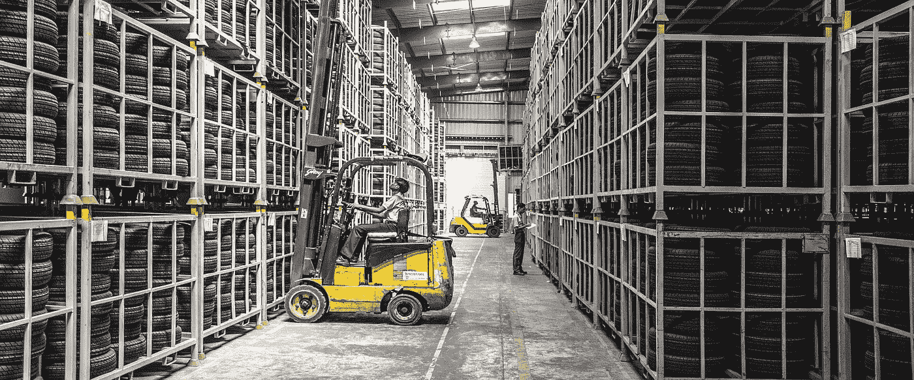

# 现场 Kubernetes 是否可行？

> 原文：<https://towardsdatascience.com/is-kubernetes-on-premise-viable-8b488368af56?source=collection_archive---------12----------------------->

## 云是最好的解决方案，但是如果不可用呢？

公共云提供商并不总是一个选择。作为云爱好者，我更喜欢在任何可能的时候使用云，但是有些情况下我们根本不能使用云。这可能是由于数据保护要求、成本优化，或者只是我们的老板害怕变化。我们可能希望事情不是这样，但我很遗憾地说，我们不能总是改变世界。那么，在这种情况下该怎么办呢？拒绝 Kubernetes 的优势或避免容器而支持虚拟机的解决方案根本不是一个选项。很容易理解，对我们 k8s 上瘾的人来说，唯一的选择就是在内部部署它。在这篇文章中，我将解释什么是关键点，以及在开始这个旅程之前你必须考虑到什么。

帕什米努·曼苏哈尼达[皮克斯拜](https://pixabay.com/it/?utm_source=link-attribution&utm_medium=referral&utm_campaign=image&utm_content=835340)

# 为什么我应该在内部使用 Kubernetes？

诚实的答案是你不应该。由于云价格和质量使用，基于云的解决方案是降低成本、保持高质量标准和缩短新安装上市时间的更好解决方案。问题是，即使 Kubernetes on cloud 是最好的选择，它也不总是适用的。

许多组织根本无法使用云。这可能是由于可疑的安全政策、法规或数据政策，或者他们所在国家的某些云服务不可用。也可能是首席信息官购买了一个新的数据中心，并希望在整个公司范围内使用这一投资。

原因不重要。问题是，简单地说，在某些情况下，Kubernetes 必须保留在本地。我认为回到 VMs 时代不是一种选择。

# 在内部使用 Kubernetes 有什么关系

Kubernetes 是一种工具。是的，一个大的，复杂的，强大的工具。但永远是个工具。运行工具的基础是:

1.  人
2.  知道如何使用它
3.  具备所有工具要求

如果你需要往木头里敲一颗钉子，你需要一把锤子(工具)，一个知道该做什么的人(你)，和一颗钉子(工具要求)。Kubernetes(工具)也差不多。你将需要一个人或一个团队知道如何处理他(设置、维护、安全)和一个运行它的基础设施(工具需求)。

我希望我没有伤害任何在锤子和 Kubernetes 之间做比较的人😃我的意图不是贬低 Kubernetes 的价值，而是介绍我们必须关注的一系列关键事项:人员和基础设施。让我们进入下一章进行深入探讨。

# 基础设施要求

理论上，你可以在你的笔记本电脑上运行 Kube，但是不难理解，为了扩展，你需要更多的东西。在混合场景中，当您已经拥有用于部署虚拟机的虚拟机管理程序时，使用它们来托管 k8s 服务器是更简单的方法。很明显，所使用的硬件很重要，您将会明白如何设置基础设施也很重要。配置不好的好硬件可能会带来不好的性能。

## 裁员

如果你想有一个可靠的解决方案，最好使用三个。使用多个节点，您可以平衡工作负载和内部服务，如 kube-apiserver、etcd、kube-scheduler 和 kube-controller-manager 等等。

## 将主容器与容器分开

主组件可以在容器的同一台机器上运行，但是最好将它们隔离开来，以避免资源冲突。

## 最低要求

Kubernetes 被设计为可以从故障中恢复，而不会丢失任何数据。这一特性取决于硬件资源的可用性。最佳实践将这一最少的资源集确定为三个节点，2GB RAM 和 8GB SSD。可以想象，硬件性能会影响 Kubernetes 的性能。建议使用固态硬盘或同等性能的硬盘。当然，在生产环境中，添加比最小资源更多的资源是一个好主意，也要考虑容器需求。

## 找到合适的支持。

您可以从头开始安装 Kubernetes，或者直接在您喜欢的虚拟机上使用 [Ansible playbook](https://github.com/apachecloudstack/k8s) 。无论如何，查看 K8S 官方文档，我们会发现这两个很好的替代方案:

*   [CloudStack](https://cloudstack.apache.org/) ，它基于硬件虚拟化原则，像传统的 IaaS 一样，它也可用于本地解决方案，并支持 Vagrant
*   [CoreOS](http://coreos.com/) 是部署 Kubernetes 集群的一个很好的选择。您可以使用本[教程](https://coreos.com/kubernetes/docs/1.6.1/index.html)或使用 CloudStack 集成来手动完成。

# 团队

Kubernetes 不是游戏。它很容易安装(只需注意它是 docker 附带的)并用于部署应用程序。稍微复杂一点的部分是管理。我的意思不是仅仅看一下资源是否足够，以及万一增加一个新的节点。我说的是确保卷的备份，分发服务以平衡节点上的负载，或者简单地解决问题。

Kubernetes 是一个完美的工具，因为在大多数情况下，你只需要安装一个，然后单独工作。同时，在云解决方案中，体系结构的一部分是托管的，内部完全由您决定。这就是为什么我建议每家采用 it 的公司都要有一名训练有素的专家。CNCF 的考试是一个很好的起点。你可以在 Udemy 或者类似的平台上买到很多便宜的备考课程。

# 别忘了 DevOps

Kubernetes 的领养不仅仅是 Kubernetes 的事。你需要他背后的所有架构。Kubernetes 的标准开发流程需要 IT 思维模式的重大改变。这也翻译成你必须提供给开发者的工具(是的，其他工具…)。首先，你将需要一个 CR (container repository)来存储所有的容器图像，这些图像将由一个 DevOps 进程产生，由一个工具实现。如果您的公司出于安全原因不允许使用云，您将需要在本地部署这样的工具。在实践中，Kubernetes 带来了一个结构良好的流程。如果你还没有，你将被迫把它带回家。

# 带什么回家

云是 Kubernetes 的第一选择，除非你处于一种特殊的情况，在这种情况下，你有特定的好处，如成本优化，硬性要求，如安全性，或者一些特殊的条件，需要对所有栈进行完全控制。如果你在这些情况下，你将需要提供一个可靠的基础设施，基于坚实的硬件和良好的安装。尽管如此，你还需要在产品方面受过训练的人，并准备好管理 Kubernetes 的复杂性。

好消息是，如果内部空间过于狭小，无法满足您的需求，您将来可以(相当)轻松地移动。

**关于 CoreOS 的一个说明**

5 月 26 日即将到来，Kubernetes 官方文档指向 Cloudstack 和 CoreOS(最后一次更新是在 2019 年 6 月😒)，但该发行版将于 5 月 26 日到期。Red Hats 设计的继任者是 Fedora CoreOS，这对于开始一个新项目来说是没问题的，但在移植的情况下需要一些工作。在这种情况下，可以选择使用 [Flatcar 容器](https://www.flatcar-linux.org/) Linux 发行版，这是一个更兼容的解决方案。另一个机会是迁移到云，如果已经在计划中的话。生命的终结可能是正确的提示。

## 参考资料:

*   [*DZone*](https://dzone.com/articles/kubernetes-on-premises-why-and-how)*——*Kubernetes 以为什么和怎样为前提
*   [*Kubernetes*](https://kubernetes.io/docs/setup/production-environment/on-premises-vm/)*—本地*虚拟机