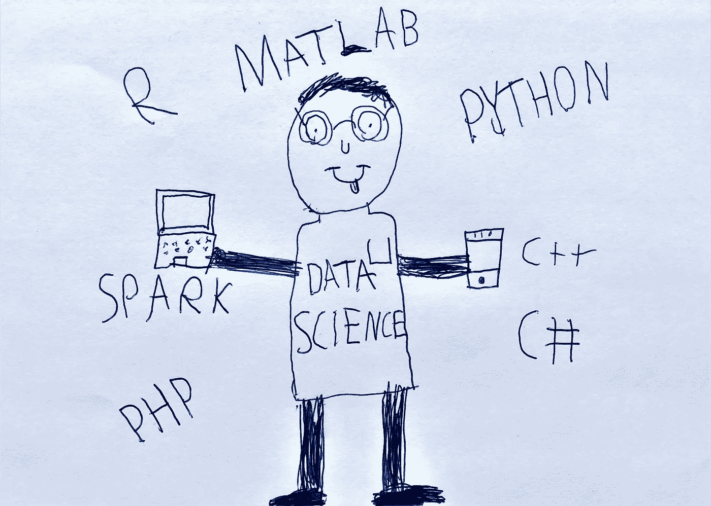
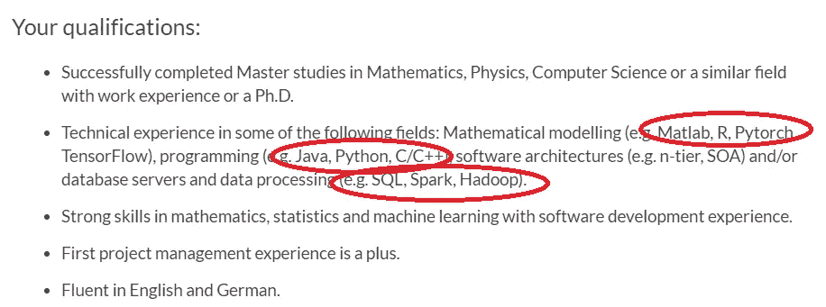
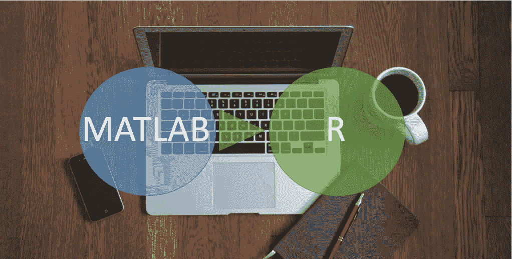

# 学习新的编程语言很难吗？

> 原文：<https://towardsdatascience.com/is-learning-new-programming-languages-tough-a0412b81293c?source=collection_archive---------70----------------------->

## *一个高级数据科学家* ***需要*** *多种编程语言* ***！***

照片由我可爱的 so 拍摄:)

如果你想成为一名高级数据科学家，你需要熟悉不同的编程语言，因为:

1.  评估和**寻找最适合项目结构的**
2.  得到一个高度精确的模型
3.  使用**可信模型**
4.  或**商业伙伴对一种特定语言的熟悉程度**

当你想学习一门新的编程语言时，不管你是新手还是专家，我们人类害怕变化，主要是因为我们认为这很难。你要投入时间去寻找好的资源，学习新的评论结构，让大脑为你想学的新语言做好准备。中国有句谚语说:

> 学习是一笔财富，它会跟随它的主人到任何地方。

对我们数据科学家来说，一种财富是有目的地学习一种新的编程语言。我们如何将恐惧转化为财富？让我告诉你怎么做。

# 从数据科学家做起

[活动发起人](https://unsplash.com/@campaign_creators?utm_source=medium&utm_medium=referral)在 [Unsplash](https://unsplash.com?utm_source=medium&utm_medium=referral) 上的照片

许多软件工程师在他们的学士或硕士课程期间，根据他们的兴趣或课程以及大学教授的兴趣，必须学习不同的编程语言，即 C#、C++、Python、R、Matlab 等。但是对于一些想以数据科学家开始职业生涯的人来说，编程是新的。和你们许多人一样，在完成博士学位后，我决定进入工业界。当我看到需要资质的工作申请时，我很惊讶:

在我的硕士和博士学位期间，我像任何研究人员一样使用 Matlab 做数据科学项目，我只知道一种我在日常工作中使用的编程语言。但是，数据科学家项目的许多组织和职位更喜欢使用 Python 或 R，因为它们是开源的，公司不必为许可证付费。于是，我开始学习 r。

# 从 Matlab 切换到 R:

像其他人一样，我认为改变是困难的，我们也知道学习一个新的话题是多么有趣。我试图找出如何学习一门新的编程语言，我认识到 4 个步骤将帮助我:

1.  **寻找最佳环境**(我安装了 [RStudio](https://rstudio.com/products/rstudio/download/) 用于使用 R)
2.  有了一本好书，不要把它全部扔掉，而是把它作为主要资源
3.  从**在线课程**开始学习(当我还是学生时，我更喜欢免费课程)
4.  **有目的或有应用地学习**，做一个你喜欢的项目

是的，如果你想把它学得很好，你必须开始用这种新语言创建一个应用程序，正如蒂姆·桑德斯所说:

> 没有应用的教育只是娱乐

如果我想找份工作，我必须把它学得很好，所以，我开始把一个项目从 Matlab 转换成 r。我意识到:

> 当你有一个集中的学习流程时，你就不应该害怕学习新的编程语言

我创建了工作流程，我将恐惧转化为财富，我学到了很多，做了第一个项目，很开心，我得到了我想要的工作。我是一名高级数据科学家，知道两个分析程序。

照片由[本·怀特](https://unsplash.com/@benwhitephotography?utm_source=medium&utm_medium=referral)在 [Unsplash](https://unsplash.com?utm_source=medium&utm_medium=referral) 上拍摄

在与 R 合作两年并做了不同的分析项目后，我发现:

1.  简单易学
2.  一个强大的研究人员社区，支持和信任软件包
3.  非常适合数据科学项目
4.  非常适合数据可视化(ggplot、Plotly、D3 等)
5.  轻松创建分析仪表板(Shinny)
6.  易于嵌入另一个环境，即 C#或 VB
7.  还有…

下面是 Matlab 和 R 的对比:

 [## MATLAB 与 R |了解 7 大重要差异

### MATLAB 的名字代表矩阵实验室。Matlab 是一个多范例的数值计算环境和…

www.educba.com](https://www.educba.com/matlab-vs-r/) 

但两年后，我决定在一家以 Python 为常用数据科学工具的公司接受新的挑战。

# 从 R 转换到 Python

当我面试新职位时，我告诉面试官，我认为学习 Python 没有任何挑战，因为我使用了适合我的工作流程。我知道:

> 当你已经学会了其中的一些语言时，学习一门新的编程语言并不困难。

我再次应用相同的工作流程，找到最佳环境**，**一本好书，一门在线课程，有目的或有应用地学习。是的，它又起作用了，我上任的第一天，在学习期间，我用 Python 写了我的项目，用的是 [Anaconda](https://www.anaconda.com/products/individual) 和 [Pycharm](https://www.jetbrains.com/de-de/pycharm/) 。如果你是一名数据科学家，并且使用 python，你知道，它拥有你做一个伟大项目所需要的所有东西，以及 Python 编程是多么令人愉快。

我从这些改变中得到的主要好处是当我接手一个用 R 编写的旧项目时，我能够为这个项目做出贡献。现在，我正在做一个项目，其中的数据收集部分是在 Matlab 中完成的，我的客户正在 Matlab 中进行仿真，我对他们的源代码没有任何问题，我正在领导数据科学部分。此外，当我在 Python 包中看到限制时，我有时会将 Python 和 R 混合起来做一个好项目。R 和 Python 的这种混合情况有助于我创建高度精确和值得信赖的数据科学产品。

在这里，您可以找到 R 和 Python 之间的比较:

 [## 数据科学领域的 R vs Python 哪个更好...？-数据文件夹

### r 和 Python 是面向数据科学的编程语言的最新水平。学习两者…

数据-天赋.培训](https://data-flair.training/blogs/r-vs-python-for-data-science/) 

# 结论

作为一名数据科学家，有必要了解不同的数据科学编程语言，因为学习新的编程语言意味着:

1.  **更灵活**接受不同的项目
2.  获得不同工具的**广阔视野**
3.  有更多的自由来选择开发项目的最佳方案
4.  对项目成功的最大贡献
5.  与开发者一起创建新的网络
6.  与熟悉某种语言的客户建立信任

如何做，如果你想理解一门新的编程语言:

1.  **寻找最佳环境**
2.  有一本好书
3.  通过**在线课程**开始学习
4.  **学有所用**

最后:

> "如果没有变化，我们就不会有进步，无论是篮球还是其他运动."**–约翰·伍登**

非常感谢您的时间和阅读我的文章，我的名字是 Abduljabbar Asadi 博士，我是一名高级人工智能和数据科学主管和兼职自由职业者。我的目标是与您分享我在为大公司开发国际数据科学项目的多年经验中获得的知识。如果你想保持联系，请在 [Medium](https://medium.com/@dr.abduljabbar.asadi) 或 [Linkedin](https://www.linkedin.com/in/abduljabbar-asadi-ph-d-300112a8/) 上关注我:)

像这样？请随意分享，这样其他人就可以找到它！