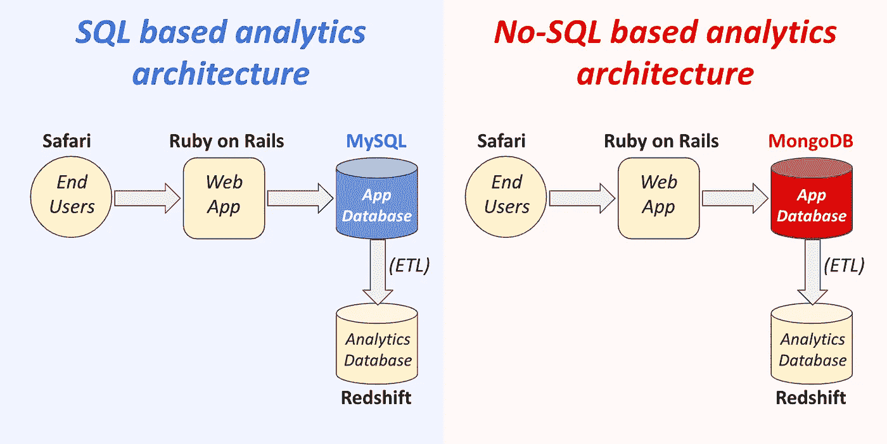

# No-SQL 是在扼杀 SQL 吗？

> 原文：<https://towardsdatascience.com/is-no-sql-killing-sql-3b0daff69ea?source=collection_archive---------6----------------------->


## SQL 永远不会消亡的两个原因

上周，一位朋友转发给我一封电子邮件，邮件来自一位成功的企业家，他宣称“SQL 已死”。

这位企业家声称，像 MongoDB 和 Redis 这样广受欢迎的非 SQL 数据库会慢慢扼杀基于 SQL 的数据库，因此作为数据科学家学习 SQL 是一个“遗留问题”

我完全被他的邮件震惊了:他是如何得出如此离谱的结论的？但这也让我很好奇…有没有可能其他人也同样被误导了？这位企业家发展了一大批追随者，而且直言不讳——新的数据科学家是否收到了应该避免学习 SQL 的建议？

因此，我想我应该公开分享我对这位企业家的回应，以防其他人认为 SQL 正濒临灭绝。

> 你绝对应该**学习 SQL，以便从事数据科学的职业。No-SQL 对学习 SQL 的价值没有任何影响**

**基本上有两个原因可以保证 SQL 在未来的几十年里仍然适用。**

****原因#1:不会——SQL 数据库不会取代 Presto、Redshift 或 BigQuery 等分析数据库****

**无论您的应用程序是使用 MySQL 这样的 SQL 后端还是 MongoDB 这样的非 SQL 后端，后端中的数据最终都会被加载到 Redshift、Snowflake、BigQuery 或 Presto 这样的专用分析数据库中。**

****

**具有分析数据库的平台架构示例:SQL 和 NoSQL**

**为什么公司要把数据转移到像 Redshift 这样的专业化柱状存储中？因为列存储能够比 NoSQL 和像 MySQL 这样的行存储数据库更快地运行分析查询。事实上，我敢打赌，柱状商店数据库的流行程度与 NoSQL 数据库一样快。**

**因此，应用程序数据库的技术，无论是 NoSQL 还是其他，通常与数据科学家无关，因为他们不使用应用程序数据库(尽管有一些例外，我将在后面讨论)。**

****原因 2:NoSQL 数据库的好处不是因为它们不支持 SQL 语言****

**事实证明，非 SQL 存储可以实现一个基于 SQL 的查询引擎，如果它对它们的支持有意义的话。类似地，SQL 数据库也可以支持 NoSQL 查询语言，但是他们选择不支持。**

**那么为什么柱状存储数据库*有意选择*提供 SQL 接口呢？**

**他们这样选择是因为 SQL 实际上是一种表达数据操作指令的非常强大的语言。**

**考虑一个简单的查询示例，该查询对 NoSQL 数据库 MongoDB 中的文档集合进行计数。**

> **注意:MongoDB 中的文档类似于行，而集合类似于表。**

```
**db.sales.aggregate( [
  {
    $group: {
       _id: null,
       count: { $sum: 1 }
    }
  }
] )**
```

**将其与等效的 SQL 进行比较。**

```
**select count(1) from sales**
```

**很明显，对于想要提取数据的人来说，SQL 语言是更好的选择。(NoSQL 数据库支持一种不同的语言，因为 SQL 对于与数据库接口的应用程序库来说比较难以正确构建)。**

**我之前提到过，应用程序数据库的技术与数据科学家无关的规则也有例外。例如，在我的第一家公司，我们实际上没有像 Redshift 这样的分析数据库，所以我必须直接查询应用程序的数据库。(更准确地说，我是在查询应用程序数据库的读取副本)。**

**该公司的应用程序还使用了非 SQL 数据库 Redis，至少有一次我需要直接从 Redis 中提取数据，所以我确实需要学习 Redis 的 NoSQL API 的一些组件。**

**因此，在主应用程序专门使用 NoSQL 数据库的环境中，您学习的任何 SQL 都可能是不相关的。但是这些环境非常罕见，随着公司的发展，他们几乎肯定会投资支持 SQL 的列存储分析数据库。**

**感谢阅读！如果你觉得这篇文章有用，我写的是关于数据科学和媒体编程的文章，所以如果你想了解更多类似的内容，请关注我。**

**[](/how-to-pass-the-facebook-data-science-interview-3f2615c17012) [## 如何通过脸书数据科学面试

### 赢得面试的 4 个技巧

towardsdatascience.com](/how-to-pass-the-facebook-data-science-interview-3f2615c17012) [](/why-python-is-better-than-r-for-data-science-careers-44ec7a149a18) [## 为什么 Python 比 R 更适合数据科学职业

### 新数据科学家将从学习 Python 中获益更多的四个原因

towardsdatascience.com](/why-python-is-better-than-r-for-data-science-careers-44ec7a149a18)**