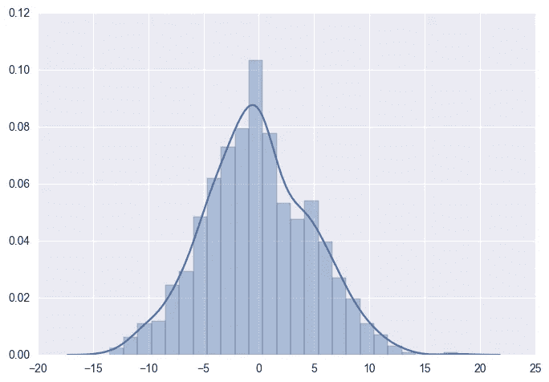
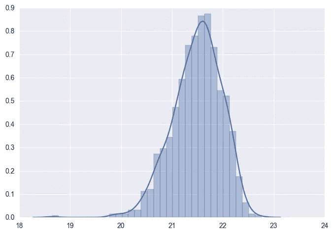
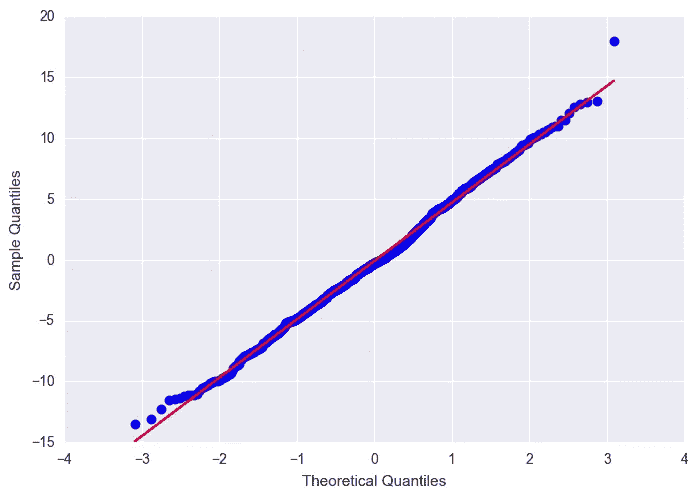
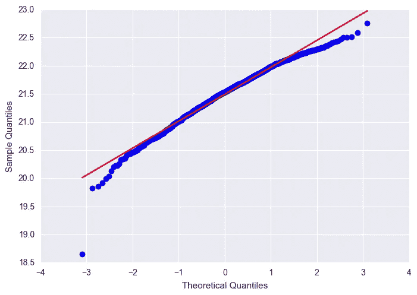
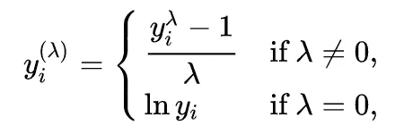
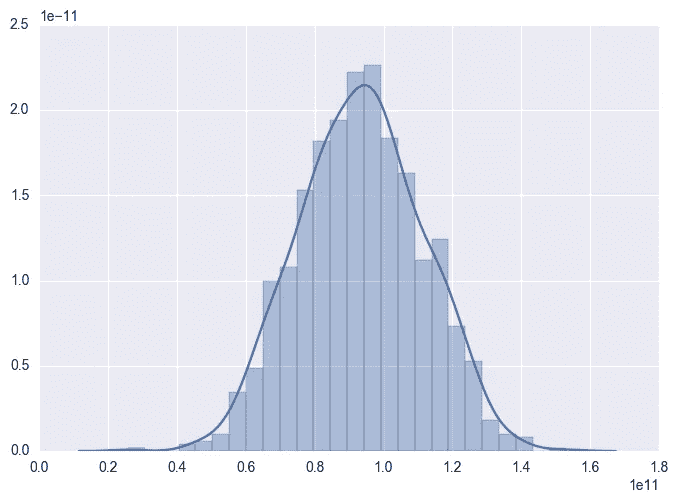
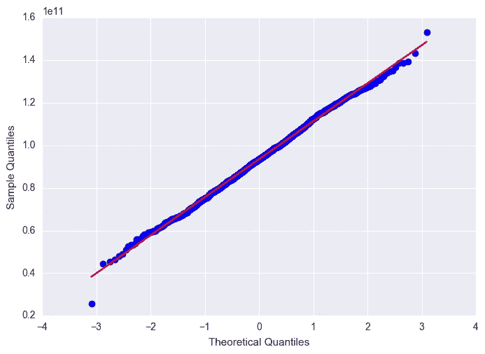

# 回归中正态分布有必要吗？如何跟踪修复？

> 原文：<https://towardsdatascience.com/is-normal-distribution-necessary-in-regression-how-to-track-and-fix-it-494105bc50dd?source=collection_archive---------4----------------------->

## 博克斯-考克斯变换，夏皮罗-维尔克检验，QQ 图


作者拍摄的图片——新加坡南洋理工大学的钟形建筑

我相信对于每个以前学过统计学的人来说，正态分布(高斯分布)是他们学到的最重要的概念之一。每次运行模型或者做数据分析的时候，我都倾向于检查因变量和自变量的分布，看它们是否正态分布。如果有些变量是偏斜的，不是正态分布的，我会有点慌。

> 我该怎么办？我应该转换变量吗？我应该把它从模型中移除还是就这么放着？

我总是想知道常态是否是一个必要的假设，以及我们应该如何解决它。这篇文章就是关于这些的。

> 那么对于自变量和因变量，正态性假设有必要成立吗？**答案是否定的**！

假设正态分布的变量只是预测误差。什么是预测误差？是模型预测结果与真实结果的偏差。

Y =系数* X +截距+预测误差

预测误差应遵循平均值为 0 的正态分布。置信区间和变量显著性的计算就是基于这个假设。这是什么意思？例如，您试图分析哪些变量有助于预测房价，并且您选择了基于 5%显著性水平的因素。如果误差分布显著偏离均值 0 正态分布，那么你选择的显著因素实际上可能不足以显著影响房价变化。但是，如果您只想获得基于最小均方误差的预测，这不会影响您的预测。

**那么我们该怎么办？**如果你只是想得到预测，那就随它去吧。如果要选择重要的预测因素，在构建模型和预测后，应该绘制图表以查看预测误差的分布。

为了更好地说明，我创建了 1 个随机正态分布样本和 1 个非正态分布样本，每个样本都有 1000 个数据点。

```
#create normal and nonnormal data sample
import numpy as np
from scipy import stats
sample_normal=np.random.normal(0,5,1000)
sample_nonnormal=x = stats.loggamma.rvs(5, size=1000) + 20
```

有许多方法可以检验数据的正态性，下面只是一些例子:

1.  简单地画出分布曲线，看看曲线是否符合钟形曲线形状。非正态样本明显是左尾的。

```
import seaborn as sns
import matplotlib.pyplot as plt
sns.distplot(sample_normal)
plt.show()
sns.distplot(sample_nonnormal)
plt.show()
```



正态分布样本的分布(左)；非正态分布样本的分布图(右)

2.使用[夏皮罗-维尔克测试](https://docs.scipy.org/doc/scipy/reference/generated/scipy.stats.shapiro.html)，内置的 python 库可用，您可以根据您决定的 p 值来决定，通常我们在 5%的显著性水平上拒绝 H0，这意味着如果 p 值大于 0.05，那么我们接受它为正态分布。注意，如果样本量大于 5000，就应该用检验统计量而不是 p 值作为指标来决定。

```
print (stats.shapiro(sample_normal))
print (stats.shapiro(sample_nonnormal))#Test Statistics, p-value
#(0.9970424175262451, 0.06130971387028694) - H0 accepted
#(0.9806660413742065, 2.945287624900317e-10) - H0 rejected
```

3. [QQ 图](https://www.statsmodels.org/stable/generated/statsmodels.graphics.gofplots.qqplot.html)，一个非常流行的用来观察数据分布是否遵循正态分布的图。

```
fig = sm.qqplot(sample_normal,line='s')
plt.show()
fig = sm.qqplot(sample_nonnormal,line='s')
plt.show()
```



正态分布 QQ-plot(左)；非正态分布 QQ 图(右)

## 我们如何解决常态问题:

通常，出现此问题(误差不符合正态分布)有两个原因:

1.  因变量或自变量太不正常(可以从变量的偏斜度或峰度看出)
2.  存在一些干扰模型预测的异常值/极值

我们应该做的是首先检查因变量和自变量中是否存在异常值。如果去除异常值不能解决问题，那么我们应该使用 box-cox 变换将一些非正态变量转换为正态分布。

下面是 Box-Cox 变换的数学公式。将基于数据点来决定λ值，以在变换后提供最佳的正态分布形状。我们可以直接使用 [Python 包](https://docs.scipy.org/doc/scipy/reference/generated/scipy.stats.boxcox.html)来帮助我们转换数据。



Box-Cox 变换数学公式

```
#transform the data using box-cox
sample_transformed, lambd = stats.boxcox(sample_nonnormal)#plot the distribution curve and QQ-plot for transformed data
sns.distplot(sample_transformed)
plt.show()
fig = sm.qqplot(sample_transformed,line='s')
plt.show()
```



我们可以看到，经过 box-cox 变换后，非正态分布的样本是正态分布的。

总之，如果您试图找到一个重要的预测因子或定义置信区间，请记住在模型建立后检查误差项的分布。如果因变量或自变量非常非正态，那么可以使用 box-cox 变换对其进行变换，使误差项更加正态分布。

您认为在构建模型之前，您已经完成了所有的统计假设检查了吗？不，你不是！如果你想了解更多关于回归模型中的其他统计假设，请参考我下面另一篇关于多重共线性的文章。

[](/multi-collinearity-in-regression-fe7a2c1467ea) [## 回归中的多重共线性

### 为什么这是个问题？如何跟踪和修复它

towardsdatascience.com](/multi-collinearity-in-regression-fe7a2c1467ea)