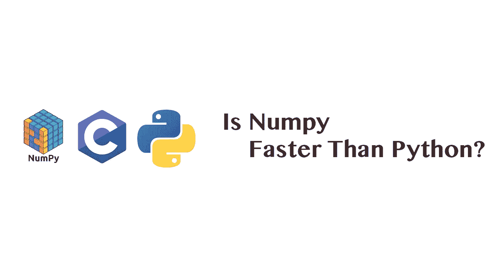
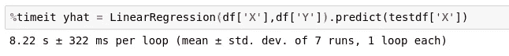
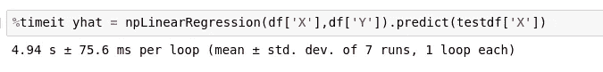

# NumPy 比 Python 快吗？

> 原文：<https://towardsdatascience.com/is-numpy-faster-than-python-e8a7363d8276?source=collection_archive---------17----------------------->

## Numpy 的线性代数比常规 Python 快多少？



A 前几天，我写了一篇文章，客观地比较了 Julia 和 Python 的现状，甚至测试了两种语言之间的一些基本迭代性能。虽然 Python 肯定落后于 Julia，但令人印象深刻的是 Python 在 Julia 面前表现得如此之好，当处理较小的数据集时，Python 通常仅落后于 Julia。然而，当观察次数增加时，Python 的速度缺点似乎成指数增长。您可以在此处找到该文章的链接:

[](/should-you-jump-pythons-ship-and-move-to-julia-ccd32e7d25d9) [## 该不该跳 Python 的船，搬去茱莉亚？

### 是应该为了朱丽亚的表现而抛弃 Python，还是朱丽亚的速度只是精心炒作？

towardsdatascience.com](/should-you-jump-pythons-ship-and-move-to-julia-ccd32e7d25d9) 

公开发表你的作品的一个好处是，它基本上可以被整个互联网的同行评议。虽然这可能会为一些相当粗鲁的人找你麻烦打开大门，但它也允许志同道合的科学家交流思想。这个故事留下了很大的反响，对我的测试进行了建设性的批评，因为我为元素级乘法和元素级指数编写了自己的函数。需要说明的是，我的目标是比较这两种语言的原始能力，并不是说用一种或另一种语言可以更快地编写这个算法，而是说明用 Julia 编写后端代码要容易得多，这与因为 Python 的缺点而改用 C 语言相反。

当然，比起使用我自己的函数，大多数 Python 程序员更希望我不要重新发明轮子，而是把它做成方形，并且更希望我只使用 NumPy。然而，为了准确测试 Pythonic 的性能，并与不使用 C 的 Julian 性能进行比较，我避免使用 C。

然而，这个想法让我很好奇。在 Github 上看，NumPy 大约有 51%是 c 语言，所以很明显，在很多情况下，NumPy 会击败我们在 Python 中可以进行的任何操作。目前悬而未决的是，我们可以从这样的事情中获得多大的性能提升。此外，NumPy 中相对基本的线性代数函数，如 numpy.multiply()，有可能是用 Python 编写的，甚至没有利用 c。

# %timeit 测试

> [笔记本](https://github.com/emmettgb/Emmetts-DS-NoteBooks/blob/master/Python3/numpyvspythonspeedtest.ipynb)

我想测试这一点的第一种方法是使用我在之前的另一篇文章中使用的相同方法。我将使用一个 10，000，000 的 dim 数据集，并尝试使用一个简单的线性回归模型进行预测，该模型使用了 C 中可能使用的 NumPy 函数和我自己的 Pythonic 函数。下面是使用我自己的函数编写的类:

```
def dot(x,y):
    lst = []
    for i,w in zip(x,y):
        lst.append(i * w)
    return(lst)
def sq(x):
    x = [c ** 2 for c in x]
    return(x)
class LinearRegression:
    def __init__(self,x,y):
        # a = ((∑y)(∑x^2)-(∑x)(∑xy)) / (n(∑x^2) - (∑x)^2)
        # b = (x(∑xy) - (∑x)(∑y)) / n(∑x^2) - (∑x)^2
        if len(x) != len(y):
            pass
        # Get our Summations:
        Σx = sum(x)
        Σy = sum(y)
        # dot x and y
        xy = dot(x,y)
        # ∑dot x and y
        Σxy = sum(xy)
        # dotsquare x
        x2 = sq(x)
        # ∑ dotsquare x
        Σx2 = sum(x2)
        # n = sample size
        n = len(x)
        # Calculate a
        self.a = (((Σy) * (Σx2)) - ((Σx * (Σxy)))) / ((n * (Σx2))-(Σx**2))
        # Calculate b
        self.b = ((n*(Σxy)) - (Σx * Σy)) / ((n * (Σx2)) - (Σx ** 2))
        # The part that is super struct:
    def predict(self,xt):
        xt = [self.a + (self.b * i) for i in xt]
        return(xt)
```

这是使用 NumPy 函数编写的同一个类:

```
import numpy as np
class npLinearRegression:
    def __init__(self,x,y):
        # a = ((∑y)(∑x^2)-(∑x)(∑xy)) / (n(∑x^2) - (∑x)^2)
        # b = (x(∑xy) - (∑x)(∑y)) / n(∑x^2) - (∑x)^2
        if len(x) != len(y):
            pass
        # Get our Summations:
        Σx = sum(x)
        Σy = sum(y)
        # dot x and y
        xy = np.multiply(x,y)
        # ∑dot x and y
        Σxy = sum(xy)
        # dotsquare x
        x2 = np.square(x)
        # ∑ dotsquare x
        Σx2 = sum(x2)
        # n = sample size
        n = len(x)
        # Calculate a
        self.a = (((Σy) * (Σx2)) - ((Σx * (Σxy)))) / ((n * (Σx2))-(Σx**2))
        # Calculate b
        self.b = ((n*(Σxy)) - (Σx * Σy)) / ((n * (Σx2)) - (Σx ** 2))
        # The part that is super struct:
    def predict(self,xt):
        xt = [self.a + (self.b * i) for i in xt]
        return(xt)
```

使用的两个 Numpy 函数是 square()和 multiply()。这些函数相对简单，正如我在函数示例中展示的那样，所以我真的很好奇是否有 C 语言可以加速它们。在我们开始速度测试之前，我们需要读入一些数据:

```
import pandas as pd
df = pd.read_csv("speedtrain.csv")
testdf = pd.read_csv("speedtest.csv")
```

现在我们将以我们自制的函数为基线来计时:



虽然 8.22 当然不坏，但它还可以更好。Julia 在不到一秒钟的时间内完成了这个计算，所以看看 C 和 Python 的组合如何与 Julia 相抗衡将会非常有趣:



> 哇！

看起来我文章的评论有一点是对的；NumPy 和 C 对于线性代数来说要快得多。我曾怀疑 NumPy 可能会为这个操作保留纯 Python 代码，但是很明显我错了。我认为提醒我们自己 NumPy 可能也有自己的类型和用 C 编写的迭代器也很重要。这当然非常酷，因为这意味着 NumPy 相对来说非常快。

# 结论

所以简短的回答是

> 是的，

NumPy 比 Python 快很多。虽然这是意料之中的，但是如果我说我期望通过使用 NumPy 而不是 Pythonic 函数来实现我的目标，那么我是在撒谎。我认为这也是对为了 Python 中的科学和数学而对 NumPy 包所做的惊人工作的一种敬意。目前，NumPy 在 Github 上有超过 23，000 个提交，这是为社区做的大量免费、开源、无私的工作！

总的来说，我认为 Python 可以通过使用一个大的 C 库来加速是非常酷的。毕竟，Python 主要是为最终用户与低层应用程序进行交互而创建的，就像他们在 ABC 中那样。我很高兴收到这个回复，并且能够进一步研究这个问题，了解更多关于使用 NumPy 带来的性能好处。非常感谢你们所有人的阅读，也感谢你们提供建设性的反馈，比如催生了这篇文章的回复。