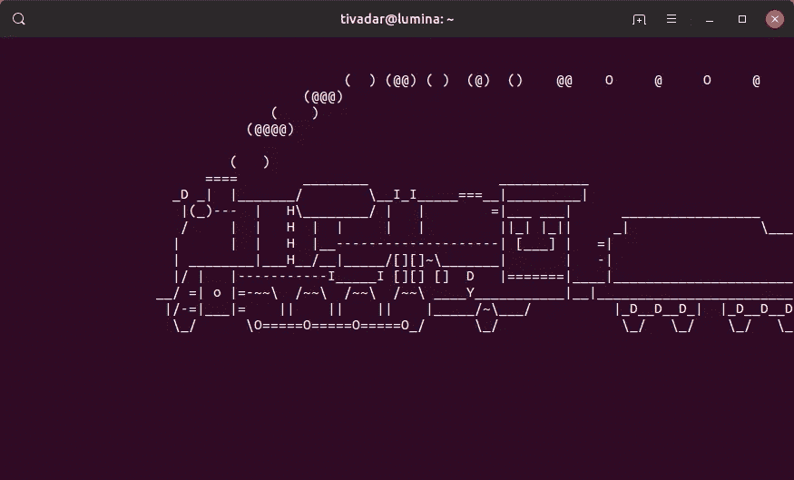
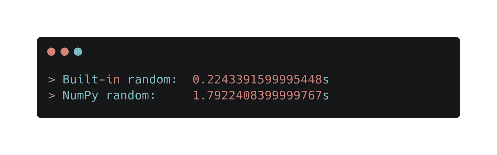
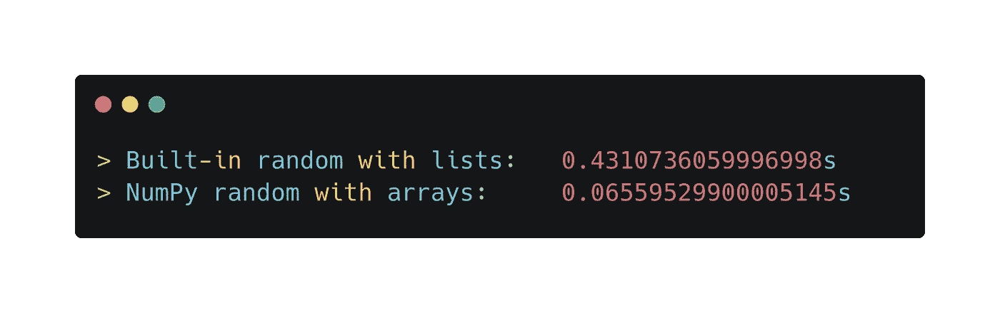
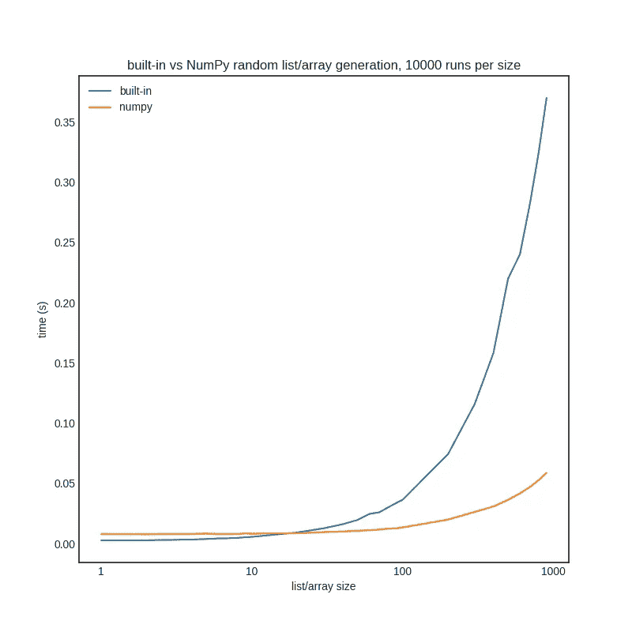

# NumPy 真的比 Python 快吗？

> 原文：<https://towardsdatascience.com/is-numpy-really-faster-than-python-aaa9f8afb5d7?source=collection_archive---------24----------------------->



来源:sl linux 命令的截图

## 是的，但前提是你知道如何使用它。

Python 开发人员都知道 NumPy 比普通 Python 快。然而，如果你用错了，它可能会影响你的表现，这也是事实。要知道什么时候使用 NumPy 是有益的，我们必须了解它是如何工作的。

在这篇文章中，我们将详细了解一下*为什么* NumPy 可以更快，以及什么时候使用它是次优的。

# Python 中的随机数

我们的玩具问题是随机数的产生。假设我们只需要一个随机数。我们应该使用 NumPy 吗？来测试一下吧！我们将它与内置的随机数生成器进行比较，运行两者一千万次，测量执行时间。

对我来说，结果如下。



所以，对于单个随机数，NumPy 要慢得多。为什么会这样呢？如果我们需要一个数组而不是一个数字呢？会不会也慢一点？

这一次，让我们生成一个包含一千个元素的列表/数组。

(我不想在 lambdas 中包装要计时的表达式，因为在 Python 中函数调用有开销。我希望尽可能精确，所以我将它们作为字符串传递给`timeit`函数。)



现在情况大不一样了。当我们生成一个数组或随机数时，NumPy 轻松获胜。

这个结果也有一些奇怪的地方。首先，我们生成一个随机数 10 000 000 次。第二，我们将 1000 个随机数组成的数组生成 10 000 次。在这两种情况下，我们最终都有 10 00 万个随机数。使用内置方法，当我们将它们放入一个列表中时，需要大约 2 倍的时间。然而，使用 NumPy，当使用数组时，我们看到了比它本身快 30 倍的速度。

为了了解幕后发生了什么，我们将对代码进行分析。

# 剖析代码:使用 cProfiler 进行分析

为了查看脚本在每个函数中花费了多少时间，我们将使用 [cProfiler](https://docs.python.org/3/library/profile.html) 。

## 1.用于生成单个数字的内置随机数

我们先来看看内置函数。在下面的脚本中，我们像以前一样创建 10，0 00，0 00 个随机数。

我们从命令行使用 cProfiler:

```
python -m cProfile -s tottime builtin_random_single.py
```

出于我们的目的，这里有两个重要的列。`ncalls`显示一个函数被调用的次数，而`tottime`是花费在一个函数上的总时间，不包括花费在子函数上的时间。

所以内置函数`random.random()`如预期被调用了 10 000 000 次，在那个函数上花费的总时间是`0.380`秒。

NumPy 版本呢？

## 2.NumPy random 用于生成单个数字

这里，这是我们分析的脚本。

结果令人惊讶:

与之前类似，`numpy.random.random()`函数确实如我们所料被调用了 10 000 000 次。然而，脚本在这个函数上花费的时间比以前在内置的随机函数上花费的时间要多得多。因此，每次函数调用的成本更高。

然而，当我们开始使用数组和列表时，事情发生了巨大的变化。

## 3.内置的随机数生成一个随机数列表

像以前一样，让我们生成 1000 个随机数的列表 10 000 次。

侧写的结果并不令人惊讶。

正如我们所看到的，大约 60%的时间花在了列表理解上:10 000 个电话，总共 0.628 秒。(回想一下，`tottime`不计算子功能调用，比如这里对`random.random()`的调用。)

现在我们可以看到为什么 NumPy 在正确使用的情况下会更快。

## 4.NumPy random 用于生成随机数数组

这个剧本和以前一样非常简单。

这是侧写的结果。

10 000 次呼叫，即使每次呼叫花费的时间更长，您也可以获得 10 00 个随机数的`numpy.ndarray`。正确使用 NumPy 的原因是它的数组非常高效。它们就像 C 数组而不是 Python 列表。它们之间有两个显著的区别。

*   Python 列表是动态的，因此可以添加和删除元素。NumPy 数组的长度是固定的，所以如果不创建一个新的数组，就不能添加或删除。(创建一个数组成本很高。)
*   Python 列表可以同时保存几种数据类型，而 NumPy 数组只能包含一种。

因此，它们不太灵活，但性能明显更高。当不需要这种额外的灵活性时，NumPy 优于 Python。

# 盈亏平衡点在哪里？

为了确切地了解 NumPy 在随机数生成方面在多大程度上超过 Python，我们可以通过测量不同大小的执行时间来比较这两者。



我们可以看到 20 左右，NumPy 开始超过 Python。当然，对于其他运算，如计算正弦或数字相加，这个数字可能不同，但趋势是相同的。对于较小的输入大小，Python 的表现略胜于 NumPy，但是随着输入大小的增加，NumPy 会大幅度胜出。

# 摘要

正确使用 NumPy 可以显著提高性能。然而，在某些情况下，Python 可能是更好的选择。如果你不知道*什么时候*使用 NumPy，你可能会损害你的表现。

一般来说，你最好使用普通的 Python，例如

*   你处理小列表，
*   您想要频繁地添加/删除列表。

当优化性能时，总是要考虑事物内部是如何工作的。这样，即使是在 Python 中，您也可以真正增强代码。

[***如果你喜欢把机器学习概念拆开，理解是什么让它们运转，我们有很多共同点。看看我的博客，我经常在那里发表这样的技术文章！***](https://www.tivadardanka.com/blog)