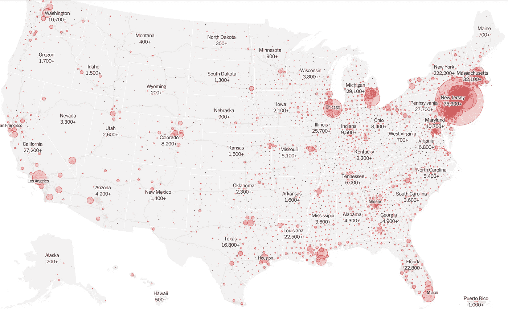
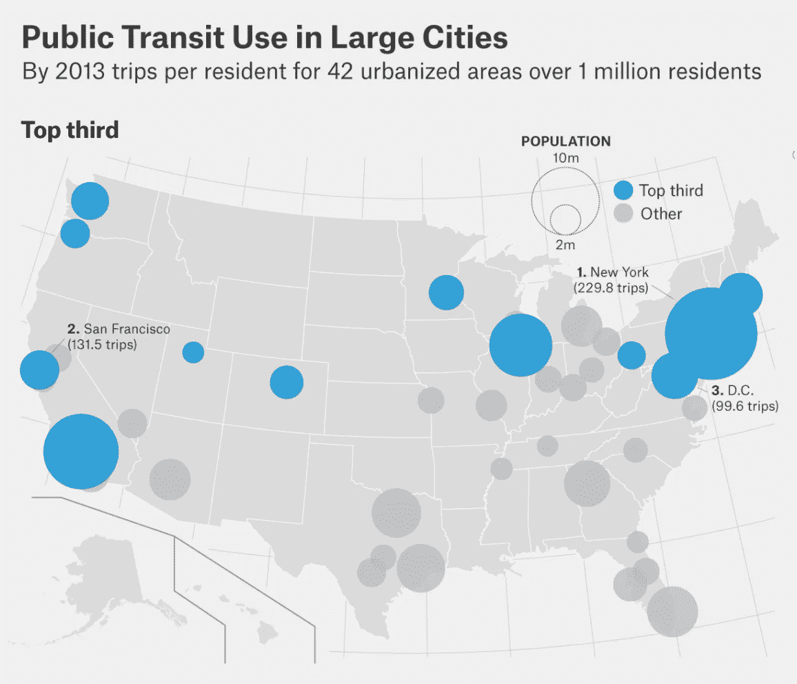
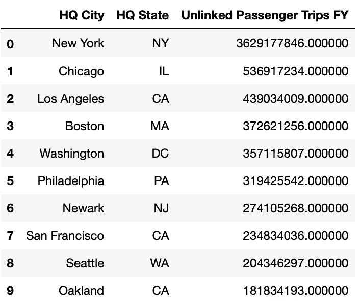
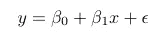
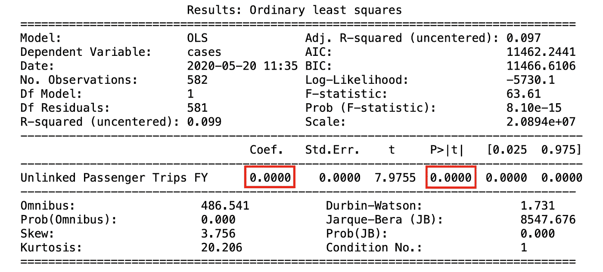
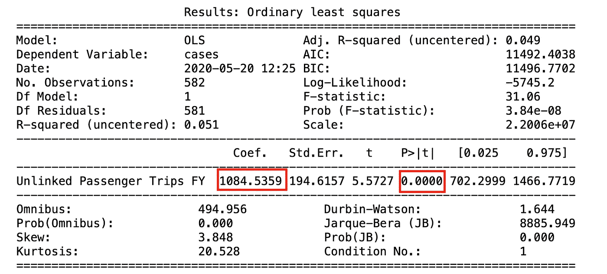
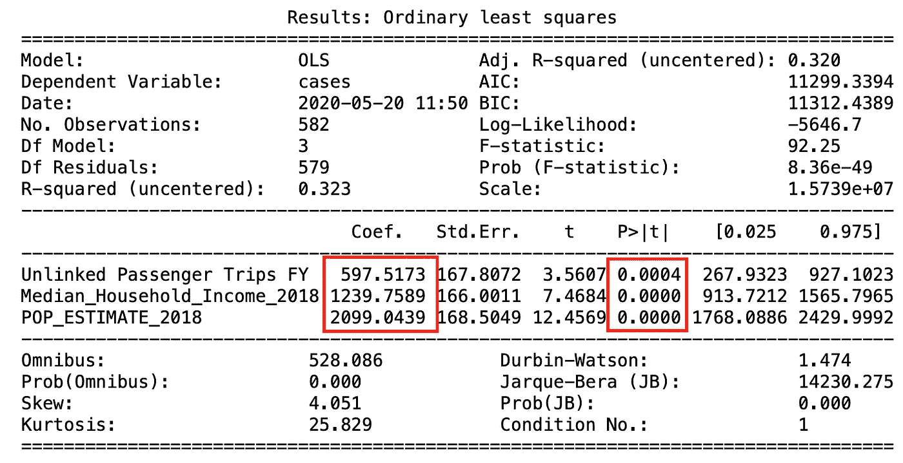

# 公共交通应该为冠状病毒的传播负责吗？

> 原文：<https://towardsdatascience.com/is-public-transit-to-blame-for-the-spread-of-coronavirus-3cec94b7388f?source=collection_archive---------57----------------------->

## 新冠肺炎 Python 教程# 2-熊猫和统计模型


马丁·大卫在 [Unsplash](https://unsplash.com?utm_source=medium&utm_medium=referral) 上的照片

```
***Note from the editors:***[*Towards Data Science*](http://towardsdatascience.com/) *is a Medium publication primarily based on the study of data science and machine learning. We are not health professionals or epidemiologists, and the opinions of this article should not be interpreted as professional advice. To learn more about the coronavirus pandemic, you can click* [*here*](https://www.who.int/emergencies/diseases/novel-coronavirus-2019/situation-reports)*.*
```

# 美国城市遭受重创

随着各州开始重新开放，很多事情仍不明朗。公共官员似乎在重新开放他们的州的问题上存在党派分歧，公民们开始在全国范围内抗议。虽然政党似乎发挥了作用，但这种分裂也可能是由冠状病毒的不均衡影响造成的。毫无疑问，美国城市受到的冲击最大。



来源:[https://www . nytimes . com/interactive/2020/us/coronavirus-us-cases . html](https://www.nytimes.com/interactive/2020/us/coronavirus-us-cases.html)

城市的人口密度最大，在获得医疗保健方面的差距也可能最大，因此可以预见，城市是受影响最大的地方。但是，病毒的传播会不会归结于对城市本身更为根本的东西。从图表中，我们可以看到最大的影响来自东北部，而越往西走，城市受到的影响似乎越来越小。

城市间影响力的差异引发了这样一个问题:东北部城市是否有一些根本的东西是西部城市不必担心的。例如，冠状病毒会因为公共交通使用的巨大差异而扩散吗？看看这张 2013 年的图表。



来源:[https://fivethirtyeight . com/features/how-your-cities-public-transit-stacks-up/](https://fivethirtyeight.com/features/how-your-citys-public-transit-stacks-up/)

它们看起来几乎是同一个图像。这是有道理的。每天乘坐拥挤的地铁车厢或只有一个携带者的小型封闭公共汽车上下班可能会导致新感染的爆发。更不用说，大量频繁接触的金属、玻璃和塑料表面，病毒可以在上面存活数小时。此外，这也可以解释在欧洲和其他发达国家相对更严重的影响，这些国家也有发达的公共交通系统。尽管乍一看很有说服力，但让我们看看数字是否支持它。

# 量化公共交通的影响

当州长和市长计划重新开放他们的社区时，应该采取重大预防措施来防止新感染的再次出现。公共交通可能是确保我们做好这件事的关键驱动力。在这篇文章中，我将带你通过一步一步的分析来估计公共交通对冠状病毒传播的影响。

## 数据

我使用了来自纽约时报的各县冠状病毒病例的分类数据，我还使用了 T2 联邦运输管理局发布的公共交通使用数据。文件中还包括从[美国农业部](https://www.ers.usda.gov/data-products/county-level-data-sets/download-data/) (USDA)收集的县级人口和收入数据。本文使用的所有数据都可以在[这里](https://github.com/sanisetti/publictransitcovid/blob/master/data.xlsx)找到。



根据非关联乘客出行对城市进行排名。非关联旅客出行是指居民进行的非关联的总出行次数。

```
**Note**: Probably the hardest part of this process is the data-wrangling in order to make the resulting dataset, if you would like to know how it was done, feel free to ask! This process also removed certain cities like NYC due to data matching errors between datasets. Also, the number of cases are as of when I was working on this project, which was actually about a month ago.
```

## 回归

量化自变量对因变量影响的一个简单方法是线性回归。



在这里，我们可以通过在上述回归中估计 x 的β系数，来模拟公共交通使用 *x* 对感染 *y* 的影响。我们可以在 python 中这样做，并检查它的重要性。首先，我们导入相关的包:

然后我们运行回归并打印结果！

执行回归后，我们发现我们有一个系数 0，但一个真正重要的 p 值。所以没有影响？



我们看到系数基本上为 0，并且在 t 统计量上有一个低 p 值。这意味着自变量在 99.999%的置信度下可能没有影响。

需要注意的是，我们的自变量的大小，比案例数要高得多。这可能导致系数小于 0.0001，但仍然很重要，因为乘客出行的数量在数千和/或数百万的数量级。因此，在进行回归分析之前，我们应该将变量标准化，以获得更合理的估计值。



结果表明，不相关的乘客旅行实际上对冠状病毒病例的数量有显著影响。

现在我们看到一个更有趣的结果，公共交通实际上可能对冠状病毒病例的数量有相对显著的影响。

## 检查有效性

这个结果准确吗？大概不会。可能有许多因素与公共交通使用相关，也可能对感染人数有因果影响。

例如，大量使用公共交通可能与低收入人群的高患病率相关。由于经济原因，这些人可能无法遵守留在家中的命令，因此更有可能被感染。高人口密度也可能与高公共交通使用率相关，更多的人意味着更多的交通流量——导致使用公共交通的概率更高。无论公共交通是否存在，更密集的环境都可能导致更多的感染。简而言之，贝塔系数可能被夸大了。相关性并不意味着因果关系。

那么我们该如何改善这一点呢？一种方法是使用一个[工具变量](https://en.wikipedia.org/wiki/Instrumental_variables_estimation)，该变量与其他因素无关。虽然有效，但在实践中很难找到有效的工具变量。公共交通的普及与人口密度、收入和地方政府有着内在的联系。

我们也可以尝试一种[差异](https://en.wikipedia.org/wiki/Difference_in_differences)的方法。如果这个国家有一些地区关闭了公共交通，我们可以比较这些县与那些没有关闭的县的感染率变化的差异。然而，没有足够多的县这样做，以作出准确的估计。因此，相反，我们将简单地添加一些控制变量，以尝试并减少因忽略因素而导致的偏差。

## 控制

我们应该添加的主要控制因素是人口密度和收入水平，因为这两个因素最有可能导致高估公共交通的影响。我们可以通过下面的代码来实现这一点:

我们看到它对我们的结果产生了巨大的影响。公共交通的影响已经减半，但它似乎仍然对冠状病毒的病例数有重大影响。



请注意，虽然不相关的乘客出行有影响，但这种影响大约是人口密度影响的四分之一。然而，这仍然是相当重要的。

# 结论

因此，根据分析，公共交通可能对新感染人数有影响。由于县级数据和市级数据之间的冲突，合并数据集存在一些限制，但我们仍然看到了一个相当令人信服的结果，即与农村地区相比，这可能导致了城市中病毒的更广泛传播。当政府计划重新开放时，他们应该特别小心如何重新开放高风险地区，他们应该依靠严格的分析来支持他们的决定。

本文是冠状病毒相关 python 教程的三部分迷你系列的第二篇文章。你可以在这里查看第一篇文章！