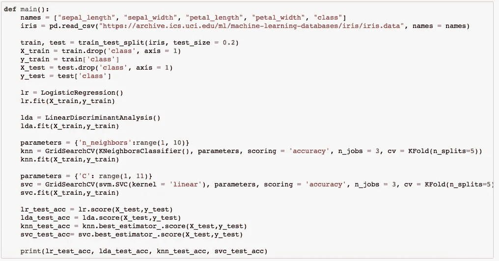

# Python 比 R 快吗？

> 原文：<https://towardsdatascience.com/is-python-faster-than-r-db06c5be5ce8?source=collection_archive---------23----------------------->

## 基于简单机器学习管道的 R vs Python 速度基准测试

图片改编自[https://www.r-project.org/logo/](https://www.r-project.org/logo/)和[https://www.python.org/community/logos/](https://www.python.org/community/logos/)

关于用于机器学习的正确工具，有很多反复出现的讨论。r 和 Python 经常被认为是替代品:它们都适合机器学习任务。但是当一个公司需要开发工具并为此维护两个解决方案时，这可能会带来更高的成本。所以，我们有时候不得不选择。

在这篇文章中，我将展示一个 R vs Python 的速度基准测试，我这样做是为了看看 Python 是否真的像某些人声称的那样提供了速度提升。

# 基准机器学习管道

对于一个基准来说，要做到公平是相对困难的:执行的速度可能很大程度上取决于我的代码，或者所使用的不同库的速度。我必须做出决定，我已经决定对虹膜数据集进行分类。这是一个相对容易的机器学习项目，这似乎有助于进行公平的比较。

我将使用 R 和 Python 中的库，我知道它们是常用的，此外它们也是我自己喜欢使用的库。

## 基准测试的步骤

我做了两个笔记本，R 和 Python，都执行以下步骤:

*   读取带有虹膜数据的 csv 文件。
*   将数据随机分为 80%的训练数据和 20%的测试数据。
*   使用内置的网格搜索和交叉验证方法，在训练数据上拟合多个模型
*   根据测试数据评估每个最佳模型，并选择最佳模型

## 基准的模型

我选择使用以下模型列表:逻辑回归、线性判别分析、K-最近邻和支持向量机。对于后两者，我添加了一个网格搜索，用于在 3 个内核上使用多处理进行 5 重交叉验证的超参数调优。

我选择了这些模型，而不是更流行的 Random Forest 或 XGBoost，因为后者有更多的参数，并且函数接口之间的差异使得很难确保模型执行的完全平等的设置。

我选择的模型参数更少，在 R 和 Python 中使用它们的方式几乎相同。因此，用错误的参数选择来偏置基准的风险较小。

# 由此产生的脚本和笔记本

我在下面展示了结果代码。要在你自己的硬件上运行笔记本，你可以在这里下载[R 笔记本](http://jooskorstanje.com/speed-benchmark-r.html)和在这里下载 [Python 笔记本](http://jooskorstanje.com/speed-benchmark-python.html)。

## R 代码

基准测试使用了以下 R 代码:

Python 比 R 快吗？—R 代码。作者配图。

## Python 代码

基准测试使用了以下 Python 代码:

Python 比 R 快吗？Python 代码。作者配图。

# 结果:Python 比 R 快吗？

为了进行公平的比较，我在一个执行了 100 次的函数中转换了完整的代码，然后测量了它所用的时间。这两个代码都是在配有 2.4GHz 双核英特尔酷睿 i5 处理器的 MacBook Pro 上执行的。

R 脚本的总持续时间大约是 11 分 12 秒，大约是每个循环 7.12 秒。Python 脚本的总持续时间大约为 2 分 2 秒，每个循环大约为 1.22 秒。

> Python 代码比 R 替代方案快 5.8 倍！

**因此，这种特殊机器学习管道的 Python 代码比 R 替代方案快 5.8 倍！**

当然，这不能自动推广到 R 和 Python 中任何类型项目的速度。此外，可能有更快的替代方法来用这两种语言编写这些代码，但我认为当关注功能而不是速度时，这两种代码都是编写机器学习笔记本的合理方法。

对我个人来说，这种差异比我预期的更显著，我会在未来的项目中考虑这一点。*我希望这篇文章对你也有用！感谢阅读！*