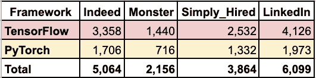
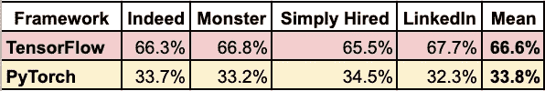
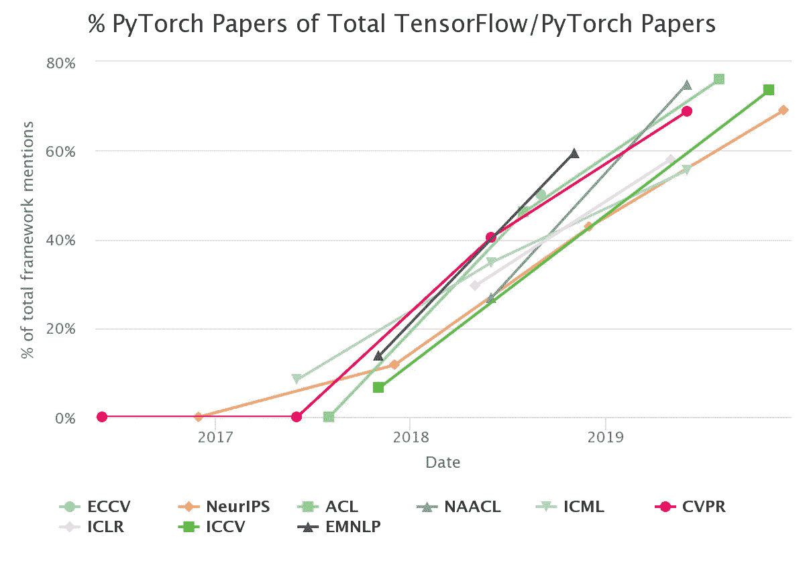
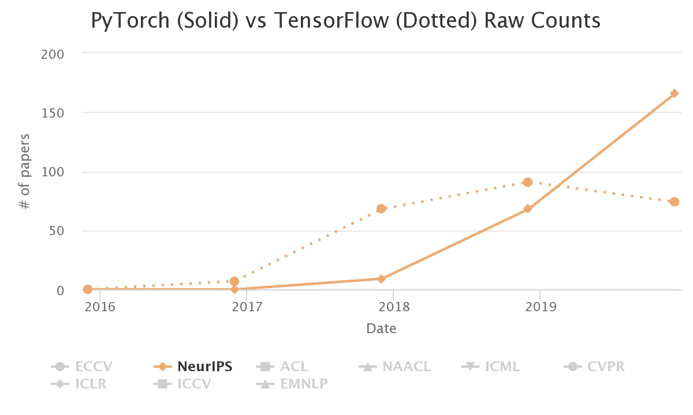
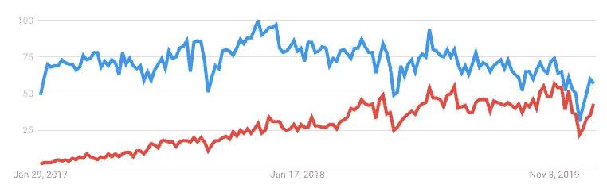
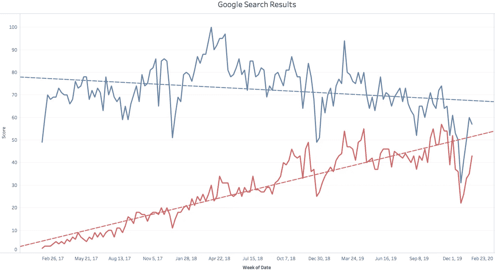

# PyTorch 是在抓 TensorFlow 吗？

> 原文：<https://towardsdatascience.com/is-pytorch-catching-tensorflow-ca88f9128304?source=collection_archive---------6----------------------->

## 2020 年深度学习框架的状态

自从我为主要的深度学习框架看风景以来，已经有 10 个月了。PyTorch 和 [TensorFlow](http://Search Results Web Result with Site Links www.tensorflow.org) 已经成为明确的框架选择。TensorFlow 领先 PyTorch 两年，但 PyTorch 已经在许多领域缩小了差距。让我们看看现在的情况吧！👍

PyTorch 和 TensorFlow？

# 有什么新鲜事？

TensorFlow 和 PyTorch 越来越像了。TensorFlow 采用了 PyTorch 创新，PyTorch 也采用了 TensorFlow 创新。值得注意的是，现在这两种语言都可以在动态执行模式或静态图形模式下运行。

这两个框架都是开源的，但是 [PyTorch](https://github.com/pytorch/pytorch) 是脸书的产品，而 [TensorFlow](https://github.com/tensorflow/tensorflow) 是谷歌的产品。

让我们看看其他一些显著的差异和更新。👍

## PyTorch

在撰写本文时，PyTorch 的版本是 1.4。它一直在增加功能，以提高行业的采用率。PyTorch 现在可以更容易地在[谷歌云的张量处理单元(TPUs)](https://cloud.google.com/tpu/docs/tutorials/pytorch-pod) 上运行——这是训练复杂深度学习模型的最快方法。

此外，Chainer 框架的维护者 Preferred Networks 最近将他们的团队带到了 PyTorch。最后，如果你喜欢 C++或 Java， [PyTorch](https://pytorch.org/) 有一个版本适合你。😀

## 张量流

TensorFlow 2.0 引入了许多改进，使 API 更加精简和友好。它紧密集成了 Keras，因为它是前端的高级 API。Keras 仍然可以与其他一些框架一起使用，但是将其作为 TensorFlow 的一部分使用通常是有意义的。

此外，如果你更喜欢 JavaScript 而不是 Python，TensorFlow 为你准备了一个 JavaScript 版本[。😀](https://www.tensorflow.org/js/)

TensorFlow 在生产和边缘深度学习方面仍然比 PyTorch 有更多的功能，但 PyTorch 越来越接近功能对等。

# 方法

如果你想学习一个流行的深度学习框架，PyTorch 和 TensorFlow 是城里的两个游戏。我没有考虑其他框架，因为没有其他框架被广泛采用。

在我之前的分析中，我查看了许多指标。结果显示，TensorFlow 和 PyTorch 都在稳步增长。在这篇文章中，我将关注我认为最重要的四个指标:工作列表、研究使用、在线搜索结果和自我报告使用。

让我们跳进来吧！🚀

# 工作列表

2020 年 1 月 26 日在美国用关键词 *TensorFlow* 和 *PyTorch* 搜索[果然](https://www.indeed.com/)、[怪兽](https://www.monster.com/jobs/)、[简聘](https://www.simplyhired.com/)、 [LinkedIn](https://www.linkedin.com/jobs/) 。

TensorFlow 在每个招聘网站的搜索结果中出现的次数平均是两倍。以下是原始数据:

这是结果占总数的百分比。

在我十个月前的分析中，我注意到 TensorFlow 出现在三倍于 PyTorch 的列表中。现在 TensorFlow 的优势降到了 2 倍。📉

# 研究

PyTorch 现在是顶级研究会议论文的领导者。前 PyTorch 实习生 Horace He 在本文中研究并讨论了这个话题。这是一张显示增长的图表。

来源:[https://chillee.github.io/pytorch-vs-tensorflow/](https://chillee.github.io/pytorch-vs-tensorflow/)

超过 50%意味着 PyTorch 比 TensorFlow 在那次会议上被提及的次数更多。

作为一个更详细的样本，这里是来自 NeurlIPS 会议的原始分数，PyTorch 使 TensorFlow 黯然失色。

来源:[https://chillee.github.io/pytorch-vs-tensorflow/](https://chillee.github.io/pytorch-vs-tensorflow/)

在最近的 NerulIPS 会议中，PyTorch 在 166 篇论文中，TensorFlow 在 74 篇论文中。PyTorch 从 2018 年的论文数量少于 TensorFlow，到 2019 年的数量增加了一倍多。

PyTorch 这么快就超过 TensorFlow 我觉得很惊讶。PyTorch 是否会继续扩大其在这一领域的领先优势，这将是一件有趣的事情。📈

接下来让我们看看在线搜索。

# 搜索流行度

我用 Google Trends 找到了 2017 年 1 月 26 日到 2020 年 1 月 26 日 PyTorch(软件)和 TensorFlow(计算机应用)在美国的相对搜索次数。

请参见下面的结果，TensorFlow 为蓝色，PyTorch 为红色:

谷歌搜索兴趣。蓝色张量流。红色火炬。

显然没有人想在寒假前后搜索深度学习框架。🎄😀

这是线性趋势线的相同数据。

蓝色张量流。红色火炬。参见 [*互动网络版*](https://public.tableau.com/shared/SCFBWY2SP?:display_count=y&:origin=viz_share_link)Tableau Public。

PyTorch 已经大大缩小了差距。看看这种趋势是否会持续下去将会很有趣。

最后，让我们看看人们说他们在用什么。

# 报告的使用

在 2019 年的[堆栈溢出开发者调查](https://insights.stackoverflow.com/survey/2019)中，10.3%的受访者报告使用 TensorFlow，而 3.3%的受访者报告使用 Torch/PyTorch。专业开发人员的得分相似(9.4%对 2.9%)。没有其他深度学习框架的报道。

值得注意的是，这项调查是在 2019 年初进行的，所以我们必须等待，看看 2020 年的结果会显示什么。📊

# 概述

TensorFlow 仍然在 PyTorch 的许多工作列表中被提及，但差距正在缩小。PyTorch 在顶级会议的研究论文中的使用量已经领先，并且几乎缩小了在谷歌搜索结果中的差距。根据最近的堆栈溢出开发者调查，TensorFlow 的使用仍然是普通的三倍。

总体而言，TensorFlow 在大多数领域仍然领先，但 PyTorch 正在取得进展。🐎

# 你应该关注什么？

这个项目是出于我的愿望而诞生的，我希望把我的时间花在使用深度学习框架并利用它进行教育上，这对于人们的学习来说是最有意义的。我仍然没有决定未来两年的答案是 PyTorch 还是 TensorFlow。

PyTorch 很可能会继续向对等发展。然而，TensorFlow 仍然是安全的选择。在可预见的未来，它将会很受欢迎，尤其是雇主。

值得注意的是，这两个框架都本着合作竞争的精神不断创新。即将到来的创新将塑造它们的受欢迎程度，并为用户带来好处。🎉

# 资源

如果你准备学习深度学习，我建议参考以下资源:

fast.ai MOOC 有很棒的视频和支持它的社区。想学 PyTorch 的话特别有用。

Chollet 的[用 Python 进行深度学习](https://www.amazon.com/Deep-Learning-Python-Francois-Chollet/dp/1617294438)这本书是关于深度学习的很好的入门书。他是 Keras 的原作者。如果你想学习 TensorFlow，这是一个特别好的选择。

TensorFlow 和 T2 py torch 的文档中都有很好的教程和指南。

## 先决条件

在你着手深度学习之前，我建议你学习 Python。如果你是 Python 的新手，我可以推荐我的[难忘的 Python](https://memorablepython.com) 书吗？😀

一旦你熟悉了 Python 基础知识，我建议你学习 NumPy 和 pandas Python 库来进行数据清理和分析。McKinney 的 [Python for Data Analysis](https://www.amazon.com/Python-Data-Analysis-Wrangling-IPython-ebook/dp/B075X4LT6K) 这本书很好地涵盖了 NumPy 和 pandas。我还在准备一本关于熊猫的书，所以订阅我的 [Data Awesome 邮件列表](https://dataawesome.com)吧，当它发布时，你会是第一个知道的人。

最后，在跳入机器学习的深度学习分支之前，我建议你用 [scikit-learn](https://scikit-learn.org/stable/) 库学习使用更通用的机器学习算法。我喜欢穆勒和圭多的[用 Python 介绍机器学习](https://www.amazon.com/Introduction-Machine-Learning-Python-Scientists/dp/1449369413/)。此外，Aurélien Géron 的第二版[使用 Scikit-Learn、Keras 和 TensorFlow 进行机器学习](https://www.amazon.com/Hands-Machine-Learning-Scikit-Learn-TensorFlow/dp/1492032646/)涵盖了使用 TensorFlow 2.0 进行机器学习和深度学习。

# 包装

我希望你发现这个对最流行的深度学习框架的状态的评估是有用的。如果你有，请在你最喜欢的社交媒体上分享，这样其他人也可以找到它。👍

我写关于 [Python](https://memorablepython.com) 、 [Docker](https://memorabledocker.com/) 、 [SQL](https://memorablesql.com/) 和其他技术主题的文章。如果你对此感兴趣，请关注我，在这里阅读更多。

快乐决定！⚖️