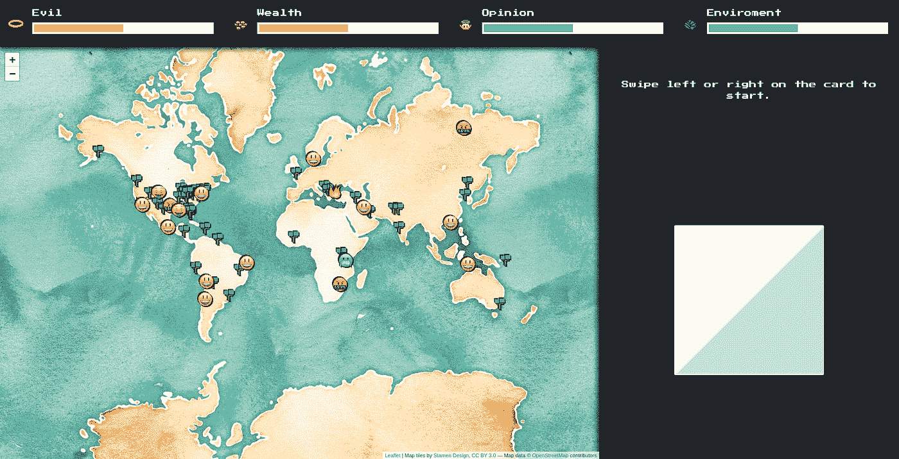
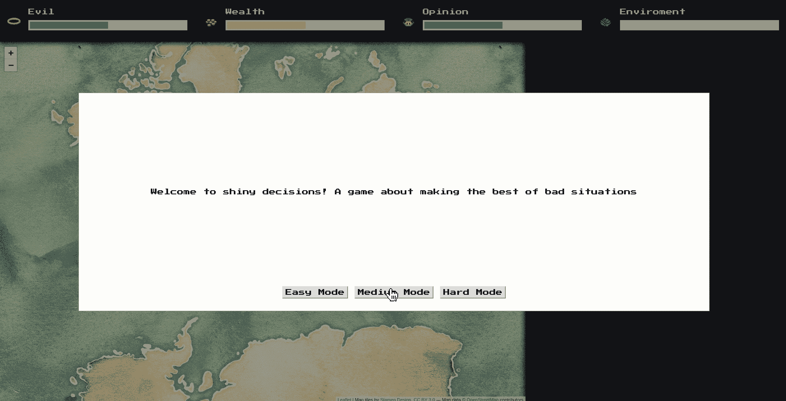
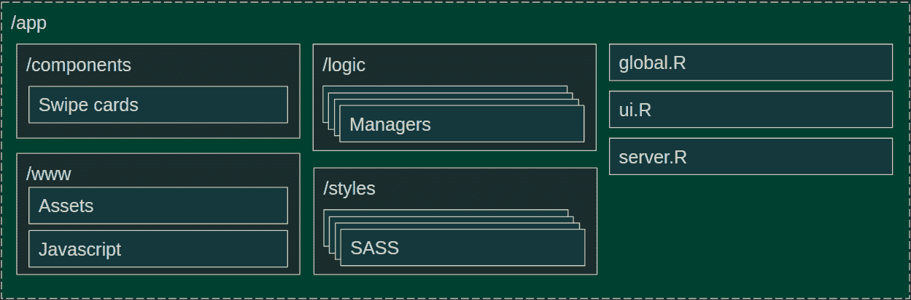
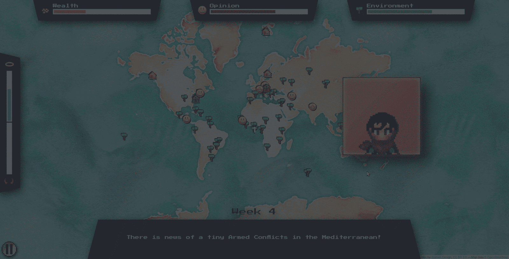
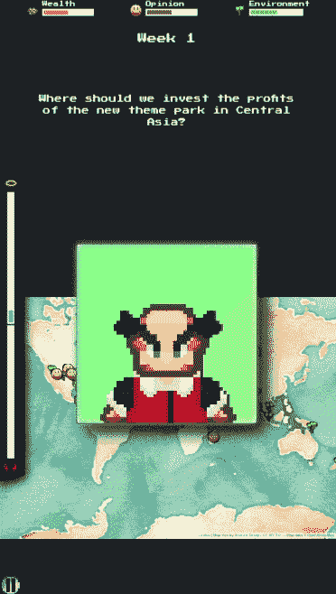
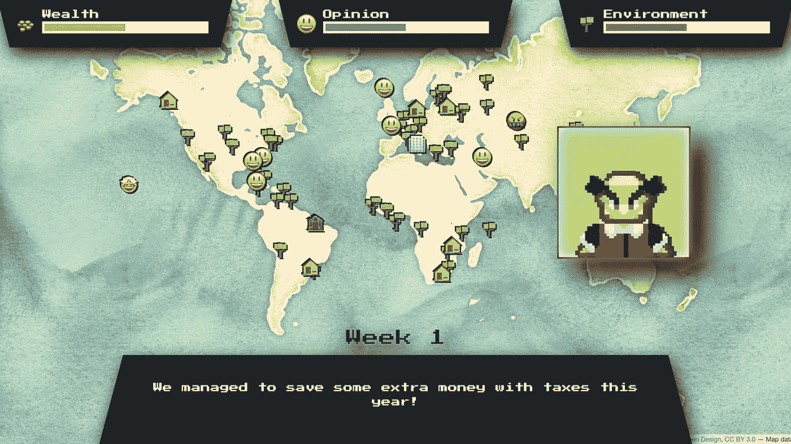

# R Shiny 的多功能性足以构建一个视频游戏吗？

> 原文：<https://towardsdatascience.com/is-r-shiny-versatile-enough-to-build-a-video-game-5c93232ef4e2?source=collection_archive---------61----------------------->

## 用有趣的方式推动 r 闪亮

在过去的两年里，RStudio 一直在组织一场竞赛，展示作为创建应用程序框架的 Shiny 的强大功能和灵活性。最近我一直致力于让闪亮的应用程序变得更漂亮，今年我决定参加这个比赛。然而，我想做一些稍微不同的事情…

就在那时，一个问题突然出现在我的脑海中:有没有可能用 R Shiny 来制作一个游戏，即使是作为一个原型？它真的有可玩性和趣味性吗？

# 电子游戏？在 R 闪亮？

历史上，Shiny 一直被用于数据驱动的应用程序和快速开发工具，但游戏之前已经在各种语言和框架中完成。不仅如此，所有的要素都在那里:构建 UI 的方法，保持游戏状态的东西，以及读取玩家输入并相应更新 UI 的能力。

早在 2016 年就有人试图制作简单闪亮的游戏《T2 》,但我想尝试一些更有雄心的东西。我越是拿这个想法开玩笑，它就越是可行。让我们看看我是不是对的。

# 这个概念

我最初的想法很简单。我希望它是一个慢节奏的游戏，你可以在桌面或手机上玩，因为我也想探索在 Shiny 中构建响应性 ui。我玩了一个刷卡游戏，不同方向的刷卡会以不同的方式影响游戏。这些选择会影响一些指标，玩家会调整决策，使这些指标保持在最佳水平。

*一款静态、早期版本的游戏。*

我觉得把玩家放在一个虚构的世界领袖的位置上会很有趣，他的决定会影响世界的状态。作为一名全能的决策者，你的工作是平衡经济、环境和公众对你表现的看法。如果其中任何一个达到零，游戏就结束了！

*玩家平衡三个指标:财富、观点和环境*

我还觉得用一个单独的值来追踪你有多邪恶会很有趣。不会让你输掉比赛，但会根据你的行为提供一些小的好处或障碍。因此，因果报应仪诞生了。

因果报应仪(左)

我想象它有一种复古的感觉，所以我用 [NES.css](https://nostalgic-css.github.io/NES.css/#) 来表达一点怀旧之情。我也真的想展示一个基于度量标准的地图，在这种情况下，“传单”是一个简单的选择，因为它是如此受欢迎和易于使用。

*实践中的概念验证*

有了大部分的研究和坚实的概念证明，是时候实施了！我希望有一个非常清晰和易于遵循的项目结构，同时让任何人都可以简单地学习和扩展。

# 项目结构

说到技术，HTML、CSS 和 JavaScript 将是前端的面包和黄油。像“htmltools”和“ [SASS](https://appsilon.com/how-to-make-your-css-awesome-with-sass/) ”这样的库是显而易见的选择，因为我打算手工构建许多这样的组件。这也可以让我轻松地包含 JavaScript 来实现更复杂的浏览器行为。

对于服务器组件，我决定将它们构建在各自的“模块”内的“R6”对象中。如果您不熟悉 R6，它是一种面向对象的编程方法，用于将方法和值封装到类中，然后可以作为单独的对象进行实例化，这意味着每个对象都有自己的方法和状态。这是一种不同于函数式编程的方法，但在其他语言中非常常用。请务必查看[马辛杜贝尔关于 R6 课程的有益帖子](https://appsilon.com/super-solutions-for-shiny-apps-using-r6-classes/)。

*项目结构图*

有了我想做的东西的想法，是时候实际建造这个东西了。所以我开始查看所需组件的列表:

*   **数据管理器**:负责加载和提供数据。因为我希望能够创建许多可能的卡片组合，所以我创建了一个小模板引擎，并使用 google sheet 作为我的数据库。这将允许我随时更改/添加/删除卡或选项，因为数据管理器总是会在新游戏开始时读取最新的数据。如果你对数据是如何保存的感兴趣，你可以在这里查看电子表格。
*   **卡牌管理员:**负责生成卡片并展示给玩家。它最终负责卡片的 UI，并根据游戏状态、当前因果值和一点随机性生成新卡，大量使用“样本”来挑选卡片模板、值和强度(卡片强度影响决策对不同指标的影响程度)。
*   **度量管理器:**主要负责当前游戏状态的视觉部分。它使用状态管理器值作为反应值来保持用户界面与游戏的当前状态同步。
*   状态管理器:游戏的核心，主要由反应列表和检查游戏状态变化的支持功能组成。例如，检查游戏结束。
*   **游戏经理:**实例化并集合所有其他经理。它负责游戏状态的启动、重置和所有高级别的改变。
*   **地图管理器:**管理一张地图，它提供了世界当前状态的一些视觉反馈。这不是最初的计划，也不是游戏所必需的，但我认为如果有一些东西而不仅仅是几个进度条来显示游戏状态，那会是一个不错的选择。

# 结果呢

几个周末后，我对它感到满意，并决定提交我的作品。竞赛结果还没有出来，所以请为我祈祷吧！

我对发展的速度感到震惊。反应值作为一个管理游戏状态的引擎是惊人的，R6 使得在需要的时候创建和破坏实例变得超级容易。使用电子表格作为数据库也是一个非常有趣的概念，结果比我预期的要好。最终的结果让我可以很容易地修复打字错误和添加新的卡类型。

由于一些自定义的 css 样式，即使是移动设备也能正常工作:

*手机版功能出奇的好！*

最后的想法:闪亮的游戏，是还是不是？

在这一点上，我们知道在 R Shiny 中构建一个正常运行的视频游戏是可能的。那么… *你是否应该*用 Shiny 来打造自己的游戏？说实话，大概不会。有几十种其他的框架和语言肯定更适合这种类型的项目。

然而，对我来说，这个项目展示了在 R Shiny 中实现复杂的 UX 和 UI 元素是多么容易。当然，这不是一个商业就绪的游戏，但作为一个概念证明或快速原型，可以在几天/几周内建立起来，然后迭代，Shiny 再次以一种非常积极的方式给我带来了惊喜。这对 Shiny 作为复杂企业仪表盘的首选解决方案的持续未来是个好兆头。

如果你想研究一下代码或者找到更多关于这个项目的信息，你可以在 Github 仓库中找到一切:[https://github.com/pedrocoutinhosilva/shiny.decisions](https://github.com/pedrocoutinhosilva/shiny.decisions)

也可能你只是想玩玩最后的结果！一定要让我知道你已经坚持了几周了！

在这里玩游戏:[https://sparktuga.shinyapps.io/ShinyDecisions/](https://sparktuga.shinyapps.io/ShinyDecisions/)

[https://sparktuga.shinyapps.io/ShinyDecisions/](https://sparktuga.shinyapps.io/ShinyDecisions/)

# 有用的参考资料

*   如果你在为你闪亮的项目寻找帮助:【www.appsilon.com】T4
*   *如有任何问题，关于这款游戏的评论还是闪亮一般*:[twitter.com/sparktuga](https://twitter.com/sparktuga)
*   *项目库*:[github.com/pedrocoutinhosilva/shiny.decisions](https://github.com/pedrocoutinhosilva/shiny.decisions)
*   *部署演示*:[sparktuga.shinyapps.io/ShinyDecisions/](https://sparktuga.shinyapps.io/ShinyDecisions/)
*   *模块*:[shiny.rstudio.com/articles/modules.html](https://shiny.rstudio.com/articles/modules.html)
*   *adv-r.hadley.nz/r6.htmlR6*:
*   *萨斯*:[github.com/rstudio/sass](https://github.com/rstudio/sass)
*   *r studio 2020 闪亮大赛*:[community.rstudio.com/t/shiny-contest-2020-is-here/](https://community.rstudio.com/t/shiny-contest-2020-is-here/)