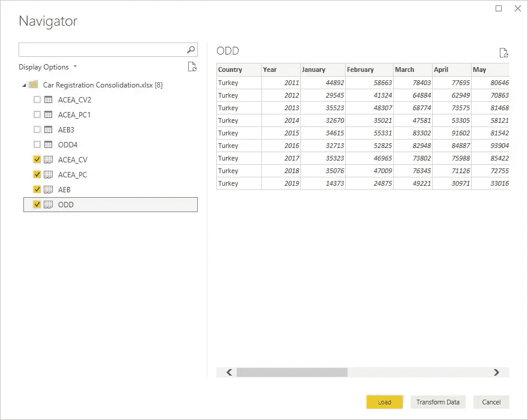
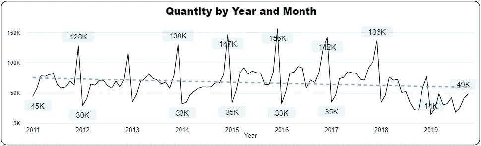
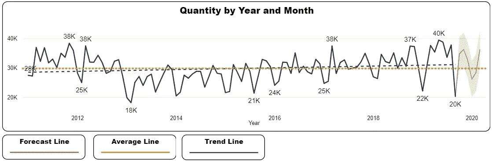

# 自助 BI 对每个人都可行吗？

> 原文：<https://towardsdatascience.com/is-self-service-bi-feasible-for-everyone-c9fa7fef4b31?source=collection_archive---------35----------------------->

# 介绍

商业智能(BI)工具/应用强调它们对复杂模型、大型数据集和复杂用例的解决方案，当然，这些解决方案也适合它们。可能希望在日常工作中使用这些工具的普通用户可能会因为认为只有 IT 专家才能开发这些东西而感到害怕和沮丧。

我不想说这个领域不需要专业知识，是的，一些解决方案需要巨大的努力和经验丰富的团队来实现。我想揭示的是，即使简单的用例也可以用最低/中等的技能来实现，它可以提供很好的内部效果并产生影响。

让我们通过使用从欧洲新乘用车和轻型商用车注册中收集的数据来举例说明这种说法，并生成一组简单但有用且有趣的可视化结果。以下示例将涵盖使用 MS Excel 和 Power BI 对数据的收集、存储、转换和可视化。

# 我们从哪里开始？

首先，我们必须获得信息(数据)并将其存储在某个地方。通常，数据存储在不同的位置、数据库或文件中，并且经常以不同的格式存储。对于这种情况，我们将把复杂性降到最低。

接下来，我们应该始终牢记 ETL 过程。这个缩写代表提取、转换和加载，可以解释如下:

**提取:**包括从不同的源中提取数据，并将其转换成适合转换的单一格式(接下来的步骤)。

**转换:**在此阶段，应用各种规则、函数和/或计算，以便为负载准备数据。这一阶段是数据清理发生的地方，它的目标是为数据的使用提供一个整洁的输出。

**Load:** 在这个阶段，数据被传输到所需的最终位置，这个位置可以是一个简单的平面文件，也可以是更复杂的数据仓库。根据不同组织的需求和用途，这个过程可能会有很大的不同，而且，由于加载的数据与数据库交互，还会发生许多其他的考虑事项。

完成前面的步骤后，可以设计和构建可视化和报告来传递信息并提供关于数据的见解。

# 工作时间到了！

## **数据采集和存储:**

对于这个例子，我们有四个不同的数据源；ACEA 乘用车登记([环节](https://www.acea.be/statistics/tag/category/passenger-cars-registrations))、ACEA 商用车登记([环节](https://www.acea.be/statistics/tag/category/monthly-provisional-vehicle-registrations-commercial-vehicle))、AEB 销售轿车及轻型商用车([环节](https://aebrus.ru/en/media/press-releases/sales-of-cars-and-light-commercial-vehicles.php))及奇数乘用车及轻型商用车([环节](http://www.odd.org.tr/web_2837_2/sortial.aspx?linkpos=1&target=categorial1&type=35&primary_id=&detail=single&sp_table=&sp_primary=&sp_fields=&sp_language=&sp_table_extra=&extracriteria=&language_id=2&search_fields=&search_values=))。

所有检索到的信息都将存储在一个 Excel 文件中，其中每个源都有自己的工作表。

每个来源一张工作表

对于每个源，数据将以下列相同的格式存储；国家、年份、月份(每月一个)和数据源(表明数据来自哪里——Source—)。

从下图中可以看出，每一行代表一个国家一年的观察结果。请注意，在这种情况下，所有信息都被插入到一个表中，并根据数据源进行命名。

ACEA 客车表

在相应的工作表中填写所有数据后，必须将文件保存在可以访问的位置。在这种情况下，它存储在网络位置的共享文件夹中。一旦完成，就为下一步做好了准备。

## **摘录:**

在这个阶段可以使用许多工具。在这种情况下，Power BI 将用于执行 ETL 过程和可视化。由于数据量非常小，并且它不是一个复杂的模型，所以在这里可以很容易地完成这项工作。

要获取数据，只需选择“获取数据”，然后，文件的来源(在这种情况下是 Excel)，一旦打开，选择相应的表格，然后单击“加载”。现在，四个不同来源的所有信息都加载进来了。

从 Excel 获取数据

选择文件中的表

作为转换过程之前的最后一步，建议检查是否正确提取了所有表中的数据。这将在查询编辑器中完成，可通过单击“编辑查询”按钮访问该编辑器。

通常 Power BI 能够识别标题(列名)和每个标题包含的数据类型。建议在每个表上检查这一点，因为有时 BI 猜测的功率可能不是我们所期望的。如果是这种情况，应该作进一步的改正。

在这个例子中，所有的列标题和数据类型都根据我们的需要正确地标识出来，每个表都没有错误(国家和数据源列用字符表示，每个月的数量用整数表示)。

## **变换:**

现在是做一些转变的时候了。首先，所有的表将通过追加来组合。只需在查询编辑器中右键单击其中一个表，然后单击“新建查询”、“合并”和“追加查询为新查询”就可以了。

通过选择“三个或更多表格”选项，然后单击“确定”，所有表格都应添加到“要追加的表格”字段。这将创建一个新的表，将这四个表组合在一起，我们可以在其中开始进行更多的转换。

为了使数据结构更适合在 Power BI 中使用，首先我们必须合并每个月的车辆数量。在当前的表格中，每个月对应于其包含数量的列。这里的目标是有一个包含数量的列和另一个规定月份的列。

为了实现这一点，并且再次在查询编辑器中对之前创建的表进行操作，必须选择每个包含月份的列(一月到十二月)。

下一步是在“转换”菜单中选择“仅取消选定列的透视”选项。

这将会创建两个新列，其中一个存储所有月份(属性)，另一个存储所有数量(值)。由于此操作，表中的行数将显著增加。

之后，它们可以用一个更有意义的名字重新命名，比如“月”和“量”。

在这个阶段，数据应该是期望的格式。在此之后可以进行其他操作或转换。例如，可以根据国家名称或任何其他特定要求来创建分类的条件列。

## **负载:**

如果前面的步骤发生在另一个实例中(不是 Power BI)，那么最终的数据将被加载到最终目标，比如一个带分隔符的平面文件或数据仓库。

因为数据的提取和转换是在与构建报告相同的环境(Power BI)中完成的，所以剩下要做的就是关闭查询编辑器并应用更改。

现在数据已经准备好进入最后阶段。

# **报告和可视化设计**

在这一阶段，必须对想要报告的内容有一个概念，是时候创建数据的视觉效果、图表和其他表示形式了。这部分本身是一个完整的主题，因此，可能的可视化和可能性的想法将被显示，但不包括如何创建它们。

在高层次的细节上，已经创建了一个包含三个条形图、一个折线图和一个地图的控制面板。

这些图像显示的是每年、每季度和每月累积的车辆登记数量。此外，一个线形图显示了几年来每月的数量，一个地图显示了相对市场规模(车辆注册数量)的国家。

数据的一些属性已经包含在过滤器窗格中。这使得对数据进行过滤和切片以获得更多信息成为可能。

接下来，显示了一些通过过滤和分割数据来获取信息和见解的示例:

## **仅显示 2018 年**

这里只过滤了年份，它按季度、月份显示了一年中所有国家/地区的总量，并且是按月份演变的。此外，可以看到地图上当年最大的市场。

## **仅显示意大利的 2018 年**

与上一个例子相同，但是在这个例子中，意大利被过滤为国家。

## **西欧五大汽车市场概述**

从地图上可以看出，西欧最大的市场是德国、法国、意大利、西班牙和英国。这些国家的发展是值得赞赏的。

随着问题和过滤越来越精细，可以在整个可视化中找到越来越多的细节和见解:

**确定西班牙新车注册的季节性和趋势**

虽然只关注折线图，但可以通过每个月来了解市场的发展。此外，该国车辆登记的季节性也有助于了解这一趋势。

## **识别土耳其市场的冲击，例如 2019 年**

除了最后一个例子，市场的冲击也可以在以下土耳其 2019 年的例子中发现。

可以使用更高级的功能来制定未来的决策，如生成预测(与工具集成)并观察德国市场新车注册的总体趋势

## **预测**

可以使用更高级的功能来制定未来的决策，如生成预测(Power BI 中的集成工具)并观察德国市场新车注册的总体趋势。

通过对德国市场的轻型商用车进行过滤，可以获得更大的粒度。

和前面的例子一样，但是是客车。

如前所述，从许多不同角度分析数据的机会是存在的，根据这些信息做出决策的可能性也增加了。

# **维护和更新**

除了本例的设置之外，剩下要做的就是在文件中的数据可用时更新它。为此，新信息将简单地添加到 Excel 文件中。

如果数据结构及其可用性没有变化，就不需要任何维护。因此，一旦数据被刷新，模型应该能够反映最新的信息。

相反，如果这些方面发生变化，可能需要更新整个流程。

# **收尾**

前面的例子是一个简化的用例，但是，值得注意的是，像这样简单的东西可以提供有见地和有用的结果。

对于每个分析/BI 项目，基础都依赖于数据可用性。正如在第一部分中所演示的，拥有一种结构化的收集和存储数据的方式将会使接下来的步骤更加简单和直接。

有了这个基础，流程的后续部分(ETL)变得更容易管理。在这种情况下，由于其结构化的形式和方便的位置，提取和导入数据很容易。必须特别注意正在提取的数据(即，它是否包含错误、缺失值或被标注在不正确的数据类型下)。

因为数据是“干净的”，所以这个例子的转换部分简单明了。唯一需要处理的事情是合并表，并将数据结构转换成适合需要的格式。最后，在这种情况下，加载就像单击一个按钮一样简单。

一旦所有的可视化都完成了，报告也构建好了，BI 工具的真正潜力就可以被欣赏了。经过一些过滤，交叉过滤和其他选择，可以获得有力和有见地的信息。

现在，总结一下，所有这些都做完了，让我们回到我们的问题上来；自助 BI 对每个人都可行吗？

在我看来，答案是肯定的，但有一个条件。这一过程可能会令人生畏，对于完全不熟悉电子表格和数据可视化的人来说，这将有一个相当长的学习曲线。因此，如果这个人对前面的几点一点都不熟悉，在开始的时候需要额外的努力，但这不是一个限制。

对于那些在过去有电子表格和数据可视化经验的人来说，这根本不应该是一个大挑战。如开头所述，简单的自助 BI 用例可以通过最低/中等技能水平实现。