# 社交距离有用吗？

> 原文：<https://towardsdatascience.com/is-social-distancing-working-b1c6e9359bde?source=collection_archive---------37----------------------->

## 使用苹果的移动跟踪数据来衡量社交距离在控制 Covid19 方面的有效性

苹果发布了一份移动数据趋势([www.apple.com/covid19/mobilit](https://www.apple.com/covid19/mobility)y ),使用苹果地图的数据来显示人们的驾驶、步行或乘坐公共交通行为如何随着时间的推移而变化。这些数据可以用来衡量人们的活动减少或社交距离增加的情况。自 2020 年 1 月 13 日以来，主要城市、地区或国家的人口流动被跟踪并报告为标准化数字。将这一数据与每日报告的 Covid19 病例数(【https://covidtracking.com】T2)结合起来，有助于考察社交距离与控制病毒之间的关系。

总共有 14 个美国城市被跟踪(洛杉矶、旧金山湾区、丹佛、迈阿密、亚特兰大、芝加哥、波士顿、巴尔的摩、底特律、纽约市、费城、达拉斯、休斯顿、西雅图)。这些城市的流动性趋势与 Covid19 阳性病例的每日计数相结合，创建了下图。

垂直虚线是首次发布居家订单的日期。在旧金山湾区，人们的活动在全州范围内的居家订单日期(3/19/20)之前就开始放缓。在其他城市也可以看到类似的行为，包括 4 月份发布居家命令的州。随着各州加大检测力度，确诊病例的数量一直在上升，即使社会距离令已经到位。

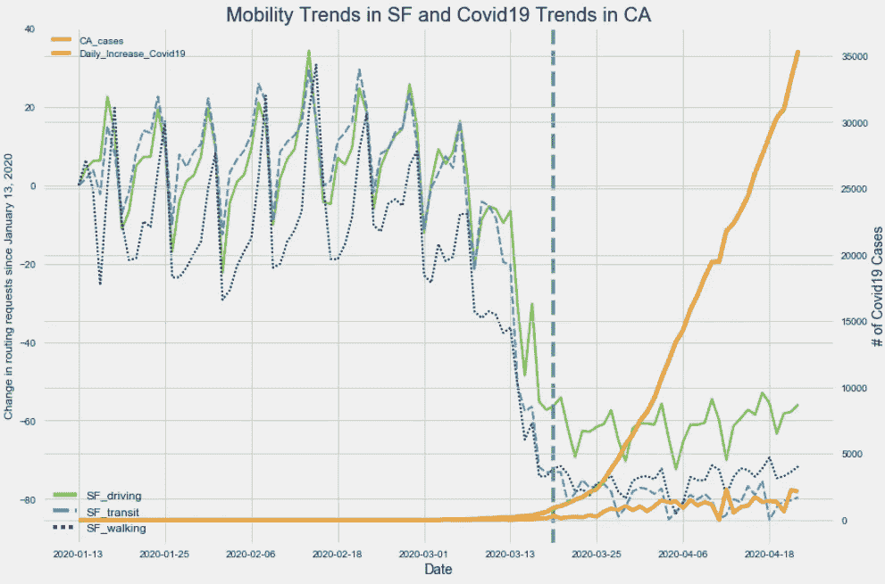

旧金山的移动趋势和加利福尼亚的每日 Covid19 病例

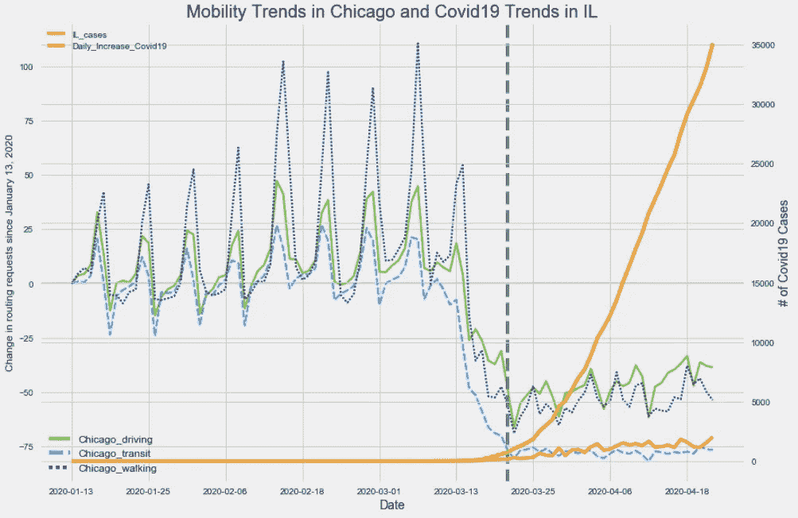

芝加哥的移动趋势和伊利诺伊州的每日 Covid19 病例

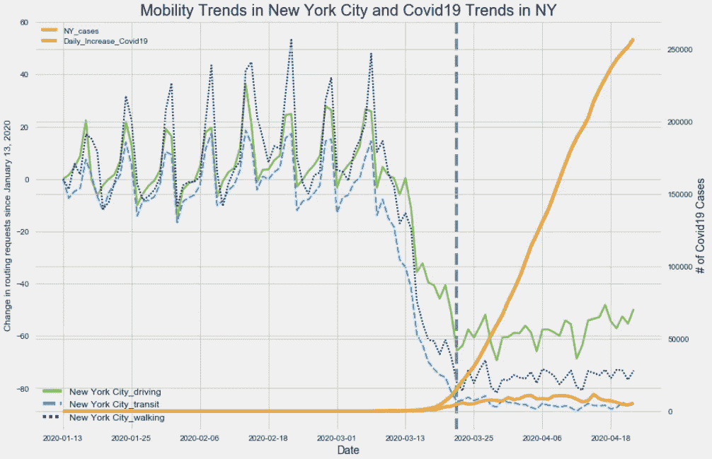

纽约市的流动趋势和纽约的每日病例

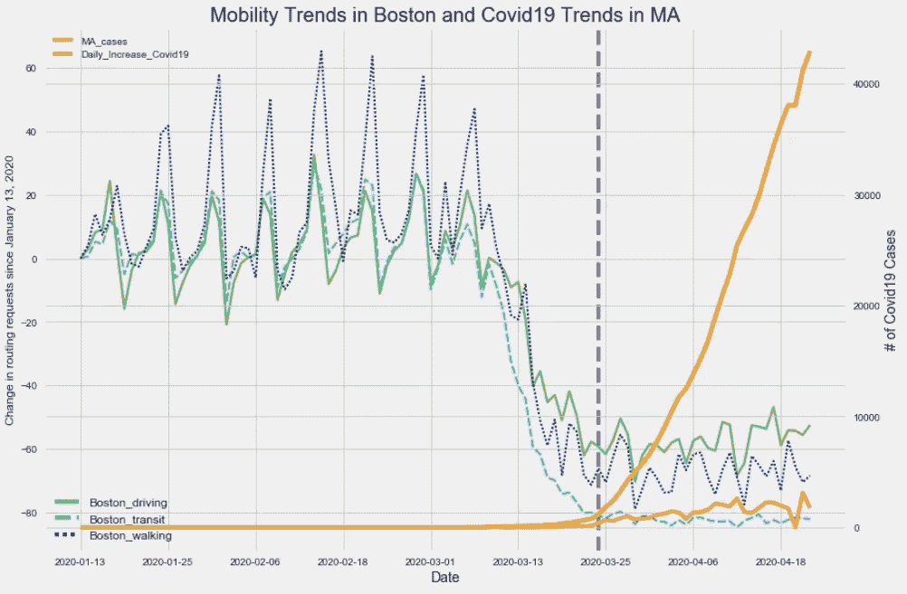

波士顿的移动趋势和马萨诸塞州的每日 Covid19 案例

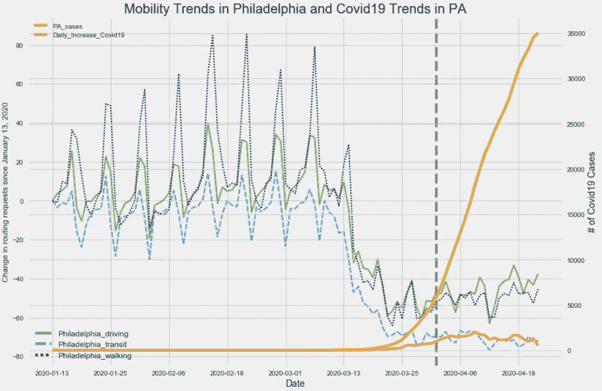

费城的流动性趋势和宾夕法尼亚州的每日 Covid19 病例

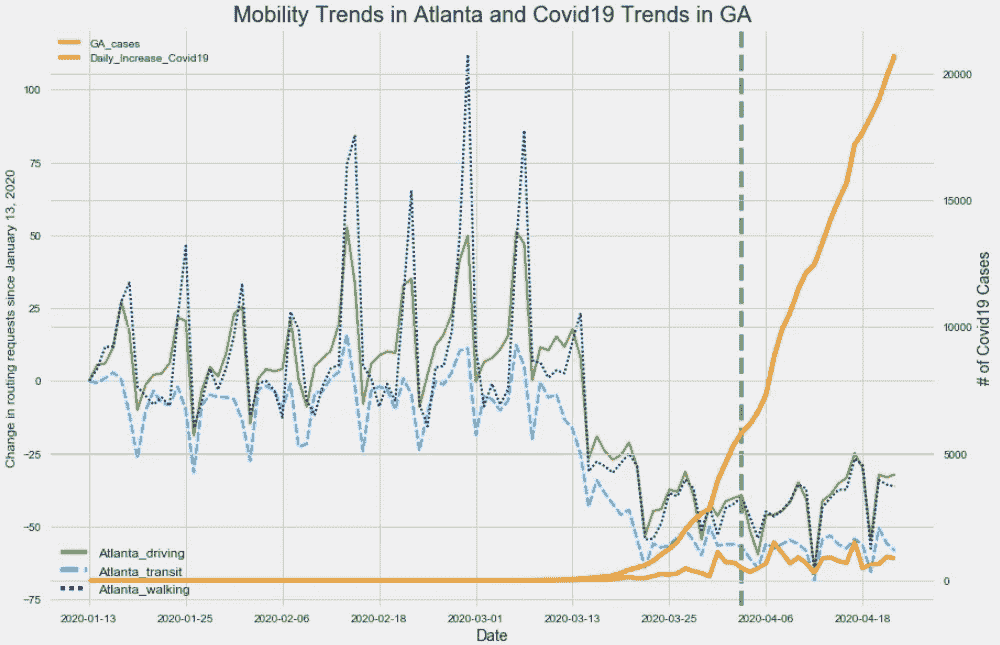

亚特兰大的流动趋势和佐治亚州的每日 Covid19 病例

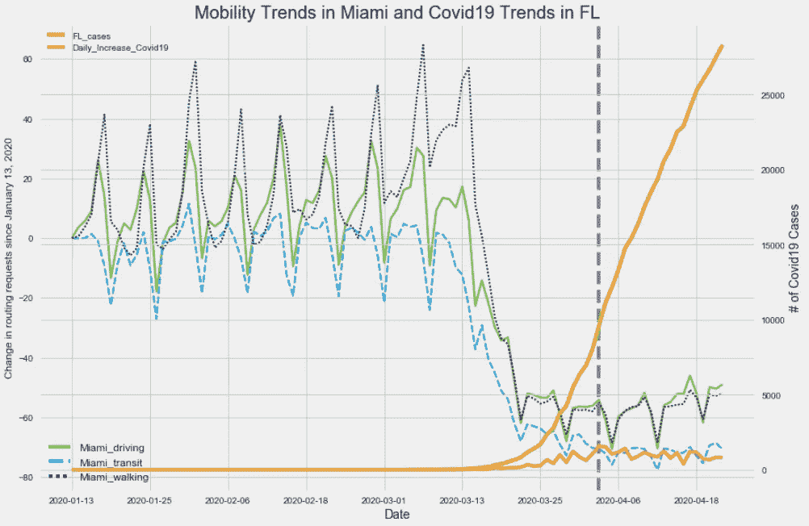

迈阿密的流动性趋势和佛罗里达州的每日 Covid19 病例

虽然一些州迅速发布了在家禁令，但一些州的反应却很慢。因此，订单的时间是一个很好的变量，可以将数据分成控制/测试组，以检查两组之间的任何可变性。

在组 1 中，选择以下四种状态——CA(3/19)，IL (3/23)，MA (3/24/)，MI (3/24)。不选择 NY，因为它会扭曲整体数据。在第二组中，选择了从 4 月份开始发布居家命令的州——佛罗里达州(4/3)、佐治亚州(4/3)、宾夕法尼亚州(4/1)、德克萨斯州(4/2)。

虽然两组的驾驶行为相似，但在步行和交通方面可以观察到明显的差异。关于交通行为，自 1 月 13 日以来，两组均出现显著下降。然而，组 1 中的州比组 2 中的州在请求公交路线方面表现出更大的下降(4 月份下降了 80%)。

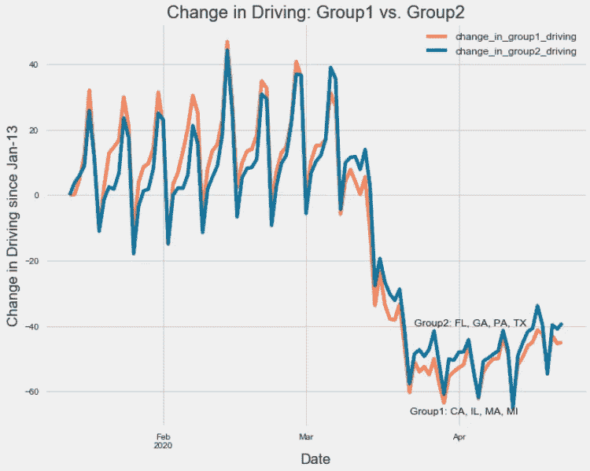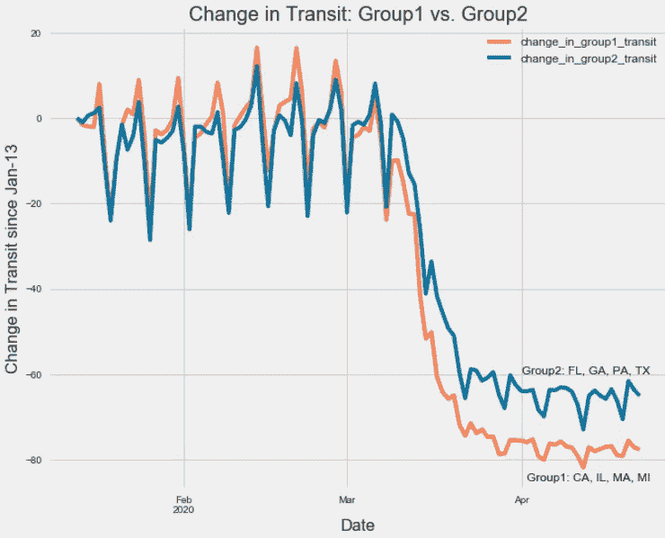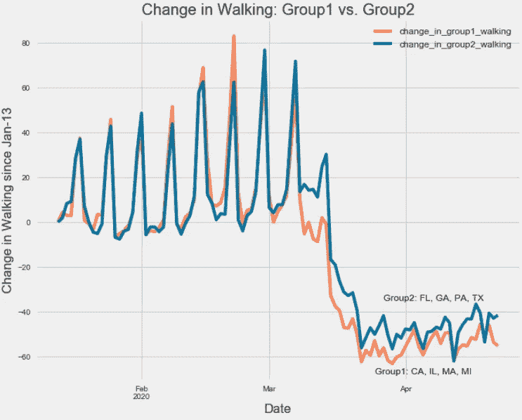

每个州有不同的测试能力和管理。为了限制少数状态对 Covid19 计数每日增加的影响，比较了每日%增加。在三月初，两组都出现了大的峰值。然而，尽管第一组州在三月晚些时候能够控制每日%的增长，但第二组州在整个三月继续出现大幅增长。有趣的是，一旦第 2 组各州从 4 月份开始实施居家订单，Covid19 的每日%增长率开始下降到一个更易于管理的水平。

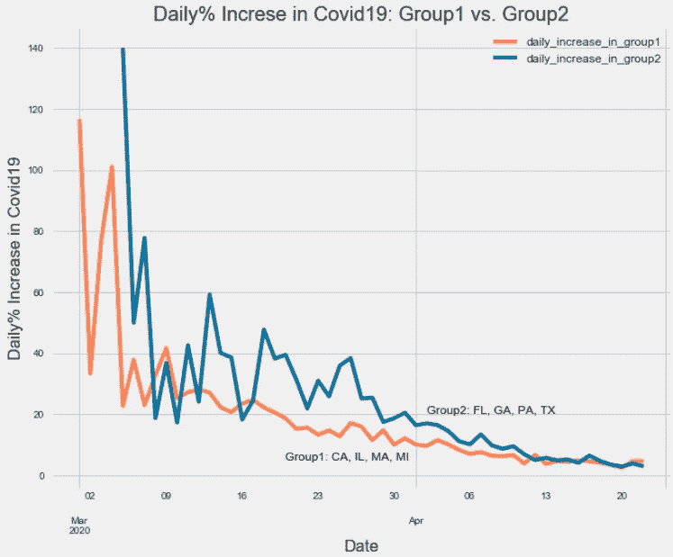

就像每个人说的那样，社交距离对对抗 Covid19 很重要。希望这能提供一些见解。